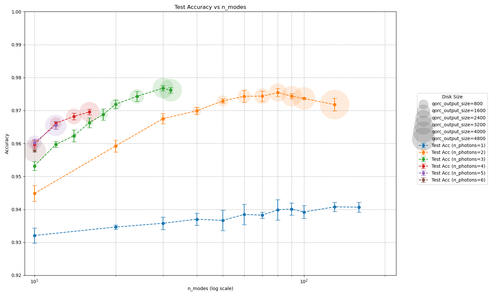
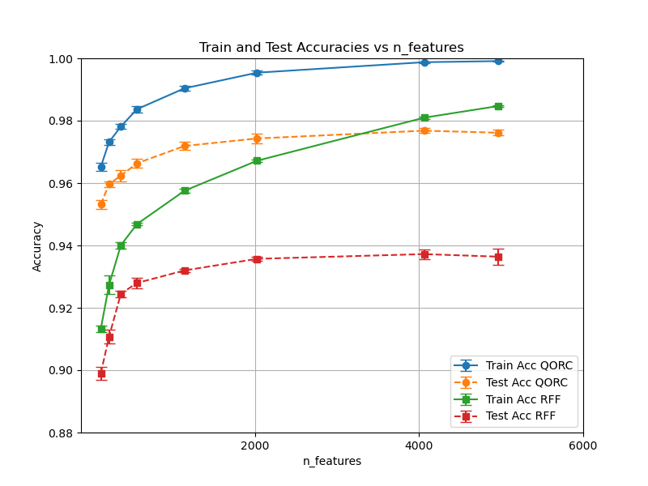

# Reproduction of [Quantum optical reservoir computing powered by boson sampling](https://opg.optica.org/opticaq/abstract.cfm?URI=opticaq-3-3-238)

## Reference and Attribution

- Paper: Quantum optical reservoir computing powered by boson sampling (Optica Quantum, 2025)
- Authors: Akitada Sakurai, Aoi Hayashi, William John Munro, Kae Nemoto
- DOI/ArXiv: https://doi.org/10.1364/OPTICAQ.541432, https://opg.optica.org/opticaq/abstract.cfm?URI=opticaq-3-3-238
- License and attribution notes:

## Overview

This repository provides a reproducible implementation of the quantum reservoir experiment using the MerLin quantum machine learning framework. The included source code enables the replication of performance results obtained with quantum features derived from the QORC experiment, thereby demonstrating a proof-of-concept for the advantages of quantum reservoirs in machine learning tasks.

## How to Run

### Install dependencies

```bash
python -m venv .venv
source .venv/bin/activate
pip install -r requirements.txt
```

### Command-line interface

Main entry point: `implementation.py`

```bash
python implementation.py --help
```

### General Options
   Option               | Description                                                                 |
 |----------------------|-----------------------------------------------------------------------------|
 | `--config PATH`      | Load config from JSON (example files in `configs/`).                        |
 | `--outdir DIR`       | Base output directory. A timestamped run folder `run_YYYYMMDD-HHMMSS` is created inside. |

### Qorc Options
 | Option               | Description                                                                 |
 |----------------------|-----------------------------------------------------------------------------|
 | `--n-photons INT`    | Number of photons.                                                          |
 | `--n-modes INT`      | Number of modes.                                                            |
 | `--seed INT`         | Random seed for reproducibility.                                            |
 | `--fold-index INT`   | Split train/val fold index.                                                 |
 | `--n-fold INT`       | Number of folds for train/val split.                                        |
 | `--epochs INT`       | Number of training epochs.                                                  |
 | `--batch-size INT`   | Batch size.                                                                 |
 | `--lr FLOAT`         | Learning rate.                                                              |
 | `--reduce-lr-patience INT` | Patience for reducing learning rate on plateau.                     |
 | `--reduce-lr-factor FLOAT` | Factor by which the learning rate will be reduced.                  |
 | `--num-workers INT`  | Number of subprocesses for data loading.                                   |
 | `--pin-memory BOOL`  | Enable pin memory for faster data transfer to CUDA devices.                |
 | `--f-out-weights PATH` | Filepath to save the model checkpoint.                              |
 | `--b-no-bunching BOOL` | Disable bunching.                                                          |
 | `--b-use-tensorboard BOOL` | Enable TensorBoard logging.                                          |
 | `--device STR`       | Device string (e.g., `cpu`, `cuda:0`, `mps`).                              |

### RFF Options
 | Option               | Description                                                                 |
 |----------------------|-----------------------------------------------------------------------------|
 | `--n-rff-features INT` | Number of Random Fourier Features.                                         |
 | `--sigma FLOAT`      | RBF kernel bandwidth.                                                       |
 | `--regularization-c FLOAT` | Regularization strength (C).                                        |
 | `--b-optim-via-sgd BOOL` | Use SGD for optimization.                                           |
 | `--max-iter-sgd INT` | Maximum number of SGD iterations.                                          |


Example runs:

```bash
# From a JSON config
python implementation.py --config configs/xp_qorc.json

# Override some parameters inline
python implementation.py --config configs/xp_qorc.json --epochs 50 --lr 1e-3
```

The script saves a snapshot of the resolved config alongside results and logs.

### Output directory and generated files

At each run, a timestamped folder is created under the base `outdir` (default: `outdir`):

```
<outdir>/run_YYYYMMDD-HHMMSS/
├── config_snapshot.json                    # Resolved configuration used for the run
├── run.log                                 # Log output (stdout/stderr)
├── f_out_results_training_{qorc,rff}.csv   # Training metrics (accuracy, duration, etc.)
│                                       # Example: `f_out_results_training_qorc.csv`
└── f_weights_out.pth                       # Trained model weights (linear layer)
```

Note:
- Change the base output directory with `--outdir` or in `configs/example.json` (key `outdir`).

## Configuration

Place configuration files in `configs/`.

- Keys typically include: n_photons, n_modes, seed, n_epochs, batch_size, learning_rate

## Results and Analysis

Main graph exposing quantum reservoir performances (test accuracy) on MNIST.



Graph comparing quantum reservoir and classical method (RFF, a fast-approximation of RBF)




## Extensions and Next Steps

## Reproducibility Notes

## Testing

