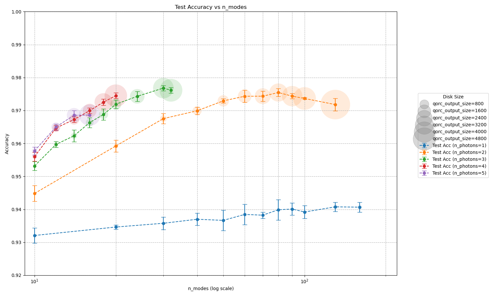

# Reproduction of [Quantum optical reservoir computing powered by boson sampling](https://opg.optica.org/opticaq/abstract.cfm?URI=opticaq-3-3-238)

## Reference and Attribution

- Paper: Quantum optical reservoir computing powered by boson sampling (Optica Quantum, 2025)
- Authors: Akitada Sakurai, Aoi Hayashi, William John Munro, Kae Nemoto
- DOI/ArXiv: https://doi.org/10.1364/OPTICAQ.541432, https://opg.optica.org/opticaq/abstract.cfm?URI=opticaq-3-3-238
- License and attribution notes:

## Overview

This repository provides a reproducible implementation of the quantum reservoir experiment using the MerLin quantum machine learning framework. The included source code enables the replication of performance results obtained with quantum features derived from the QORC experiment, thereby demonstrating a proof-of-concept for the advantages of quantum reservoirs in machine learning tasks.

## How to Run

### Install dependencies

```bash
python -m venv .venv
source .venv/bin/activate
pip install -r requirements.txt
```

### Command-line interface

Main entry point: `implementation.py`

```bash
python implementation.py --help
```

Supported options:

- `--config PATH` Load config from JSON (example files in `configs/`).
- `--seed INT`    Random seed for reproducibility.
- `--outdir DIR`  Output base directory (default: `outdir`). A timestamped run folder `run_YYYYMMDD-HHMMSS` is created inside.

Example reproduction specific options:
- `--device STR`  Device string (e.g., cpu, cuda:0, mps).
- `--epochs INT`  Number of training epochs.
- `--batch-size INT` Batch size.
- `--lr FLOAT`    Learning rate.

Example runs:

```bash
# From a JSON config
python implementation.py --config configs/example.json

# Override some parameters inline
python implementation.py --config configs/example.json --epochs 50 --lr 1e-3
```

The script saves a snapshot of the resolved config alongside results and logs.

### Output directory and generated files

At each run, a timestamped folder is created under the base `outdir` (default: `outdir`):

```
<outdir>/run_YYYYMMDD-HHMMSS/
├── config_snapshot.json   # Resolved configuration used for the run
└── trained_model.pth      # Linear layer weights of the trained model
```

Note:
- Change the base output directory with `--outdir` or in `configs/example.json` (key `outdir`).

## Configuration

Place configuration files in `configs/`.

- `defaults.json` shows the structure and defaults.
- Keys typically include: n_photons, n_modes, seed, n_epochs, batch_size, learning_rate

## Results and Analysis

Main graph exposing quantum reservoir performances (test accuracy) on MNIST.



## Extensions and Next Steps

## Reproducibility Notes

## Testing

