# Limitations of Amplitude Encoding on Quantum Classification

## Reference and Attribution

- Paper: Limitations of Amplitude Encoding on Quantum Classification(2025)
- Authors: Wang *et al.*
- DOI/ArXiv: [2503.01545](https://arxiv.org/abs/2503.01545)


## Overview

### 🎯 Main goal 
> Explore the limitations of amplitude encoding whileseeing if the same results appear with angle encoding.

### Main result

> “We have investigated the concentration phenomenon induced by amplitude encoding and the resulting loss barrier phenomenon. Since encoding is a necessary and crucial step in leveraging QML to address classical problems, our findings indicate that the direct use of amplitude encoding may undermine the potential advantages of QML. Therefore, more effort should be devoted to developing more efficient encoding strategies to fully unlock the potential of QML.”

A loss function barrier seems to appear with angle encoding for most of the complex datasets. If the features are not espacially sparse, the loss will plateau. 

Talking about the concentration phenomena:

> “However, our numerical simulations reveal that under amplitude encoding as the amount of training data increases, although the generalization error decreases, the training error increases counterintuitively, resulting in overall poor prediction performance.”

### Main theorems and propositions of the paper
> **Theorem**:  For a K-class classification, we employ the cross-entropy loss function $LS(\theta)$ [...]. The quantum classifier is trained on a balanced training set $S = \{(x (m) , y(m) )\}^M_{ m=1}$, where each class contains M/K samples. Suppose the eigenvalues of each observable $H_k$ belong to [-1, 1], for k = 1, ..., K. If the trace distance between the expectations of encoded states of any different classes is less than $\epsilon$, then for any PQC U($\theta$) and optimization algorithm, we have $LS(\theta) \geq \ln [K - 4(K - 1)\epsilon]$ with probability at least $1 - 8e^{-M\epsilon^2/8K}$.

> **Proposition**: Assume that all elements in the feature $x \in \mathbb{R}^{2^n}$ have the same sign, and the elements satisfy $|x_i| \in [m, M]$. If $|\frac{m}{M}-1|<\epsilon$, then after amplitude encoding, we have
$$ T\bigg(\rho(x), \frac{1}{2^n}\ket{+}^{\otimes n}\bra{+}^{\otimes n}\bigg)$$
where $T(\rho_1,\rho_2)=\frac{1}{2}||\rho_1-\rho_2||_1$, the Schatten-1 norm.

Here we see that no mater the distribution, the encoded state, no matter the associated class will converge towards rge same state.

> The other two proposition are more refined that the previous one. The first one says that if a feature as a symetric density function and a mean value of zero, the encoded state will converge to the completly mixed state. The other one says that if the density function of a feature for two classes for a point x is oppsoite sign-wise, the expected encoded state will be the same for both classes

### Their framework
1. The data is encoding via amplitude encoding
2. The trainable layer:
  a. For one qubit, one layer is composed of RZ, RX, RZ. We use L of them
  b. For multiple qubits (here 10): a gate-based qcnn is used.

  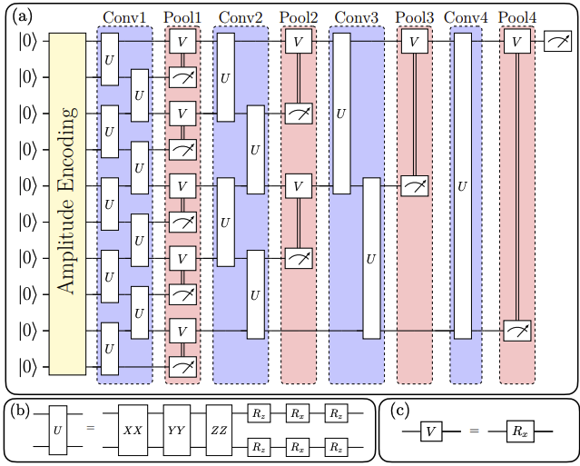
  Source: X. Wang, Y. Wang, B. Qi, and R. Wu, “Limitations of Amplitude Encoding on Quantum Classification,” Mar. 03, 2025, arXiv: arXiv:2503.01545. doi: [10.48550/arXiv.2503.01545](https://arxiv.org/abs/2503.01545).


### Difference in framework
In a MerLin point of view, we can not directly adopt gate based circuits to photnics. Instead we inspired ourselves from their models to create our own.

1. The data is encoded via amplitude encoding.
2. The trainable layer:
   1. For one qubit, one layer is composed of random phase shifters. We use `L` of them.
   2. For multiple qubits:
      1. If it's a simple model, we add `L` layers of `CircuitBuilder.add_entangling_layer()`.
      2. If it is a QCNN model, we use the hybrid model presented in the [photonic_QCNN folder](../photonic_QCNN/).


For simple layers, the angle amplitude model was also implemented.
1. A ``CircuitBuilder.add_entangling_layer()`` or, if their is one single mode a ``CircuitBuilder.add_rotations()`` is added at the start of the circuit.
2. The data is encoding via amplitude encoding
3. We add L-1 layers of ``CircuitBuilder.add_entangling_layer()`` or ``CircuitBuilder.add_rotations()`` depending on the number of modes.

For angle encoding, the featires are normalized between 0 and 1 to have meaningful phase shifts in the circuit.

### Their results
#### Limitations of amplitude encoding on synthetic datasets

The authors presented three datasets used respectively in the next three figures. The datasets only have two features ($x_1$ and $x_2$) each.

- For class 1, $x_1$ and $x_2$ follow the uniform distribution $\mathcal{U}[4,5]$. For class 2, $x_1$ and $x_2$ follow the uniform distribution $\mathcal{U}[5.5,6.5]$.
- For class 1, $x_1$ and $x_2$ follow the uniform distribution $\mathcal{U}[-1,1]$. For class 2, $x_1$ and $x_2$ follow the uniform distribution $\mathcal{U}[[-5,-3]\cup[3,5]]$.
- For class 1, $x_1$ follows the uniform distribution $\mathcal{U}[-3,-1]$ and $x_2$ follows the normal distribution $\mathcal{N}(-2,1)$. For class 2, $x_1$ follows the uniform distribution $\mathcal{U}[1,3]$ and $x_2$ follows the normal distribution $\mathcal{N}(2,1)$.

##### Figure 1 (First dataset)

Here the average encoded state ($\mathbb{E}[\rho(x_1,x_2)]$.) via amplitude encoding is compared for each class to the $\ket{+}\bra{+}$ state via the trace distance operator $T$ defined in the earlier proposition.

  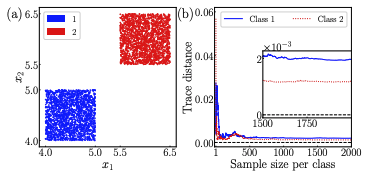

  Source: X. Wang, Y. Wang, B. Qi, and R. Wu, “Limitations of Amplitude Encoding on Quantum Classification,” Mar. 03, 2025, arXiv: arXiv:2503.01545. doi: [10.48550/arXiv.2503.01545](https://arxiv.org/abs/2503.01545).

  We observe that, even though the dataset is easily linearly separable, the normalization limitation of amplitude encoding makes the encoded state in the computer the same for both classes.

##### Figure 2 (Second dataset)

Here the average encoded state via amplitude encoding is compared for each class to the $\mathbb{I}/2$ state via the trace distance operator $T$ defined in the earlier proposition.

  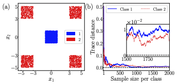

  Source: X. Wang, Y. Wang, B. Qi, and R. Wu, “Limitations of Amplitude Encoding on Quantum Classification,” Mar. 03, 2025, arXiv: arXiv:2503.01545. doi: [10.48550/arXiv.2503.01545](https://arxiv.org/abs/2503.01545).

  The same conclusion from figure 1 can be done here.

  ##### Figure 3 (Third dataset)

Here the average encoded state via amplitude encoding is compared between classes via the trace distance operator $T$ defined in the earlier proposition.

  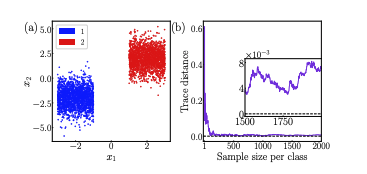

  Source: X. Wang, Y. Wang, B. Qi, and R. Wu, “Limitations of Amplitude Encoding on Quantum Classification,” Mar. 03, 2025, arXiv: arXiv:2503.01545. doi: [10.48550/arXiv.2503.01545](https://arxiv.org/abs/2503.01545).

  The same conclusion from figure 1 can be done here.

  #### Figure 4: Loss plateau on synthetic datasets

  Here a 10 layer one qubit layer circuit is trained to classify the three datasets presented in the previous figures.

  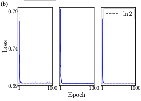

  Source: X. Wang, Y. Wang, B. Qi, and R. Wu, “Limitations of Amplitude Encoding on Quantum Classification,” Mar. 03, 2025, arXiv: arXiv:2503.01545. doi: [10.48550/arXiv.2503.01545](https://arxiv.org/abs/2503.01545).

  We show that a loss plateau can be observed at $\ln(2)$ for all the datasets. This confirms the intuitions of the authors for datasets that are now seperable via amplitude encoding.

  #### Figure 5: Trace distance between classes on known datasets.

  Using the same methodology as figure 3, the distance between the expected encoded states of the binary version of known datasets is done here.
  - The MNIST dataset while using only the 0 and 1 digits.
  - The CIFAR-10 dataset with only airplanes and birds.
  - The PathMNIST dataset with adipose and backgroud pictures.
  - The EuroSAT dataset with forest and sea lakes.

  All of the pictures we transformed to be in a 32x32 format.

  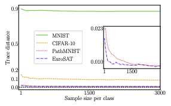

  Source: X. Wang, Y. Wang, B. Qi, and R. Wu, “Limitations of Amplitude Encoding on Quantum Classification,” Mar. 03, 2025, arXiv: arXiv:2503.01545. doi: [10.48550/arXiv.2503.01545](https://arxiv.org/abs/2503.01545).

  We observe here that only the MNIST dataset is well suited for amplitude encoding. The other datasets pretty much have the same expected encoded state.

#### Figure 6: Classification of the known datasets - bad
  Here, an experiment with the QCNN model was done on the EuroSAT dataset while varying the number of sample size per class. 

  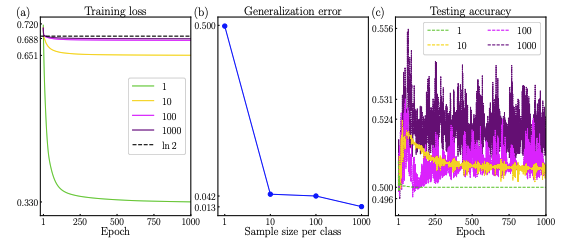

  Source: X. Wang, Y. Wang, B. Qi, and R. Wu, “Limitations of Amplitude Encoding on Quantum Classification,” Mar. 03, 2025, arXiv: arXiv:2503.01545. doi: [10.48550/arXiv.2503.01545](https://arxiv.org/abs/2503.01545).

  We see that the dataset is not well suited for the model. The similar results were observed for the CIFAR-10 and PathMNIST datasets.

#### Figure 7: Classification of the known datasets - good
  Here, an experiment with the QCNN model was done on the MNIST dataset while varying the number of sample size per class. 

  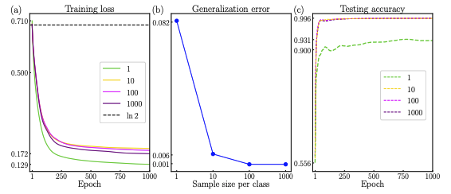

  Source: X. Wang, Y. Wang, B. Qi, and R. Wu, “Limitations of Amplitude Encoding on Quantum Classification,” Mar. 03, 2025, arXiv: arXiv:2503.01545. doi: [10.48550/arXiv.2503.01545](https://arxiv.org/abs/2503.01545).

  We see that the dataset is well suited for this model as it converges to good testing accuracy.
### Our results
#### Limitations of amplitude encoding on synthetic datasets
##### Reproduction of figure 1
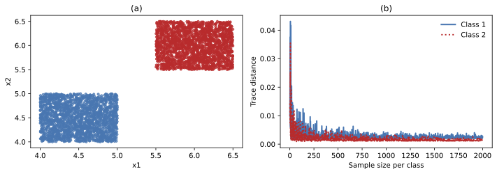

##### Reproduction of figure 2
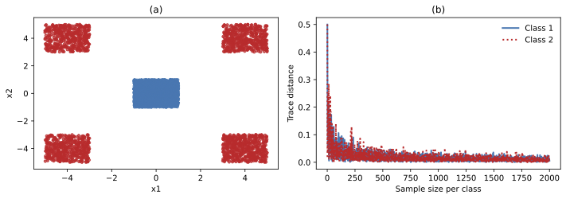

##### Reproduction of figure 3
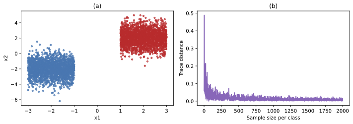

We can see that we observe the same results as the one presented in the paper.

#### Figure 4: Loss plateau on synthetic datasets

For our reproduction of figure 4, we decided to run the experiment for 1,10 and 100 layers and for three different models.

##### Gate-based model (like the paper)
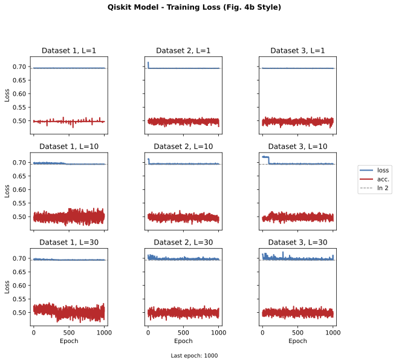

We observe the same loss plateau at $\ln(2)$ across all layer numbers and that the accuracy is indeed the same as a random guesser.

##### Merlin amplitude encoding model

Here we tried our MerLin model with amplitude encoding.

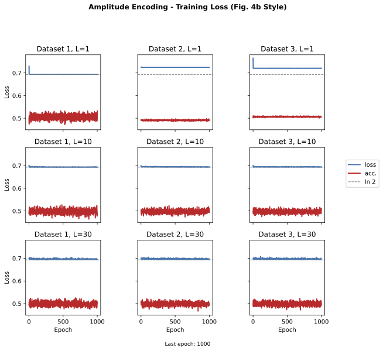

Without a big suprise, we obtain the same results as the gate based model.

##### Merlin angle encoding model
To show that that not one encoding is strictly better than the other, we tried the same experiment but with an angle encoding model.

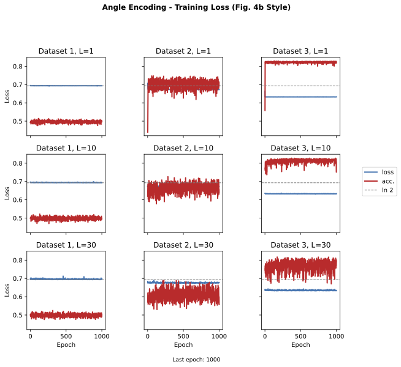

The results can be significally better with this type of encoding showing that, the power of the encoding is really tied to the caracteristics of the models **and the studied dataset**. Indeed, the loss goes lower than the $ln(2)$ plateau observed on amplitude encoding models. 

It is also possible to realize that even here, dataset 1 is not being classified better with the angle encoding. Another encoding would be need here.

#### Figure 5: Trace distance between classes on known datasets.

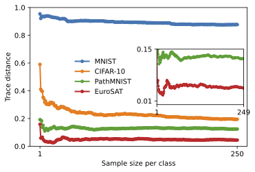

Here we observe the same results as the one presented in the paper.

#### Figure 6-7: Classification of the known datasets
**The results are to come!**

## How to Run

### Install dependencies

```bash
python -m venv .venv
source .venv/bin/activate
pip install -r requirements.txt
```

### Command-line interface

Main entry point: the paper-level `lib/runner.py`. The CLI is entirely described in `cli.json`, so updating/adding arguments does not require editing Python code.

```bash
# From inside papers/reproduction_template
python l../../implementation.py  --help

# From the repo root
python implementation.py --paper AA_study --help
```

Example overrides (see `cli.json` for the authoritative list):

- `--config CONFIG_NAME` Load an additional JSON config (merged over `defaults.json`). The config path is automatically handled by the code.

Example runs:

```bash
# From a JSON config (inside the project)
python ../../implementation.py  --config configs/defaults.json

# Override some parameters inline
python ../../implementation.py  --config configs/defaults.json --batch_size 50 

# Equivalent from the repo root
python implementation.py --paper AA_study --config configs/defaults.json --batch_size 50
```

## Project structure --> TODO
- `papers/AA_study/lib/runner.py` — The file to run for every experiment.
- `papers/AA_study/lib/` — core papers.AA_study.library modules used by scripts.
  - `torchquantum/` — Repository used for gate-based models. Here is the [link](https://github.com/mit-han-lab/torchquantum) to the repo.
  - `amplitude_limitations.py`, `run_bas.py`- Files containing the function to run the corresponding experiment. `amplitude_limitations.py` contains all of the functions of the figure reproductions.
  - `classical_models.py`: A classical CNN used for comparaison in the BAS experiment.
  - `qiskit_models.py`: Gate-based models used in the figures.
  - `qlayers.py`: The MerLin modules used for the reproduction of the figures.
- `configs/` — Experiment configs consumed by the shared runner. The available ones are below.
  - `defaults.json`, `BAS_exp.json`, `fig_1_exp.json`, `fig_2_exp.json`, `fig_3_exp.json`, `fig_4_exp.json`, `fig_5_exp.json`, `fig_6_exp.json`, `fig_7_exp.json`
- `cli.json` - The description of all of the changeable parameters of the runs.
- `aa_study.ipynb` - A notebook explaining the workflow of the paper.
- Other
  - `images/` - Images used in the ReadMe.
  - `requirements.txt` — Python dependencies.
  - `tests/` - Unitary tests to make sure the papers.AA_study.lib works correctly.
  - `utils/` — Containing the `utils.py` file used for plotting and repo utility functions.

## Results and Analysis

- The results are stored in the [results](results/) folder. Logs and figures will be saved in the [outdir](outdir/) directory.
- To reproduce the experiments, simply call these lines at the paper level:
 
 For just a basic training and evaluation on the BAS dataset:
 >``python3 implementation.py --paper AA_study  --config configs/defaults.json``

  For the BAS dataset experiment :
 >``python3 implementation.py --paper AA_study --config configs/BAS_exp.json``

   To reproduce figure i between $\{1,2,3,4,5,7\}$ :
 >``python3 implementation.py --paper AA_study --config configs/fig_i_exp.json``


## Extensions and Next Steps
We will explore a photonic based, angle-encoding QCNN to classify the data that can not be classified by the amplitude encoding version.

## Testing

Run tests from inside the `papers/AA_study/` directory:

```bash
cd papers/AA_study
pytest -q
```
Notes:
- Tests are scoped to this template folder and expect the current working directory to be `DQNN/`.
- If `pytest` is not installed: `pip install pytest`.

## Acknowledgments

We used the torchquantum repository developped by Hanrui Wang for gate-based models. Here is the [link](https://github.com/mit-han-lab/torchquantum) to the repo.