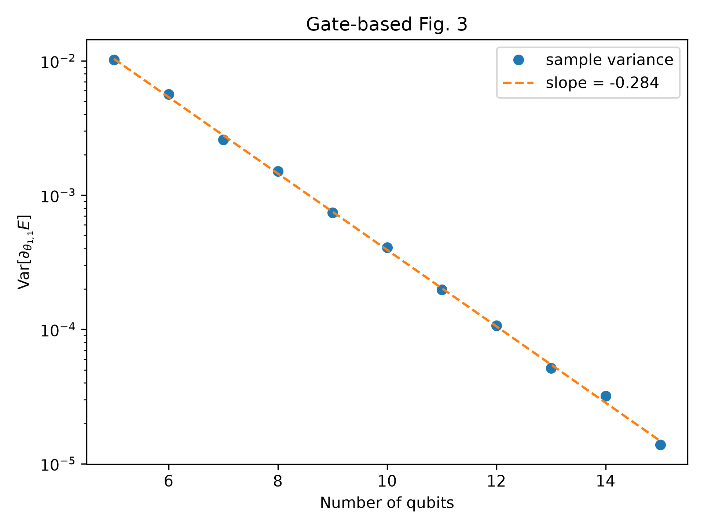
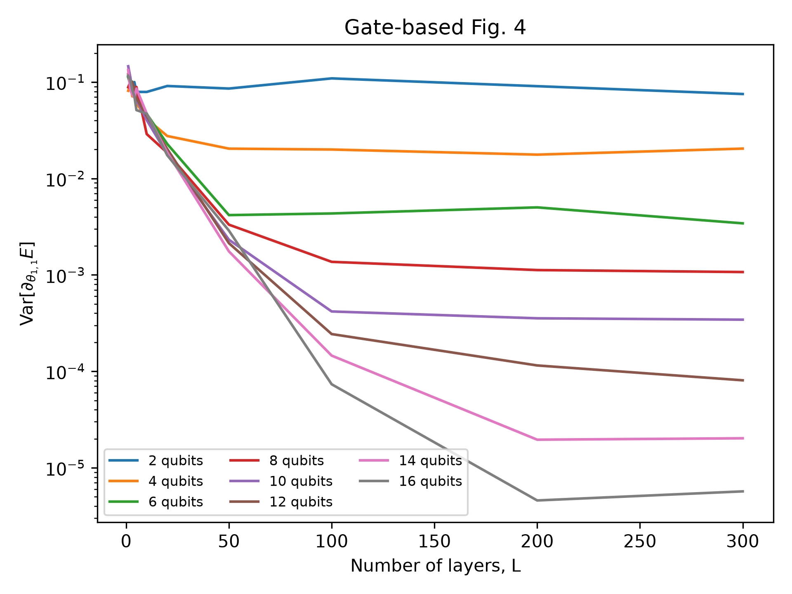

# Barren Plateaus in Quantum Neural Network Training Landscapes - Reproduction

## Reference and Attribution

This project formalizes the reproduction of McClean, Boixo, Smelyanskiy, Babbush,
and Neven, *Barren plateaus in quantum neural network training landscapes*,
Nature Communications 9, 4812 (2018), DOI
[10.1038/s41467-018-07090-4](https://doi.org/10.1038/s41467-018-07090-4).
The partial reproduction (logical and photonic translation) of this work was handled by [Eason Xie](https://github.com/easonoob) and lead to a publication accepted to QCE2026 [Pre-Asymptotic Trainability in Photonic Variational Circuits under Postselection](https://arxiv.org/abs/2605.11879) as part of a collaboration with Quandela. Cassandre Notton reformatted the code from Eason to have it follow the repository template.

## Original Paper

The paper studies random parameterized quantum circuits and shows that gradient
means and variances concentrate near zero as the number of qubits grows. Figure 3
plots the variance of the first parameter gradient against qubit count. Figure 4
plots the same variance against circuit depth and shows convergence toward a
qubit-dependent 2-design plateau.

## Reproduction Scope

The gate-based implementation uses TorchQuantum and follows the paper’s 1D
random circuit: an initial `RY(pi/4)` on every wire, random `RX`/`RY`/`RZ`
rotations, a nearest-neighbour CZ ladder, and the two-local `Z1 Z2` objective.
It writes the variance data, an exponential Fig. 3 fit, and Fig. 3/Fig. 4 plots.
For Fig. 3, the configured depth is ``layers_per_qubit * number_of_qubits``;
the default paper-scale value is 10 layers per qubit. A fixed depth of 10 for
all system sizes is a shallow-circuit control, not the paper-scale Fig. 3
protocol, because its local light cone does not grow with the system size.

The photonic implementation reproduces the Fig. 3-style qubit scaling using the
MerLin/Perceval photonic model and compares Fock, unbunched, and dual-rail
computation spaces. This is an analogue rather than a numerical gate-for-gate
equivalent: the Hilbert/computation spaces differ. The setup follows the
post-selection comparison developed in [arXiv:2605.11879](https://arxiv.org/abs/2605.11879).

The committed experiments and figures use reduced qubit counts and circuit
depths so that they can be run with practical local resources. The implementation
does not impose these reduced settings: users can provide their own configuration
with the original paper-scale ranges, including up to 26 qubits and 500 layers,
subject to the available memory and compute time.

## Install and Run

From the repository root:

```bash
pip install -r papers/BP_QNN/requirements.txt
```

Run the short smoke test with:

```bash
python implementation.py --paper BP_QNN --config papers/BP_QNN/configs/defaults.json
```

For an explanatory, laptop-sized Fig. 3 walkthrough covering both backends,
open `papers/BP_QNN/bp_qnn.ipynb`. The corresponding small CLI configs are
`configs/demo_fig3.json` and `configs/demo_fig3_merlin.json`. The gate-based
demo uses 2–6 qubits, ten layers per qubit, and 32 samples; the photonic demo
remains at 2–4 qubits and four samples per point. Run the photonic version with:

```bash
python implementation.py --paper BP_QNN --config papers/BP_QNN/configs/demo_fig3_merlin.json
```

The reproduced figures use these configurations:

```bash
# Gate-based Figure 3: variance versus qubit count, with exponential fit
python implementation.py --paper BP_QNN --config papers/BP_QNN/configs/fig3_gb.json

# MerLin/photonic Figure 3 analogue: Fock, unbunched, and dual-rail spaces
python implementation.py --paper BP_QNN --config papers/BP_QNN/configs/fig3_merlin.json

# Gate-based Figure 4: variance versus circuit depth
python implementation.py --paper BP_QNN --config papers/BP_QNN/configs/fig4_gb.json
```

The paper-scale gate-based settings are in
`papers/BP_QNN/configs/original_config.json`. To run at the full scale, edit or
copy that configuration and set the desired `qubits`, `layers`, and `samples`
values (up to 26 qubits and 500 layers). Runs write timestamped artifacts under
`papers/BP_QNN/outdir/run_YYYYMMDD-HHMMSS/` unless a global `--outdir` is
supplied. With `"plot": true`, the runner writes PNG figures, along with
`results.csv` and (for Fig. 3) the fitted parameters in `fit.json` or
`fit_merlin.json`.

## Figures

### Figure 3: gate-based reproduction

The gate-based result shows the gradient variance decreasing approximately
exponentially as the number of qubits increases. The dashed line is a linear
fit in log-variance space.



### Figure 3: MerLin/photonic analogue

The MerLin analogue compares Fock, unbunched, and dual-rail computation spaces
for arcsine and uniform parameter initializations. Because these computation
spaces are not numerically equivalent to the gate-based Hilbert space, the
slopes and absolute variances should be compared qualitatively rather than
directly.


### Figure 4: gate-based reproduction

The depth sweep shows the variance changing with the number of circuit layers
for systems ranging from 2 to 16 qubits.

This layer-by-layer comparison is meaningful for the gate-based circuit, where
the layer count directly changes the circuit architecture. It does not transfer
directly to the MerLin/photonic implementation: circuits with different nominal
layer counts are compiled to a universal interferometer, so they do not retain
the same explicit notion of depth. Consequently, comparing different layer
counts for an otherwise identical photonic circuit would not provide a clean
physical comparison in the current implementation. A meaningful photonic depth
study could instead restrict the optical circuits to non-universal networks and
vary their depth up to the point at which they become universal (100%). We leave
that comparison for future work.



## Results and Limitations

The expected qualitative result is exponential variance decay with qubit count
and a depth-dependent convergence plateau. Exact slopes and plateau heights are
sample-, dtype-, and backend-dependent. Full paper-scale runs can be expensive,
especially for 24-qubit state-vector simulations and 500-layer circuits.

The photonic Fig. 3 analogue should not be compared by absolute variance alone
with the gate-based result because the selected computation spaces and measured
probability vectors are different.

Nominal photonic layer counts should also not be interpreted as directly
comparable circuit depths: compilation to a universal interferometer changes
the implemented optical network rather than preserving a gate-layer structure.
A future experiment could compare non-universal optical networks at depths up to
the 100% universal limit, but that is outside the scope of this reproduction.

The photonic Fig. 3 run writes `figure3_merlin.png` with side-by-side
initialization panels and `fit_merlin.json` containing the fitted slope and
`R^2` for every initialization/computation-space combination.

## Tests

```bash
cd papers/BP_QNN
pytest -q
```
