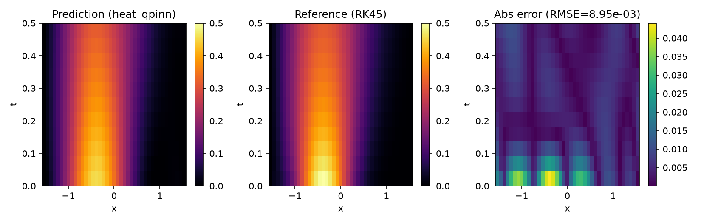
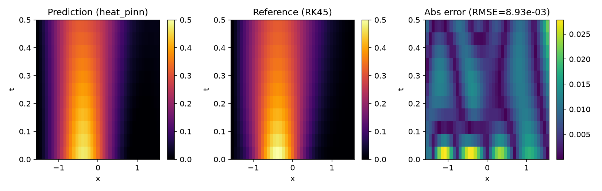

# Curated results

Tracked record of the reproduction's key findings. Raw run artefacts
(prediction arrays, loss histories, model weights, logs) live in the
gitignored `outdir/`; everything here is a compact, regenerable view of
those runs. See "Regenerating" below for the exact commands.

## Headline findings

### 1D Poisson (paper §IV.A, RMSE target 1.09e-4)

| Run | Params | Epochs | RMSE | Curated file |
|---|---:|---:|---:|---|
| CV-QPINN smoke (2+2 layers, cutoff 8) | 48 | 200 | 4.64e-3 | `poisson_qpinn_smoke_200ep.json` |
| Classical PINN baseline | 90 | 3000 | 8.28e-4 | `poisson_pinn_3000ep.json` |
| MerLin linear-optics adaptation (merlin 0.4) | 162 | 600 | 2.37e-4 | `poisson_merlin_600ep.json` |


### 1D heat equation, 5-seed matched-effort sweep (paper §IV.B, Table IV)

The headline scientific result: under matched-effort training the
classical PINN **beats** the QPINN, refuting the paper's slight-quantum-
advantage reading of Table IV. Full statistics in `seed_aggregate.json`
and the write-up in `heat_seed_sweep.md`.

| Model | Params | RMSE mean ± std (5 seeds) | Paper value |
|---|---:|---:|---:|
| CV-QPINN (2+2 layers, cutoff 10, 60+200 ep) | 48 | 1.23e-2 ± 4.8e-3 | 1.24e-2 |
| Classical PINN (300+1000 ep) | 42 | 8.74e-3 ± 1.2e-3 | 2.09e-2 |

Single-run heatmaps (prediction / RK45 reference / abs error):




### Nested-autograd vs consistency-loss ablation (paper §III.B)

The consistency loss is confirmed as a memory optimisation (nested peak
RSS jumps ~15x between cutoff 10 and 12) but costs 12–100x accuracy at
equal epoch budget in the smoke regime. Write-up:
`nested_vs_consistency_benchmark.md`; per-configuration metrics in
`poisson_nested_cutoff8_200ep.json`, `poisson_nested_cutoff12_200ep.json`,
`poisson_cons_cutoff12_200ep.json`.

## File index

| File | Kind | Source |
|---|---|---|
| `poisson_*.json`, `heat_*.json` | compact per-run metrics | `utils/curate_results.py` on an `outdir/` run |
| `runs/<label>.json` | same record plus loss history and prediction arrays (plotted by `notebook.ipynb`) | `utils/curate_results.py --with-arrays` |
| `seed_aggregate.json` | per-group mean ± std across seeds | `utils/aggregate_seeds.py` |
| `*.png` | figures | `utils/plot_poisson.py` / `utils/plot_heat.py` |
| `heat_seed_sweep.md`, `nested_vs_consistency_benchmark.md` | findings write-ups | hand-written |

Each compact JSON records its `source_run` (the `outdir/` directory it
was promoted from), the seed, key hyper-parameters, and the metrics —
but no prediction arrays and no full config dump.

## Regenerating

Runs always write raw artefacts to `outdir/run_*/`. Promote a run into
`results/` with:

```bash
# from the paper directory
python utils/curate_results.py outdir/run_<STAMP> --label <label> [--plot] [--with-arrays]
python utils/aggregate_seeds.py          # refresh seed_aggregate.json
python utils/plot_poisson.py outdir/run_<A> outdir/run_<B> ... --out results/poisson_compare.png
```

The current artefacts were promoted from: `run_20260528-120233`
(poisson_qpinn smoke), `run_20260528-120837` (poisson_pinn),
`run_20260723-143630` (poisson_merlin, merlin 0.4),
`run_20260528-120909` (heat_qpinn smoke), `run_20260528-120934`
(heat_pinn), and the `poisson_*_cutoff*` ablation directories.
