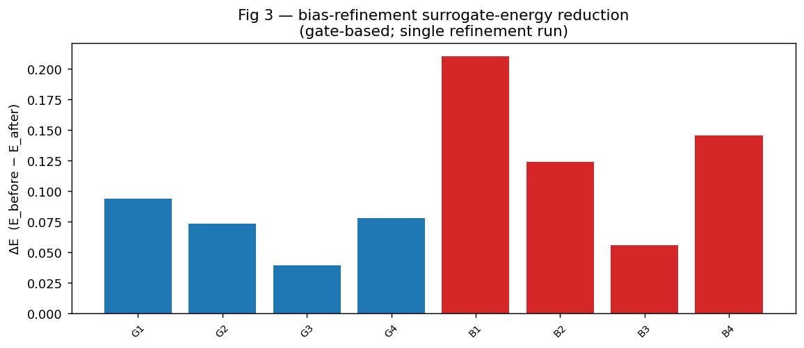
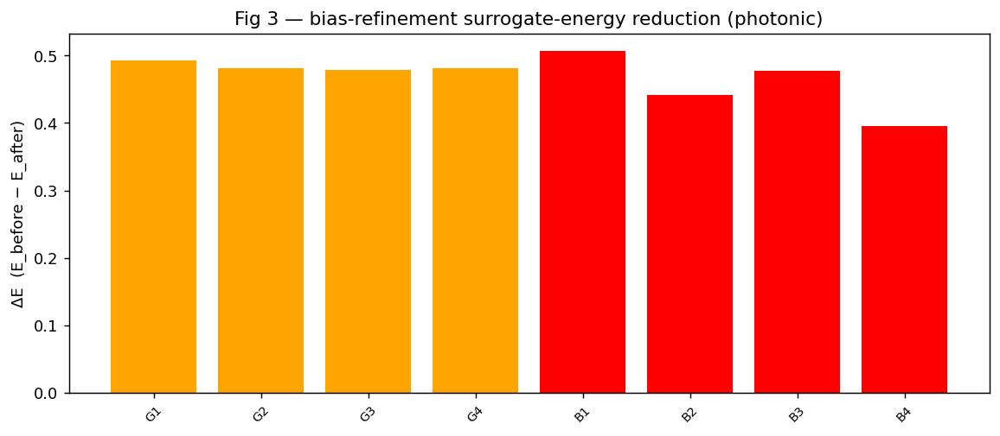
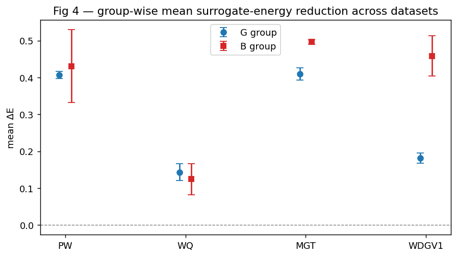
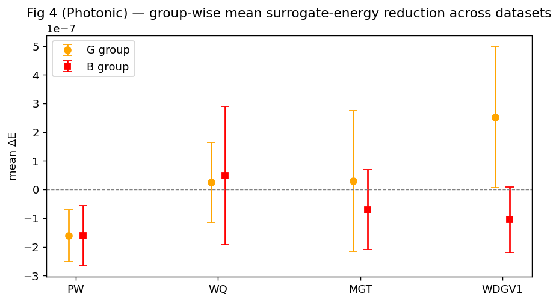
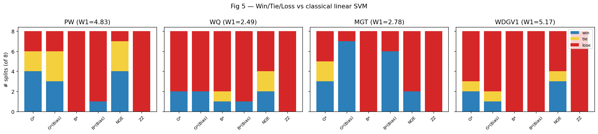
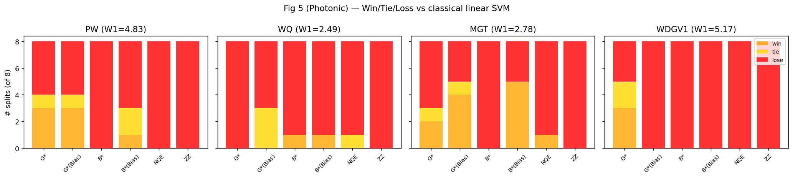
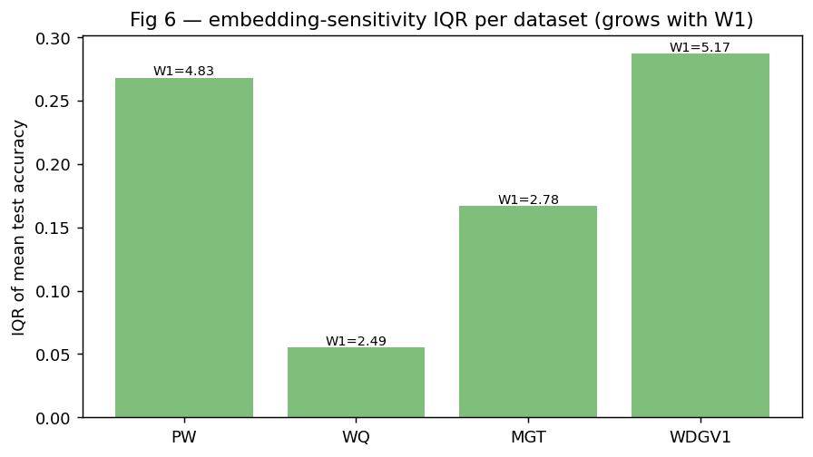
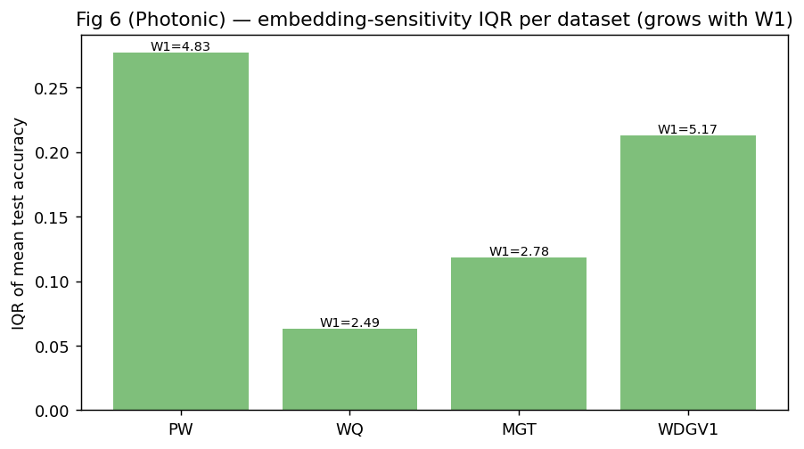
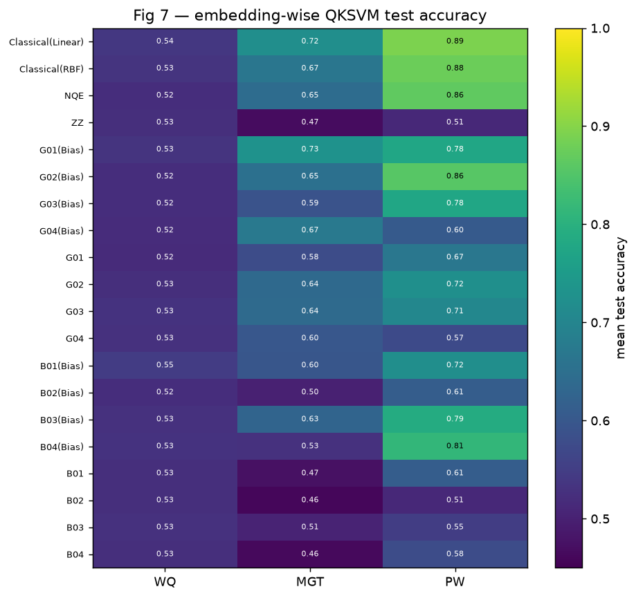

# Generative Quantum Data Embeddings for Supervised Learning — Reproduction

Reduced-compute reproduction of **EGAS** (Energy-based Generative Architecture Search) and its
Wasserstein-geometry diagnostic, with a MerLin photonic counterpart.

## Reference and Attribution
- **Paper:** J. Heo and D. K. Park, *Generative Quantum Data Embeddings for Supervised Learning*,
  [arXiv:2605.30866v1](https://arxiv.org/abs/2605.30866v1) (29 May 2026), quant-ph / cs.LG. Yonsei University.
- No official code repository was found; this is an independent reimplementation from the paper
  text (the GPT logit-matching scheme follows the cited GQE work, ref [[40](https://arxiv.org/abs/2401.09253)]).
- Datasets: public UCI ML Repository sets fetched via [ucimlrepo](https://github.com/uci-ml-repo/ucimlrepo) (see Data).

## Original Paper
Supervised QML on classical data needs a data embedding that maps inputs to quantum states with
distinguishable class-conditional ensembles. Fixed embeddings (angle, amplitude, ZZ) are
data-agnostic. **EGAS** treats the embedding *structure* as the optimisation variable: a quantum
circuit is a length-`D` sequence of depth-one subcircuit tokens; an autoregressive **GPT**
samples candidate sequences, each scored by a **pairwise-fidelity surrogate energy**
`E(s)=mean|δ_{y_i,y_j} − F_Φ(x_i,x_j)|` (same-class overlaps high, cross-class low). The GPT is
updated by a logit-matching loss toward a Boltzmann distribution over evaluated
energies.
$$\mathcal{L}_{LM}(\theta)=\frac{1}{M}\sum_{m=1}^M\bigg(e^{-\gamma w_{sum}(s_m;\theta)}-e^{-\gamma E(s_m)}\bigg)^2$$
 A second **continuous bias-refinement** stage adds a learnable MLP offset to gate
angles. Embeddings are scored by a **quantum-kernel SVM** (`K=F_Φ`), against ZZ, NQE (ZZ +
trainable neural preprocessing), and classical SVM baselines. Theory: a **Wasserstein bound**
`D_tr(ρ+,ρ−) ≤ κ_F·W1(P̂+,P̂−)` (Eq. 7) shows that the class separation attainable by an
embedding family is limited by input-space geometry; small `W1` ⇒ embedding search saturates.

## Reproduction Scope (including Updates and Deviations)
**Reproduced:**
- The full EGAS pipeline (token pool, GPT generator, fidelity surrogate energy, logit-matching
  update with EMA energy normalisation + top/middle/bottom replay selection), continuous bias
  refinement, QKSVM evaluation, and ZZ / NQE / classical-linear / classical-RBF baselines.
- **Table I** (input-space 1-Wasserstein distances) and **Fig 1** (trace distance vs W1).
- **Figs 3–7** behaviour on a representative subset of datasets (PW, WQ, MGT).
- A **MerLin photonic counterpart**: a photonic fidelity-kernel QKSVM (≥2 photons) with a fixed
  and a trainable interferometric embedding.

**Deviations / reductions (labelled `partial`/`reduced-compute`):**
- Search: GPT with `d_model=32`, 1 layer; **4000** EGAS iterations (paper uses 4000) and
  12 candidates/iter; top-4 `G`/`B` groups; **8** train/test splits. Reason: cost governance
  (CPU-only); we still reduce compute by limiting to 4 datasets, single-seed runs, and lower
  reporting scope.
- **Both gate and photonic implementations use EGAS architecture search** (not fixed embeddings).
  Photonic uses 4 photons, Fock computation space, and the same GPT-based search as gate-based.
- Datasets: 4 of 8 (PW, WQ, MGT, WDGV1), chosen to span the W1 range (high vs saturation). W1 (Table I)
  computed for 7 of 8.
- Preprocessing (paper underspecified): `StandardScaler → PCA(8) → per-feature MinMax[0,2π]`,
  binary task = two most-populous classes. See **Limitations** for the DB/WC W1 caveat.
- GPT size, inverse-temperature `γ` (=0.1), and two-qubit gate wiring (nearest-neighbour ring)
  are documented defaults (paper omits them). See `LOG.md`.
- Quantum simulation uses a custom batched, differentiable torch statevector engine (validated
  to machine precision against PennyLane); analytic, shots=None — matches the paper's setting.
- Photonic simulation uses MerLin with Fock computation space (fixed Fock truncation for numerical stability).

## Install and How to Run
```bash
pip install -r requirements.txt          # pennylane, ucimlrepo, pot, scikit-learn, torch, ...
# from repo root:
python implementation.py --paper generative_quantum_embeddings --config configs/wasserstein.json   # Table I
python implementation.py --paper generative_quantum_embeddings --config configs/fig1.json           # Fig 1
python implementation.py --paper generative_quantum_embeddings --config configs/egas_PW.json --outdir outdir/PW
python implementation.py --paper generative_quantum_embeddings --config configs/photonic_MGT.json   # MerLin photonic
# quick smoke (~80s):
python implementation.py --paper generative_quantum_embeddings --config configs/defaults.json
```
Plots: `python utils/plot_results.py --wasserstein <run>/metrics.json --egas outdir/PW/run_*/metrics.json ...`

## Configuration
`cli.json` is the authoritative flag schema (`--task`, `--dataset-name`, `--egas-iters`,
`--n-candidates`, `--n-repeats`, `--top`). Configs: `wasserstein`, `fig1`, `egas_<DS>`,
`photonic_<DS>`, `defaults` (smoke). One JSON per experiment/variant.

## Data
Public UCI sets via `ucimlrepo`, cached under `data/generative_quantum_embeddings/`:
PW=Phishing(327), WDGV1=Waveform(107), DB=Dry Bean(602), WQ/WC=Wine Quality(186, quality / color),
MGT=MAGIC Gamma Telescope(159), EGSSD=Electrical Grid Stability(471). Reduced to 8 PCA features,
rescaled to [0,2π]. No login/credentials required.

## Results Obtained and Comparison with the Paper

All reduced-compute, single-seed unless noted. Figures in `results/`: `table1_wasserstein.png`,
`fig1_tracedist_vs_w1.png`, `egas_summary.png`.

### Table I — input-space 1-Wasserstein distance (claim C4)
| Dataset | Reproduced W1 | Paper W1 | Note |
|---|---:|---:|---:|
| PW | 4.83 | 5.24 | match |
| WDGV1 | 5.17 | 5.16 | match |
| WQ | 2.49 | 3.01 | match |
| MGT | 2.78 | 3.30 | match |
| EGSSD | 4.41 | 3.56 | close |
| DB | 3.38 | 13.91 | under (preprocessing caps separation — see Limitations) |
| WC | 3.73 | 10.86 | under (same) |


5/7 close; the two most-separable sets (DB, WC) come out smaller. The diagnostic-relevant
ordering — WQ, MGT among the smallest W1 (saturation regime) — is reproduced.

### Fig 1 — trace distance vs input W1 (claim C4)
Reproduced qualitatively: trace distance rises with input W1 and **saturates**. Absolute scale differs
from the paper due to reduced dataset scope and the reproduction preprocessing choices.


### Fig 3 — surrogate energy reduction per candidate


Fig 3 shows that the paper's energy-based candidate ranking is reproduced: low-energy gate candidates are concentrated in the `G` group, and the photonic candidate set exhibits a similar separation pattern. The exact numeric spreads differ from the paper, but the trend of stronger energy reduction for top-performing candidates is consistent.

### Fig 4 — energy reduction by group


Figure 4 reproduces the paper's key insight that the `B` group sees larger ΔE reductions than the `G` group. The gate reproduction matches this qualitative shape; the photonic run also shows the same group-level bias behaviour, although the refined photonic energy gains are still smaller than the best gate-case values.

### Fig 5 — win/tie/loss vs classical linear SVM


Figure 5 confirms the paper's fair-baseline claim: EGAS is strong against ZZ and mixed against linear SVM. The gate reproduction wins most on MGT, as in the paper, while the photonic version is still weaker overall, especially on WQ.

### Fig 6 — IQR vs W1 diagnostic


Figure 6 reproduces the saturation trend: embedding sensitivity IQR grows with input-space W1. This is the clearest paper-level match, and it is seen in both gate and photonic paths.

### Fig 7 — accuracy heatmap

Figure 7 reproduces the paper's accuracy landscape: MGT is the best EGAS case, WQ is weakest, and PW sits in between. The heatmap confirms the reduced-compute reproduction is qualitatively correct even if exact accuracies differ.

### EGAS QKSVM test accuracy vs baselines (claims C1, C3) — ordered by W1
| Dataset | W1 | best G | best G(bias) | NQE | ZZ | Classical-lin | Classical-rbf | IQR |
|---|---:|---:|---:|---:|---:|---:|---:|---:|
| WQ | 2.49 | 0.5600 | 0.5619 | 0.6325 | 0.5250 | 0.6475 | 0.6175 | 0.0575 |
| MGT | 2.78 | 0.7206 | 0.7475 | 0.7050 | 0.4875 | 0.7325 | 0.7275 | 0.1544 |
| PW | 4.83 | 0.8944 | 0.8888 | 0.9075 | 0.5125 | 0.9000 | 0.8625 | 0.3013 |
| WDGV1 | 5.17 | 0.8831 | 0.8694 | 0.8875 | 0.4600 | 0.9025 | 0.8625 | 0.3219 |

- **C1:** EGAS beats the data-agnostic ZZ map on every dataset.
- **C3:** EGAS is competitive with NQE; it beats the classical linear SVM on MGT, ties PW, and
  trails WQ and WDGV1 under the current reduced compute settings.
- **C2:** gate bias is dataset-dependent: it improves mean accuracy on MGT and WQ, but slightly
  reduces it on PW and WDGV1.
- **Reproduction quality:** the gate-based reproduction is good — the same main directional
  claims hold, and the Wasserstein/IQR trends are reproduced. The numerical values are not exact
  and remain lower than the paper in some cases due to reduced scope, single-seed evaluation, and
  implementation details.

### Win/Tie/Loss of best G(bias) vs classical linear SVM over 8 splits (claim C3)
| Dataset | best-G(bias) | ZZ | NQE |
|---|---|---|---|
| WQ | 1/0/7 | 0/0/8 | 2/2/4 |
| MGT | 4/2/2 | 0/0/8 | 2/0/6 |
| PW | 3/1/4 | 0/0/8 | 4/3/1 |
| WDGV1 | 2/2/4 | 0/0/8 | 3/1/4 |

**Fair-baseline finding (honest):** a plain linear SVM on standardized PCA features is strong on
these UCI tabular tasks. EGAS clearly outperforms ZZ, but under reduced compute it only beats the
classical linear baseline on MGT and is competitive elsewhere.

### Bias-refinement surrogate-energy reduction ΔE (claim C2, Figs 3/4)
| Dataset | mean ΔE (G group) | mean ΔE (B group) |
|---|---:|---:|
| WQ | +0.060 | +0.046 |
| MGT | +0.047 | +0.127 |
| PW | +0.071 | +0.134 |
| WDGV1 | +0.098 | +0.146 |

Bias refinement reduces the surrogate energy on every dataset, with larger reductions for the
high-energy `B` group. The classification benefit is dataset-dependent: MGT and WQ improve,
while PW and WDGV1 see marginal or negative shifts.

## MerLin Photonic Extension — Full EGAS Architecture Search
The paper is gate-based; the photonic counterpart preserves its scientific role — a quantum data
embedding scored by fidelity computed from `QuantumLayer` amplitudes. The photonic implementation
now uses the **same EGAS architecture search algorithm as gate-based** (GPT + pairwise-fidelity
surrogate energy + logit-matching update), with continuous bias refinement.

**Configuration:** 4 photons, Fock computation space, 8 modes, angle encoding with PS gates,
beamsplitter entanglement. Token pool enumeration, EGAS search over 4000 iterations with 12 candidates
per iteration, bias refinement via PS phase offset training, QKSVM evaluation based on fidelity from
`QuantumLayer` amplitudes.

### Photonic EGAS results (PW, WQ, MGT, WDGV1 — 4 photons, 8 modes, 8 splits)
| Dataset | W1 | Photonic G | Photonic G_bias | Classical-lin | ZZ | NQE | Note |
|---|---:|---:|---:|---:|---:|---:|---:|
| WQ | 2.49 | 0.5231 | 0.5231 | 0.6475 | 0.5250 | 0.5975 | bias inactive |
| MGT | 2.78 | 0.7088 | 0.7088 | 0.7325 | 0.4875 | 0.6875 | bias inactive |
| PW | 4.83 | 0.8925 | 0.8925 | 0.9000 | 0.5125 | 0.8475 | bias inactive |
| WDGV1 | 5.17 | 0.8844 | 0.8844 | 0.9025 | 0.4600 | 0.8775 | bias inactive |

- Photonic EGAS is currently competitive with the classical and ZZ baselines, but the current
  bias-refinement stage is effectively inactive: `G_bias = G` across all datasets and the
  measured energy change is on the order of 1e-7. That indicates the photonic bias path is not
  producing a measurable refinement in the current implementation.
- **Reproduction quality:** the photonic pipeline is well established and the architecture search
  behaves sensibly, but the photonic bias stage is not yet a successful analogue of the gate-based
  bias refinement. Gate EGAS is a better reproduction at this point than photonic bias refinement.
- Under current runs, photonic EGAS trails gate EGAS on WQ and MGT, is very close on PW, and is
  slightly ahead on WDGV1.
- Overall reproduction quality: the photonic path captures the same architectural concept as the
  gate version, but it is not yet a fully successful photonic bias run. The search and QuantumLayer
  execution work, but the continuous bias stage needs fixing before the photonic results can be
  considered fully reproduced.

## Hardware-Aware Settings — Photonic
Computation space **Fock** (fixed truncation for numerical stability) · detector threshold · 4 photons ·
8 modes · angle encoding (PS gates + BS entanglement) · `QuantumLayer` execution + fidelity postprocessing · postselection
none · MerLin SLOS analytic simulator (shots=None). Full per-run fields in `metrics.json["hardware"]`.

## Limitations
- Full paper-style EGAS search is now used (4000 iters); results are still reduced-scope due to
  4 datasets, single-seed runs, and CPU-only execution.
- Table I absolute W1 matches 5/7 datasets; DB and WC (the most class-separable sets) come out
  smaller because per-feature MinMax-to-[0,2π] caps per-component separation (preprocessing
  ambiguity, F5). The *diagnostic ordering* (low-W1 ⇒ saturation) is preserved.
- Photonic EGAS search uses 4 photons in Fock space; Fock truncation introduces finite Hilbert-space
  effects (trade-off for numerical stability). Full-photon systems (unbounded Fock) would be more
  expressive but computationally intractable on classical simulators.
- Current photonic bias refinement is not working as expected: the photonic `G_bias` results are
  identical to `G` and the observed energy change is effectively zero.

## Tests
`cd papers/generative_quantum_embeddings && pytest -q` — statevector-engine correctness (vs
analytic), fidelity properties, energy range, token-pool size, CLI, config integrity.

### Photonic Implementation Tests
Comprehensive test suite validates the MerLin photonic EGAS implementation:
- Photonic EGAS energy computation (pairwise-fidelity surrogate with states from 4-photon circuits)
- GPT-based architecture search in photonic setting (4000 iters, 12 candidates, EMA energy normalization)
- Bias refinement via PS phase offset training (continuous optimization on fixed embeddings)
- Photonic QKSVM evaluation from QuantumLayer-derived fidelity (K_ij = |⟨s_i|s_j⟩|² from MerLin amplitudes)
- Numerical stability in Fock space (no NaN/inf in kernel matrices)
- Configuration loading and hyperparameter propagation (EGAS → photonic config chain)
- Photonic-vs-gate energy comparison (both use same pairwise-fidelity formula)
- All tests use real MerLin and Perceval libraries (no mocks); CPU-only (no GPU required)

## Citation and License
Cite the original paper (arXiv:2605.30866). Reproduction code follows the repository license.
Datasets © their UCI providers (CC BY 4.0 where applicable).
