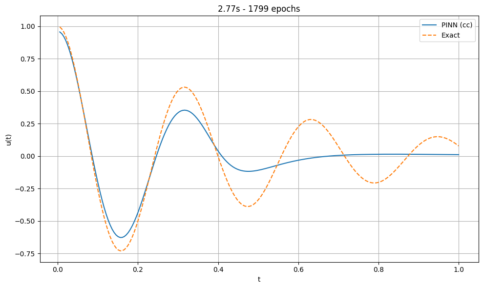
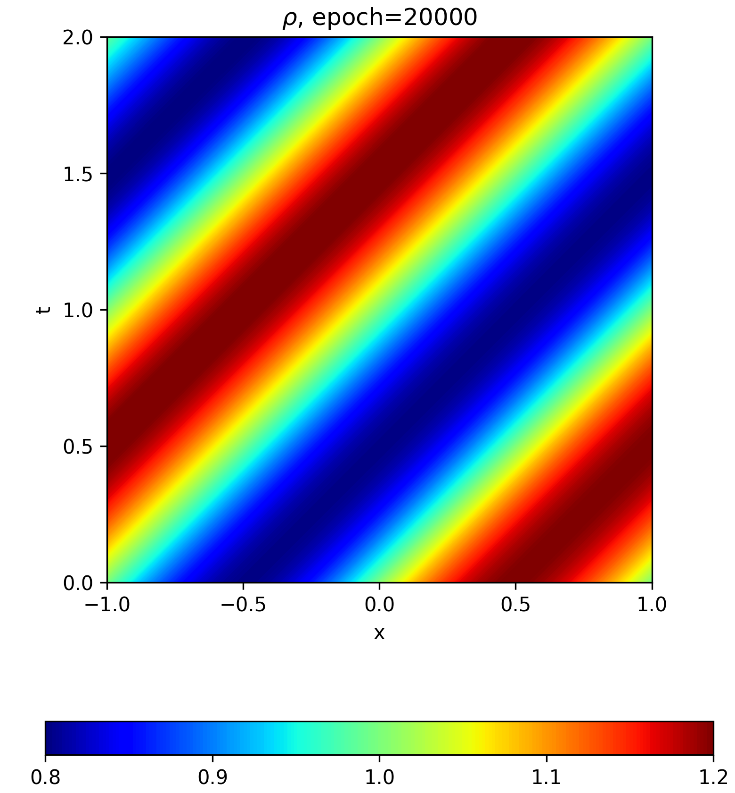
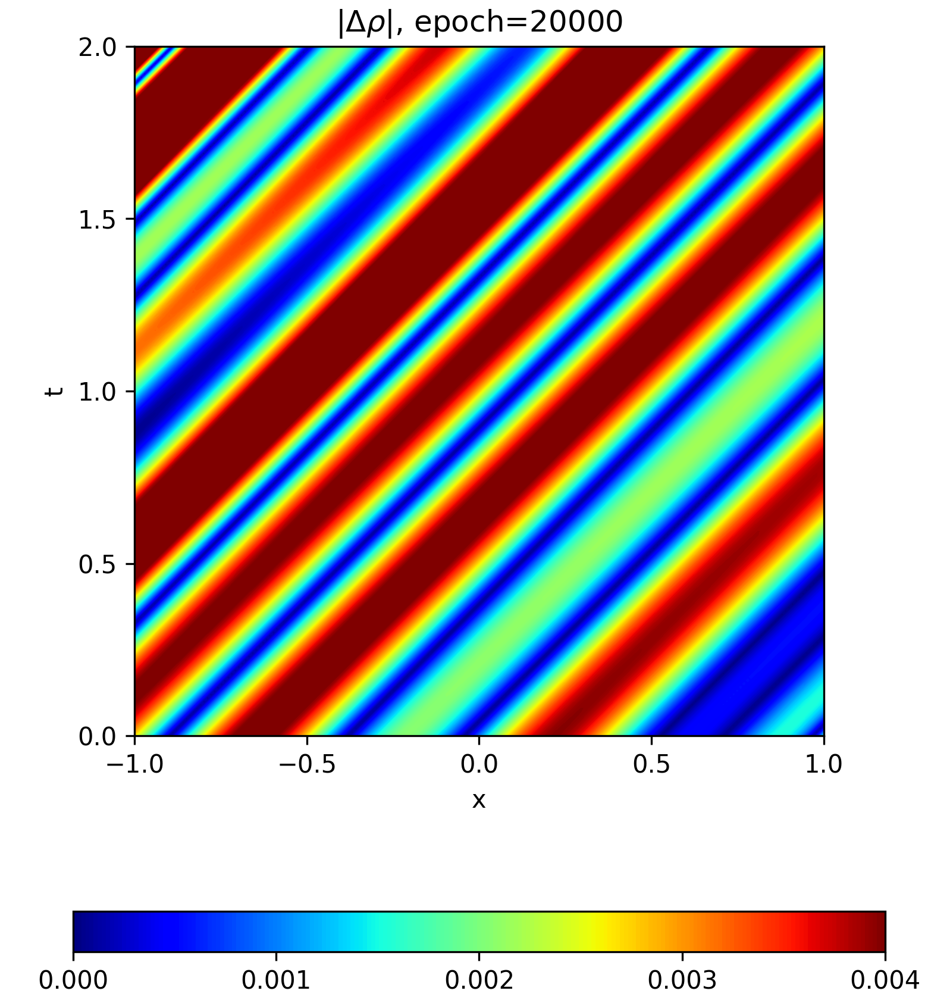
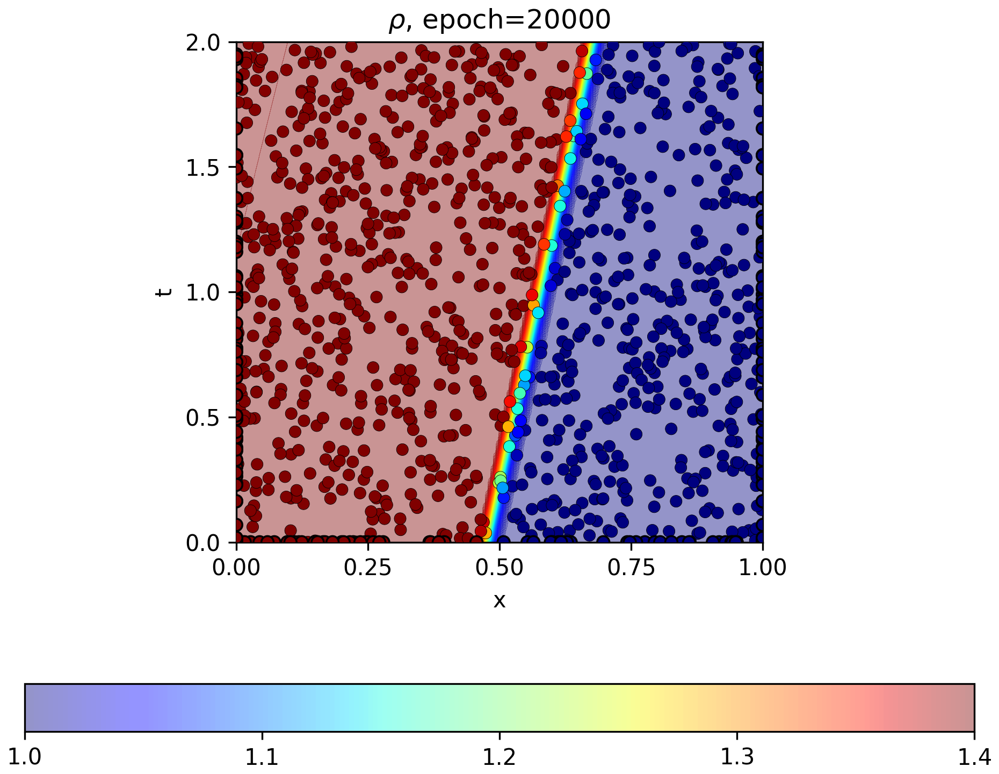
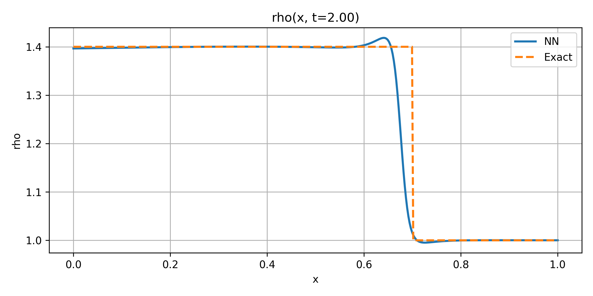

# Hybrid Quantum Physics-informed Neural Network - Reproduction

## Reference and Attribution

This reproduction targets **Hybrid Quantum Physics-informed Neural Network: Towards Efficient Learning of High-speed Flows** by Fong Yew Leong, Wei-Bin Ewe, Si Bui Quang Tran, Zhongyuan Zhang, and Jun Yong Khoo.

- arXiv: <http://arxiv.org/abs/2503.02202>
- Original repository: not used as a runtime dependency here
- License: follow the repository license and cite the original paper when using these experiments

## Original Paper

The paper studies hybrid quantum/classical physics-informed neural networks for high-speed-flow problems. It compares classical-classical, hybrid quantum-classical, and quantum-quantum branch architectures on four cases:

- `DHO`: damped harmonic oscillator from Appendix A.2
- `SEE`: smooth 1D Euler equation from Section 3.1
- `DEE`: discontinuous 1D Euler equation from Section 3.2
- `TAF`: steady 2D transonic flow around a NACA0012 airfoil from Section 3.3

The PINN objective combines data or boundary-condition terms with physics residual terms computed through automatic differentiation. Quantum branches use PennyLane circuits or Merlin/Perceval photonic layers, depending on the configured variant.

## Reproduction Scope

This folder implements the four benchmark families and these architecture variants:

- `cc`: classical-classical
- `hy-pl`: hybrid PennyLane
- `hy-m`: hybrid Merlin
- `hy-mp`: hybrid Merlin-Perceval for `DHO`
- `qq-pl`: quantum-quantum PennyLane
- `qq-m`: quantum-quantum Merlin
- `qq-mp`: quantum-quantum Merlin-Perceval for `DHO`

The shared runtime entrypoint is:

```text
lib.runner.train_and_evaluate(cfg, run_dir)
```

## MerLin Usage

MerLin is used for the photonic quantum branches, not as the top-level runtime.
The repository runtime still enters through `implementation.py`, then HQPINN
dispatches to the configured benchmark and architecture.

The MerLin integration is centralized in `lib/layer_merlin.py`:

- `make_interf_qlayer(n_photons)` builds the interferometer-style MerLin
  `QuantumLayer` used by the `hy-m` and `qq-m` configs.
- `make_perceval_qlayer()` builds the DHO-only Perceval circuit used by the
  `hy-mp` and `qq-mp` configs.
- `BranchMerlin` wraps the quantum layer as a PyTorch module so it can be used
  like any other PINN branch.
- `make_merlin_processor(backend)` builds the optional remote execution
  processor used in `mode=remote`.

During local training, MerLin is evaluated as a differentiable local
`QuantumLayer`. The branch maps physical inputs to angle features, runs the
trainable photonic circuit, groups Fock-space probabilities with MerLin's
measurement strategy, then applies a small linear readout before fusion with the
other branch outputs. The benchmark-specific feature maps are:

| Benchmark | MerLin feature map input |
| --- | --- |
| `DHO` | time `t`, encoded as harmonic angle features. |
| `SEE` | `(x, t)`, including the traveling-wave coordinate `x - t`. |
| `DEE` | `(x, t)`, including the shock-relative coordinate `x - (x0 + u*t)`. |
| `TAF` | `(x, y)`, including a compact coordinate interaction `x - y`. |

Architecture variants use MerLin as follows:

| Variant | MerLin role |
| --- | --- |
| `hy-m` | One MerLin branch plus one classical MLP branch. |
| `qq-m` | Two independent MerLin branches. |
| `hy-mp` | DHO-only Perceval/MerLin branch plus one classical MLP branch. |
| `qq-mp` | DHO-only pair of Perceval/MerLin branches. |

Remote mode is inference-only. It loads a local checkpoint, rebuilds the MerLin
branch with a `MerlinProcessor`, and evaluates the saved model on the selected
backend, for example:

```bash
python implementation.py --paper HQPINN --config configs/dho_hy_m_run.json --mode remote --backend sim:ascella
```

Remote mode does not train with remote gradients. Training configs run locally;
use remote mode only after a matching checkpoint exists in `models/`.

## Updates and Deviations

- The paper now runs through the repository-level `implementation.py` shared runtime.
- `python -m HQPINN` is no longer a supported entrypoint.
- The default config is a lightweight `DHO` inference smoke config.
- Full experiment settings are kept in named JSON configs under `configs/`.
- TAF geometry data lives under `data/HQPINN/NACA0012/`.
- TAF does not include the original internal CFD target fields for `X_data_int`; those points are reused as additional collocation points.
- PennyLane variants outside `DHO` are expensive on CPU and are not part of the standard batch launcher.

## Project Layout

```text
papers/HQPINN/
|-- README.md
|-- requirements.txt
|-- notebook.ipynb
|-- notebook_dho_helpers.py
|-- cli.json
|-- configs/
|-- lib/
|   |-- runner.py
|   |-- config.py
|   |-- DHO/
|   |-- SEE/
|   |-- DEE/
|   `-- TAF/
|-- tests/
|-- utils/
|-- models/
|-- outdir/
`-- assets/
```

Shared data is stored outside the paper folder:

```text
data/HQPINN/NACA0012/
```

## Install

From the repository root:

```bash
python -m venv .venv
source .venv/bin/activate
pip install -r papers/HQPINN/requirements.txt
```

Install `pytest` as well when running the test suite.

## How to Run

Use `configs/defaults.json` only as a shared-runtime smoke check. It verifies
discovery, config merging, imports, and output routing with a tiny DHO
classical inference run; it is not a paper result.

List discovered papers:

```bash
python implementation.py --list-papers
```

Show HQPINN options:

```bash
python implementation.py --paper HQPINN --help
```

Run the default smoke config:

```bash
python implementation.py --paper HQPINN --config configs/defaults.json
```

For a real experiment, train first, then run the matching inference config:

```bash
python implementation.py --paper HQPINN --config configs/dho_cc_train.json
python implementation.py --paper HQPINN --config configs/dho_cc_run.json
```

Run larger named experiments from the repository root:

```bash
python implementation.py --paper HQPINN --config configs/see_hy_m_train_10-4-2.json
python implementation.py --paper HQPINN --config configs/dee_qq_m_train_1.json
python implementation.py --paper HQPINN --config configs/taf_cc_train_40-4.json
```

Run from inside the paper folder:

```bash
cd papers/HQPINN
python ../../implementation.py --config configs/defaults.json
```

Batch launchers:

```bash
cd papers/HQPINN
bash utils/run_all_train_jobs.sh --dry-run
bash utils/run_see_dee_hy_pl_jobs.sh --dry-run
```

`utils/run_all_train_jobs.sh` covers the standard local training queue:
classical-classical, Merlin hybrid, and Merlin quantum-quantum jobs, plus the
DHO PennyLane jobs. It skips most SEE/DEE/TAF PennyLane jobs because they are
slow on CPU. Use `utils/run_see_dee_hy_pl_jobs.sh` when those hybrid PennyLane
jobs are explicitly needed.

## Configuration

`cli.json` is the authoritative paper-specific CLI schema. Global flags such as `--config`, `--outdir`, `--seed`, `--dtype`, `--device`, `--log-level`, and `--data-root` are injected by the shared runtime.

Important paper-specific options:

- `--experiment`: benchmark and architecture variant
- `--mode`: `train`, `run`, or `remote`
- `--backend`: local or remote backend label
- `--n-layers`, `--n-nodes`, `--n-qubits`, `--n-photons`, `--q-layers`: model-size controls
- `--force-retrain`: ignore reusable checkpoints where supported

Every JSON config includes a `description` field for traceability.

### Choosing a Config

Config names follow this pattern:

```text
configs/<benchmark>_<architecture>_<mode>[_<size>].json
```

The same values appear inside the JSON as `experiment`, `mode`, `backend`, and
`model`. Prefer editing or copying a named config over passing many CLI
overrides when running a long experiment.

| Name part | Values | Meaning |
| --- | --- | --- |
| `benchmark` | `dho`, `see`, `dee`, `taf` | Damped oscillator, smooth Euler, discontinuous Euler, or transonic airfoil. |
| `architecture` | `cc`, `hy_m`, `hy_pl`, `qq_m`, `qq_pl` | Classical-classical, hybrid Merlin, hybrid PennyLane, quantum-quantum Merlin, or quantum-quantum PennyLane. |
| DHO-only architecture | `hy_mp`, `qq_mp` | Merlin-Perceval variants implemented only for DHO. |
| `mode` | `train`, `run` | `train` creates checkpoints and result summaries. `run` loads a matching local checkpoint and writes inference artifacts. |
| `backend` | `local` in committed configs | Remote execution is selected by overriding `--mode remote --backend <backend>` for Merlin inference. |

Size suffixes encode the model dimensions used by the runner:

| Config example | Size meaning |
| --- | --- |
| `see_cc_train_10-7.json` | `n_nodes=10`, `n_layers=7`. |
| `taf_hy_m_train_80-4-2.json` | `n_nodes=80`, `n_layers=4`, `n_photons=2`. |
| `dee_hy_pl_run_20-4-2.json` | `n_nodes=20`, `n_layers=4`, `q_layers=2`. |
| `dee_qq_m_run_5.json` | Merlin quantum-quantum model with `n_photons=5`. |
| `see_qq_pl_train_3.json` | PennyLane quantum-quantum model with `q_layers=3`. |

Plain configs without a size suffix use the default size for that family. For
SEE and DEE the classical hidden width/depth choices are `10-4`, `10-7`, and
`20-4`. For TAF they are `40-4`, `40-7`, and `80-4`. DHO configs use one compact
size per architecture.

Architecture fields required in `model`:

| Architecture | Required model keys |
| --- | --- |
| `cc` | `n_layers`, `n_nodes` |
| `hy_m` | `n_layers`, `n_nodes`, `n_photons` |
| `hy_pl` | `n_layers`, `n_nodes`, `q_layers`; DHO uses `n_qubits` instead of `q_layers` |
| `qq_m` | `n_photons` |
| `qq_pl` | `q_layers`; DHO uses `n_qubits` instead of `q_layers` |
| `hy_mp` | DHO only; `n_layers`, `n_nodes` |
| `qq_mp` | DHO only; no extra model-size key |

Recommended experiment order:

1. Run `configs/defaults.json` to check the shared runtime.
2. Run `configs/dho_cc_train.json` as the smallest training path.
3. Run the `*_cc_train*.json` files for the benchmark baselines.
4. Run matching `*_run*.json` configs after checkpoints exist in `models/`.
5. Add Merlin variants next, then PennyLane variants when the local environment
   and runtime budget are ready.

## Data

TAF geometry files are committed under:

```text
data/HQPINN/NACA0012/
```

To regenerate them:

```bash
cd papers/HQPINN
python -m lib.TAF.generate_aerofoil_training_sets
```

The shared runtime also accepts `--data-root` or `DATA_DIR` to point at an alternate repository-level data directory.

## Outputs

Each shared-runtime invocation creates:

```text
papers/HQPINN/outdir/run_YYYYMMDD-HHMMSS/
|-- config_snapshot.json
`-- run.log
```

Training and inference runs write local regenerated artifacts under
`papers/HQPINN/results/`. Treat that folder as a working output directory unless
you intentionally curate a small result for documentation.

Committed result artifacts are kept in `papers/HQPINN/assets/`:

- `papers/HQPINN/assets/DHO/dho_summary.csv`
- `papers/HQPINN/assets/SEE/see_summary.csv`
- `papers/HQPINN/assets/DEE/dee_summary.csv`
- `papers/HQPINN/assets/DHO/dho_cc/*.png`
- `papers/HQPINN/assets/SEE/see_cc_10-4/*.png`
- `papers/HQPINN/assets/DEE/dee_cc_10-4/*.png`

Curated checkpoints are written under:

```text
papers/HQPINN/models/<benchmark>/
```

## Results Obtained

The committed results in `assets/` are small classical-classical baseline runs
used as a documentation snapshot. They are not the full paper matrix.

| Benchmark | Config | Run ID | Main metric |
| --- | --- | --- | --- |
| `DHO` | `configs/dho_cc_train.json` | `20260504-163330` | Relative L2 error `4.161749e-01` |
| `SEE` | `configs/see_cc_train_10-4.json` | `20260504-163400` | Density error `4.158964e-03`; pressure error `2.587267e-04` |
| `DEE` | `configs/dee_cc_train_10-4.json` | `20260504-163726` | Density error `3.934973e-02`; pressure error `5.138812e-05` |

### Curated Figures

DHO classical-classical prediction against the exact oscillator solution:



SEE classical-classical density prediction and absolute density error:





DEE classical-classical density prediction and final-time density slice:





Current qualitative status:

- `DHO`, `SEE`, and `DEE` have runnable train and inference paths.
- `TAF` is implemented as a geometry-aware PINN baseline because the original internal CFD target fields are unavailable.
- The default smoke config verifies shared-runtime wiring without training a model.
- No committed TAF figure is currently included in `assets/`.

## Comparison with the Paper

The implementation follows the paper's benchmark split and architecture naming. The main known mismatch is `TAF`: without supervised CFD targets for internal points, the reproduction cannot fully match the paper's transonic-airfoil results or Figure 7 flow structure.

## Limitations

- Some quantum variants require PennyLane, Merlin, and Perceval installations that are sensitive to local versions.
- `remote` mode requires a non-local backend and the corresponding Merlin runtime credentials/configuration.
- CPU-only full runs can be slow, especially PennyLane variants outside `DHO`.
- Missing checkpoints cause inference configs to finish without producing a prediction artifact.

## Tests

From the paper folder:

```bash
cd papers/HQPINN
python -m pytest -q
```

Shared-runtime checks from the repository root:

```bash
python implementation.py --list-papers
python implementation.py --paper HQPINN --help
python implementation.py --paper HQPINN --config configs/defaults.json
```

## Citation and License

Cite the original arXiv paper when using these reproduced experiments. Follow this repository's license for the reproduction code and any additional license terms of PennyLane, Merlin, Perceval, PyTorch, NumPy, and Matplotlib.
