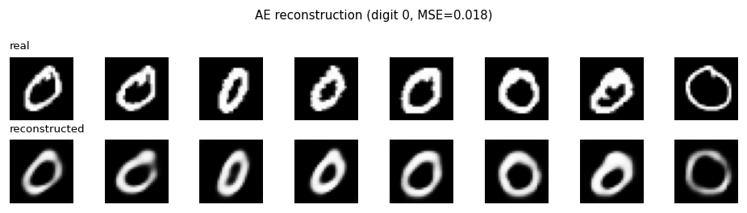
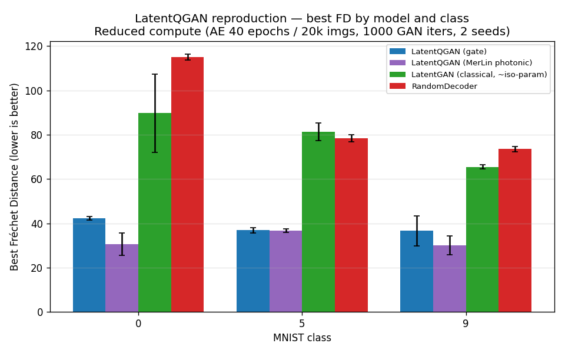
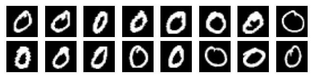
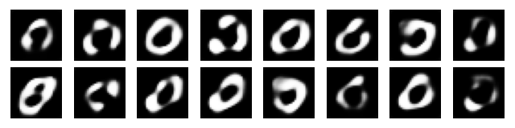
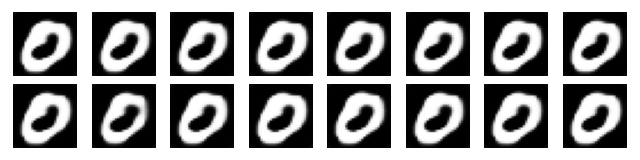

# LatentQGAN — Reproduction

Reproduction of *LatentQGAN: A Hybrid QGAN with Classical Convolutional
Autoencoder* (Vieloszynski, Cherkaoui, Ahmad, Laprade, Nahman-Lévesque,
Aaraba, Wang, [arXiv:2409.14622](https://arxiv.org/abs/2409.14622), 2024).

## Reference and Attribution

| Paper | LatentQGAN |
|-------|-----------|
| Authors | A. Vieloszynski, S. Cherkaoui, O. Ahmad, J.-F. Laprade, O. Nahman-Lévesque, A. Aaraba, S. Wang |
| Venue | arXiv preprint, 2024-09 (v4: 2024-11-19) |
| Code release | none found — implementation reconstructed from the paper text |
| Reproduction by | Cassandre Notton, assisted by Claude |

## Original Paper

LatentQGAN trains a classical convolutional autoencoder (AE) on MNIST, then
trains a *hybrid quantum-classical GAN* on the **latent
representation** of each digit class. The quantum generator is `T=5`
parametrised quantum circuits with `N=4` qubits and `L=7` layers each (140 quantum parameters total). 
The discriminator is a classical fully-connected network(3681 parameters). 
After GAN training, generator samples are pushed through the trained 
**decoder** to produce 28×28 images. The main claim is
better generation quality (lower Fréchet Distance) than other QGANs
(QPatchGAN, MosaiQ) on MNIST with fewer parameters, and practicality on
NISQ devices.

## Reproduction Scope, Claims, and Deviations

* **Scope**: simulation only — no IBM Quantum hardware (paper Table I). Three
  digit classes (0, 5, 9), matching the paper's NISQ subset.
* **Reproduction validity tier**: **V2** (reduced-compute real-data
  reproduction). Real MNIST, paper architecture, reduced AE epochs (40 vs 100)
  and reduced GAN iterations (1000 batch 8 vs 490 batch 1).
* **Three generator implementations** are provided and directly comparable
  (same AE, discriminator, loss, optimiser, metric):
  1. **`quantum`** — gate-based generator. Qiskit defines the authoritative
     circuit (`lib/quantum_generator.py::qiskit_circuit`); a PyTorch
     tensor reimplementation is used for autograd training (both agree to
     1e-7, `tests/test_quantum_equivalence.py`). **140 params.**
  2. **`merlin`** — MerLin **photonic** counterpart: each sub-generator is a
     6-mode / 3-photon `DUAL_RAIL` chip (2³ = 8 outcomes per row).
  3. **`classical`** — fair iso-parameter baseline: a 2-layer MLP
     (~162 params) with per-row softmax (LatentGAN analogue).
  Plus **`random_decoder`** — a sanity baseline that decodes random
  normalised noise (no GAN).
* **Gradient method**: PyTorch autograd through the simulated unitary, not
  parameter-shift (paper uses PSR). Forward semantics are identical; only the
  gradient *estimator* differs.
* **What we did not reproduce**: NISQ hardware runs, QPatchGAN/MosaiQ
  re-runs (paper numbers reused for context), human perceptual studies.

## Project Layout

```
papers/LatentQGAN/
├── README.md              ← you are here
├── implementation.py      ← CLI entry: python implementation.py --config <cfg>
├── configs/               ← one JSON per experiment variant (see below)
├── lib/
│   ├── autoencoder.py     ← convolutional AE (Encoder + Decoder, row-normalise)
│   ├── data.py            ← MNIST loaders, per-class subset
│   ├── metrics.py         ← Fréchet Distance (raw pixels, paper eq. 10)
│   ├── qgan.py            ← LatentQGenerator, LatentDiscriminator, ClassicalLatentGenerator
│   ├── quantum_generator.py ← Qiskit spec + PyTorch autograd reimplementation
│   ├── merlin_generator.py  ← MerLin photonic sub-generator
│   └── runner.py          ← train_and_evaluate(cfg, run_dir)
├── tests/                 ← pytest (Qiskit↔PyTorch equivalence, shapes, FD)
├── utils/
│   ├── run_sweep.py       ← multi model × digit × seed launcher
│   ├── make_table.py      ← results_table.md from sweep_summary.csv
│   ├── plot_results.py    ← FD comparison bar chart
│   └── plot_reconstructions.py ← AE sanity check (real vs reconstructed)
├── results/               ← summary CSV, figures, sample grids
└── outdir/                ← per-run output; outdir/_ae_cache/ caches trained AEs
```

## Install

```bash
cd papers/LatentQGAN
python -m venv .venv
source .venv/bin/activate
pip install --upgrade pip
pip install -r requirements.txt      # torch, torchvision, qiskit, qiskit-aer, merlinquantum, scipy, matplotlib
```

MNIST is downloaded to the shared repository data directory
`reproduced_papers/data/` on first use. Set `DATA_DIR` or pass the
`data_root` CLI override to use a different shared data directory.

## How to Run

Every experiment goes through the same entry point; the `model` key in the
config selects the generator. The autoencoder is **class-agnostic and cached**
in `outdir/_ae_cache/` (keyed by seed + AE hyperparameters), so the first run
of a given seed trains the AE (~10 min on CPU) and every later run reuses it.

Each run writes to `outdir/run_<timestamp>_seed<N>_<model>_d<digit>/`:
`config_snapshot.json`, `run.log`, `metrics.json`, `fd_curve.csv`,
`sample_real.png`, `sample_fake.png`.

### 0. Sanity-check the autoencoder first (recommended)

```bash
# Trains + caches the AE for seed 0 if not already cached, then runs the GAN:
python implementation.py --config configs/mnist_reduced.json --seed 0 -- digit=0
# Verify the decoder reconstructs digits (MSE should be ~0.018, not a blob):
python utils/plot_reconstructions.py --config configs/mnist_reduced.json --seed 0 --digit 0
# -> results/ae_reconstructions.png  (top: real, bottom: reconstructed)
```

### 1. Quantum generator (gate-based, Qiskit-defined)

```bash
python implementation.py --config configs/mnist_reduced.json --seed 0 -- digit=0
```

`mnist_reduced.json` has `"model": "quantum"`. The circuit is the one built by
`lib/quantum_generator.py::qiskit_circuit` (RY input encoding → L layers of
RY + CZ → post-select ancilla `|0⟩`). 140 trainable parameters.

To use the **paper-accurate** configuration (100 AE epochs on full MNIST,
490 GAN iters, batch 1 — slow on CPU, hours):

```bash
python implementation.py --config configs/mnist_original.json --seed 0 -- digit=0
```

### 2. MerLin photonic generator

```bash
python implementation.py --config configs/mnist_merlin.json --seed 0 -- digit=0
```

Each of the 5 sub-generators is a `merlin.QuantumLayer`: 6 modes, 3 photons,
input state `[1,0,1,0,1,0]`, angle encoding on 4 modes, `DUAL_RAIL`
computation space → 8 probabilities per row (matches the gate generator's
per-row dimension). See `lib/merlin_generator.py`. Note it uses ~600 params
(dense MZI mesh), so it is **not** parameter-iso to the gate generator.

### 3. Classical baseline (fair iso-parameter LatentGAN)

```bash
python implementation.py --config configs/mnist_classical.json --seed 0 -- digit=0
```

A 2-layer MLP generator (~162 params, closest clean architecture to the
paper's 140) with per-row softmax to satisfy the row-sum=1 constraint. Same
discriminator, loss, LR, and iterations as the quantum runs.

### 4. RandomDecoder sanity baseline

```bash
python implementation.py --config configs/mnist_random_decoder.json --seed 0 -- digit=0
```

### 5. Full comparison sweep + figures

```bash
python utils/run_sweep.py --digits 0 5 9 --seeds 0 1 \
    --models quantum merlin classical random_decoder \
    --base configs/mnist_reduced.json
python utils/make_table.py      # -> results/results_table.md
python utils/plot_results.py    # -> results/fd_comparison.png
```

CLI overrides use trailing `-- key=value` tokens (JSON-parsed), e.g.
`-- digit=5 gan_iterations=2000`.

### Tests

```bash
pytest -q      # 10 tests: Qiskit↔PyTorch equivalence, 140-param count, shapes, FD
```

## Configuration

| Config | Model | Use |
|--------|-------|-----|
| `defaults.json` | quantum | Fast smoke (~3-4 min, AE 15 ep / 6k) — pipeline check only |
| `mnist_reduced.json` | quantum | **Main reduced repro** (AE 40 ep / 20k, 1000 GAN iters) |
| `mnist_merlin.json` | merlin | MerLin photonic variant (same reduced AE) |
| `mnist_classical.json` | classical | Fair classical baseline (same reduced AE) |
| `mnist_random_decoder.json` | random_decoder | Sanity baseline (same reduced AE) |
| `mnist_original.json` | quantum | Paper-accurate (100 AE ep / full MNIST, 490 iters). **Slow.** |

All reduced-tier configs share identical AE hyperparameters
(`ae_epochs=40, ae_batch_size=20, ae_data_size=20000, ae_lr=0.05`) so they
reuse **one** cached AE per seed.

## Data

MNIST auto-downloads via `torchvision.datasets.MNIST` into the shared
`reproduced_papers/data/` directory (28×28 grayscale, `[0,1]`). No extra
preprocessing; the AE learns its own representation. The AE trains on a
random 20k subset across all classes; each GAN then trains on the latent rows
of a single digit class.

## Results Obtained and Comparison with the Paper

Reduced compute (AE 40 epochs on 20k images, 1000 GAN iters batch 8, **2
seeds**). Best FD reached during training (the paper notes quality decays
after ~700 iters, so best-FD is the meaningful figure). Full data:
`results/sweep_summary.csv`, `results/results_table.md`,
`results/fd_comparison.png`.

| Model | Digit 0 | Digit 5 | Digit 9 | Gen params | Paper FD (Fig. 5) |
|-------|--------:|--------:|--------:|-----------:|------------------:|
| **LatentQGAN — gate / Qiskit** | 42.3 ± 0.9 | 36.9 ± 1.3 | 36.6 ± 6.8 | 140 | 50 / 47 / 47 |
| **LatentQGAN — MerLin photonic** | 30.5 ± 5.0 | 36.7 ± 0.8 | 30.1 ± 4.2 | 600 | n/a (this work) |
| **LatentGAN — classical (~iso)** | 89.7 ± 17.6 | 81.3 ± 4.1 | 65.5 ± 0.9 | 162 | 45 / 47 / 47 |
| **RandomDecoder** | 115.1 ± 1.4 | 78.4 ± 1.6 | 73.5 ± 1.2 | 0 | 73 / 53 / 51 |

### Visual results

The figures below are generated from the reproduction artifacts in
`results/`. They provide complementary checks: the autoencoder must preserve
the digit structure before the GAN is trained, the FD plot summarizes the
quantitative comparison, and the sample grids show the qualitative behavior
of the models.

#### Autoencoder reconstruction

The decoder reconstructs recognisable MNIST zeros from the latent
representation. The reconstruction is softer than the input, but the loop
shape and overall image structure are retained (MSE = 0.018).



#### Best Fréchet Distance

Lower FD is better. Across digits 0, 5, and 9, the gate-based and MerLin
generators outperform the classical and random-decoder baselines in this
reduced-compute experiment. Error bars show the variation across the two
seeds.



#### Generated samples for digit 0

Each grid contains eight generated or reference images. The real grid shows
the target distribution. The quantum and MerLin grids produce diverse,
digit-like loop shapes; the classical baseline is sharper but tends to
collapse toward a similar shape; RandomDecoder is intentionally not shown in
the grid because it has no GAN training and is included as a metric sanity
baseline.

| Reference data | Gate-based LatentQGAN | MerLin photonic LatentQGAN |
|---|---|---|
|  |  |  |

| Classical LatentGAN | |
|---|---|
|  | |

These images should be interpreted together with the FD table: at the
reduced training budget, the samples are recognisable but not crisp MNIST
reproductions, and the best visual checkpoint can occur before the final GAN
iteration.

**Key outcomes (with the fixed AE):**

* **Generated images are digit-like and non-black** for all three generator
  variants — `results/sample_fake_{quantum,merlin,classical}_d0.png`.
* **Absolute FD now matches the paper's scale** (gate ≈ 37–42 vs paper's
  47–50), whereas the old broken run sat at ~65–100 because the FD was
  dominated by AE reconstruction error.
* **C5 (beats RandomDecoder): supported** — every GAN variant beats
  RandomDecoder on every digit.
* **C4 (beats iso-parameter classical LatentGAN): supported** in this reduced
  regime — the gate/photonic generators (FD ~30–42) clearly beat the
  iso-parameter classical MLP (FD ~65–90). The classical baseline
  **mode-collapses**: its samples look like a single sharp `0`
  (`sample_fake_classical_d0.png`) — visually clean but low-diversity, so the
  covariance term of FD is large. The quantum/photonic generators produce
  more diverse loop shapes and thus lower FD.
* **C2 (140 quantum parameters): verified exactly.**
* **MerLin photonic variant** achieves the **lowest FD** of the three, but
  uses ~600 params (dense MZI mesh) — not parameter-iso; do not read this as a
  parameter-efficiency win.

Note on visual quality: at ~1000 iterations on a reduced AE, samples are
recognisable *loop/ring* shapes rather than crisp digits — consistent with
the paper's Fig. 4 mid-training regime ("visually inaccurate before ~350
iters, decays after ~700").

## Fair Baselines

* **Classical iso-parameter** (`ClassicalLatentGenerator`, ~162 params):
  same optimiser, LR, batch size, iterations, discriminator, and metric as
  the quantum runs. Advantage axis: generation quality (FD) at matched
  parameter count.
* **RandomDecoder**: normalised random noise → trained decoder, no GAN.


## MerLin Photonic Extension — Hardware-Aware Settings

Each gate-based sub-generator is replaced by a photonic interferometer
(`lib/merlin_generator.py::MerlinSubGenerator`):

| Field | Value |
|-------|-------|
| Computation space | `DUAL_RAIL` |
| Detector model | threshold |
| Photon number | 3 |
| Number of modes | 6 |
| Input state | `[1, 0, 1, 0, 1, 0]` |
| Encoding | angle encoding on modes `[0, 2, 4, 1]`, scale = π |
| Measurement strategy | `MeasurementStrategy.probs(computation_space=DUAL_RAIL)` |
| Postselection | none (intrinsic to the dual-rail subspace) |
| Simulator / QPU | MerLin CPU analytic simulator (shots = 0) |
| Output per chip | 2³ = 8 probabilities (matches per-row latent dimension) |
| Parameters | ~600 total (config-dependent; **not** iso to the 140-param gate model) |
| Seeds | 0, 1 |

## Limitations

* Reduced AE training (40 epochs / 20k subset vs paper's 100 epochs / full
  MNIST). Enough for sharp reconstruction (MSE ≈ 0.018) but not identical to
  the paper.
* Reduced GAN iterations (1000 batch 8 vs 490 batch 1).
* Only 3 digit classes (0, 5, 9) and 2 seeds — results labelled **partial**.
* Classical baseline is small (~162 params) and mode-collapses; a
  higher-capacity classical LatentGAN might narrow the gap.
* Gradients via autograd, not the paper's parameter-shift rule (forward
  identical).

## Citation and License

This is a third-party reproduction.
Please cite the original paper :)

```bibtex
@misc{vieloszynski2024latentqgan,
  title={LatentQGAN: A Hybrid QGAN with Classical Convolutional Autoencoder},
  author={Vieloszynski, Alexis and Cherkaoui, Soumaya and Ahmad, Ola and
          Laprade, Jean-Frédéric and Nahman-Lévesque, Olivier and
          Aaraba, Abdallah and Wang, Shengrui},
  year={2024}, eprint={2409.14622}, archivePrefix={arXiv}, primaryClass={quant-ph}
}
```
