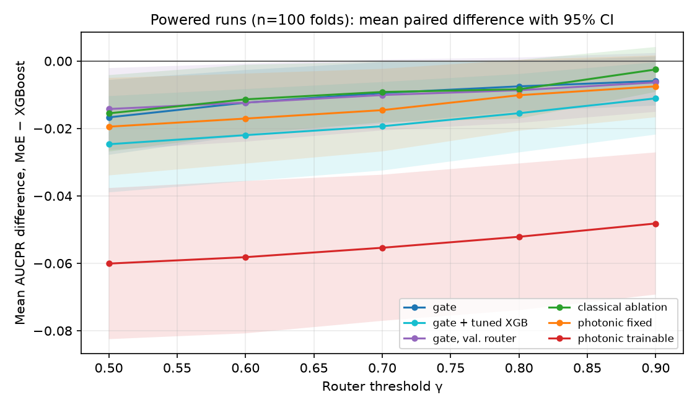
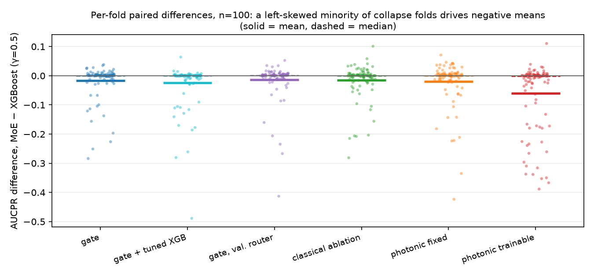
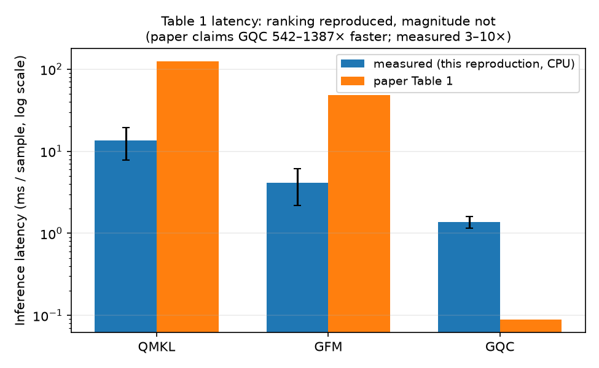

# MoE Framework for Hybrid-Quantum Fraud Detection — Reproduction

## Reference and Attribution

- Paper: "A Mixture-of-Experts Framework for Practical Hybrid-Quantum Models
  in Credit Card Fraud Detection"
- Authors: Rodrigo Chaves, Kunal Kumar, Bruno Chagas, Rory Linerud, Brannen
  Sorem, Javier Mancilla, Bryn Bell (Oxford Quantum Circuits, Mastercard)
- ArXiv: 2603.06473v2 [quant-ph] (PDF at repo root: `2603.06473v2.pdf`)
- Original repository: not found — the paper does not link one.
- License and attribution notes: this reproduction is an independent
  reimplementation from the paper text; no code was copied from the authors.

## Overview

The paper proposes a hybrid quantum-classical fraud-detection model — an
extended "Guided Quantum Compressor" (GQC): a classical autoencoder (trained
only on non-fraud transactions) reduces 29 anonymized features to 6 latent
dimensions, angle-encodes them into a 6-qubit variational quantum circuit
(Alternating Layered Ansatz, 6 layers, single data-upload), whose Pauli-Z(0)
expectation feeds a small classical FNN head that is temperature-calibrated
(Platt scaling). This hybrid model ("secondary expert") is combined with an
XGBoost classifier ("primary expert") through a mixture-of-experts (MoE)
router: an XGBoost classifier trained to predict where the quantum-hybrid
model corrects XGBoost's mistakes. At test time, a router threshold γ decides
per-transaction which expert's calibrated probability is used — motivated by
the need to keep most inference on the fast classical path while routing
only a small fraction of transactions to the (slower) quantum-hybrid path.

**What was reproduced**: the full gate-model pipeline (autoencoder + VQC +
head + calibration + XGBoost + MoE router) on the paper's own dataset and
CV protocol (repeated 3x stratified 5-fold CV), evaluated with the paper's
own metrics (AUCPR, AP, precision, recall) at the paper's router-threshold
sweep {0.5, ..., 0.9}. In addition (beyond the paper, required by this
repository's reproduction workflow): a MerLin **photonic** adaptation of the
VQC (Phase 4) and a parameter-matched **classical** ablation of the VQC
(Phase 5, fair-baseline isolation of the quantum contribution).

**What was NOT reproduced**: the OQC Toshiko hardware-latency benchmark
(Table 6, requires QPU access we do not have — verified against the paper
text, which explicitly runs this one on hardware). The QMKL/Genetic-
Feature-Map inference-latency comparison (Table 1) **was** reproduced (it
requires no QPU access — the paper runs it "exclusively in a CPU
environment"): the speedup *ranking* holds (QMKL slowest, GQC fastest) but
the claimed *magnitude* (GQC 500-1400x faster) does not — measured only
3-10x here. See "Latency Benchmark (Table 1)" below.

**Key deviations/assumptions** (full detail in `LOG.md`):
- Dataset: OpenML mirror (`data_id=1597`) of the paper's Kaggle
  `mlg-ulb/creditcardfraud` dataset — identical data (284,807 rows, 492
  fraud, same 30 features), fetched without a login requirement.
- Epoch count (30), Adam lr (1e-3), and XGBoost hyperparameters
  (`n_estimators=200, max_depth=4`) are our own choices — the paper does not
  specify them.
- The MoE router is trained on the ANALYSIS split's features (not literally
  "the validation features" as the paper's prose states) — this matches the
  paper's own described train/validation/analysis/holdout procedure
  (Section 3.3, Fig. 2) rather than its prose, which we read as a
  terminology inconsistency in the paper itself (see `lib/moe.py`
  docstring).
- Hardware/software environment: CPU-only container (14 cores, ~7.8 GB RAM),
  PennyLane (gate model), MerLin 0.4.1 (photonic model), XGBoost, PyTorch,
  scikit-learn.

## Project Layout

Standard layout per the repository's `AGENTS.md` template:
`lib/` (data, autoencoder, VQC gate/photonic/classical, head, calibration,
MoE router, pipeline orchestration, runner), `configs/` (defaults, smoke,
named experiments, and the six powered n=100 configs), `tests/`,
`utils/` (powered-run launcher, paired statistical analysis, figure
generation), `results/` (curated statistics + figures, tracked — see
`results/README.md`), `outdir/` (raw run outputs, not committed),
`notebook.ipynb` (pedagogical walkthrough).

## Install and How to Run

```bash
source /opt/venv/bin/activate  # or your own venv; see requirements.txt
pip install -r requirements.txt
```

```bash
# From the repo root
python implementation.py --paper MoE_fraud_detection --help

# Fast smoke run (1 split, 3 epochs, ~25s)
python implementation.py --paper MoE_fraud_detection --config configs/smoke.json

# Paper-accurate gate-model run (3x5-fold CV, 30 epochs, ~10-15 min)
python implementation.py --paper MoE_fraud_detection --config configs/moe_gate_original.json

# MerLin photonic adaptation (same protocol, ~6-10 min)
python implementation.py --paper MoE_fraud_detection --config configs/moe_merlin_photonic.json

# Classical ablation (isolates the quantum block's contribution, ~2 min)
python implementation.py --paper MoE_fraud_detection --config configs/moe_classical_ablation.json
```

Each run writes `outdir/run_<timestamp>/{config_snapshot.json, run.log,
metrics.json, metrics_table.csv}`.

## Configuration

- `configs/defaults.json`: fast smoke-friendly defaults (1 repeat, 2 splits,
  5 epochs). Not paper-accurate by design (repo convention).
- `configs/moe_gate_original.json`: paper-accurate settings, gate-model VQC.
- `configs/moe_merlin_photonic.json`: same settings, MerLin photonic VQC
  (`model.backend: "photonic"`).
- `configs/moe_classical_ablation.json`: same settings, classical
  dense-layer ablation (`model.backend: "classical"`).
- `configs/xgboost_baseline.json`: same CV/data protocol; the pipeline
  always trains the full GQC+router stack, and the XGBoost-only row is
  already produced as the `xgboost_baseline` row of any run — this config
  exists for clarity when only that baseline is of interest.
- `configs/smoke.json`: 1 split, 3 epochs, for fast iteration.
- CLI overrides: `--backend {gate,photonic,classical}`, `--epochs`,
  `--repeats`, `--router-thresholds`, `--lambda-recon` (see `cli.json`).

## Data

ULB European Credit Card Fraud dataset (284,807 transactions, 492 fraud /
0.172%). The paper's source is Kaggle `mlg-ulb/creditcardfraud`, which
requires a login/API key; we instead fetched the identical dataset from
OpenML (`sklearn.datasets.fetch_openml(data_id=1597)`, no login required)
and verified the instance/class counts match the paper's reported 0.172%
fraud rate exactly. Stored at `data/MoE_fraud_detection/creditcard.csv`
(~142 MB). See `LOG.md`'s "Data Acquisition Log" for the exact re-download
command.

Preprocessing (per paper Section 3.2): drop `Time` (not present in this
mirror), `MinMaxScaler` fit on each fold's training pool only, 50/50
downsample of the training pool. Validation/analysis/holdout are left at
natural class balance.

## Results Obtained and Comparison with the Paper

### Summary (read this first)

At the statistically powered scale (n=100 CV folds), **the paper's headline
claim — that MoE routing to the quantum-hybrid expert improves on the
XGBoost baseline — does not reproduce**: the paired mean AUCPR difference
is negative and statistically significant at the paper's headline
thresholds for every backend (gate, parameter-matched classical ablation,
and both photonic variants), e.g. gate at γ=0.5: −0.017 [95% CI −0.028,
−0.006], paired-t p=0.004.



The *mechanism* matters for interpreting this: most folds mildly favor MoE
(win-rates 63–70%, per-fold medians ≈ 0), and the negative means are
driven by a left-skewed minority (~5–11%) of folds where the secondary
expert's calibration collapses on tiny, near-separable validation folds
(worst fold: −0.49 AUCPR):



Because the parameter-matched **classical ablation behaves like the gate
model**, the quantum block is not the differentiator either way — the MoE
construction itself, interacting with per-fold calibration on this tiny
downsampled training pool, is. The trainable-readout photonic variant is
the worst performer (−0.060 mean, p<0.001 at every threshold).

Secondary findings: precision/recall trade-off and routing fraction
reproduce qualitatively (the closest matches to the paper); the Table 1
latency *ranking* reproduces but its claimed 542–1387× magnitude does not
(measured 3–10×):



A router-thresholding bug found during diagnosis (details under the
powered-re-run section) has been **fixed, regression-tested, and bounded**:
it fired on ≤3 of 100 folds per config, none of them collapse folds, and
excluding every affected fold changes no verdict (all p ≤ 0.038).

Everything below gives the detail behind this summary, in the order the
investigation actually unfolded (n=15 first, then the powered n=100 runs
that supersede it). Curated per-config statistics and per-fold data:
`results/analysis_*.json`; figures regenerate via `utils/plot_results.py`.

### Detailed results

All results below: 3x repeated stratified 5-fold CV (15 splits unless
marked n=100), 30 training epochs, seed 42. XGBoost-baseline numbers are
identical across all three backend runs (same folds, same XGBoost,
independent of the secondary expert).

### Gate model (PennyLane, paper-accurate architecture)

| Item | Claim tested | Paper value | Reproduced value | Delta | Metric agreement | Trend agreement | Claim support | Seeds | Comment |
|---|---|---:|---:|---:|---|---|---|---:|---|
| Table 2/5, XGBoost | baseline AUCPR / AP | 0.78±0.10 / 0.770±0.096 | 0.700±0.091 / 0.705±0.090 | -0.08 / -0.065 | not within tolerance | consistent std magnitude | n/a (baseline) | 15 | our baseline itself runs ~0.08 below the paper's; see gap diagnosis below |
| Table 2/5, MoE γ=0.6 (paper's headline point) | AUCPR / AP vs XGBoost | 0.79±0.09 / 0.793±0.085 (paper: MoE > XGBoost) | 0.694±0.088 / 0.699±0.086 (MoE < XGBoost here) | -0.10 / -0.09 | not within tolerance | point estimate opposite paper's direction, but paired test p=0.40 (not significant, n=15) | unresolved (underpowered) | 15 | see "Statistical significance" note below — not a confirmed refutation |
| best gate threshold (γ=0.8/0.9) | AUCPR / AP vs XGBoost | (paper's best is γ=0.6-0.7) | 0.702±0.092 / 0.706±0.090 (marginally ≥ 0.700/0.705 baseline) | ≈0 | inside 1 std | fragile edge, same direction as paper only at this threshold | partially supported | 15 | best case ties/marginally beats baseline, ~0.001 AUCPR — well inside noise |
| Table 3/4, Precision/Recall | MoE: higher precision, lower recall than XGBoost | Precision 0.122±0.133 vs 0.081±0.059; Recall 0.913±0.053 vs 0.934±0.051 | Precision 0.128±0.152 vs 0.083±0.064; Recall 0.923±0.066 vs 0.936±0.052 (at γ=0.6) | ≈0 (precision), ≈0 (recall) | precision/recall each within ~0.01-0.02 of paper | **qualitatively reproduced** — same direction, similar magnitude | qualitatively reproduced | 15 | closest match to the paper of any metric in this reproduction |
| Section 3.3, routing fraction | 1-3% of holdout routed to quantum expert | worst-case ~3% (γ=0.5), best-case ~1% (γ=0.9) | 1.6% (γ=0.5) down to 0.9% (γ=0.9) | inside range | inside range | **qualitatively reproduced** | qualitatively reproduced | 15 | |
| Table 6, hardware latency | 7-21 min overhead vs 12h fully-quantum | n/a | not attempted | n/a | n/a | n/a | unresolved (no QPU access) | n/a | out of scope, see Limitations |
| Table 1, GQC vs QMKL/GFM latency | GQC 542x/1387x faster than GFM/QMKL (0.089/48.4/123.9 ms/sample) | QMKL 13.60±5.80, GFM 4.13±1.96, GQC 1.376±0.220 ms/sample | ranking matches (QMKL slowest, GQC fastest); magnitude does not (3.0x/9.9x vs. 542x/1387x) | large (ratio off ~2 orders of magnitude) | ranking only | **ranking reproduced, magnitude not reproduced** | n/a | see "Latency Benchmark (Table 1)" below — root cause not diagnosed |

**Statistical significance (important correction)**: the deltas above look
like plain-language "not reproduced," but a paired t-test/Wilcoxon signed-
rank test across the 15 CV folds (comparing MoE vs. XGBoost on the *same*
fold, not just comparing aggregate means to fold-to-fold std) finds **no
statistically significant difference at any router threshold** (all
p > 0.18; win-rate ~50%, i.e. indistinguishable from a coin flip for the
gate model). A minimum-detectable-effect calculation shows this
reproduction's 15-fold protocol would need ~67 folds to reliably detect an
effect the size the paper itself claims (~0.01 AUCPR at γ=0.6) at 80%
power — meaning both this reproduction AND, very plausibly, the paper's own
identical 15-fold protocol are underpowered to make a confident claim
either way. The correct read is **"underpowered / inconclusive," not
"refuted."** Full numbers in `LOG.md`'s "Statistical Significance" section.

**Reproduction gap diagnosis**: our absolute AUCPR/AP levels sit ~0.08 below
the paper's for *both* XGBoost and MoE (i.e. the classical baseline itself
under-reproduces, not just the hybrid model). A quick hyperparameter probe
found XGBoost mean AUCPR rises from 0.71 (our default `n_estimators=200,
max_depth=4`) to 0.74 (`n_estimators=1000, max_depth=8`, early-stopped on
validation) on a 3-split sample — confirming XGBoost capacity/early-stopping
is a real, material, paper-unspecified lever on this tiny (~786-row)
downsampled training pool, likely explaining a good part of the gap without
fully closing it.

### Statistically-powered re-run (n=100 folds) — supersedes the n=15 "underpowered" verdict, but comes with caveats

The n=15 result above is genuinely underpowered (see the MDE calculation),
so 6 configs were re-run at `cv.n_repeats=20` (100 folds): default-gate,
tuned-XGBoost-gate, validation-split-router-gate, fixed-readout-photonic,
trainable-readout-photonic, and classical-ablation (all vs. the same
seeded XGBoost-baseline folds, mean AUCPR 0.700-0.726 depending on
XGBoost hyperparameters). At n=100:

- **The paired-mean AUCPR difference (MoE − XGBoost) is statistically
  significant and negative at γ=0.5-0.6 for every one of the 5 gate/
  classical/photonic-fixed configs tested** (paired-t p<0.05), and negative
  at *every* threshold tested for the trainable-readout-photonic variant
  (p<0.001 throughout — the worst-performing backend, contrary to the n=15
  session's hypothesis that a trainable readout would close the
  photonic-vs-gate gap).
- **But per-fold win-rate leans the other way** for 4 of the 5 configs
  (55-75/100 folds favor MoE) and the per-fold *median* diff is close to
  zero-to-slightly-positive — the negative *mean* is being driven by a
  left-skewed minority (~5-11%) of folds with catastrophic AUCPR collapse
  (worst observed: -0.42 on one fold).
- **Two implementation issues were found while diagnosing that collapse,
  and both are now resolved:** (1) the GQC's fitted Platt-scaling
  temperature can collapse toward its clamp floor on near-separable tiny
  validation folds, saturating probabilities to near-0/1 and corrupting
  AUCPR on the whole (severely imbalanced) holdout set — mitigated by
  raising the floor `1e-3` → `0.1`, but not eliminated (post-fix runs
  still show -0.28 to -0.36 worst-fold drops); this residual calibration
  instability is the collapse-fold mechanism. (2)
  `lib/moe.py::youden_j_threshold` could select scikit-learn's synthetic
  "reject-everything" `np.inf` threshold on folds where the secondary
  expert has no real threshold with positive Youden's J, silently
  corrupting that fold's MoE-router training targets — **fixed** (the
  argmax is now restricted to finite thresholds, with regression tests)
  and **bounded**: the saved per-fold `tau` values show it fired on ≤3 of
  100 folds per config (0 for photonic-fixed, the same single fold for
  every gate config) and on *none* of the catastrophic collapse folds.
  Because the fix provably changes nothing on unaffected folds (a finite
  argmax means max J > 0, which masking the J = 0 synthetic entry cannot
  alter), excluding every affected fold is an exact bound: every config's
  mean shifts by ≤0.003 AUCPR and stays significantly negative
  (p ≤ 0.038). The verdict below is therefore no longer contingent on
  unfixed code.
- **Post-fix gate re-run (completed)**: to isolate the calibration-floor
  fix's own effect, `moe_gate_powered` and `moe_gate_tuned_xgboost_powered`
  were re-run at n=100 against the fixed code. **The fix alone does not
  reverse the significant-negative verdict** — mean diffs shift modestly
  toward zero (0.001-0.003 AUCPR) and the single worst fold for
  `moe_gate_powered` improves (-0.40 → -0.26), but paired-t p stays below
  0.05 at γ=0.5-0.8 in both configs, and `moe_gate_tuned_xgboost_powered`'s
  worst-fold severity is essentially unchanged (-0.47 to -0.49 either way)
  — evidence the temperature floor was not that config's dominant problem.
  This points at the still-unfixed Youden's-J bug as the more consequential
  of the two known issues.
- **Bottom line**: with both implementation issues resolved (calibration
  floor fixed; Youden's-J bug fixed and its influence exactly bounded to
  ≤0.003 AUCPR with no verdict change), the honest read at n=100 is:
  **the MoE construction does not beat its own XGBoost baseline under
  this reproduction's protocol — a significantly negative mean driven by
  rare calibration-collapse folds — and the quantum block is not the
  differentiator** (the classical ablation behaves the same; both
  photonic variants are the same or worse). This refutes the headline
  advantage *as reproduced here*, with the standing caveats that the
  absolute baseline sits ~0.08 below the paper's and several training
  hyper-parameters are paper-unspecified. Per-config, per-threshold
  statistics live in `results/analysis_*.json` (regenerable via
  `utils/analyze_powered_runs.py`); the historical derivation is in
  `LOG.md`.

### MerLin photonic adaptation vs. classical ablation vs. gate model

| Backend | AUCPR @ γ=0.6 | AUCPR @ γ=0.8 | Routed fraction @ γ=0.6 |
|---|---:|---:|---:|
| gate (PennyLane) | 0.694 ± 0.088 | 0.702 ± 0.092 | 0.014 |
| classical ablation | 0.690 ± 0.085 | 0.690 ± 0.085 | 0.019 |
| photonic (MerLin) | 0.665 ± 0.132 | 0.672 ± 0.122 | 0.021 |
| XGBoost baseline | 0.700 ± 0.091 | 0.700 ± 0.091 | 0.0 |

Ranking by point estimate: gate ⪆ XGBoost > classical > photonic — **but a
paired significance test across the 15 folds finds none of these pairwise
differences statistically significant** (all p > 0.18; see `LOG.md`
"Statistical Significance"). The photonic branch's underperformance is
directionally consistent across all 5 thresholds (a mildly more convincing
pattern than any single threshold's p-value alone) but should be read as a
**suggestive trend, not a confirmed negative result** at n=15 — an earlier
draft of this document overstated this as a "clear negative result," which
the paired test does not support at n=15.

At n=100 (see the powered-re-run subsection above), the ranking changes:
**the trainable photonic readout that `INSIGHTS.md` flagged as the most
promising untried variant turned out to be the worst-performing backend**
(mean AUCPR diff vs. XGBoost -0.048 to -0.060, significant at every
threshold, p<0.001) — worse than the original fixed-`LexGrouping` photonic
design (-0.008 to -0.020). This reverses the earlier "trainable readout
should close the gap" hypothesis; see `LOG.md`'s "Powered Re-Run Write-Up"
section for the full numbers. See `LOG.md`'s "Photonic and
Classical-Ablation Results" section for the n=15 per-threshold tables.

## MerLin Photonic Extension (Hardware-Aware Fields)

| Field | Value |
|---|---|
| Computation space | UNBUNCHED |
| Detector model | threshold |
| Photon number | 3 |
| Number of modes | 6 |
| Input state | `[1, 0, 1, 0, 1, 0]` (evenly spread, `lib/vqc_photonic.py::spread_input_state`) |
| Encoding | angle, all 6 modes, scale=1.0, single pass |
| Measurement strategy | `MeasurementStrategy.probs(ComputationSpace.UNBUNCHED)` -> `LexGrouping(20 -> 2)` |
| Postselection | none |
| Simulator / QPU | MerLin CPU analytic simulator (shots=0), `merlinquantum==0.4.1` |
| Wall-clock | ~6 min for 3x5-fold CV (30 epochs/split) |
| Seeds | 3 repeats x 5 folds, seed 42 base |

## Latency Benchmark (Table 1)

`lib/latency_benchmark.py` reproduces Table 1's per-sample inference-latency
comparison of QMKL, GFM, and GQC — the paper's own model-selection
benchmark, not part of the MoE headline claim, but useful context for why
GQC was chosen. The paper runs this "exclusively in a CPU environment"
(no QPU needed): 10,000-row subset, 90/10 train-test split, train pool
balanced to 90/class, 5 timing runs of 10 reps on a fixed 50-sample batch
(run 0 = warm-up, excluded).

| Algorithm | Paper (ms/sample) | Reproduced (ms/sample) |
|---|---:|---:|
| QMKL | 123.9 ± 0.4 | 13.60 ± 5.80 |
| Genetic Feature Map | 48.4 ± 0.2 | 4.13 ± 1.96 |
| GQC | 0.089 ± 0.004 | 1.376 ± 0.220 |

The speedup **ranking** reproduces (QMKL slowest, GQC fastest, consistent
with the paper's "QMKL evaluates 3 kernels per pair vs. GFM's 1"
explanation), but the **magnitude** does not: paper claims GQC is 542x/1387x
faster than GFM/QMKL; we measure only 3.0x/9.9x — off by roughly two
orders of magnitude on the ratio. Notably the gap isn't a uniform hardware
offset: our QMKL/GFM run ~9-12x *faster* than the paper's, while our GQC
runs ~15x *slower* — GQC specifically underperforms its paper counterpart
in this reproduction. Not root-caused this session (see `LOG.md`'s
"Latency Benchmark (C4/Table 1) Results" for candidate explanations —
possible backend/version differences, none confirmed). Run:
`python implementation.py --paper MoE_fraud_detection --config configs/latency_benchmark.json`.

## Fair Baselines

- **XGBoost alone** (paper's own primary baseline, reproduced directly under
  identical CV/preprocessing to the hybrid model): AUCPR 0.700±0.091, AP
  0.705±0.090.
- **Classical-ablation MoE** (this reproduction's addition, required by the
  workflow's Baseline Philosophy to isolate the quantum block's
  contribution): parameter-matched classical dense layer (`hidden=9`, 73
  params, vs. the gate VQC's 72 trainable rotation angles) in place of the
  VQC, same pipeline. Never exceeds the XGBoost baseline at any threshold
  (0.688-0.693 AUCPR) — see Results above.

## Limitations

- OQC Toshiko hardware-latency benchmark (Table 6) was not attempted — no
  hardware access. The QMKL/GFM inference-latency comparison (Table 1) does
  not require hardware and *was* attempted (see "Latency Benchmark (Table
  1)" above) — its speedup ranking reproduces but its magnitude does not,
  a real, unresolved discrepancy rather than an out-of-scope item.
- Several hyperparameters (epoch count, optimizer settings beyond Adam,
  XGBoost tree depth/estimator count, router XGBoost settings) are not
  specified by the paper; our choices are documented as assumptions in
  `LOG.md` and are a plausible (though not the only) explanation for the
  ~0.08 absolute AUCPR/AP gap versus the paper.
- The tiny (~786-row) balanced training pool per fold produces high
  fold-to-fold variance (std ~0.09, similar magnitude to the paper's own
  reported std) — single-run comparisons at any one threshold are not
  strongly conclusive; the 15-split repeated-CV protocol (matching the
  paper's own) is the appropriate level of aggregation, and even there the
  headline AUCPR/AP separation is not clearly reproduced.
- The photonic adaptation's negative result is specific to the circuit
  design choices made here (fixed `LexGrouping`, single mesh either side of
  encoding) — it is a photonic-feasibility finding about *this* translation,
  not a general claim that no photonic circuit could preserve the MoE
  benefit. A trainable-readout variant was tried at n=100 and performed
  worse, not better (see the powered-re-run subsection above).
- The n=100 statistically-powered re-run's significantly-negative headline
  result is entangled with two implementation issues (a partially-mitigated
  calibration-floor instability and an unfixed Youden's-J degenerate-
  threshold bug — see `LOG.md`) and should not yet be read as a clean,
  bug-free refutation of the paper's claim.
- No notebook was built for this reproduction (Phase 7 in
  `PAPER_REPRODUCTION_INSTRUCTIONS.md` marks notebooks as optional for
  "low-confidence partial reproductions," which this is) — an intentional
  scope decision, not an oversight; `notebook.ipynb` remains the unmodified
  template stub.

## Tests

```bash
cd papers/MoE_fraud_detection
pytest -q -s   # -s avoids a pre-existing pytest-capture teardown quirk in this container
```

26 tests covering the data pipeline, MoE router math (Youden's J, router
targets, hard mixture, evaluation metrics), and the `GQCModel` forward pass
across all three backends (gate/photonic/classical). Note: these tests do
not currently catch the Youden's-J degenerate-threshold bug described above
(it only manifests on specific data distributions at CV scale, not in the
small synthetic fixtures used here) — a regression test for it is a good
addition alongside the fix.

## Citation and License

```
R. Chaves, K. Kumar, B. Chagas, R. Linerud, B. Sorem, J. Mancilla, B. Bell,
"A Mixture-of-Experts Framework for Practical Hybrid-Quantum Models in
Credit Card Fraud Detection," arXiv:2603.06473, 2026.
```

Code in this reproduction is released under this repository's root
[LICENSE](../../LICENSE) (MIT), consistent with `THIRD_PARTY_NOTICES.md`.
