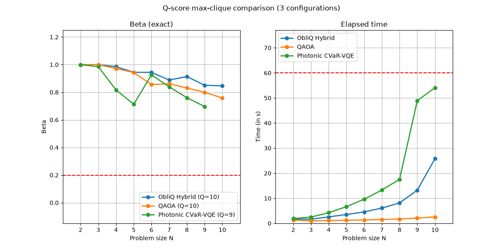

# ObliQ: Solving QUBO on Real Photonic Quantum Machines

Reproduction of the **ObliQ** photonic QUBO solvers on **MerLin**, evaluated under the
**Q-score** Max-Cut / Max-Clique benchmark against **QAOA**, a photonic **CVaR-VQE**
baseline, and classical annealing solvers.

## 1. Reference and Attribution

- **Paper:** *ObliQ: Solving Quadratic Unconstrained Binary Optimization Problems on Real
  Photonic Quantum Machines*, Aditya Ranjan *et al.*, SIGMETRICS 2025.
  [ACM DL](https://dl.acm.org/doi/10.1145/3771573)
- **Benchmark:** Atos Q-score (Max-Cut / Max-Clique), see
  ["Evaluating the Q-score of quantum annealers"](https://ieeexplore.ieee.org/document/9860191).
- **Baseline:** the CVaR-VQE solver follows Quandela's reference implementation.
- The ObliQ circuits, QUBO encoding, and decoding are reproduced from the paper; the
  MerLin implementation and the Q-score evaluation harness are original to this folder.
- License: Apache 2.0 (see `LICENSE`).

## 2. Overview

ObliQ encodes a QUBO onto a photonic interferometer and reads a solution off the output
photon distribution. Three variants are reproduced:

| Solver | Backend | Notes |
|--------|---------|-------|
| `obliq-static` | MerLin (photonic) | Anchor circuit only: QUBO off-diagonals to beam-splitter angles. No trainable parameters, so a single forward pass *is* the answer. |
| `obliq-vqc` | MerLin (photonic) | Trainable photonic mesh, no anchor. Size-matched to the other two for a fair comparison. |
| `obliq-hybrid` | MerLin (photonic) | The anchor circuit seeding a trainable VQC — the paper's headline method, and the default here. |
| `Photonic_CVARVQE` | MerLin (photonic) | CVaR-VQE baseline on a generic interferometer. |
| `QAOA` | Qiskit | Gate-model baseline: local statevector sampling, IBM, or Quantum Inspire. |
| `Simulated_Annealing`, `tabu` | D-Wave Ocean | Classical baselines (local). |
| `Advantage_system4.1`, `hybrid` | D-Wave Leap | Quantum-annealing / hybrid baselines (remote). |

All photonic solvers run **fully on MerLin** (`QuantumLayer`, Fock-space
probabilities), on either the local differentiable simulator or a remote Quandela
processor. Every solver returns a bitstring, and the harness scores that bitstring
against the same QUBO, so the comparison is fair by construction.

ObliQ training (`obliq-vqc` / `obliq-hybrid`) supports `adam`/`sgd` (autograd through the
differentiable simulator) and `cobyla` (gradient-free, so it can train *through* a remote
noisy simulator or a real QPU, where gradients do not exist).

### What was reproduced

- **Method:** the anchor-point encoding
  ($\theta_{ij} = \tfrac{1}{2}\arccos\sqrt{1 - Q_{ij}}$, giving
  $\langle n_i n_j \rangle = 1 - Q_{ij}$), the ancilla homogenization for non-constant
  diagonals, the number-mapping readout, and the static / VQC / hybrid variants.
- **Instances:** Erdős–Rényi $G(N, 1/2)$, resampled until non-empty, seeded per instance.
- **Metric:** Q-score $\beta$ and the per-instance wall-clock time, for $N = 2 \ldots 8$
  at 100 instances per size.

### Deviations and assumptions

- **Adapted evaluation.** The paper reports QUBO approximation
  quality on a random instance set. Here max-clique and max-cut instances are scored with the Q-score
  $\beta$ metric on Erdős–Rényi Max-Cut / Max-Clique.  It is not a figure-for-figure reproduction.
- **Two $\beta$ normalizations exist and they disagree at small $N$.** `plotter.py -e`
  scores each instance against *its own* graph (naive random search vs. the true
  optimum); without `-e` the Q-score standard's asymptotic constants are used, which
  deflate $\beta$ noticeably below $N \approx 10$. Use `-e` at these sizes; the
  asymptotic form is kept for comparability with published Q-score numbers.
- **Q-score.** The largest $N$ that clears
  $\beta^* = 0.2$ *with every smaller size also clearing it*. The Atos definition
  ("largest $N$ above the threshold") assumes $\beta$ decreases with $N$, which makes the
  two readings identical; they differ only for a solver whose $\beta$ dips below the line
  and recovers.
- **Exact optima are exhaustive at these sizes.** `utils.qubo.exact_optimum` enumerates
  (all $2^N$ partitions for Max-Cut, `max_weight_clique` for Max-Clique) and is the one
  definition used by both `benchmark.py sweep --exact` and `plotter.py -e`. Above
  `EXACT_MAX_CUT_LIMIT = 20` nodes Max-Cut falls back to a greedy bound.

### Environment

Developed on Windows 11 / Python 3.14, CPU only. Key versions: `merlinquantum` 0.4.0,
`perceval-quandela` 1.2.2, `torch` 2.10, `qiskit` 2.4, `dwave-ocean-sdk` 9.3,
`numpy` 2.4, `networkx` 3.6. Nothing is platform-specific; no GPU is used.

## 3. Project Layout

```
ObliQ/
├── benchmark.py         # the benchmark: one instance, a sweep, and the CLI
├── plotter.py           # beta vs N and time vs N figures
├── cli.json             # the CLI, declared: flags -> config paths / kwargs
├── demo.ipynb           # end-to-end walkthrough of the method
├── configs/             # one JSON per (problem x solver)
├── lib/                 # harness infrastructure
│   ├── config.py        #   config load, CLI overrides, content addressing
│   ├── seeding.py       #   deterministic seed derivation
│   └── timeout.py       #   out-of-process timeout enforcement
├── models/              # the solvers
│   ├── solver.py        #   name -> solver, plus capability sets
│   ├── circuits.py      #   MerLin circuits and their execution (shared)
│   ├── obliq.py         #   ObliQ: encode, run, decode, train
│   ├── cvar_vqe.py      #   photonic CVaR-VQE baseline
│   ├── qaoa.py          #   Qiskit QAOA baseline
│   ├── dwave.py         #   D-Wave QPU / SA / Tabu / Leap hybrid
│   └── backend.py       #   Quandela credential resolution
├── utils/               # the problems
│   ├── qubo.py          #   QUBO representations, problem dispatch, beta
│   ├── readout.py       #   Fock outcome -> bitstring -> energy (shared)
│   ├── max_cut.py       #   Max-Cut QUBO, exact optimum, beta
│   ├── max_clique.py    #   Max-Clique QUBO, exact optimum, beta
│   └── graphs.py        #   the benchmark's Erdos-Renyi instances
├── results/<hash>/      # content-addressed sweep outputs
├── plots/               # generated figures
├── assets/              # notebook figures
└── tests/
```

`lib`, `models` and `utils` are namespace packages imported as top-level modules, so run
everything from this directory.

## 4. How to Run

```bash
python -m venv .venv
source .venv/bin/activate        # Windows: .venv\Scripts\activate
pip install -r requirements.txt
```

Run everything from inside this directory.

**Interactive walkthrough** — build a problem, encode it, run the static solver, train
the hybrid, and reproduce the comparison figure:

```bash
jupyter notebook demo.ipynb
```

**A single instance**, no config file. `-e` scores beta against that instance's own
optimum, exactly as `plotter.py -e` does for a whole sweep; without it you get the
asymptotic baselines:

```bash
python benchmark.py run -e --problem max-clique --size 8 --solver obliq-hybrid --seed 101200 \
    --solver-options '{"nsamples": 5000, "train": {"optimizer": "adam", "max_iter": 50}}'
```

**A full sweep**, then the figure:

```bash
python benchmark.py sweep --config configs/obliq_maxclique.json
python benchmark.py sweep --config configs/qaoa_maxclique.json
python benchmark.py sweep --config configs/cvarvqe_maxclique.json

python plotter.py -e -f configs/obliq_maxclique.json configs/qaoa_maxclique.json \
                        configs/cvarvqe_maxclique.json -o comparison.png
```

Each config already pins its sweep (sizes 2–10, 100 instances/size, seed 101200), so no
`--sizes` / `--instances` overrides are needed. That matters: **results are stored under
a hash of the config, and the plotter re-hashes the same file to find them**, so
overriding the sweep on one side only sends the plotter to a directory that does not
exist. Override on both sides, or neither.

`python benchmark.py sweep --help` lists every declared flag; adding one means editing
`cli.json`, not Python. `benchmark.py run` takes the same instance arguments without a
config file, and omitting `--seed` there draws a random instance (nothing is reproducible
in that mode, so the sweep always seeds).

`plotter.py` accepts, beyond `-f`/`-o`/`-e`:

| Flag | Effect |
|------|--------|
| `-t`, `--ignore_time_limit` | Decide the Q-score on mean $\eta$ alone, ignoring the 60 s limit |
| `--show_stddev`, `--stddev_lines` | $\pm1\sigma$ as shading, or as dotted bounds |
| `--show_minmax`, `--minmax_lines` | Per-size min/max envelope as shading, or as dotted bounds |
| `--log_time` | Logarithmic time axis |

### Running on real Quandela hardware

Set `backend` to a platform name for any photonic solver — `"sim:slos"`,
`"sim:ascella"` (noisy simulator), or `"qpu:ascella"` (real QPU):

```jsonc
"solver_options": {
  "nsamples": 5000,
  "backend": "qpu:ascella",
  "train": { "optimizer": "cobyla", "max_iter": 5 }   // gradient-free is required
                                                      // (the shipped configs use adam,
                                                      //  which is local-only)
}
```

Adam/SGD raise on a remote backend by design: autograd cannot flow through sampled
measurements. Use `cobyla`, which needs only forward evaluations.

The token is resolved in this order: an explicit `solver_options.token`, the
`QUANDELA_API_KEY` / `QUANDELA_TOKEN` environment variables, then
`configuration/_QUANDELA_API_KEY` (git-ignored). `obliq-static` needs no training at all,
which makes it the cheapest variant to try on hardware.

## 5. Configuration

```jsonc
{
  "problem_type": "max-clique",       // or "max-cut"
  "solver": "obliq-hybrid",
  "name": "ObliQ Hybrid",             // plot label only; excluded from the hash
  "sweep": {
    "size_range": [2, 3, 4, 5, 6, 7, 8, 9, 10],
    "nb_instances_per_size": 100,
    "seed": 101200,                   // the only source of randomness in a run
    "timeout": 60,                   // per-instance seconds
    "min_timeout_size": 14,           // below this, timeouts are only checked post-hoc
    "parallel_workers": 10,           // execution-only; excluded from the hash
    "include_exact_results": false    // store exact optima too (needs a seed)
  },
  "provider": null,                   // QAOA: null | "ibm" | "qi"
  "backend": null,                    // QAOA backend, or Quandela platform
  "solver_options": { "nsamples": 5000, "num_rep": 10, "graph_mode": 0,
                      "train": { "optimizer": "adam", "max_iter": 100,
                                 "learning_rate": 0.05 } }
}
```

`solver_options` binds directly to the solver's signature, so an unrecognised key is a
`TypeError` naming it — the accepted set is exactly:

- **ObliQ** (`models/obliq.py::run_obliq_solver`): `nsamples`, `num_rep`, `graph_mode`,
  `coeffs`, `backend`, `token`, `seed`, and a `train` block. `train` is itself the keyword
  arguments of `train_obliq_vqc_coeffs`: `optimizer` (`adam`/`sgd`/`cobyla`), `max_iter`,
  `learning_rate`, `init_scale` (spread of the initial coefficient draw), `seed`,
  `verbose`, `finite_diff_step` (COBYLA's `rhobeg`), `beta1`/`beta2`/`epsilon` (Adam), and
  `initial_coeffs`. Training is unavailable for `obliq-static`.
- **CVaR-VQE** (`models/cvar_vqe.py::run_photonic_cvarvqe`): `nb_samples`, `nb_inputs`,
  `cvar_alpha`, `max_iter`, `learning_rate`, `optimizer`, `goal`, `backend`, `token`,
  `seed`.
- **QAOA** (`models/qaoa.py::run_QAOA`): `number_of_shots`, `maxiter`, `reps`, `seed`, and
  `max_attempts` (retries when the optimizer returns an infeasible solution).
- **D-Wave**: no `solver_options`; `num_reads` under `sweep` is required by the QPU and
  Simulated Annealing.

### Comparable hyperparameters

Twelve configs cover the cross product of two problems and six locally runnable
solvers. Every knob that means the same thing across solvers is held equal, so a
difference in the figure is a difference in method rather than in budget:

| Shared | Value | Where |
|--------|-------|-------|
| Sweep | $N = 2 \ldots 10$, 100 instances/size, seed 101200, 60 s per instance | `sweep` in every config |
| Shot / read budget | 5000 | ObliQ `nsamples`, CVaR-VQE `nb_samples`, QAOA `number_of_shots`, SA `sweep.num_reads` |
| Optimizer iterations | 100 | ObliQ `train.max_iter`, CVaR-VQE `max_iter`, QAOA `maxiter` |
| Optimizer / learning rate | `adam`, 0.05 | both photonic variational solvers |
| Seeding | derived per instance | no config pins a solver seed |

Deliberately *not* equalized, because nothing else has a counterpart: `num_rep`
(anchor repetitions), `cvar_alpha` and `nb_inputs` (CVaR-VQE's search), `reps` (QAOA
layers), `graph_mode`. Equal iteration counts are a shared convention for the Adam optimizer; only for the cobyla the compute is equal leading to same maximum function evaluations.

`graph_mode` selects how candidate bitstrings are ranked during decoding. Only mode `0`
(prefixes of the photon-occupancy ranking) applies to Max-Cut and Max-Clique; modes `1`
and above exist for the grouped-variable and assignment-style QUBOs of the original ObliQ
code and are unreachable through the two problems here.

Add an `"output": {"dir": "..."}` block to move a run's results; `output.dir` defaults to
`results`.

## 6. Results and Analysis

Sweep settings for the run below: Erdős–Rényi $G(N, 1/2)$, $N = 2 \ldots 10$, 100
instances/size, seed 101200, 60 s per-instance limit.



Mean exact $\beta$ by size:

| Solver | $N=2$ | 3 | 4 | 5 | 6 | 7 | 8 | 9 | 10 | Q-score |
|--------|------|---|---|---|---|---|---|---|---|---------|
| ObliQ Hybrid | 1.000 | 1.000 | 0.985 | 0.944 | 0.944 | 0.888 | 0.914 | 0.851 | 0.846 | **10** |
| QAOA | 1.000 | 1.000 | 0.972 | 0.943 | 0.856 | 0.862 | 0.830 | 0.800 | 0.759 | **10** |
| Photonic CVaR-VQE | 1.000 | 0.985 | 0.817 | 0.713 | 0.926 | 0.839 | 0.760 | 0.696 | 0.799 | **10** |

ObliQ Hybrid holds $\beta \approx 0.85$–$1.0$ across the whole range and leads QAOA,
which decays to $0.76$ at $N = 10$. CVaR-VQE is not monotone: it falls at $N = 4$–$5$ before recovering, with slow decline in performance. All models reach Q=10, the sweep does not go high
enough to separate them on that single number, so the mean-$\beta$ curve is the
informative comparison. ObliQ's runtime sits between QAOA's and CVaR-VQE's.

To regenerate: run the three sweeps in §4, then `plotter.py -e`.

## 7. Reproducibility Notes

Every source of randomness in a run traces back to one number, `sweep.seed`:

```
sweep.seed + instance_index                    -> the graph            (verbatim)
blake2b(instance_seed, "solver", solver_name)  -> the solver's own RNG (derived)
blake2b(instance_seed, "beta")                 -> the sampled random baseline
```

Derived rather than reused, so a solver's starting point is not a function of its
problem instance; `blake2b` rather than `hash()`, because sweeps run in spawned worker
processes where Python salts `hash()` per process. Seeds are derived in code, never stored
in a config, so they do not enter a config's hash.

Where each solver's randomness lives, and what pins it:

| Solver | Stochastic step | Pinned by |
|--------|-----------------|-----------|
| `obliq-static` | none | exact probabilities, coefficients written explicitly |
| `obliq-vqc`, `obliq-hybrid` | the initial VQC coefficient draw | the derived seed — or `train.seed`, or supplying `coeffs` outright. Adam/SGD and COBYLA are deterministic from there, so the whole energy curve replays. |
| `Photonic_CVARVQE` | layer initialization, final `torch.multinomial` draw | `set_global_seed` on the derived seed |
| `QAOA` | variational initial point, shot sampling | `algorithm_globals.random_seed`, `StatevectorSampler(seed=…)` |
| `Simulated_Annealing`, `tabu` | the anneal / tabu search | the samplers' explicit `seed` |
| `Advantage_system4.1`, `hybrid`, `qpu:*` | the hardware | nothing — see below |

Instances are regenerated, never shipped between processes: `benchmark.py sweep --exact` and
`plotter.py -e` both rebuild them with `utils.graphs.sample_instance_graph`. Using that
one sampler matters because it retries edgeless draws — calling `nx.erdos_renyi_graph`
directly disagrees with it wherever a draw is empty.

Irreducible: real hardware. A QPU (`qpu:*`) and the D-Wave QPU / Leap hybrid solvers
cannot be made to repeat themselves, and remote sampled backends only converge in
distribution.

One caveat seeding does not cover: torch's intra-op threads can split a float32
reduction differently between runs, which in principle can flip two near-degenerate
bitstrings. For bit-identical single runs:

```python
import torch

torch.use_deterministic_algorithms(True, warn_only=True)
torch.set_num_threads(1)
```

The sweep already parallelizes across instances, so single-threading one instance costs
little. Record exact versions with `pip freeze > results/requirements.txt`.

## 8. Testing

```bash
cd ObliQ
pytest -q
```

91 tests, no network or hardware required. They cover the encoding (augmentation,
anchor-angle formula and ordering, decoding), the readout (including a behaviour lock
against the upstream CVaR-VQE mapping), seed derivation (including stability across
processes), instance generation (including the edgeless-draw retry), config hashing
(**the shipped hashes are pinned, so a config edit that would orphan `results/` fails a
test**), the CLI, and end-to-end reproducibility of every local solver.

## 9. Extensions and Next Steps

- Push the sweep past $N = 10$, where the solvers' Q-scores would actually separate.
  Cost is dominated by the Fock-space dimension, so `obliq-static` scales furthest.
- Run `obliq-static` and a COBYLA-trained `obliq-hybrid` on `qpu:ascella` and compare
  against the noisy simulator, to separate encoding quality from hardware noise.
- Add the remaining Q-score problems, and weighted QUBOs where the anchor encoding's
  normalization matters more.
- Ablate `num_rep` (how finely the anchor angle is spread) and the seeding of the hybrid
  from something other than the static bitstring.