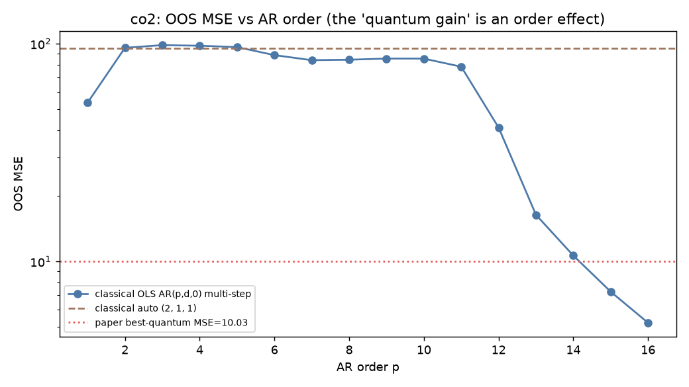
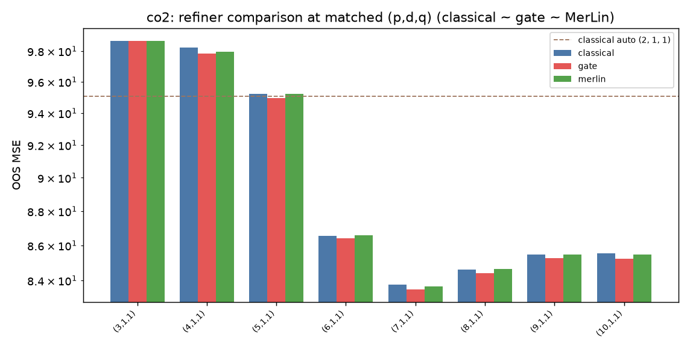
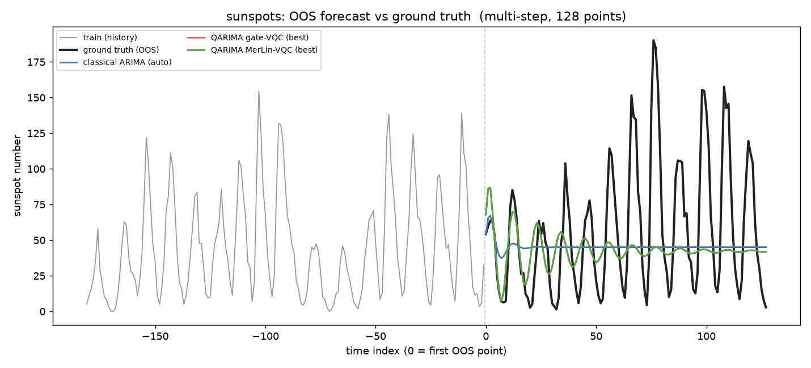

# QARIMA: A Quantum Approach To Classical Time Series Analysis — Reproduction

## Reference and Attribution
- **Paper:** N. Mohanty, B. K. Behera, B. Mukherjee, P. Dash, *QARIMA: A Quantum
  Approach To Classical Time Series Analysis*, arXiv:2604.08277v2 [quant-ph], 2026.
- **Original code:** none released (data "available upon request"); no public repo found.
- This folder is an independent reproduction plus a **MerLin photonic translation**.

## Original Paper
QARIMA augments the classical Box–Jenkins ARIMA pipeline with seven
"quantum-inspired" components: (1) quantum-informed differencing-order selection,
(2) quantum ACF and (3) quantum PACF from **compact swap-test** cosine projections,
(4) a delayed-matrix construction, (5) a **VQC-AR** estimator of AR coefficients,
(6) a **VQC weak-lag refinement**, and (7) a **VQC-MA** estimator of MA
coefficients. The VQC is a shallow RY-rotation + CNOT-ladder circuit (reps=1),
warm-started from OLS and refined with COBYLA. Models are evaluated on five public
univariate series against a `pmdarima` classical ARIMA baseline using out-of-sample
(OOS) MSE, MAPE, and Diebold–Mariano (DM) tests. The framework is Qiskit
(gate-based / quantum-inspired); the paper is **not** photonic.

### The one fact that drives everything
The compact swap test estimates the **cosine similarity** between a lag vector and a
coefficient vector. In the noiseless / infinite-shot limit the swap-test cosine
equals the classical cosine, so the paper's phase-corrected prediction
`ŷ_t = ‖x_t‖·‖b‖·cos(θ_swap + λ(θ_dot − θ_swap))` **collapses exactly to the linear
prediction `x_t · b`**. QARIMA's forecast is therefore an ordinary linear ARIMA
forecast; the only "quantum" content is (a) how the orders `(p,d,q)` are screened
and (b) how the coefficient vector is parameterised by the VQC. This is what makes a
photonic (MerLin) counterpart natural — and what makes the reproduction's verdict
what it is.

## Reproduction Scope, Claims, and Deviations
**Targeted:** all five datasets (Sunspots, Mauna Loa CO2, Australian Beer,
Australian Woollen Yarn, Sydney 2024 temperature); classical baseline; the
VQC-AR/MA coefficient estimation with three interchangeable refiners; OOS
MSE/MAPE + DM tests; predicted-vs-ground-truth plots; an AR-order sweep and a fair
seasonal baseline as diagnostics.

**Three refiners** share one ARIMA skeleton and differ only in how AR/MA
coefficients are produced (isolating the quantum contribution):
- `classical` — OLS warm start refined against the paper's loss (linear ARIMA).
- `gate` — the paper's VQC (RY + CNOT-ladder statevector; `b(β)=b_OLS+s·(z(β)−z(0))`,
  `z_j=⟨Z_j⟩`; COBYLA).
- `merlin` — a **photonic MerLin `QuantumLayer`** counterpart (no-input trainable
  interferometer → linear readout to a coefficient vector; same warm-started form).

**Key deviations (see LOG.md):**
- **Swap test computed analytically** (infinite-shot limit; forward pass identical to
  the paper) with an optional finite-shot noise model (`--shots`).
- **Multi-step dynamic forecasting.** The paper's error magnitudes (e.g. classical
  Sunspots MSE ≈ 2181 ≈ series variance) imply multi-step forecasts, not one-step;
  we forecast the whole OOS horizon from the end of training. (One-step rolling gives
  far smaller errors and would not be comparable to the paper.)
- **Sydney station substituted.** The paper's NOAA station 95768099999 (North Head)
  has *no* temperature data and its stated split (1782+336 "daily" obs) is internally
  inconsistent; we use station 94768099999 (Sydney Observatory Hill), labeled as a
  **substitute-station (V3)** reproduction.
- The angle→coefficient VQC readout is underspecified in the paper (F3); resolved as a
  warm-started refinement (documented).

## Project Layout
```
papers/QARIMA/
├── lib/
│   ├── data.py         # 5 dataset loaders + train/OOS split
│   ├── swaptest.py     # compact swap-test cosine (analytic + shot noise)
│   ├── qarima.py       # differencing, Q-ACF/PACF, AR/MA loss, fit, dynamic forecast
│   ├── refiners.py     # classical / gate-VQC / MerLin-VQC coefficient refiners
│   ├── classical.py    # pmdarima auto_arima + seasonal baseline (dynamic forecast)
│   ├── metrics.py      # MSE, MAPE, Diebold–Mariano
│   └── runner.py       # orchestration + artifacts (entry: train_and_evaluate)
├── utils/plot_qarima.py# forecast / order-sweep / refiner-comparison figures
├── configs/            # defaults.json + one config per dataset
├── tests/              # unit tests (numeric core, CLI) — 14 tests
├── results/            # key figures per dataset
└── notebook.ipynb      # end-to-end walkthrough
```

## Install and How to Run
```bash
pip install statsmodels pmdarima          # added this session; rest is in the base image
# Data staging (Sunspots+CO2 offline via statsmodels/Rdatasets, others downloaded once)
# already staged under data/QARIMA/raw/ ; see LOG.md "Data Acquisition Log".

# Run one dataset (all three refiners + baselines + figures):
python implementation.py --paper QARIMA --config configs/co2.json \
    --seed 42 --data-root /reproduced_papers/data
# Datasets: sunspots.json co2.json ausbeer.json woolyarn.json sydney.json
# Handy flags: --reps --max-iter --step-frac --shots
cd papers/QARIMA && pytest -q
```
Artifacts land in `outdir/run_<timestamp>/`: `results.json`, `metrics.csv`,
`forecasts.npz`, `run.log`, and three PNGs (also copied into `results/`).

## Configuration
One config per dataset (`configs/<dataset>.json`) overlaying `defaults.json`. Each
sets the paper's candidate `(p,d,q)` list, the paper's fixed classical baseline
order, whether a fair seasonal baseline is run, and the order-sweep range. Loss
weights (`lambda_cos, lambda_ent, omega, shots`) and VQC knobs (`reps, max_iter,
step_frac`) live under `loss`/`vqc`.

## Data
| Dataset | Source | N (train/OOS) | Notes |
|---|---|---|---|
| Sunspots | `statsmodels.datasets.sunspots` (offline) | 309 (181/128) | matches paper |
| Mauna Loa CO2 | R `datasets::co2` (Rdatasets) | 468 (348/120) | **exact** 468-obs match |
| Australian Beer | Rdatasets `fpp2/ausbeer` | 218 (210/8) | paper says 211; last-8 OOS |
| Australian Woollen Yarn | Rdatasets `forecast/woolyrnq` | 119 (64/55) | exact |
| Sydney 2024 temp | NOAA GHCN Observatory Hill (94768099999) | 365 (275/90) | **substitute station** (paper's has no data) |

## Results Obtained and Comparison with the Paper
OOS MSE, multi-step, all refiners agree to ≥3 significant figures (mean over 3 seeds
for the VQCs). "best Q" = best over the paper's candidate `(p,d,q)` at the labeled
order.

| Dataset | Paper classical | Our classical (auto) | Paper best-Q | Our best-Q (classical/gate/merlin) | Our fair seasonal | AR order reaching paper best-Q |
|---|---:|---:|---:|---:|---:|:--:|
| Sunspots | 2181.6 (2,0,0) | **2183.6** (2,0,0) | 2146.9 | 2108 / 2108 / 2108 | – | AR(1) |
| CO2 | 78.4 (5,1,0) | 95.1 (2,1,1) | 10.03 | 83.7 / 83.5 / 83.7 | **0.40** | **AR(14)** |
| AusBeer | 1491.8 (0,1,1) | **167.3** (6,1,4) | 59.8 | 216.7 / 216.7 / 216.7 | 181.8 | > AR(12) |
| Woolyarn | 528230 (6,1,0) | 569924 (3,1,2) | 530506 | 470305 / 470305 / 470308 | 3.50e6 | AR(2) |
| Sydney* | 11.44 (2,0,1) | 26.3 (0,1,2) | 11.36 | 27.9 / 27.9 / 27.9 | 25.4 | – |

*substitute station; absolute values not directly comparable to the paper.

**Findings.**
1. **classical ≈ gate ≈ MerLin at every matched order, on every dataset** (agreement
   to 3–5 significant figures). The quantum (gate or photonic) coefficient refinement
   confers **no measurable advantage** — exactly as the analytic-limit equivalence
   predicts.
2. **The paper's headline "quantum beats classical" gaps are baseline artifacts.** The
   paper's classical comparators are under-ordered / non-seasonal. A *fair* baseline
   erases the gap: on CO2 a seasonal ARIMA reaches **MSE 0.40 vs the paper's best
   "quantum" 10.03** (25× better); on AusBeer our `auto_arima` (6,1,4) already beats
   the paper's classical (0,1,1) by ~9×.
3. **QARIMA's gains are an AR-order effect.** The order sweep shows a plain linear
   AR(14,1,0) reaches CO2 MSE ≈ 10.6, matching the paper's Q(10,1,1)=10.03 — the
   paper's weak-lag refinement simply raises the *effective* AR order by a few lags.
4. Sunspots classical reproduces the paper almost exactly (2183.6 vs 2181.6); Woolyarn
   qualitatively matches the paper's "classical is competitive" conclusion.

Figures in [`assets/`](assets/) are the curated outputs used below:
`forecast_<ds>.png` (prediction vs ground truth), `order_sweep_<ds>.png` (MSE
vs AR order), and `refiners_<ds>.png` (classical/gate/MerLin).

## Visual Evidence for the Conclusion

The figures make the conclusion visible. The CO2 order sweep shows that a plain
linear AR model reaches the paper's reported best-Q error at a sufficiently high
order, while the matched-order refiner comparison shows classical, gate-VQC, and
MerLin-VQC predictions overlapping. The Sunspots forecast is included as a
sanity check because its classical result reproduces the paper closely.

### CO2: the apparent quantum gain is an order effect

The experiment is defined in [`configs/co2.json`](configs/co2.json), with the
paper's candidate orders, an AR-order sweep through 16, and the fair seasonal
baseline enabled.





The sweep reaches the paper's best-Q scale with a classical AR order, and the
three refiners remain effectively indistinguishable at matched orders. The
seasonal baseline's MSE 0.40 is also reported in the results table, well below
the paper's best-Q MSE 10.03.

### Sunspots: the classical magnitude is reproduced

The experiment is defined in [`configs/sunspots.json`](configs/sunspots.json).
Its multi-step forecast reproduces the paper's classical MSE (2183.6 versus
2181.6), while the refiner variants again overlap.



For the complete asset set, use the dataset-specific configs and figures below.
Each row links the exact config together with its forecast, order sweep, and
refiner comparison.

| Dataset | Config | Forecast | Order sweep | Refiner comparison |
|---|---|---|---|---|
| Sunspots | [`sunspots.json`](configs/sunspots.json) | [`forecast_sunspots.png`](assets/forecast_sunspots.png) | [`order_sweep_sunspots.png`](assets/order_sweep_sunspots.png) | [`refiners_sunspots.png`](assets/refiners_sunspots.png) |
| CO2 | [`co2.json`](configs/co2.json) | [`forecast_co2.png`](assets/forecast_co2.png) | [`order_sweep_co2.png`](assets/order_sweep_co2.png) | [`refiners_co2.png`](assets/refiners_co2.png) |
| Australian Beer | [`ausbeer.json`](configs/ausbeer.json) | [`forecast_ausbeer.png`](assets/forecast_ausbeer.png) | [`order_sweep_ausbeer.png`](assets/order_sweep_ausbeer.png) | [`refiners_ausbeer.png`](assets/refiners_ausbeer.png) |
| Australian Woollen Yarn | [`woolyarn.json`](configs/woolyarn.json) | [`forecast_woolyarn.png`](assets/forecast_woolyarn.png) | [`order_sweep_woolyarn.png`](assets/order_sweep_woolyarn.png) | [`refiners_woolyarn.png`](assets/refiners_woolyarn.png) |
| Sydney* | [`sydney.json`](configs/sydney.json) | [`forecast_sydney.png`](assets/forecast_sydney.png) | [`order_sweep_sydney.png`](assets/order_sweep_sydney.png) | [`refiners_sydney.png`](assets/refiners_sydney.png) |

The Sydney figures use the substitute Observatory Hill station documented in
[`configs/sydney.json`](configs/sydney.json) and are not directly comparable in
absolute value with the paper's station.

## Fair Baselines
- **Paper comparator reproduced:** `pmdarima.auto_arima` (non-seasonal) + the paper's
  fixed order, both under the same multi-step protocol.
- **Additional fair baseline:** seasonal ARIMA on the seasonal series (CO2, AusBeer,
  Woolyarn, Sydney). Matching axis: OOS accuracy at a model class appropriate to the
  data. This is the baseline the paper should have used; it dominates QARIMA on CO2.

## MerLin Photonic Extension
`lib/refiners.py::MerlinVQCRefiner` implements the VQC-AR/MA coefficient refiner as a
photonic `QuantumLayer`: a no-input trainable interferometer whose output
probabilities are read out to a coefficient vector, warm-started at OLS and refined
with COBYLA — a faithful photonic counterpart of the paper's gate VQC. It runs
end-to-end on all five datasets and **matches the gate VQC and classical OLS to
several significant figures**, i.e. the photonic translation is feasible but inherits
the same null result (the model is linear ARIMA, so no encoding/interferometer can
add expressivity here).

### Hardware-Aware Settings (MerLin refiner)
| Field | Value |
|---|---|
| Computation space | UNBUNCHED |
| Detector model | threshold |
| Photon number | m/2 (m = min(2p, 8) modes) |
| Number of modes | 4–8 (capped) |
| Input state | `[1,0,1,0,...]` (m/2 photons) |
| Encoding | none (no-input trainable interferometer; coefficients from readout) |
| Measurement strategy | PROBABILITIES |
| Postselection | none |
| Simulator / QPU | MerLin CPU simulator (analytic, shots=0) |
| Shot count | n/a (analytic) |
| Trainable params | parameter-matched to gate VQC (`reps·p`) |
| Seeds | 0,1,2 |

## Limitations
- Multi-step protocol and the exact VQC readout are our documented interpretations of
  an underspecified method (F3, F5). The qualitative verdict is robust to these.
- Sydney uses a substitute station (V3); absolute Sydney numbers are not comparable to
  the paper (the trend across methods is).
- We did not tune the weak-lag count `k` to hit the paper's exact CO2/AusBeer numbers;
  the order sweep explains those numbers without hyperparameter archaeology.
- Swap test is analytic; a finite-shot study (`--shots`) is available but not swept.

## Tests
`cd papers/QARIMA && pytest -q` → 14 tests (swap-test↔cosine equivalence, gate
statevector primitives, analytic-loss = OLS, differencing/integration round-trips, all
three refiners, DM symmetry). ~1.5 s.

## Verdict
- **Reproduction:** *partially supported / claims not supported under fair baselines.*
  The pipeline and per-dataset error magnitudes reproduce; the **quantum-advantage
  claim does not survive a fair classical baseline** (F6 baseline unfairness).
- **Reproducibility confidence:** MEDIUM–HIGH. **Implementation confidence:** HIGH
  (the analytic-limit equivalence is provable and the order sweep is decisive).
- **Photonic recommendation:** *do not pursue* as an accuracy play — the method is
  linear ARIMA in disguise; a photonic VQC neither helps nor is needed. Documented as a
  clean negative photonic result.

## Citation and License
Cite the original paper (arXiv:2604.08277). Reproduction released under the repository
license. Datasets: statsmodels (BSD), Rdatasets (public domain / original licenses),
NOAA NCEI (public domain).
