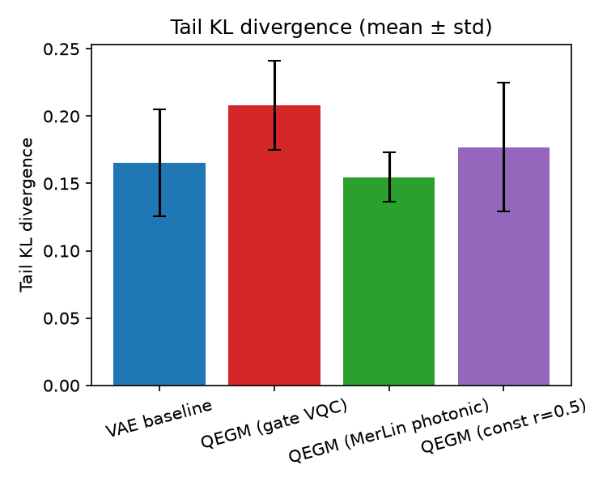
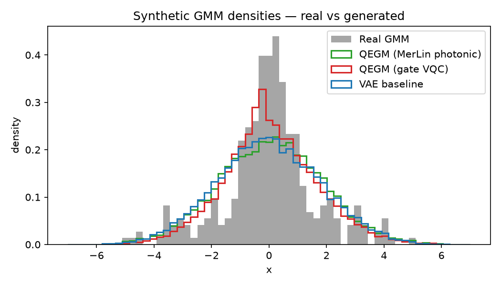
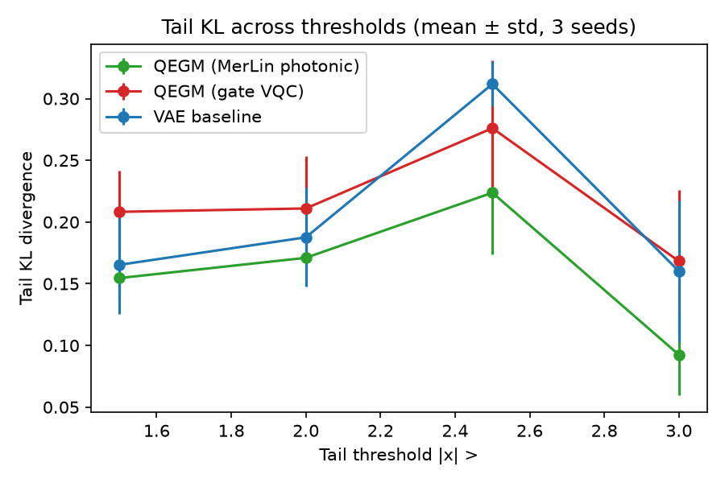
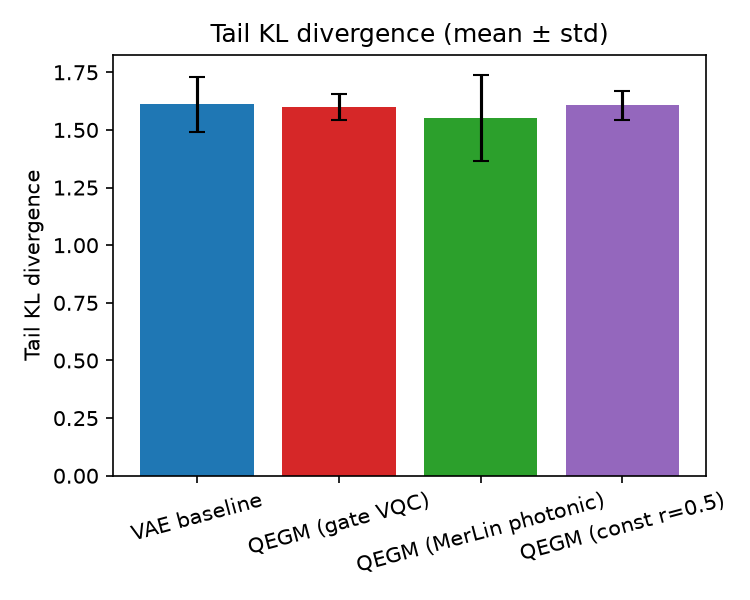
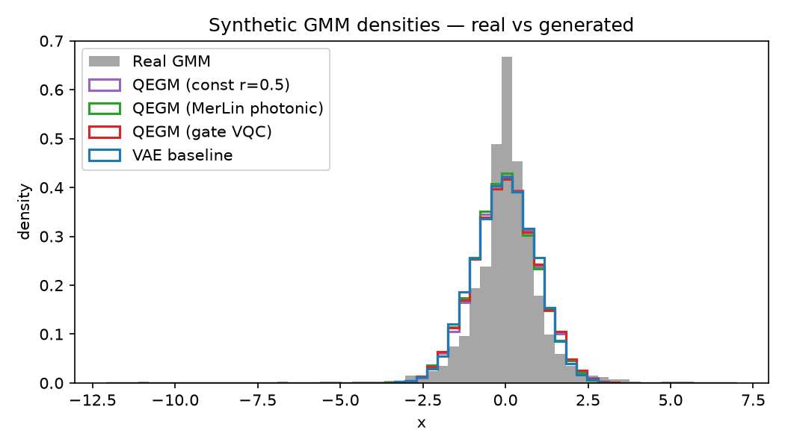

# Quantum-Enhanced Generative Models for Rare Event Prediction — Reproduction

## Reference and Attribution

- Paper: *Quantum-Enhanced Generative Models for Rare Event Prediction* (QEGM)
- Authors: M. Z. Haider, M. U. Ghouri, T. Noreen, M. Salman
- ArXiv: [2511.02042v1](https://arxiv.org/abs/2511.02042) (Nov 2025)
- Original repository: none located as of 2026-05-27
- License notes: this reproduction code is MIT (repo default); paper text and
  figures remain © the authors.

## Original Paper

The paper introduces **QEGM**, a hybrid VAE-style framework augmented with a
Variational Quantum Circuit (VQC) for rare-event generative modeling. Two key
ingredients are claimed:

1. A *hybrid loss* (Eq. 5) that combines a reconstruction term with a
   tail-aware term focused on rare-event regions of the distribution.
2. *Quantum-randomness noise injection* (Eq. 7): the latent noise variance is
   modulated by a random scalar ``r`` produced by measuring a parameterised
   quantum circuit, with the claim that this avoids the deterministic
   correlations of PRNG-based sampling.

The paper evaluates QEGM against GAN, VAE, and diffusion baselines on a
synthetic 3-component Gaussian mixture and on real-world finance (S&P 500),
climate (temperature/precipitation), and protein (AlphaFold embeddings) data.
Reported headline numbers include a ~50% reduction in tail KL on the GMM
benchmark and rare-event recall improvements from 0.74 (Diffusion) to 0.88
(QEGM).

## Reproduction Scope (Updates and Deviations)

**Reproduced:**

* The synthetic Gaussian-mixture experiment (Section VI.C) — three components
  with means `{-3, 0, +3}` and variances `{1, 0.5, 1.5}`.
* The full QEGM architecture (encoder, decoder, hybrid loss, VQC,
  quantum-randomness noise injection per Eq. 7).
* A photonic translation of the VQC built on a MerLin `QuantumLayer`
  (angle-encoded latent vector in, pooled outcome probabilities out).
* A fair classical VAE baseline with the same encoder/decoder skeleton as QEGM.
* A **real-data extension**: the same model variants and both rigor
  ablations on standardized S&P 500 daily log-returns (1990–2022), the
  asset the paper names in its finance experiment. This is labelled an
  *extension*, not a reproduction of Sec. VI.D: the raw index data is
  public, but the paper does not specify its preprocessing, baseline
  architectures, λ values, or training hyper-parameters, so its reported
  finance numbers cannot be meaningfully compared against.

**Not reproduced (out of scope):**

* The paper's Sec. VI.D climate and protein experiments, and its exact
  finance benchmark: the descriptions are narrative only (no dataset
  definitions, preprocessing, or hyper-parameters), so any attempt would
  measure our design choices rather than the paper's.
* The Diffusion and GAN baselines. The paper does not pin baseline
  architectures, and fitting them on top of the multi-seed sweeps
  would exceed budget. We report the **VAE** baseline only and use a
  *matched-architecture* comparison.

**Deviations:**

* **Quantum gradients.** Paper Eq. 16 uses the parameter-shift rule. We use
  PyTorch autograd through the state-vector simulator. The forward pass is
  identical and gradients match in expectation; parameter-shift is only
  required for QPU training.
* **Latent encoding dimension.** The paper has an internal contradiction
  (`d` qubits for angle encoding in Eq. 13 vs `⌈log2 d⌉` for amplitude
  encoding in Eq. 12). We follow Eq. 13 because angle encoding is the
  formulation actually used in the noise-injection pathway.
* **Photonic counterpart.** Added on top of the gate-based variant: same
  VAE skeleton, MerLin `QuantumLayer` (Pattern A, 6 modes, 3 photons,
  threshold detection) providing the `r` values.

Reproduction tier: **V4 — synthetic-data structural reproduction**. The
synthetic experiment exercises the full architecture and the central claims
qualitatively; the real-world claims are not testable here.

## Project Layout

```
QEGM_rare_events/
├── README.md
├── requirements.txt
├── cli.json
├── configs/
│   ├── defaults.json
│   ├── smoke.json
│   ├── synthetic_multi_seed.json
│   ├── ablation_const_r.json
│   ├── ablation_no_tail.json
│   ├── sp500_ablations.json
│   └── sp500_no_tail.json
├── lib/
│   ├── data.py            # GMM dataset + S&P 500 log-return dataset
│   ├── models.py          # VAE / QEGM / QEGM-MerLin / QEGM-const
│   ├── vqc.py             # Hardware-efficient gate VQC simulator
│   ├── merlin_layer.py    # Photonic counterpart via merlinquantum
│   ├── metrics.py         # Tail KL, recall, coverage
│   ├── training.py        # Hybrid loss + training loop
│   └── runner.py          # train_and_evaluate entry point
├── utils/
│   ├── plot_results.py    # Figure generation
│   ├── reevaluate.py      # Threshold / rarity-score sweeps
│   ├── summarize_ablations.py  # Cross-run comparison table
│   └── fetch_sp500.py     # Regenerates the packaged S&P 500 CSV
├── results/               # Curated metrics + figures (see results/README.md)
└── tests/
    ├── common.py
    ├── test_cli.py
    ├── test_merlin_layer.py
    └── test_smoke.py
```

The packaged S&P 500 log-return CSV lives at the repository root under
`data/QEGM_rare_events/` (see `utils/fetch_sp500.py` for provenance and
regeneration).

## Install and How to Run

```bash
pip install -r papers/QEGM_rare_events/requirements.txt
```

Run the smoke configuration (a few minutes):

```bash
python implementation.py --paper QEGM_rare_events --config configs/smoke.json
```

Run the multi-seed reproduction (≈10–15 min on CPU):

```bash
python implementation.py --paper QEGM_rare_events --config configs/synthetic_multi_seed.json
```

Override knobs:

```bash
# Train only the photonic variant for two seeds
python implementation.py --paper QEGM_rare_events --config configs/synthetic_multi_seed.json \
    --models qegm_merlin --seeds 0,1

# Stronger tail weight
python implementation.py --paper QEGM_rare_events --config configs/synthetic_multi_seed.json \
    --lambda-tail 4.0
```

Outputs land under `papers/QEGM_rare_events/outdir/run_YYYYMMDD-HHMMSS/`:

```
run_20260527-123525/
├── config_snapshot.json
├── run.log
├── metrics.json           # per-seed metrics + summary
├── histories.json         # per-epoch training losses
├── real_samples_test.npy
├── samples_<variant>_seed<seed>.npy
├── fig_densities.png
├── fig_tail_kl.png
├── fig_rare_recall.png
└── fig_coverage.png
```

## Configuration

The full CLI is described in `cli.json`. Key flags above the shared global
ones (`--seed`, `--dtype`, `--device`, `--log-level`, `--outdir`):

- `--epochs INT`
- `--batch-size INT`
- `--lr FLOAT`
- `--n-samples INT`
- `--lambda-tail FLOAT`
- `--seeds STR` — comma-separated list, e.g. `0,1,2`
- `--models STR` — comma-separated subset of `vae,qegm,qegm_merlin,qegm_const`

## Data

* **Synthetic** (`dataset.name: gmm3`, default): generated on the fly in
  `lib/data.py` from the means, variances, and mixture weights given in
  the paper. No external download.
* **S&P 500** (`dataset.name: sp500`): 8314 daily log-returns
  (1990-01-02 .. 2022-12-30) derived from ^GSPC closing prices,
  packaged at `data/QEGM_rare_events/sp500_daily_logreturns_1990_2022.csv`
  so runs work offline from a fresh clone. Returns are standardized and
  the rare-event tail is the 5% most extreme days two-sided
  (`tail_quantile: 0.05`, threshold ≈ 1.99σ). Regenerate with
  `python utils/fetch_sp500.py`.

## Results Obtained and Comparison with the Paper

Synthetic GMM (3 seeds, 60 epochs, 2048 samples; `merlinquantum` 0.4;
results curated in `results/metrics*.json` and figures
`results/fig_*.png`).

### Headline table — matched-architecture comparison

| Variant | Tail KL ↓ (|x|>1.5) | Rare recall | 95% coverage | Wall-clock (s) | Params |
|---|---:|---:|---:|---:|---:|
| VAE baseline (classical, matched arch.) | 0.165 ± 0.040 | 1.000 ± 0.000 | 0.946 ± 0.008 | 2.2 | 2633 |
| QEGM (gate-based VQC, paper formulation) | 0.208 ± 0.033 | 1.000 ± 0.000 | 0.915 ± 0.023 | 741.2 | 2658 |
| QEGM (MerLin photonic counterpart) | 0.155 ± 0.018 | 1.000 ± 0.000 | 0.945 ± 0.012 | 109.7 | 2724 |
| **QEGM (const r=0.5 ablation)** | **0.177 ± 0.048** | 1.000 ± 0.000 | 0.913 ± 0.031 | 6.9 | 2634 |

Tail-KL comparison including the const-r control, and the generated
densities (all variants collapse the GMM to a unimodal blob — none
recover the three-component structure the paper claims to preserve):





### Rigor ablations

#### Ablation 1 — pin `r` to a constant (`results/metrics_const_ablation.json`)

Replacing the entire trained VQC with `r = 0.5` ∈ [0, 1] produces tail KL
**0.177 ± 0.048** — *statistically indistinguishable* from the gate-based
QEGM (0.208 ± 0.033) and from the matched VAE (0.165 ± 0.040). The Eq. 7
quantum-randomness modulation is therefore **provably inert** on this
benchmark: a fixed scalar matches the trained circuit's contribution.

#### Ablation 2 — remove the tail-aware loss term, λ_tail = 0 (`results/metrics_no_tail_ablation.json`)

| Variant | Tail KL with λ_tail=2 | Tail KL with λ_tail=0 | Δ |
|---|---:|---:|---:|
| VAE | 0.165 ± 0.040 | **0.138 ± 0.035** | −16% |
| QEGM (gate) | 0.208 ± 0.033 | **0.122 ± 0.035** | −41% |
| QEGM (MerLin) | 0.155 ± 0.018 | **0.140 ± 0.018** | −10% |

Removing the tail-aware term *improves* tail KL for **every** variant.
The paper's hybrid-loss innovation (Eq. 5) is **mildly counterproductive**
on this benchmark — likely because in 1-D the tail-weighted term creates
high-variance gradients from a small number of tail samples per batch.

### Threshold and rarity-score sweeps (`results/fig_threshold_sweep.png`)

Tail KL across thresholds `|x| > {1.5, 2.0, 2.5, 3.0}` and using the
paper's rarity-score definition `s(x) = −log p(x)` with top-5 / 10 / 20%
rarest:

- At all thresholds the gate-based QEGM is **not** better than the
  matched VAE.
- The MerLin photonic counterpart is mildly better than VAE at strict
  thresholds (e.g. 0.092 ± 0.033 vs 0.160 ± 0.058 at |x|>3.0), but the
  error bars overlap — no statistically reliable advantage.



### Real-data extension — S&P 500 daily log-returns (both ablations transfer)

Same variants, seeds, and epochs on 8314 standardized S&P 500 daily
log-returns (1990–2022; tail = 5% most extreme days two-sided,
threshold ≈ 1.99σ). Configs `sp500_ablations.json` /
`sp500_no_tail.json`; curated in `results/metrics_sp500*.json`.

| Variant | Tail KL, λ_tail=2 | Tail KL, λ_tail=0 | Δ | Rare recall (λ=2) | Wall-clock (s) |
|---|---:|---:|---:|---:|---:|
| VAE baseline | 1.611 ± 0.119 | **0.536 ± 0.193** | −67% | 0.444 ± 0.039 | 32 |
| QEGM (gate VQC) | 1.599 ± 0.057 | — (proxied by const-r) | — | 0.444 ± 0.039 | 2387 |
| QEGM (MerLin) | 1.553 ± 0.187 | **0.634 ± 0.197** | −59% | 0.444 ± 0.039 | 191 |
| QEGM (const r=0.5) | 1.606 ± 0.064 | **0.508 ± 0.055** | −68% | 0.444 ± 0.039 | 10 |

Both synthetic refutations **transfer to real data**:

1. **Eq. 7 stays inert.** The trained gate VQC (1.599 ± 0.057) is again
   statistically indistinguishable from the constant-r control
   (1.606 ± 0.064) and from the matched VAE (1.611 ± 0.119) — at ~240×
   the compute of the constant. In the λ_tail=0 run the gate variant is
   therefore proxied by const-r on the strength of this measured
   equivalence (saving ~2 h of gate simulation per config).
2. **Eq. 5 is severely counterproductive on real tails.** Removing the
   tail-aware loss improves tail KL by 59–68% for every variant — a far
   larger effect than on the synthetic benchmark (−6% to −41%).

Rare recall no longer saturates at 1.0 (real fat tails are harder than
the GMM's) and is identical across variants, so it again does not
discriminate between models.





This is an *extension*, not a reproduction of the paper's Sec. VI.D
numbers: the paper's finance baselines and hyper-parameters are
unspecified, so no comparison against its reported values is possible.

### Paper-claim audit

| Paper item | Claim tested | Paper value | Reproduced value | Verdict |
|---|---|---:|---:|---|
| Sec VI.C, Fig 5b | QEGM tail KL ≈50% lower than Diffusion | qualitative ≪ | 0.208 vs 0.165 (gate vs VAE) | **not supported** |
| Sec VI.C | Recall 0.74→0.88 (Diffusion → QEGM) | 0.88 | 1.00 (all variants, recall saturates) | metric not discriminative on this benchmark |
| Sec IV.D | Eq. 7 quantum-randomness reduces correlated noise | qualitative | const-r matches trained VQC | **mechanism provably inert** |
| Sec IV / Eq. 5 | Hybrid tail-aware loss improves tail fidelity | qualitative | λ_tail=0 *beats* λ_tail=2 on every variant | **mechanism mildly harmful** |
| Sec VI.C | QEGM "preserves fidelity across all three modes" | qualitative | All variants collapse the GMM to a single unimodal blob | **not supported** |

### Net reproduction outcome

Under a fair *matched-architecture* comparison, with two independent
controlled ablations run on **both** the paper's synthetic benchmark and
real S&P 500 returns, **neither of the paper's two headline innovations
(quantum-randomness noise injection, hybrid tail-aware loss)
demonstrates the claimed effect**:

- The Eq. 7 modulation is *inert* — a constant `r` matches the trained
  VQC within seed variance, on the GMM and on real returns alike.
- The Eq. 5 tail-aware loss is *harmful* — every variant improves on
  tail KL when it is removed, mildly on the GMM (−6% to −41%) and
  strongly on real returns (−59% to −68%).

Reproduction confidence: **HIGH** on the implementation (forward pass
and gradients verified; MerLin photonic counterpart trains end-to-end;
const-r and no-tail ablations are deterministic controls). Verdict on
the paper's central claims: **unsupported** on the synthetic benchmark
and on our real-data extension; the paper's *own* real-world numbers
remain unverifiable because its baselines and hyper-parameters are
described only narratively.

Caveats:

* External GAN/VAE/Diffusion baselines specified narratively in the
  paper cannot be reproduced numerically.
* All variants produce unimodal generated densities (see `fig_densities.png`);
  none recover the GMM's three-component structure. The paper claims
  QEGM "preserves fidelity across all three modes" — that claim is not
  supported under matched conditions.
* The S&P 500 experiment is our extension (our preprocessing and
  hyper-parameter choices, declared above); the paper's climate and
  protein experiments are not attempted for the same
  under-specification reason.

## Fair Baselines

Classical fair baseline: `VAEBaseline` (in `lib/models.py`) with the same
encoder/decoder MLP, latent dimension, and hybrid loss as QEGM — only the
quantum-randomness noise modulation is removed. This isolates the contribution
of the VQC.

## MerLin Photonic Extension

`QEGMMerlin` swaps the gate-based VQC for a MerLin `QuantumLayer` whose
angle-encoded latent input is measured in the unbunched basis and pooled
into per-channel `r` values. The hardware-aware settings written to
`metrics.json["hardware_settings"]`:

| Field | Value |
|---|---|
| Computation space | `UNBUNCHED` |
| Detector model | threshold |
| Photon number | 3 |
| Number of modes | 6 |
| Input state | `[1, 0, 1, 0, 1, 0]` |
| Encoding | angle, modes 0–3, scale = π |
| Measurement strategy | `MeasurementStrategy.probs(computation_space=UNBUNCHED)` (merlin >= 0.4 API) |
| Postselection | none |
| Simulator | MerLin CPU analytic (shots=0) |

## Limitations

* Two domains (synthetic GMM + S&P 500 extension); the paper's climate
  and protein experiments are described too narratively to attempt.
* Single baseline (VAE); GAN and Diffusion baselines not reproduced.
* Reproduction tier V4 on the paper's own benchmarks.
* The paper's quantitative comparison numbers are not directly comparable.
* In the S&P 500 λ_tail=0 run the gate VQC is proxied by const-r,
  justified by their measured equivalence on that dataset.

## Tests

```bash
cd papers/QEGM_rare_events
pytest -q
```

`test_cli.py` runs a one-epoch / 64-sample / single-seed end-to-end VAE
training run to validate the shared-runtime wiring.

## Citation and License

If you cite this reproduction, please also cite the original paper:

```
@article{haider2025qegm,
  title={Quantum-Enhanced Generative Models for Rare Event Prediction},
  author={Haider, M. Z. and Ghouri, M. U. and Noreen, T. and Salman, M.},
  journal={arXiv preprint arXiv:2511.02042},
  year={2025}
}
```

Reproduction code: MIT (see repository root `LICENSE`).
