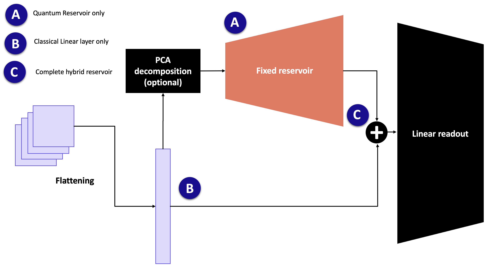
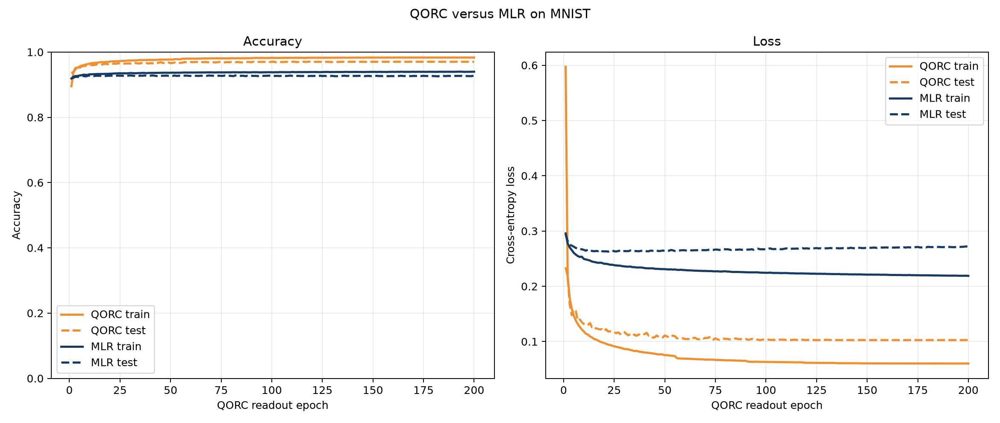
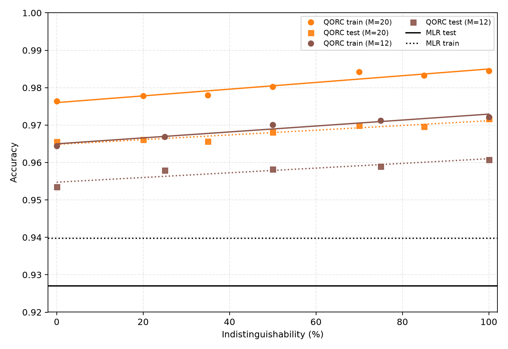
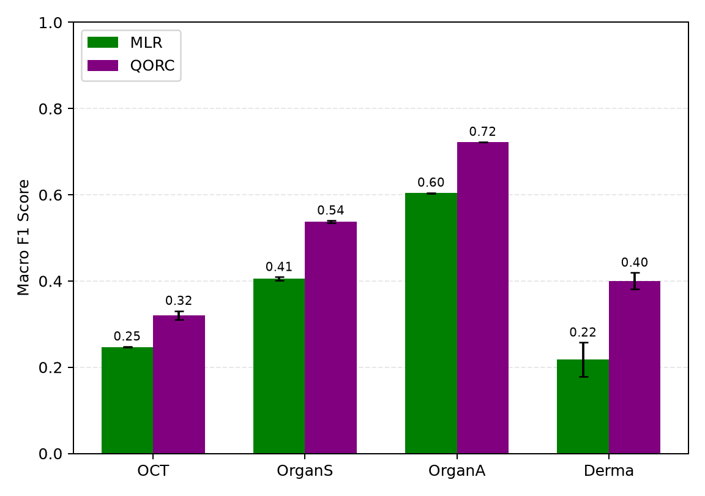
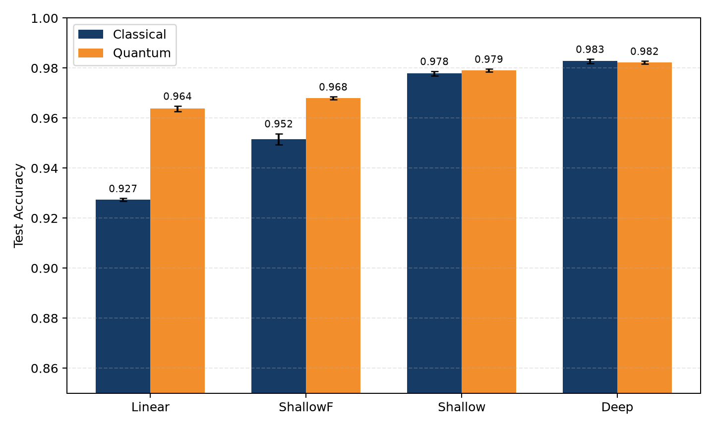

# QORC - Quantum Optical Reservoir Computing Reproductions

This project contains reproductions based on two photonic reservoir-computing
papers. The sections below keep the original QORC reproduction separate from
the newer quantum-accelerated machine-learning experiments.

## Paper 1: Quantum Optical Reservoir Computing Powered by Boson Sampling

[Original paper](https://opg.optica.org/opticaq/abstract.cfm?URI=opticaq-3-3-238)

## Reference and Attribution

- Paper: Quantum optical reservoir computing powered by boson sampling (Optica Quantum, 2025)
- Authors: Akitada Sakurai, Aoi Hayashi, William John Munro, Kae Nemoto
- DOI/ArXiv: https://doi.org/10.1364/OPTICAQ.541432, https://opg.optica.org/opticaq/abstract.cfm?URI=opticaq-3-3-238

## Overview

This repository provides a reproducible implementation of the **Quantum Optical Reservoir Computing (QORC) experiment** using the **MerLin quantum machine learning framework**. The code replicates the performance results of quantum feature-based classification on the MNIST dataset and its two variants (K-MNIST and Fashion-MNIST), demonstrating the proof-of-concept advantages of quantum reservoirs in machine learning tasks.

### Key Components
- **Datasets**: Classic MNIST (10-class image classification, 28x28 pixels, 60,000 training + 10,000 test images), and two variants (K-MNIST and Fashion-MNIST).
- **Models**:
  - **QORC (Quantum Optical Reservoir Computing)**:
    - **Nb photons and modes**: To be selected by the user.
    - **Pre-circuit and Reservoir circuits**: Both use the same Haar-random unitary matrix representation.
    - **Input State**: Photons are distributed over modes.
    - **Training**: Only the linear classifier is trained; circuit parameters are fixed.
    - **Bunching Control**: Configurable (with `b_no_bunching`).
    - **Dimensionality Reduction**: PCA applied to MNIST images before feeding into QORC.
    - **Optimizer**: AdaGrad with cross-entropy loss and Xavier Glorot weight initialization.
    - **Learning Strategy**: `ReduceLROnPlateau` with gradient clipping (norm=1.0) for stability.
    - **Normalization**:
      - MNIST: Scaled to `[0, 1]` by dividing by 255.
      - PCA: Global min-max normalization to preserve variance ratios.
      - QORC features: StandardScaler.
  - **RFF (Random Fourier Features)**:
    - **Features**: RBF kernel with configurable bandwidth (`sigma`) and number of components.
    - **Optimizer**: SGD or `LinearSVC` (hinge loss).
    - **Normalization**: StandardScaler for both MNIST and RFF features.

### Technical Choices
- **Hardware**: Compatible with CPU and GPU (`device: cpu/cuda:0`).
- **Reproducibility**: Seed control for all random number generators (RNGs). Set `seed=-1` for random behavior; positive seeds ensure determinism.
- **Training**:
  - **QORC**: Uses train/val split with k-fold cross-validation (default: 5 folds). Validation set is only used for model selection.
  - **RFF**: Configurable via SGD or direct `LinearSVC` optimization.
- **Logging**: TensorBoard support and computation duration tracking for benchmarking.
- **No Data Augmentation**: Not required for this proof-of-concept.
- **Looping**: Supports automated iteration over parameter ranges (e.g., n_photons, n_modes) for batch experimentation.

### Deviations/Assumptions
- **Circuit Design**: Pre-circuit and reservoir share the same Haar-random unitary matrix, as in the original paper.
- **Determinism**: Fully deterministic when `seed > 0`. Random behavior if `seed=-1`.

## Concept

**Quantum Optical Reservoir Computing (QORC)** leverages the intrinsic non-linearity of photonic circuits to compute high-dimensional, untrained features. A trainable linear layer is then applied to these features to perform image classification.



In detail, an **M-mode random interferometer** (pre-circuit) with **N single-photon inputs** generates a complex photonic resource state. Each input image undergoes **dimensionality reduction via Principal Component Analysis (PCA)**, and the resulting feature vector modulates the phases of a column of phase shifters, encoding the data into the photonic state. The encoded state is subsequently processed through a second **M-mode random interferometer** (the reservoir), which may be identical to the pre-circuit. The output **Fock-state probabilities**, obtained via coincidence detection, serve as quantum-derived features for classification.

## How to Run

### Install dependencies

```bash
python -m venv .venv
source .venv/bin/activate
pip install -r requirements.txt
```

### Command-line interface

All runs go through the repository root runner so the CLI definition in `cli.json` stays in sync with other projects.

```bash
# From the repo root
python implementation.py --paper QORC --config QORC/configs/xp_qorc.json --help

# From inside this folder
python ../implementation.py --paper QORC --config configs/xp_qorc.json --help
```

### General Options
   Option               | Description                                                                 |
 |----------------------|-----------------------------------------------------------------------------|
 | `--config PATH`      | Load config from JSON (example files in `configs/`).                        |
 | `--outdir DIR`       | Base output directory. A timestamped run folder `run_YYYYMMDD-HHMMSS` is created inside. |
 | `--dataset-name DS`  | Dataset: `mnist`, `oct`, `organs`, `organa`, or `derma`. Default: `mnist`. |
 | `--dataset-sampling MODE` | MNIST training sampling: `full`, `balanced`, `gauss`, or `imbal`. |
 | `--dataset-sample-count INT` | Total training examples for a sampled MNIST experiment. |
 | `--dataset-samples-per-class INT` | Training examples per class for balanced MNIST. |

### Qorc Options
 | Option               | Description                                                                 |
 |----------------------|-----------------------------------------------------------------------------|
 | `--n-photons INT`    | Number of photons.                                                          |
 | `--n-modes INT`      | Number of modes.                                                            |
 | `--seed INT`         | Random seed for reproducibility.                                            |
 | `--fold-index INT`   | Split train/val fold index.                                                 |
 | `--n-fold INT`       | Number of folds for train/val split.                                        |
 | `--batch-size INT`   | Batch size.                                                                 |
 | `--lr FLOAT`         | Learning rate.                                                              |
 | `--reduce-lr-patience INT` | Patience for reducing learning rate on plateau.                     |
 | `--reduce-lr-factor FLOAT` | Factor by which the learning rate will be reduced.                  |
 | `--num-workers INT`  | Number of subprocesses for data loading.                                   |
 | `--pin-memory BOOL`  | Enable pin memory for faster data transfer to CUDA devices.                |
 | `--f-out-weights PATH` | Filename for the optional model checkpoint.                         |
 | `--save-weights BOOL` | Save the best model checkpoint as a `.pth` file. Default: `false`.   |
 | `--b-no-bunching BOOL` | Disable bunching.                                                          |
 | `--b-use-tensorboard BOOL` | Enable TensorBoard logging.                                          |
 | `--device STR`       | Device string (e.g., `cpu`, `cuda:0`, `mps`).                              |
 | `--epochs INT`       | Number of readout-training epochs. Default: 200.                         |
 | `--noise-enabled BOOL` | Enable Perceval source noise. Default: false.                         |
 | `--noise-indistinguishability FLOAT` | Photon indistinguishability in `[0, 1]`. |
 | `--noise-g2 FLOAT`   | Perceval `g2` source parameter in `[0, 1]`.                              |
 | `--noise-g2-distinguishable BOOL` | Distinguishability of `g2`-generated photons. |
 | `--use-qpu BOOL`     | Require a `qpu:*` backend instead of local simulation.                   |
 | `--qpu-device NAME`  | Perceval backend, for example `qpu:ascella`.                             |

### RFF Options
 | Option               | Description                                                                 |
 |----------------------|-----------------------------------------------------------------------------|
 | `--n-rff-features INT` | Number of Random Fourier Features.                                         |
 | `--sigma FLOAT`      | RBF kernel bandwidth.                                                       |
 | `--regularization-c FLOAT` | Regularization strength (C).                                        |
 | `--b-optim-via-sgd BOOL` | Use SGD for optimization.                                           |
 | `--max-iter-sgd INT` | Maximum number of SGD iterations.                                          |


Example runs:

```bash
# To run the default qorc experiment
python implementation.py --paper QORC --config QORC/configs/xp_qorc.json

# To run the default RFF experiment
python implementation.py --paper QORC --config QORC/configs/xp_rff.json

# Override some parameters inline
python implementation.py --paper QORC --config QORC/configs/xp_qorc.json --epochs 50 --lr 1e-3

# Gaussian-imbalanced MNIST from Table S4 of photonic_qml.pdf
python implementation.py --paper QORC --config QORC/configs/defaults.json \
  --dataset-name mnist --dataset-sampling gauss --dataset-sample-count 10000

# Noisy local reservoir simulation
python implementation.py --paper QORC --config QORC/configs/defaults.json \
  --noise-enabled true --noise-indistinguishability 0.87 --noise-g2 0.04

# Fig. 3: MedMNIST macro-F1 comparison, three runs per dataset
python implementation.py --paper QORC --config QORC/configs/QORC_medmnist.json
```

The Fig. 3 run compares QORC with M=20 and N=3 against the raw-pixel MLR
baseline on OCT, OrganS, OrganA, and Derma for 200 epochs. It writes
`fig3_qorc_mlr_medmnist.csv`, `fig3_qorc_mlr_medmnist.json`, and
`fig3_qorc_mlr_medmnist.png` to the timestamped output directory. The plot
shows mean test macro-F1 over the three configured seeds with standard
deviation error bars; MLR is green and QORC is purple.


To reproduce the graphs:

```bash
# To plot the main graph
$ python utils/draw_main_graph.py

# To plot the graph comparing qorc and rff
python utils/draw_graph_qorc_vs_rff.py
```

The script saves a snapshot of the resolved config alongside results and logs.

### Data location

- MNIST/K-MNIST/Fashion-MNIST downloads are stored under the shared repo data root by default (`data/QORC/`).
- Override per run with `DATA_DIR=/abs/path` or `--data-root /abs/path` on the `implementation.py` command; the paper subfolder `QORC` is appended automatically by `runtime_lib.data_paths.paper_data_dir`.
- Data loaders now live in `papers/shared/QORC/datasets.py` and are imported from there (no code under `data/` and no per-paper data folder is used).

### Output directory and generated files

At each run, a timestamped folder is created under the base `outdir` (default: `outdir`):

```
<outdir>/run_YYYYMMDD-HHMMSS/
├── config_snapshot.json                    # Resolved configuration used for the run
├── run.log                                 # Log output (stdout/stderr)
├── f_out_results_training_{qorc,rff}.csv   # Training metrics (accuracy, duration, etc.)
│                                           # Example: `f_out_results_training_qorc.csv`
└── f_weights_out.pth                       # Only present when save_weights=true
```

Note:
- Change the base output directory with `--outdir` or in `configs/example.json` (key `outdir`).
- Checkpoint saving is disabled by default (`save_weights: false`) to prevent
  memory and disk usage from accumulating during sweeps. Set `save_weights` to
  `true` in a config, or pass `--save-weights true`, to write the best
  validation checkpoint using `f_out_weights` as its filename.

## Configuration

Place configuration files in `configs/`.

- **`xp_qorc.json`**: Defines the structure and default parameters for the **QORC experiment**.

- **`xp_rff.json`**: Defines the structure and default parameters for the **RFF experiment**.

- Typical keys for the QORC experiment include n_photons, n_modes, seed, n_epochs, batch_size, and learning_rate, while the RFF experiment includes keys such as n_rff_features.

- **Looping Support**: Some parameters can be provided as lists (e.g., `n_photons`, `n_modes`, `seed`, `fold_index`, `n_rff_features`). In such cases, the script will automatically loop over all provided values **in a grid-search manner**.


## Results for Paper 1

Main graph exposing quantum reservoir performances (test accuracy) on the classic MNIST dataset.


In the precedent graph, bunching was manually disabled when the condition `n_photons * n_photons < n_modes` was met, to ensure more precise calculations. The results obtained are comparable to those reported in the reference paper.

Graph comparing the quantum optical reservoir computing (QORC) method with the classical Random Fourier Features (RFF) method, a fast approximation of the Radial Basis Function (RBF) kernel, on the classic MNIST dataset. For the QORC, the number of photons is fixed at 3, as specified in the reference paper.


## Paper 2: Photonic Quantum-Accelerated Machine Learning

Reference: [Photonic Quantum-Accelerated Machine Learning](https://arxiv.org/abs/2512.08318),
by Markus Rambach, Abhishek Roy, Alexei Gilchrist, Akitada Sakurai, William J.
Munro, Kae Nemoto, and Andrew G. White.

The second paper studies the same frozen boson-sampling reservoir approach as
a quantum accelerator for classical machine learning. Its experiments extend
the first reproduction to biomedical MedMNIST datasets, controlled MNIST class
imbalance, sparse training data, imperfect photon sources, and photonic-QPU
execution.

### Experiment 1: MNIST QORC versus linear-softmax baseline

The first implemented comparison trains the Merlin `ReservoirClassifier` QORC
readout and a raw-pixel `torch.nn.Linear` softmax baseline for 200 epochs on
the same MNIST train/validation split. The generated figure contains training
and test accuracy in the left panel and cross-entropy loss in the right panel.
QORC is orange and the linear baseline is dark blue.



Run this experiment from the repository root:

```bash
python implementation.py --paper QORC \
  --config papers/QORC/configs/comparison_QORC_LSVC_mnist.json
```

The run writes the figure and its serialized metrics to
`comparison_QORC_LSVC_mnist.png` and `comparison_QORC_LSVC_mnist.json` in the
timestamped output directory.

### Experiment 2: Fig. 2(b) indistinguishability sweep

The Fig. 2(b) experiment evaluates MNIST classification with QORC using three
photons while varying source indistinguishability. It runs both `M=12` and
`M=20` configurations on the full 60,000-image training set and 10,000-image
test set. The default points are `[0, 25, 50, 75, 100]` percent for `M=12` and
`[0, 20, 35, 50, 70, 85, 100]` percent for `M=20`. Training points use circles
and solid regression lines; test points use squares and dotted regression
lines. The fixed MLR references are 0.9397708177566528 for training and
0.9269999861717224 for testing.

The generated reproduction figure is included here:



Run it with:

```bash
python implementation.py --paper QORC \
  --config papers/QORC/configs/noisy_QORC_indistinguishability.json
```

The indistinguishability arrays can be edited directly in
`configs/noisy_QORC_indistinguishability.json`. The run writes
`noisy_QORC_indistinguishability.png`, `.csv`, and `.json` artifacts to the
timestamped output directory.

### Experiment 3: Fig. 3 MedMNIST QORC versus MLR macro-F1

This experiment reproduces Fig. 3 by comparing the QORC readout with
`M=20` modes and `N=3` photons against a raw-pixel linear-softmax MLR
classifier. Both models are trained for 200 epochs on the
OCT, OrganS, OrganA, and Derma datasets from MedMNIST v2. Results are the
test macro-F1 score averaged over three runs with seeds 42, 43, and 44; error
bars show one standard deviation.

| Dataset | MLR macro-F1 | QORC macro-F1 |
| --- | ---: | ---: |
| OCT | 0.247 ± 0.001 | 0.321 ± 0.010 |
| OrganS | 0.405 ± 0.004 | 0.537 ± 0.003 |
| OrganA | 0.604 ± 0.001 | 0.722 ± 0.000 |
| Derma | 0.218 ± 0.039 | 0.400 ± 0.019 |



Run it from the repository root with:

```bash
python implementation.py --paper QORC \
  --config papers/QORC/configs/QORC_medmnist.json
```

The run writes per-seed scores and the aggregate summary to
`fig3_qorc_mlr_medmnist.csv` and `fig3_qorc_mlr_medmnist.json`, alongside the
generated PNG in the timestamped output directory. The committed figure above
is the curated result from the three-run experiment.

### Experiment 4: Fig. 4 MNIST accuracy versus training-set size

This experiment measures MNIST accuracy as a function of the balanced training
set size `n_tr`, using 50 independently sampled subsets at each configured
size from 100 through 60,000 images. The local curves use QORC with `N=3` and
`M=12`: ideal QORC has no source noise, while noisy QORC uses `g(2)=1.95%`
and indistinguishability `I=0`. The MLR baseline is shown in blue; ideal,
noisy, and QPU QORC are teal, purple, and orange, respectively. Error bars
are one standard deviation across subsets.

The QPU branch is optional and disabled by default because it is expensive.
When enabled, it uses `g(2)=1.95%`, `I=86.36%`, tests on
`n_te = 4669 - n_tr`, and omits QPU points above `n_tr=3900`. The grey
reference lines and configured Hill-function parameters reproduce the paper's
best-MLR references and fits. The inset displays one-standard-deviation bands
around the measured test accuracies.

Because the `g(2)=1.95%` simulation has a higher transient memory cost, the
default noisy quantum feature batch is limited to 25 images
(`noisy_feature_batch_size`). The ideal and QPU feature batches use 250 images;
these settings do not change the training subset sizes or epoch count.

Run the default local experiment from the repository root with:

```bash
python implementation.py --paper QORC \
  --config papers/QORC/configs/fig4_dataset_size_comparison.json
```

Set `enable_qpu` to `true` and provide the required Perceval credentials to
include the QPU series. The run writes
`fig4_dataset_size_comparison.png`, `.csv`, and `.json` to the timestamped
output directory.

The default training sizes are `[100, 300, 500, 700, 900, 1000, 1500, 2000,
2500, 3000, 3500, 4000, 5000, 7500, 10000, 20000, 30000, 40000, 50000, 60000]`.
The 50-subset sweep is computationally intensive even with the QPU branch
disabled; use a temporary config with fewer sizes or subsets for a smoke run.

### Experiment 5: Fig. 6 MNIST architectures

This experiment compares baseline pixel-only readouts with QORC-augmented
readouts on full MNIST. The QORC reservoir uses `N=3`, `M=20`, no bunching,
and therefore `D=C(20,3)=1140` reservoir features. Reservoir features are
standardized using the training set and concatenated with the 784 normalized
pixel features. Linear, ShallowF, Shallow, and Deep readouts use the Table S9
optimizer, learning-rate, batch-size, width, activation, and dropout settings
stored in the configuration. Training runs for 30 epochs.

The default configuration uses 100 runs for error bars. Set `n_runs` to 1 for
a faster mean-only check. It writes
`fig6_mnist_different_architectures.png`, `.csv`, and `.json` to the timestamped
output directory. The JSON also records the paper's target test accuracies:
Linear 92.7%→96.5%, ShallowF 95.3%→96.4%, Shallow 97.0%→97.5%, and Deep
98.3%→97.9%.

The reproduced test-accuracy plot labels the pixel-only baseline as
**Classical** in dark blue and the reservoir readout as **Quantum** in orange;
mean values are annotated above the bars.



Run it with:

```bash
python implementation.py --paper QORC \
  --config papers/QORC/configs/fig6_MNIST_different_architectures.json
```


## Extensions and Next Steps

- **Circuit Depth Ablation**: Study how test accuracy evolves with deeper/shallower quantum circuits.
- **Photon/Mode Scaling**: Evaluate performance with higher photon counts and mode dimensions, leveraging HPC resources (e.g., GENCI/Jean Zay) for large-scale simulations.


## Reproducibility Notes

### Random Seed Control
- Set `seed` to a positive integer for full determinism.
- `seed=-1` disables control (random behavior).

### Determinism Settings
- All RNGs (NumPy, PyTorch, Perceval) are seeded if `seed > 0`.

### Library Versions
```bash
numpy==2.3.3
scikit_learn==1.7.1
pandas==2.3.1
torch==2.7.1
perceval_quandela==0.13.2
merlinquantum==0.1.0
```
