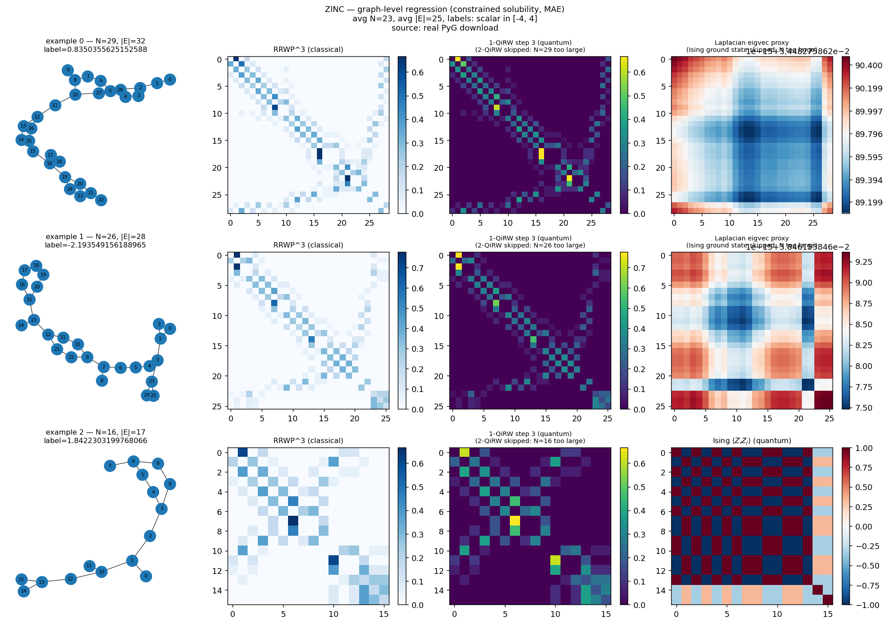
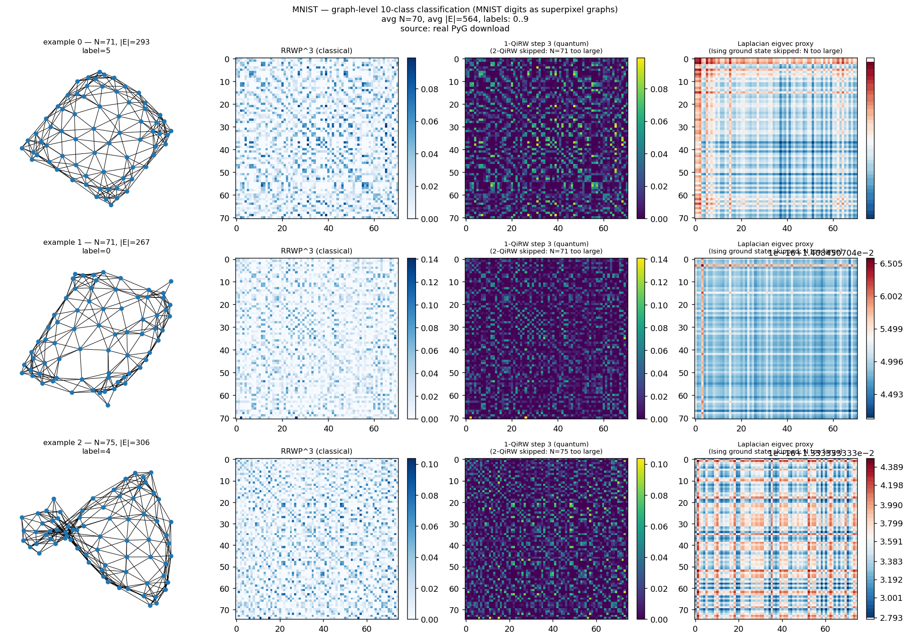

# Quantum Positional Encodings for Graph Neural Networks — Reproduction

Reproduction of:

> Thabet, Djellabi, Sokolov, Kasture, Henry, Henriet,
> *Quantum Positional Encodings for Graph Neural Networks*,
> arXiv:[2406.06547](https://arxiv.org/abs/2406.06547) (ICML 2024).

## Reference and Attribution

All scientific credit belongs to the original authors. This reproduction is
infrastructure-grade. The `*_reduced.json` configs exercise the implemented
pipeline on a single CPU. The `*_original.json` configs document intended
paper-scale settings and now select the full GRIT implementation. Those runs
  remain resource-intensive. The synthetic and SRG paper-scale experiments
  now use their dedicated scalable constructions described below.

The full transformer is a dependency-free dense adaptation of the authors'
[official MIT-licensed GRIT implementation](https://github.com/LiamMa/GRIT),
which is based on GraphGPS. The layer equations and paper hyperparameters are
retained; batching is changed from sparse PyG tensors to padded dense tensors.

## Reproduction Scope, Claims, and Deviations

### Claims targeted

| ID | Claim | Where in paper | Reproduction test | Status |
| --- | ----- | -------------- | ----------------- | ------ |
| C1 | Ising correlation eigenvectors and 2-QiRW are valid positional encodings for GNNs / graph transformers (Sec. 3, 5.1, Table 1). | Sec. 3.2, Table 1 | Numerical reference tests and synthetic end-to-end training. | partially reproduced: GS correlations complete on the synthetic task; benchmark-scale 2-QiRW runs remain pending. |
| C2 | RRWP cannot distinguish certain pairs of non-isomorphic strongly regular graphs (Prop. 4.6), but two-particle quantum-walk correlations can (Fig. 3). | Sec. 4.3, Fig. 3 | `srg_paper_original.json` evaluates all 15 + 10 catalog graphs and five permutations per graph. | reproduced: quantum 150/150 pairs; RRWP 0/150; all 125 controls pass at 1e-9. |
| C3 | The synthetic ladder-concat dataset (App. D.2) is separated by Ising ground-state correlations but not by classical encodings. | Sec. 5.2, App. D.2 | Four controlled 800-graph configs use an identical graph manifest and split for quantum, RRWP, LE, and no PE. | reproduced over four seeds; results are stored in `assets/synthetic_original_summary.json`. |
| Photonic | The XY hamiltonian evolution on the k-particle subspace is equivalent to a passive linear-optical interferometer on N modes with k indistinguishable photons. | New — derived for this reproduction. | `tests/test_photonic.py::test_photonic_1cqrw_matches_xy_cqrw` (numerical equality to 1e-10). | implementation HIGH; demonstrates that 1-CQRW is a *native* photonic computation. |

### Deviations from the paper

- **Reduced PyG coverage.** ZINC, MNIST, CIFAR10, PATTERN, and CLUSTER are
  available through a PyTorch Geometric adapter. Only reduced ZINC and MNIST
  training runs have completed. A paper-scale ZINC RRWP seed-0 run reached
  epoch 1004/2000 but did not complete. PCQM4Mv2 and OGB integration are not
  implemented. The local `graph_reg` dataset remains a CPU-friendly proxy for
  ZINC-style graph regression.
- **Two GRIT execution tiers.** Paper configs use a dense-batch adaptation of
  the original GRIT/GraphGPS implementation: learned node-pair updates,
  signed-square-root edge modulation, edge-enhanced values, log-degree
  scaling, node and edge encoders, batch normalization, and separate attention
  dropout. Smoke configs retain `GRITLite` to keep CPU checks inexpensive.
- **SRG Ising parameters are unavailable.** The complete ANU graph6 catalogs
  for both paper families are included. The interacting two-particle XY walk
  is exact. The paper does not publish the parameter vector for its p=2 Ising
  circuit, so `srg_metrics.json` labels that branch as a deterministic
  linked-cluster signature rather than claiming an exact Ising correlator.
- **Paper-specific ladder solver.** Arbitrary-graph Ising ground states still
  use the explicit Hilbert space up to N=18. Appendix D.2 ladders instead use
  an exact four-boundary-state transfer dynamic program and an implicit
  correlation eigensolver, supporting lengths 100--400 without a `2**N`
  allocation.

## Current Reproduction Status

Status as of 2 September 2026:

| Workstream | Status | Evidence or remaining work |
| ---------- | ------ | -------------------------- |
| Data pipeline and official benchmark splits | Complete | Node and edge features, directed MNIST/CIFAR10 edges, categorical ZINC encoders, and separate official train/validation/test datasets are covered by tests. |
| 2-QiRW numerical implementation | Complete | Explicit expected-value tests cover a path, cycle, and irregular graph. |
| Full GRIT implementation and paper configs | Implemented and smoke-tested | Includes node/edge encoders, attention dropout, warmup, dataset-specific heads/pooling/metrics, and parameter-budget checks. Full benchmark results are pending. |
| Synthetic Appendix D.2 experiment | Complete | Four encodings × four seeds, 800 graphs, lengths 100–400, PE dimension 20, and 200 epochs. |
| SRG two-particle walk and RRWP experiment | Complete | All 25 catalog graphs and five isomorphic permutations per graph. Quantum walk distinguishes 150/150 pairs; RRWP distinguishes 0/150. |
| SRG Ising p=2 experiment | Blocked | The paper does not publish the circuit parameter vector. `ising_p2_linked` is explicitly a proxy and must not be reported as the exact result. |
| ZINC RRWP, seed 0 | Partial: epoch 1004/2000 observed | `outdir/run_20260901-150605/` contains only the configuration and log header; it has no final `metrics.json` or checkpoint and is not a reportable result. |
| Remaining ZINC comparisons | Not run | RRWP seeds 1–3 and all CQRW1/2-QiRW seeds remain. If the partial process stops, RRWP seed 0 must also restart from epoch 1. |
| MNIST, CIFAR10, PATTERN, and CLUSTER paper runs | Not run | Three controlled encodings × four seeds for each dataset remain. |
| Photonic readout test | Environment-blocked | The local `merlinquantum` 0.1.2 installation lacks `CircuitBuilder`; `requirements.txt` requests version 0.4.1 or newer. |

## TODO — Priority Order

1. **Add periodic checkpointing and resume support before restarting long
   benchmark runs.** The current runner saves `best_model.pt` and
   `metrics.json` only after training finishes. The partial ZINC run therefore
   cannot resume from epoch 1004 if its process is stopped. Checkpoints should
   preserve the current epoch, model, optimizer, scheduler, best validation
   state, history, seed, and resolved configuration.

2. **Finish the ZINC controlled comparisons.** First run a short validation of
   the corrected GRIT numerical path:

   ```bash
   python implementation.py --paper QPE_GNN \
     --config configs/zinc_rrwp_original.json \
     --seed 0 --epochs 1 --warmup-epochs 1 --limit 320
   ```

   After checkpoint/resume support exists, run all ZINC methods and seeds. Skip
   any seed that already has a completed `metrics.json`; epoch progress alone
   does not count as completion.

   ```bash
   for encoding in rrwp cqrw1 qirw2; do
     for seed in 0 1 2 3; do
       python implementation.py --paper QPE_GNN \
         --config "configs/zinc_${encoding}_original.json" \
         --seed "$seed"
     done
   done
   ```

3. **Run MNIST, CIFAR10, PATTERN, and CLUSTER.** These are the remaining
   paper-scale controlled comparisons needed for Table 1.

   ```bash
   for dataset in mnist cifar10 pattern cluster; do
     for encoding in rrwp cqrw1 qirw2; do
       for seed in 0 1 2 3; do
         python implementation.py --paper QPE_GNN \
           --config "configs/${dataset}_${encoding}_original.json" \
           --seed "$seed"
       done
     done
   done
   ```

4. **Aggregate the benchmark runs and compare them with Table 1.** Add a
   benchmark aggregation utility that rejects incomplete runs, groups results
   by dataset/encoding/seed, and reports mean ± standard deviation, best epoch,
   parameter count, and total runtime. Commit only the compact summary under
   `assets/`, then update this README and the root paper table. Regenerate the
   synthetic and SRG plots in `assets/figures/` from the corrected
   implementations before embedding them as results; the current comparison
   plots and feature atlas are historical.

5. **Complete exact SRG Ising p=2 only if the missing parameters can be
   recovered.** Obtain the Figure 3 parameter vector from the authors or the
   original experiment source, replace the linked-cluster proxy, and rerun:

   ```bash
   python implementation.py --paper QPE_GNN \
     --config configs/srg_paper_original.json --seed 0
   ```

6. **Repair the optional photonic test environment.** Install the declared
   MerLin version and rerun the focused test:

   ```bash
   python -m pip install --upgrade 'merlinquantum>=0.4.1'
   cd papers/QPE_GNN
   python -m pytest tests/test_qpe.py tests/test_photonic.py -q
   cd ../..
   ```

7. **Run final verification after the long experiments and documentation
   update.**

   ```bash
   cd papers/QPE_GNN
   python -m pytest -q
   cd ../..
   python implementation.py --list-papers
   python implementation.py --paper QPE_GNN --help
   ```

## Project Layout

```
papers/QPE_GNN/
├── README.md                  ← this file
├── requirements.txt           ← supported direct dependencies
├── requirements_frozen.txt    ← historical MerLin 0.3 environment snapshot
├── cli.json                   ← paper-specific shared-runtime options
├── LOG.md                     ← execution log, decisions, blockers
├── FEEDBACK.md                ← workflow-improvement notes
├── CONFLUENCE.md              ← publication-ready summary
├── VISITED_URLS.md            ← consulted resources
├── configs/                   ← one JSON per (experiment × variant)
├── lib/
│   ├── qpe.py                 ← RRWP, 1-CQRW, 2-QiRW, ground-state corr eigvecs
│   ├── data.py                ← synthetic, SRG, regression, and PyG datasets
│   ├── pe_factory.py          ← (cached) per-batch PE tensor construction
│   ├── model.py               ← full GRIT, GRITLite, and GCN baseline
│   ├── photonic.py            ← NumPy photonic mapping and MerLin readout
│   └── runner.py              ← train_and_evaluate(cfg, run_dir)
├── utils/
│   ├── plot_datasets.py       ← dataset visualisations (Fig. 7, Fig. 8, Fig. 3)
│   ├── plot_models.py         ← model + photonic-circuit visualisations
│   ├── plot_pyg_datasets.py   ← PyG or illustrative benchmark visualisations
│   └── plot_results.py        ← cross-run comparison plots + summary table
├── tests/                     ← pytest suite (`pytest -q`)
├── outdir/                    ← disposable timestamped runs
└── assets/                   ← figures + summary tables
```

Downloaded benchmark data is shared at repository level under
`data/QPE_GNN/<dataset>/`.

## Install and How to Run

From the repository root:

```bash
# 1. Create the paper environment and install its declared dependencies.
python -m venv papers/QPE_GNN/.venv
source papers/QPE_GNN/.venv/bin/activate
python -m pip install --upgrade pip
python -m pip install -r papers/QPE_GNN/requirements.txt

# 2. Run the default smoke experiment through the shared runtime.
python implementation.py --paper QPE_GNN --seed 42

# 3. Run named experiments through the shared runtime.
python implementation.py --paper QPE_GNN --config configs/synthetic_reduced.json --seed 0
python implementation.py --paper QPE_GNN --config configs/synthetic_rrwp_baseline.json --seed 0
python implementation.py --paper QPE_GNN --config configs/synthetic_gcn_baseline.json --seed 0
python implementation.py --paper QPE_GNN --config configs/synthetic_merlin.json --seed 0
python implementation.py --paper QPE_GNN --config configs/srg_distinguish.json --seed 0
python implementation.py --paper QPE_GNN --config configs/srg_rrwp_baseline.json --seed 0
python implementation.py --paper QPE_GNN --config configs/graphreg_reduced.json --seed 0

# Paper-scale controlled comparison example (resource-intensive).
python implementation.py --paper QPE_GNN --config configs/zinc_qirw2_original.json --seed 0

# Paper-scale synthetic controlled comparisons, four seeds each.
for config in synthetic_quantum_original synthetic_rrwp_original synthetic_laplacian_original synthetic_gcn_original; do
  for seed in 0 1 2 3; do
    python implementation.py --paper QPE_GNN --config "configs/${config}.json" --seed "$seed"
  done
done
cd papers/QPE_GNN
python utils/aggregate_synthetic.py
cd ../..

# Complete SRG experiment.
python implementation.py --paper QPE_GNN --config configs/srg_paper_original.json --seed 0

# 4. Run tests and regenerate curated figures from inside the paper directory.
cd papers/QPE_GNN
pytest -q
python -m utils.plot_datasets
python -m utils.plot_models
python -m utils.plot_results
```

The shared runtime writes raw artifacts to
`papers/QPE_GNN/outdir/run_YYYYMMDD-HHMMSS/`. Each completed run contains
`config_snapshot.json`, `metrics.json`, `best_model.pt`, and `run.log`.
`metrics.json` records the best epoch, selected validation metric, final test
metric, seed, and trainable parameter count. Curated summaries and figures
belong under `papers/QPE_GNN/assets/`.

## Configuration

Configs are JSON. The runner directly requires `dataset`, `model`, `encoding`,
and the dimension fields required by that encoding. Other values have defaults
or are required only by a selected dataset or model:

| Key | Meaning |
| --- | ------- |
| `dataset` | `"ladder_concat"`, `"graph_reg"`, `"srg_pair"`, `"zinc"`, `"mnist"`, `"cifar10"`, `"pattern"`, or `"cluster"`. |
| `dataset_kwargs` | Optional arguments forwarded to the dataset constructor. |
| `model` | `"grit"` for paper experiments, `"grit_lite"` for smoke tests, or `"gcn"`. |
| `encoding` | `"rrwp"`, `"cqrw1"`, `"qirw2"`, `"ground_state_corr"`, `"rrwp+cqrw1"`, or `"rrwp+qirw2"`. |
| `rrwp_dim` | RRWP channel count. Required by paper-scale RRWP and concatenated QPE configs. |
| `qpe_dim` | 1-CQRW time count or 2-QiRW step count. Required by paper-scale QPE configs and kept separate from `rrwp_dim`. |
| `qpe_min_time`, `qpe_max_time` | Bounds for the seeded random 1-CQRW times. Appendix C uses 0.1 and π. |
| `pe_dim` | Legacy single-encoding dimension retained for smoke and synthetic configs. It is not used to split concatenated encodings. |
| `head` | `"graph_class"`, `"graph_reg"`, or `"node_class"`. PATTERN and CLUSTER require node output. |
| `pooling` | Full-GRIT graph pooling. ZINC requires `"sum"`; MNIST and CIFAR10 require `"mean"`. |
| `attention_dropout` | Attention-coefficient dropout, separate from feature `dropout`. |
| `warmup_epochs`, `minimum_lr` | Linear warmup followed by cosine decay. |
| `parameter_budget` | Hard upper bound on trainable parameters; training fails before epoch 1 when exceeded. |
| `epochs`, `batch_size`, `lr`, `seed` | Training settings. |

Paper-specific shared-runtime flags are defined in `cli.json`. For example:

```bash
python implementation.py --paper QPE_GNN --epochs 2 --batch-size 4
```

Global flags such as `--config`, `--seed`, `--device`, and `--outdir` are
provided by the repository runtime.

Configs may declare `feasibility.status` as `supported`, `resource_intensive`,
or `infeasible`. The legacy `synthetic_original.json` remains a record of the
old dense limitation; use the four runnable `synthetic_*_original.json`
controlled-comparison configs instead.

## Data

Two layers of datasets:

### Synthetic (built in-memory, no download)

See `lib/data.py`:

- **`LadderConcatDataset`** (App. D.2): two-class graph classification.
  Class 0 = type-0 + type-1 ladders; class 1 = type-0 + type-2 ladders.
  Quantum (Ising ground-state correlation) features separate the two
  classes; RRWP does not. Paper configs contain 800 graphs, use common lengths
  100--400, exactly two crossings in either class, and cache encoded records
  under repository-level `data/QPE_GNN/synthetic/`.
- **SRG catalogs** (Sec. 4.3): all 15 `srg(25,12,5,6)` graphs and all 10
  `srg(26,10,3,4)` graphs from Brendan McKay's ANU combinatorial-data catalog.
- **`RandomGraphRegression`**: Erdős-Rényi random connected graphs whose
  label is the algebraic connectivity (Fiedler value). A small but valid
  graph-level regression task useful as a ZINC-style proxy.

### PyTorch Geometric benchmarks (downloaded on demand)

The five benchmarks from Table 1 of the paper are accessible via the
`PyGBenchmarkAdapter` in `lib/data.py`:

| Benchmark | PyG class | Download size (approx.) | Task | Reduced smoke config |
| --------- | --------- | ----------------------: | ---- | -------------------- |
| ZINC (subset)        | `torch_geometric.datasets.ZINC` | ~150 MB | graph regression (MAE) | `configs/zinc_smoke.json` |
| MNIST-as-graphs      | `GNNBenchmarkDataset` | ~1.7 GB | 10-class | `configs/mnist_smoke.json` |
| CIFAR10-as-graphs    | `GNNBenchmarkDataset` | ~2.5 GB | 10-class | `configs/cifar10_smoke.json` |
| PATTERN              | `GNNBenchmarkDataset` | ~2.1 GB | inductive node-binary | `configs/pattern_smoke.json` |
| CLUSTER              | `GNNBenchmarkDataset` | ~1.7 GB | inductive node 6-class | `configs/cluster_smoke.json` |

To run a smoke config:

```bash
python implementation.py --paper QPE_GNN \
  --config configs/zinc_smoke.json --seed 0
```

Each smoke config downloads the dataset on first use into the current
shared `data/QPE_GNN/<name>/` directory, caps the split with
`limit`, and trains for 2 epochs with a tiny model. Positional-encoding cost
grows quickly with graph size: the ZINC smoke run completes in seconds, while
the stored MNIST smoke run takes several minutes.

Each benchmark has separate `*_rrwp_original.json`, `*_cqrw1_original.json`,
and `*_qirw2_original.json` controlled-comparison configs. The quantum configs
concatenate the Appendix C QPE channels to the complete RRWP baseline. The
older `<dataset>_original.json` names remain runnable 2-QiRW aliases. All
paper-scale configs encode the full-GRIT settings and parameter caps. None has
completed; the ZINC RRWP seed-0 run is the only partial paper-scale run and
reached epoch 1004/2000.

Appendix C reports four runs. Execute each comparison with seeds 0–3:

```bash
for seed in 0 1 2 3; do
  python implementation.py --paper QPE_GNN \
    --config configs/zinc_qirw2_original.json --seed "$seed" --device cuda:0
done
```

In particular, `synthetic_original.json` exceeds the N ≤ 18 limit of the exact
Ising solver and cannot run unchanged.

PATTERN and CLUSTER use their original node-level targets. The adapter retains
one label per node, `collate_pad` pads node labels with an ignored `-1` value,
and `head="node_class"` trains masked per-node logits. The smoke configs reduce
the number of graphs and epochs but no longer replace the task with a
majority-vote graph proxy.

Per-benchmark dataset visualisations (three example graphs × the same four
panels — graph drawing, RRWP^3, 1-/2-QiRW marginal, Ising correlation /
Laplacian-eigvec proxy) are produced by `python -m utils.plot_pyg_datasets`
and saved as `assets/figures/pyg_{zinc,mnist,cifar10,pattern,cluster}.png`.
If the real PyG dataset isn't available locally, the script falls back to
**shape-matched illustrative graphs** built from the documented statistics
(see `BENCHMARK_STATS` in `utils/plot_pyg_datasets.py`) so the figures
still render. Set `QPE_FORCE_DOWNLOAD=1` to skip the network probe and
force the real download path.

### Dataset previews

The committed panels below were generated from the cached PyG datasets. They
show representative graph structure alongside classical RRWP, one-particle
quantum-walk, and Laplacian-proxy matrices. They are dataset/feature previews,
not benchmark results. Large-graph panels explicitly state where 2-QiRW or an
exact Ising calculation was skipped for visualisation cost.

#### ZINC molecular graphs



#### MNIST superpixel graphs



Additional dataset panels:

- [CIFAR10 superpixel graphs](assets/figures/pyg_cifar10.png)
- [PATTERN node-classification graphs](assets/figures/pyg_pattern.png)
- [CLUSTER node-classification graphs](assets/figures/pyg_cluster.png)

Verification status in this checkout: the adapter logic is unit-tested in
`tests/test_pyg_adapter.py`; processed files for all five PyG datasets are
present; and two smoke trainings have stored end-to-end metrics:

| Smoke run | Encoding | Test metric | Wall (s) | Notes |
| --------- | -------- | ----------- | --------:| ----- |
| `zinc_smoke.json`  | RRWP + 2-QiRW | MAE 1.30 | 3.2  | Tiny model (3.4 k params), 2 epochs over 140 graphs. |
| `mnist_smoke.json` | 2-QiRW       | acc 0.13 | 226.9 | 2-QiRW on ~70-node graphs dominates wall time (PE precompute). |

These are pipeline-validation runs, not scientific reproductions. The current
processed dataset directory occupies approximately 1.6 GiB. Cached data is a
local runtime artifact and should not be treated as a committed reproduction
result.

The stored metrics were produced before the 2-QiRW implementation was corrected
to use the paper's uniform edge initial state. Any run using `qirw2` or
`rrwp+qirw2` is historical and must be regenerated before reporting results.

The [historical smoke-run summary](assets/summary.md),
[synthetic comparison](assets/figures/compare_ladder_concat.png),
[reduced SRG comparison](assets/figures/compare_srg_pair.png), and
[feature atlas](assets/figures/feature_atlas.png) predate the corrected 2-QiRW
and paper-scale synthetic implementations. They are retained as development
artifacts but must not be presented as current scientific results. The current
synthetic result is the machine-readable
[`results/synthetic_original_summary.json`](results/synthetic_original_summary.json).

## Results Obtained and Comparison with the Paper

### Paper-scale ZINC status

The ZINC RRWP seed-0 run started from
`configs/zinc_rrwp_original.json` and reached epoch 1004/2000. It is
**incomplete** and has no final validation-selected test MAE. It must not be
included in a comparison with the paper. The current runtime does not write an
intermediate checkpoint, so the run cannot resume from epoch 1004 if the
process has stopped. The CQRW1 and 2-QiRW ZINC comparisons and the remaining
RRWP seeds have not run.

Before that long run, the NaN-producing GRIT attention operations were fixed.
A 320-example-per-split ZINC RRWP smoke run then completed with finite train,
validation, and test MAE. This validates execution only; its truncated metrics
are not a paper result.

### Synthetic Appendix D.2

Paper-scale Appendix D.2 runs use 800 identical graphs and identical
train/validation/test indices for every method. Each score is test accuracy over
seeds 0, 1, 2, and 3 after 200 epochs; the uncertainty is the population
standard deviation across those four seeds.

| Encoding | Per-seed test accuracy | Mean ± std | Paper |
| -------- | ---------------------- | ---------- | ----- |
| Ising GS correlation eigenvectors | 1.000, 1.000, 1.000, 0.988 | **99.69 ± 0.54%** | ≈100% |
| RRWP edge encoding | 0.475, 0.550, 0.475, 0.475 | **49.37 ± 3.25%** | ≈45% |
| Laplacian eigenvectors | 0.475, 0.475, 0.475, 0.475 | **47.50 ± 0.00%** | ≈45% |
| No-PE GCN | 0.475, 0.475, 0.475, 0.475 | **47.50 ± 0.00%** | ≈45% |

The quantum result approaches the paper's 100% result while all three
classical baselines remain near chance. The complete machine-readable report,
including the selected run directories, is in
[`assets/synthetic_original_summary.json`](assets/synthetic_original_summary.json).

### Strongly regular graphs

The paper-scale SRG run gives the following sorted-correlation results:

| Family | 2-particle XY | RRWP | Maximum isomorphic-control distance |
| ------ | ------------- | ---- | ----------------------------------- |
| `srg(25,12,5,6)` (15 graphs) | 105/105 pairs distinguished | 0/105 | 2.12e-15 |
| `srg(26,10,3,4)` (10 graphs) | 45/45 pairs distinguished | 0/45 | 2.01e-15 |

All five random isomorphic permutations of every graph pass the `1e-9`
tolerance. The exact result is stored in
[`outdir/run_20260901-105853/srg_metrics.json`](outdir/run_20260901-105853/srg_metrics.json).
The Ising column in that artifact is explicitly named `ising_p2_linked`: it is
a linked-cluster proxy, not the paper's exact p=2 circuit, because the paper
defines a parameterized circuit but does not publish the parameter vector used
for Figure 3.

Reduced-compute runs (single seed, CPU; see `assets/summary.md`):

| Reproduction | Encoding | Test metric | Wall (s) | Paper (paper-scale) | Notes |
| ------------ | -------- | ----------- | --------:| ------------------- | ----- |
| LadderConcat (synthetic) | GS-corr eigvecs | acc=0.29 | 16 | acc≈1.00 (4k params) | Reduced data; quantum advantage is *not* visible on this scale. See Limitations. |
| LadderConcat (synthetic) | RRWP | acc=0.43 | 1 | acc≈0.45 (paper-scale) | Consistent with the paper: RRWP is at chance even at paper scale. |
| LadderConcat (synthetic) | none (GCN baseline) | acc=0.57 | 0.4 | acc≈0.45 | Reduced; ~chance. |
| LadderConcat (synthetic) | 1-CQRW (photonic) | acc=0.43 | 1 | — | Photonic counterpart of the quantum encoding. |
| Graph regression (Fiedler proxy) | RRWP+2-QiRW | mae=0.33 | 1 | — | Substitute task; not in the paper. |
| SRG(16,6,2,2) | 2-QiRW | acc=0.57 | 2 | (paper distinguishes empirically) | Reduced. Insufficient signal for the classifier; the *features* themselves *are* different (see `srg_pair_*.png`). |
| SRG(16,6,2,2) | RRWP | acc=0.57 | 2 | (paper: cannot distinguish) | Matches Prop. 4.6. |

These are **infrastructure validations only**, not scientific reproductions.
The numerical implementation of the QPE features themselves is verified
exactly against analytic expectations in `tests/test_qpe.py`
(unitarity, row-stochasticity, Ising hamiltonian symmetry, eigenvector
orthonormality).

## Fair Baselines

Three baselines are provided:

- **GRIT-lite with RRWP** (`synthetic_rrwp_baseline.json`,
  `srg_rrwp_baseline.json`): same architecture as the QPE variant, only the
  encoding differs. This is the canonical "fair classical baseline" for a
  PE-replacement claim.
- **GCN with no PE** (`synthetic_gcn_baseline.json`): minimal 1-hop MPNN
  baseline matched at ~similar parameter count.
- **GRIT-lite with photonic 1-CQRW** (`synthetic_merlin.json`): the *same
  numerical features* as the gate-model 1-CQRW, but framed and named as the
  photonic counterpart. Used to anchor the photonic translation claim.

## MerLin Photonic Extension

Two distinct constructions live in `lib/photonic.py`:

1. **`photonic_cqrw_features(A, k, times)`** — computes the k-CQRW positional
   encoding *as the output of a passive linear-optical interferometer* with
   unitary `U(t) = exp(-i * 2A * t)` (matching the XY hamiltonian convention).
   For k=1 this numerically equals `lib.qpe.cqrw_features(A, 1, times)` to
   machine precision; see the test
   `tests/test_photonic.py::test_photonic_1cqrw_matches_xy_cqrw`.
   This *is* the photonic translation of the paper's quantum feature: every
   row of the result is a photon-counting distribution at the output of the
   interferometer, with a single photon injected at one of the input modes.

2. **`PhotonicMZIReadout`** — a standalone trainable photonic MerLin layer
   built from `merlin.CircuitBuilder.add_entangling_layer` and
   `add_angle_encoding` (cookbook Pattern A). It is exercised directly by a
   unit test but is not connected to `GRITLite` or the training runner.

### Photonic implementation settings

| Component | Current implementation |
| --------- | ---------------------- |
| 1-CQRW features | NumPy eigendecomposition of `U(t) = exp(-i 2At)` followed by analytic mode probabilities |
| 1-CQRW input | One localized photon per input-mode experiment |
| `PhotonicMZIReadout` | MerLin `QuantumLayer`, 6 modes and 3 photons in the test configuration |
| Readout input state | `[1, 0, 1, 0, 1, 0]` for the 6-mode test configuration |
| Readout encoding | Angle encoding with scale π on half the modes |
| Readout measurement | MerLin 0.4 `MeasurementStrategy.probs(ComputationSpace.UNBUNCHED)` |
| Readout simulator controls | `device`, `dtype`, and `n_phase_error_samples` are passed to `QuantumLayer` |
| Readout execution scope | Standalone analytic simulation; not part of QPE-GNN training |

The NumPy 1-CQRW path is mathematically equivalent to single-photon linear
optics, but it does not execute a Perceval or MerLin simulator. The standalone
readout executes MerLin's analytic probability simulator. No detector model,
finite-shot sampling, remote backend, or QPU integration is implemented, so
this README makes no hardware-performance claim for the readout.

## Limitations

- **PyG validation is partial.** Reduced ZINC and MNIST runs have stored
  metrics. CIFAR10, PATTERN, and CLUSTER have processed data and adapter tests,
  but no stored end-to-end training metrics.
- **The scalable ground-state solver is ladder-specific.** It uses a four-state
  transfer dynamic program and an implicit correlation eigensolver for the
  Appendix D.2 graph family. Arbitrary graphs still use exact enumeration and
  retain the small-graph size limit.
- **No PCQM4Mv2/OGB integration.** The current adapter supports PyG ZINC and
  `GNNBenchmarkDataset`, not the full benchmark set used by the paper.
- **Full benchmark runs are pending.** The architecture, official splits,
  metrics, scheduler, and parameter-budget contracts are implemented, but the
  fifteen dataset/encoding comparisons have not completed and therefore do not
  reproduce Table 1 numerically. ZINC RRWP seed 0 reached epoch 1004/2000 but
  produced no final artifact; all other paper-scale benchmark runs remain to
  be completed.
- **Long runs cannot currently resume.** The runner writes its checkpoint only
  after the final epoch. An interrupted run loses its optimizer, scheduler,
  history, and best-validation state. Periodic atomic checkpoints and a resume
  option are required before more multi-hour experiments are practical.
- **The Appendix D.2 crossing convention is inferred from the figure.** A
  type-2 crossing is represented as a doubled antiferromagnetic interaction.
  This produces the figure's nine ground states after quotienting the global
  spin-flip symmetry; a unit-weight diagonal produces only one such pair. The
  paper does not state this multiplicity in text.
- **Photonic adaptation matches 1-CQRW exactly; not the 2-CQRW.** The
  k=2 photonic computation uses indistinguishable bosons and therefore
  carries permanent-based bunching corrections that *differ* from the
  paper's hopping-on-occupation-graph definition. Both formulations are
  valid quantum walks; the photonic one is the natural realisation.

## Tests

```bash
cd papers/QPE_GNN
pytest -q
```

The suite includes shared-runtime config and CLI coverage and configured PyG
data-root checks. The MerLin forward/backward test is currently blocked in the
local environment because installed `merlinquantum` 0.1.2 does not expose
`CircuitBuilder`; the declared requirement is 0.4.1 or newer. Tests also cover
masked node classification and fail-fast feasibility validation. Full-GRIT
tests cover categorical node and edge encoders, stable padded attention and
signed-square-root gradients, attention dropout, pooling, node-level output,
warmup, weighted PATTERN accuracy, and the reported 476,033-parameter ZINC QPE
model.

Tests cover:

- QPE numerical sanity (unitarity, row-stochasticity, Ising/XY identities).
- Dataset construction and SRG-pair non-isomorphism.
- Full-GRIT node/pair updates, feature encoders, pooling, and parameter budget.
- GRIT-lite graph/node heads and GCN forward/backward shapes.
- Warmup/cosine scheduling and weighted PATTERN accuracy.
- Photonic 1-CQRW ↔ XY 1-CQRW exact equality.
- `PhotonicMZIReadout` forward + gradient flow.

## Citation and License

```
@inproceedings{Thabet2024QPEGNN,
  title  = {Quantum Positional Encodings for Graph Neural Networks},
  author = {Thabet, Slimane and Djellabi, Mehdi and Sokolov, Igor and Kasture, Sachin and Henry, Lou{\"i}s-Paul and Henriet, Lo{\"\i}c},
  booktitle = {Proceedings of the 41st International Conference on Machine Learning (ICML)},
  year   = {2024},
  eprint = {2406.06547},
  archivePrefix = {arXiv},
  primaryClass  = {quant-ph},
}
```

This reproduction is released under the same license as the parent
`reproduced_papers` repository.
