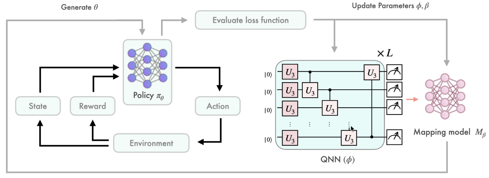
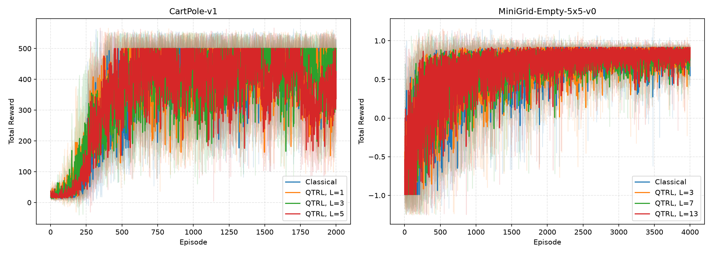
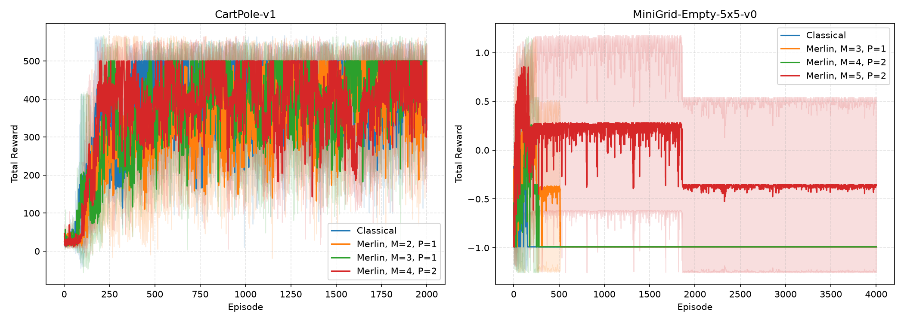

# QTRL: Toward Practical Quantum Reinforcement Learning via Quantum-Train

This project reproduces selected QTRL experiments within the
`reproduced_papers` framework. It includes Merlin photonic, Merlin-MPS,
TorchQuantum, and classical backends; CartPole and MiniGrid training; a
pedagogical notebook; and Figure 1-style parameter sweeps.

## Reference and Attribution

The original paper is:

> Chen-Yu Liu, Chu-Hsuan Abraham Lin, Chao-Han Huck Yang, Kuan-Cheng Chen,
> and Min-Hsiu Hsieh, “QTRL: Toward Practical Quantum Reinforcement Learning
> via Quantum-Train,” 2024.

- Paper: [arXiv:2407.06103](https://arxiv.org/abs/2407.06103)
- Original code: [QuantumTrain, `chenyu_dev/QuantumTrain`](https://github.com/Hon-Hai-Quantum-Computing/QuantumTrain/tree/chenyu_dev/QuantumTrain)

The paper's central idea is to use a quantum model to generate the parameters
of a classical reinforcement-learning policy. The environment and policy
execution remain classical; gradients update the quantum model through the
policy-gradient objective. The paper studies CartPole-v1 and
MiniGrid-Empty-5x5-v0 with TorchQuantum state-vector simulation and varies
quantum-circuit depth.

## Model and Workflow

The repository's Merlin CartPole workflow is:

1. A Perceval/Origen photonic quantum layer produces `q_output_size` values.
2. A classical mapping network transforms those values into policy weights.
3. The local CartPole policy reshapes the generated 8-value vector into a
   `4 x 2` matrix and computes two action logits from the four-dimensional
   observation.
4. `train_environment` samples actions, computes discounted returns, and
   updates the hybrid model with REINFORCE.

The original-paper model diagram is included here for reference:



The local implementation is intentionally smaller than the paper's policy
topologies. It uses a linear CartPole policy rather than the paper's
`4-128-2` policy, so the results below are Figure 1-style local reproductions,
not numerical claims of exact paper replication.

## Reproduction Scope and Deviations

The current repository provides:

- CartPole and MiniGrid runners using Gymnasium.
- Merlin photonic, Merlin-MPS, TorchQuantum, and classical backends.
- Episode-reward plots and structured JSON result artifacts.
- TorchQuantum depth comparisons for Figure 1.
- Merlin mode/photon comparisons for Figure 1.

Important deviations from the original paper:

- The local policy is linear, rather than the paper's larger CartPole and
  MiniGrid policy networks.
- MiniGrid uses the Gymnasium action space directly instead of forcing the
  paper's three-action setup.
- The local TorchQuantum model uses U3 and circular CU3 layers, with a mapping
  configuration that differs from the original implementation.
- Results depend on dependency versions, seeds, hardware, and backend details.

## Installation

From the repository root:

```bash
python -m pip install -r papers/QTRL/requirements.txt
```

The requirements include Gymnasium, MiniGrid, Matplotlib, Merlin, and the
TorchQuantum source dependency. TorchQuantum must be importable when running
the TorchQuantum configurations.

## Configuration

The authoritative paper-specific CLI schema is [`cli.json`](cli.json).

### Default Merlin configuration

[`configs/defaults.json`](configs/defaults.json) is the configuration used by
the notebook and by the default runner:

| Setting | Value |
| --- | --- |
| Environment | CartPole |
| Backend | `merlin_mlp` |
| Quantum output size | `4` |
| Photons | `2` |
| Modes | `3` |
| Mapping hidden sizes | `[8, 8]` |
| Episodes | `500` |
| Learning rate | `0.01` |

The notebook loads this JSON file directly. It does not duplicate the model
or training settings, so changes to the defaults are reflected in the
notebook when it is rerun.

Other standalone configurations are available for
[TorchQuantum CartPole](configs/cartpole-tq.json),
[TorchQuantum MiniGrid](configs/minigrid-tq.json), and
[Merlin MiniGrid](configs/minigrid.json).

## How to Run

Run the default Merlin CartPole training from the repository root:

```bash
python implementation.py --paper QTRL
```

Run the TorchQuantum and Merlin Figure 1-style sweeps:

```bash
python implementation.py --paper QTRL --config configs/figure_1-tq.json
python implementation.py --paper QTRL --config configs/figure_1-merlin.json
```

Open the notebook with `papers/QTRL` as its working directory:

```bash
cd papers/QTRL
jupyter notebook QTRL_demo.ipynb
```

The notebook walks through model initialization, quantum-generated policy
weights, CartPole inference, one environment transition, training, the
episode-reward curve, and a first-versus-last-20-episode reward summary.

## Figure 1-Style Reproduction

The Figure 1 runner aggregates the mean total reward over three repeats and
draws a one-standard-deviation band. The configurations are:

- `figure_1-tq.json`: TorchQuantum depth comparison.
  - CartPole: classical baseline and depths `L=1, 3, 5`, 2,000 episodes,
    learning rate `0.001`.
  - MiniGrid: classical baseline and depths `L=3, 7, 13`, 4,000 episodes,
    learning rate `0.0001`.
  - Three repeats per variant.
- `figure_1-merlin.json`: Merlin mode/photon comparison.
  - CartPole: `(modes, photons) = (2, 1), (3, 1), (4, 2)`, 2,000 episodes,
    learning rate `0.01`.
  - MiniGrid: `(modes, photons) = (3, 1), (4, 2), (5, 2)`, 4,000 episodes,
    learning rate `0.01`.
  - Three repeats per variant.

Curated aggregate figures are included in the repository:





Raw runs are written to timestamped directories under `outdir/`. Aggregate
runs contain the figure, a JSON result file, `config_snapshot.json`, and
`run.log`. Variant checkpoints are written under the run's `checkpoints/`
directory when checkpointing is enabled.

## Results and Limitations

The committed Figure 1 assets show the current local implementation's reward
curves for the TorchQuantum depth sweep and Merlin mode/photon sweep. They are
useful for checking the reproduction workflow and comparing local variants.
They should not be interpreted as numerically faithful reproductions of the
paper until the policy topology, MiniGrid action handling, and remaining
backend differences are aligned with the original code.

## Project Layout

```text
papers/QTRL/
├── QTRL_demo.ipynb
├── README.md
├── assets/
│   ├── QTRL_model_arxiv_2407-06103.png
│   ├── figure_1-merlin.png
│   └── figure_1-tq.png
├── cli.json
├── configs/
│   ├── defaults.json
│   ├── cartpole-tq.json
│   ├── minigrid-tq.json
│   ├── figure_1-merlin.json
│   └── figure_1-tq.json
└── lib/
    ├── figure_1.py
    ├── runner.py
    ├── util.py
    └── torchmps/
```

## Citation and License

```bibtex
@article{liu2024qtrl,
  title={QTRL: Toward Practical Quantum Reinforcement Learning via Quantum-Train},
  author={Liu, Chen-Yu and Lin, Chu-Hsuan Abraham and Yang, Chao-Han Huck
          and Chen, Kuan-Cheng and Hsieh, Min-Hsiu},
  journal={arXiv preprint arXiv:2407.06103},
  year={2024}
}
```

The original paper and original code remain subject to their respective
licenses and attribution requirements.
