# Neural Quantum Embedding
 “[Neural Quantum Embedding: Pushing the Limits of Quantum Supervised Learning](https://arxiv.org/abs/2311.11412v2 )” by Hur et al., 2024 .

Code provided: https://github.com/takh04/neural-quantum-embedding  

## 1. Executive Summary
### What the paper does

This paper introduce a QPU efficient way to encode classical data. This methods, proven mathematically, enables the encoding of the data to be maximally distant on the quantum Hilbert space. It also states that the rest of the trainable circuit can not improve that embedding and can just find an optimal measurement limited by the representation of the data.

### Why it matters

An optimal encoding makes the classification of the data easier. As it is showed in the paper, in can severely limit the performance of the model if it is not appropriate. The performance of an embedding varies on the dataset. Hence, a variable encoding may be the optimal way to classify the data. The classifier part of a QML algorithm only finds the optimal measurment that is clearly limited by the encoded states.

### Main claims

The embedding creates a easier and more efficient classification, the choice lower-bounds the training error.

The optimal encoded can not be fully determined classically efficiently.

The optimal encoded limits the expressivity of the model, and so the trainability.

It still shows advantages in noisy simulations and on hardware.

### Bottom line 
> Reproduced (Except one figure)  

### Main takeaways 

The MerLin implementation was difficult but it is efficient

The same results are observed with the gate-based version and MerLin-based version

## 2. Paper overview
### Core idea 

Train the embedding of classical features on quantum computers with a classical neural network.

### Are there similar works already done in the literature ?

[Lloyd's paper](https://arxiv.org/abs/2001.03622) identifies the power of a trainable embedding. Howerver, it does not use a classical model to train the embedding.

### Method summary

- Phase 1: A classical model takes the classical features in input, generates weights for the embedding part of the quantum circuit. We train the classical model to maximise the distance bewteen encoded states of different classes.

- Phase 2: Then we train the classifier part of the quantum circuit just like any QML algorithm. The parameters of the classical models are here frozen, but the input still goes through this model.

### Main figure / pipeline

Phase 1:
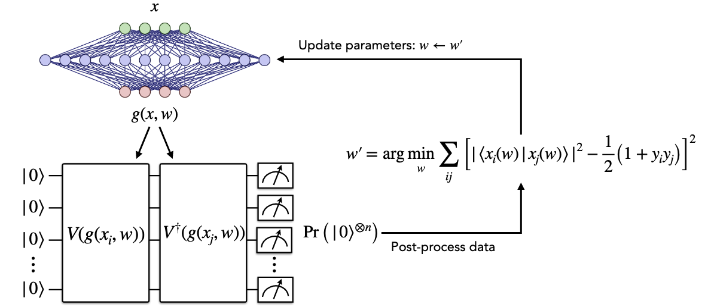

Phase 2:
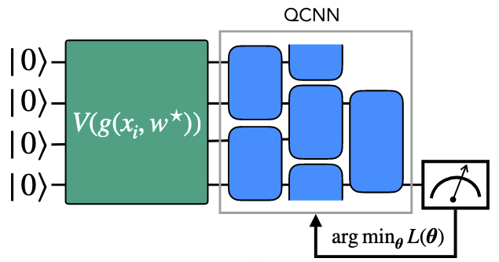

### Key takeaways from the paper

- The embedding creates a easier and more efficient classification, the choice lower-bounds the training error.

- The optimal encoded can not be fully determined classically efficiently.

The optimal encoded limits the expressivity of the model, and so the trainability.

- It still shows advantages in noisy simulations and on hardware.

## 3. Reproduction scope
### What was targeted

Figures 2 to 6 were reproduced.

### What was not targeted

Figures on other datasets than MNIST, noisy simulations and experiments on hardware.

### Success criteria

Figures are almost identical for gate-based models and follow the same trends for the MerLin-based implementation.

## 4. Original method

### Architecture
| Paper                         | Photonic reimplementation |
|------------------------------|---------------------------|
| 4 qubits, PCA 8              | n=2, m=6, PCA 8          |
| 8 qubits, PCA 8              | n=5, n=10, PCA 8         |
| 4 qubits, PCA 4              | n=2, m=6, PCA 4          |

**Notes:**  
The classical models are composed of 3 linear layers separated by the ReLU activation function.  
For the reimplementation, the quantum embedding takes more parameters than the gate-based model.

---

### Training setup
- **Paper:** MNIST dataset with digits 0 and 1  
- **Photonic reimplementation:** Same setup  
- **Notes:** Always using the ADAM optimiser (the paper uses Nesterov)

---

### Hyperparameters
- Learning rate: **0.01**  
- Distance used in training: **trace distance**

---

### Missing details / assumptions
- The number of epochs per step is not always clarified  
- It will be specified per figure in section 7.2.

To use later \begin{equation}
    \epsilon=\sqrt{\Tr{A^\dag A}}
\end{equation}


## 5. Reproduction implementation

### 5.1. Quantum implementation
#### How to run

- The results are stored in the results folder. Logs and figures will be saved in the outdir directory.

- The possible configs options are described in the cli.json file.

- At the papers level, to reproduce figure i between $\{2,3,4,5,6\}$ :
```
python3 implementation.py --paper nn_embedding --config configs/fig_i_exp.json
```
#### Run the tests

- At the papers level:
```
cd papers/AA_study
pytest -q
```

#### Deviations from paper:

- The quantum embedding parameters that are optimized are all the trainable ones in the MerLin QuantumLayer. There is a better control of the trainable parameters in the gate-based version.

## 6. Reproduction results

### Result status

Figures 2 through 6 are reproduced and a noise-free simulation with Pennylane. Some better or equivalent results are observed with the MerLin implementation.

All of the parameters values used are available in the table of section 7.2.

### 6.1. Figure 2

We want to compare NQE to a fixed embedding classifier.

This identifies the learning process of our NQE model of learning the 0 and 1 digits of the MNIST dataset. We analyze during the embedding training phase the trace distance between the average encoded states of each class. We also plot the loss of the models when training afterwards the classifier. We also indicate the final test accuracies of the model on the loss plot.

Here only the b and c sub-polts are reproduced since the other figure is in a noisy situation.

#### Paper’s result
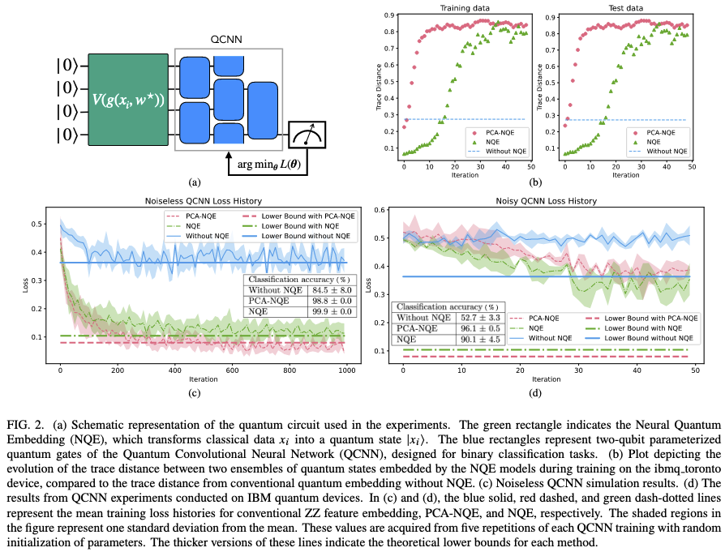

#### Gate-based reproduction
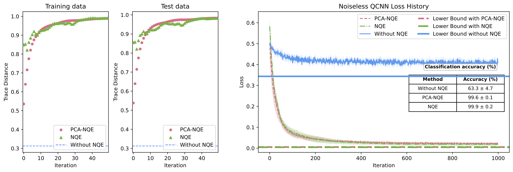

#### MerLin reproduction
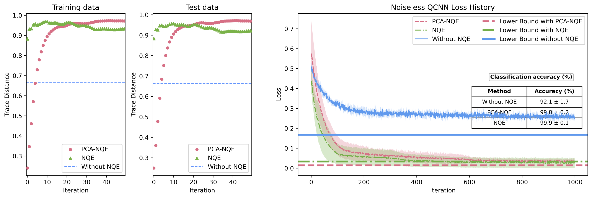

#### Discussion
We observe the same trends than the original paper for the gate and MerLin based reproductions. Although for MerLin implementations, the normal encoded states are more distant maybe explaining the fact the the NQE without PCA encodes better states at earlier iterations. The model without the embedding training also performs better than the gate-based reproduction who is way worse than also the NQE model from the paper. It is maybe explained by the fact that the loss does not reach the lower bound as much as it is shown on the paper.

In general, we conclude that this figure was reproduced for both implementations as the encoded states are clearly trained to be maximally distant with the NQE and that makes the loss barrier lower for these model who show better performance afterwards.


### 6.2. Figure 3

We want to compare NQE to a trainable embedding classifier.

Here we plot the loss of the training of the classifier. NQE models had their embedding trained before. We compare the model with VQC encoding circuits with a layer number of data reuploading.  We show that this method is not as efficient as NQE.

Here, only sub-plot a was reproduced as we analyze the 0 and 1 digits of the MNIST dataset on a noise-free simulator.

#### Paper’s result
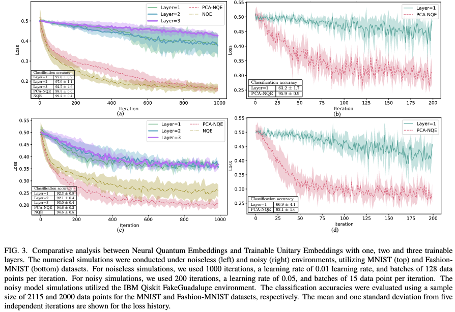

#### Gate-based reproduction
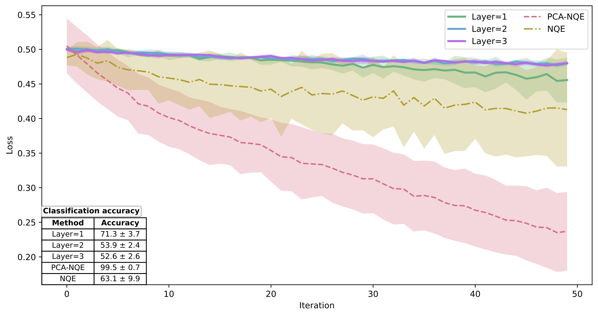

#### MerLin reproduction
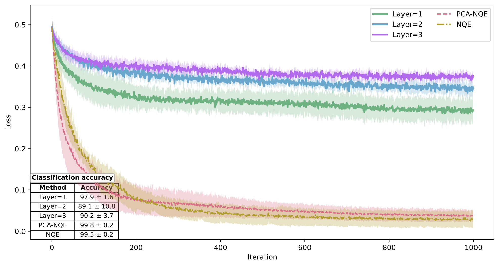

#### Discussion

We clearly observe the same trends as the paper for the reproductions showing a clear advantage for NQE methods against trainable encodings. Better accuracy across and faster loss decrease is observed just like with fixed embeddings in figure 2.


### 6.3. Figure 4
In QML, there is a tradeoff between expressivity and trainability. Indeed, a larger expressivity is needed for complex data, but, with the barren plateau phenomena, it makes the model difficult to train. With a optimal encoded, we can limit the effective dimension, simplify the problem and make the model easier to train. That is why a study of the effective dimension (a metric also used in classical ML) makes sense here. Here is the formula.
$$d_{LED}=\frac{2\log\bigg(\frac{1}{V_\epsilon}\int_{B_\epsilon (\theta^*)}\sqrt{\det(\mathbb{1}+\kappa_{n,\gamma}\overline{F}(\theta))}\mathrm{d} \theta\bigg)}{\log (\kappa_{n,\gamma})}$$

For more details about the parameters of the local effective dimension and the way it is computed here. Checkout section 4 in this [LaTeX document](https://www.overleaf.com/project/69a9c53955a12333eab55974). 

#### Paper’s result
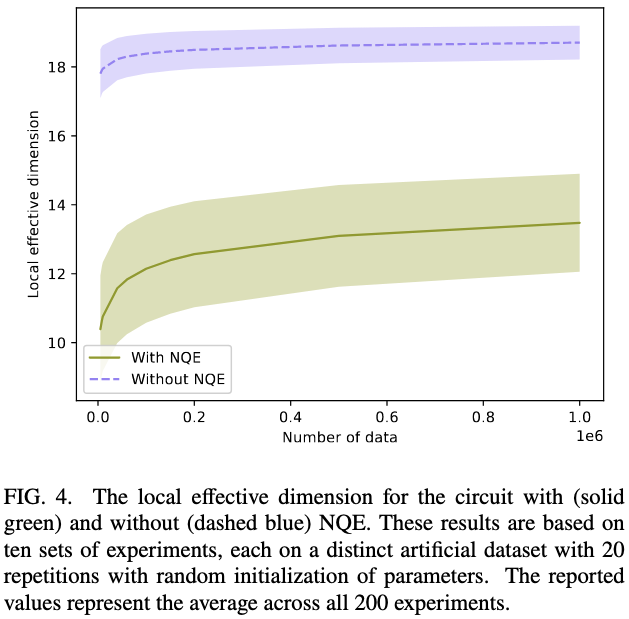

#### Gate-based reproduction
**Comming soon!**

#### MerLin reproduction
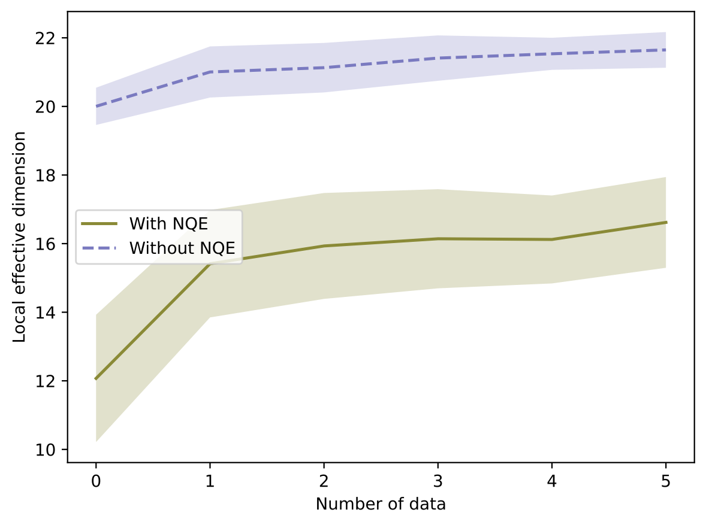

#### Discussion
Since the effective dimension was calculated with Qiskit in the paper and the translation from photonic to gate-based is not trivial, the metric was calculated explicitly in a non efficient manner. That is why  less synthetic datasets and repetitions were used to create this figure. However, we see the same trends as the paper figure. Although, the MerLin dimension is a little bigger across the figure. The difference between the methods is about the samen as the one shown in the paper.

### 6.4. Figure 5

We analyze the generalization error upper bound which is bounded by
$$\sqrt{\frac{\|W^*\|^2_F}{N}} $$

Where
$$\|W^*\|^2_F=\sum_i\sum_j \bigg[(K^Q+\lambda \mathbb{1})^{-1}K^Q(K^Q+\lambda \mathbb{1})^{-1}\bigg]_{i,j}y_iy_j$$

The $K^Q$ is the Kernel matrix, $\lambda$ is a regularization weight and $y$ are the labels associated to the points.

We try to show that the NQE model is better at generalization tasks. 

#### Paper’s result
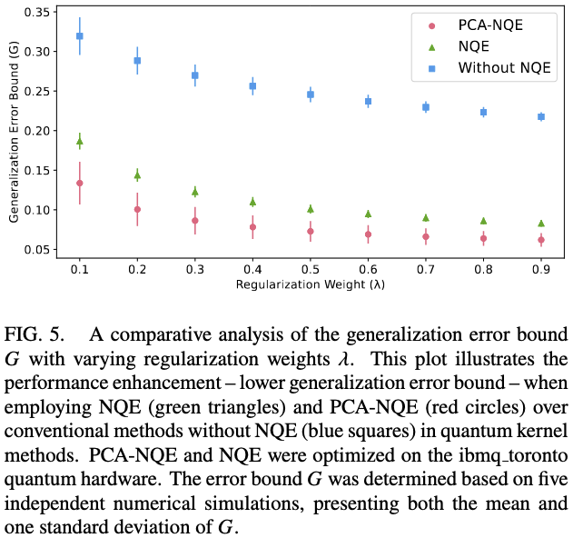

#### Gate-based reproduction
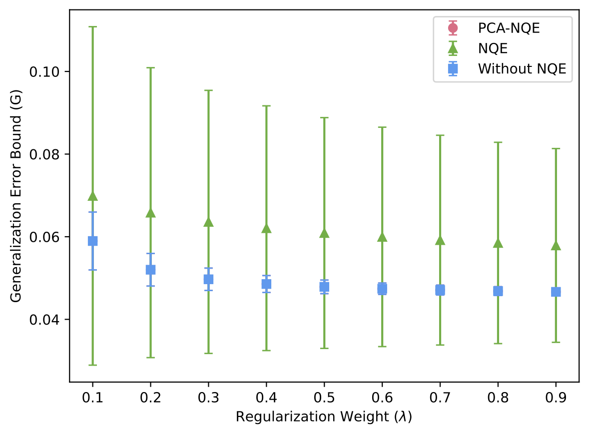

#### MerLin reproduction
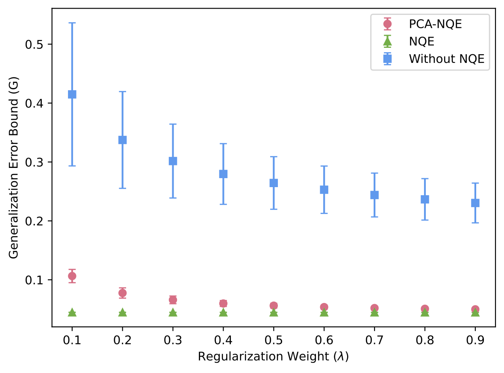

#### Discussion
It is important to note that the experiment from the paper was done on a noisy quantum computer which explains that our models performs better on perfect simulation. For the MerLin implementation we again see similar trends. Even though  the NQE is a little better than the PCA-NQE (contradictory to the paper), they are very close to one another. For the gate-based reproduction, the results are not reproduced and further investigation is necessary.


### 6.5. Figure 6

In the same optics as figure 4, we try to prove that the NEQ model limits the explored space of the model to improve the performance. We show it with the deviation from the 2-design metric:
$$\epsilon=\sqrt{\text{Tr}(A^\dag A)}$$
Where
$$A=\int_{Haar}(\ket{\psi}\bra{\psi})^{\otimes 2}\mathrm{d} \psi- \int_{\epsilon}(\ket{\phi}\bra{\phi})^{\otimes 2}\mathrm{d} \phi$$
Where ε is the space of the encoded states of the dataset.

If $\epsilon=0$, then the model considers the full Hilbert space for its calculations. This is what NQE is trying to avoid. We want to see a larger deviation with NQE than without it.

We also show that NQE methods have a better Kernel variance.  That is desired because less shots are required to estimate the matrix if the variance is big.

#### Paper’s result
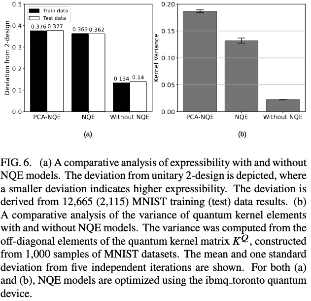

#### Gate-based reproduction
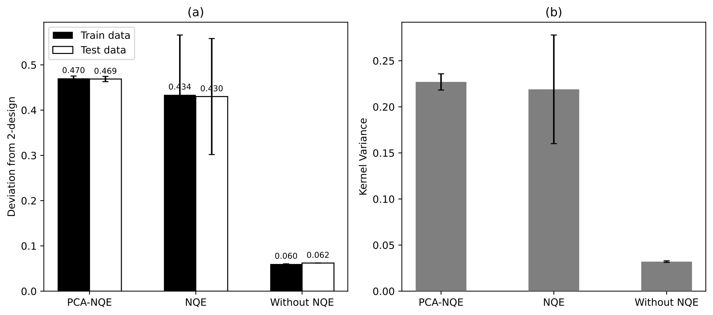

#### MerLin reproduction
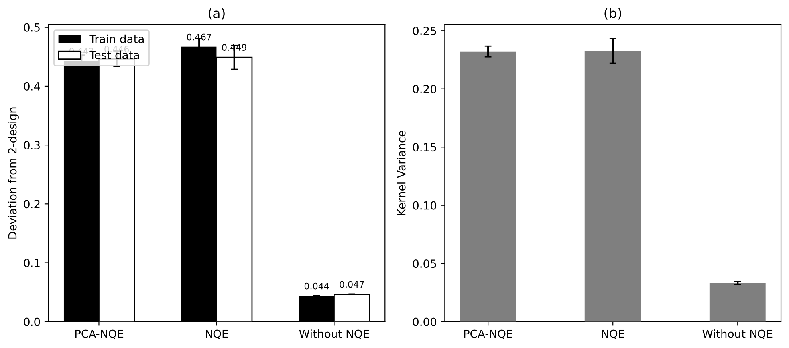

#### Discussion
We obtain the same conclusion as the figure from the paper we get a large deviation from the two design with the NQE methods that without it. We even get a better difference with the reproductions and even more in photonics. The formula uses an integral over the Haar distribution. For the photonic implementation, it was replaced by an integral over random states creates from torch. random. Since the spaces are not the same, it is difficult to compare the values directly. We still can conclude that the space explored by the embedding trained model is a smaller space that isn easier to train. We conclude the same thing with the kernel variance plot where it is bigger with NQE.

## 7. Photonic translation

#### Photonic objective

- Obtain the same or bette results than the gate-based model.

#### Proposed photonic formulation

- The encoding part of the interferometer has no input parameters and the classical model changes all of the trainable parameters.

#### Circuit / model

- The embedding and classifying circuits are a trainable universal unitary with the add_entangling_layer method of the CircuitBuilder.

### 7.1. MerLin feasibility

#### Can this be done in MerLin? 

- The entire pipeline was reproduced in MerLin and is even faster than the Pennylane implementation. 

### 7.2. Photonic implementation and results

#### What was implemented

The entire neural embedding pipeline with the scripts to reproduce all of the 5 figures.

#### Backend

Unbunched for all experiments.

#### Modes / photons / layers

See the table in section 4 to see these specs for the three different models.

#### Training settings:
<table>
<thead>
<tr>
<th>Metric / Figure</th>
<th>Original</th>
<th>Gate-based</th>
<th>Photonic</th>
</tr>
</thead>
<tbody>
<tr>
<td><b>2</b></td>
<td>
<pre>
batch_size = 25
num_epochs_training_embedding = 50
num_epochs_training_classifier = 1000
lr = 0.01
distance = "Trace"
samples_per_class = unknown
num_classes = 2
num_repetitions = 5
</pre>
<b>Model 1</b>
</td>
<td>
<pre>
batch_size = 100
num_epochs_training_embedding = 50
num_epochs_training_classifier = 1000
lr = 0.01
distance = "Trace"
samples_per_class = 150
num_classes = 2
num_repetitions = 5
</pre>
<b>Model 1</b>
</td>
<td>
<pre>
batch_size = 100
num_epochs_training_embedding = 50
num_epochs_training_classifier = 1000
lr = 0.01
distance = "Trace"
samples_per_class = 150
num_classes = 2
num_repetitions = 5
</pre>
<b>Model 1</b>
</td>
</tr>
<tr>
<td><b>3</b></td>
<td>
<pre>
batch_size = 128
num_epochs_training_embedding = unknown
num_epochs_training_classifier = 1000
lr = 0.01
distance = "Trace"
samples_per_class = 150
num_classes = 2
num_repetitions = 5
layers_to_test = [1, 2, 3]
</pre>
<b>Model 2</b>
</td>
<td>
<pre>
batch_size = 128
num_epochs_training_embedding = 1000
num_epochs_training_classifier = 1000
lr = 0.01
distance = "Trace"
samples_per_class = 150
num_classes = 2
num_repetitions = 5
layers_to_test = [1, 2, 3]
</pre>
<b>Model 2</b>
</td>
<td>
<pre>
batch_size = 128
num_epochs_training_embedding = 1000
num_epochs_training_classifier = 1000
lr = 0.01
distance = "Trace"
samples_per_class = 150
num_classes = 2
num_repetitions = 5
layers_to_test = [1, 2, 3]
</pre>
<b>Model 2</b>
</td>
</tr>
<tr>
<td><b>4</b></td>
<td>
<pre>
batch_size = 25
num_epochs_training_embedding = 100
lr = 0.01
distance = "Trace"
samples_per_datatset = 1e6
num_datasets = 10
num_repetitions_per_dataset = 20
epsilon = "Unknown"
num_samples_int = "Same as number of data"
</pre>
<b>Unknown</b>
</td>
<td>
<pre>
batch_size = 25
num_epochs_training_embedding = 100
lr = 0.01
distance = "Trace"
samples_per_datatset = 400
num_datasets = 3
num_repetitions_per_dataset = 3
epsilon = 0.01
num_samples_int = 100
</pre>
<b>Model 3</b>
</td>
<td>
<pre>
batch_size = 25
num_epochs_training_embedding = 100
lr = 0.01
distance = "Trace"
samples_per_datatset = 400
num_datasets = 3
num_repetitions_per_dataset = 3
epsilon = 0.01
num_samples_int = 100
</pre>
<b>Model 3</b>
</td>
</tr>
<tr>
<td><b>5</b></td>
<td>
<pre>
batch_size = 25
num_epochs_training_embedding = 1000
lr = 0.01
distance = "Trace"
samples_per_class = 500
num_repetitions = 5
weights = np.arange(0.1, 1, 0.1)
</pre>
<b>Model 3</b>
</td>
<td>
<pre>
batch_size = 100
num_epochs_training_embedding = 1000
lr = 0.01
distance = "Trace"
samples_per_class = 500
num_repetitions = 5
weights = np.arange(0.1, 1, 0.1)
</pre>
<b>Model 3</b>
</td>
<td>
<pre>
batch_size = 100
num_epochs_training_embedding = 1000
lr = 0.01
distance = "Trace"
samples_per_class = 500
num_repetitions = 5
weights = np.arange(0.1, 1, 0.1)
</pre>
<b>Model 3</b>
</td>
</tr>
<tr>
<td><b>6</b></td>
<td>
<pre>
batch_size = 25
num_epochs_training_embedding = 1000
lr = 0.01
distance = "trace"
samples_per_class = 500
num_repetitions = 5
</pre>
<b>Model 3</b>
</td>
<td>
<pre>
batch_size = 100
num_epochs_training_embedding = 200
lr = 0.01
distance = "Trace"
samples_per_class = 500
num_repetitions = 5
</pre>
<b>Model 3</b>
</td>
<td>
<pre>
batch_size = 100
num_epochs_training_embedding = 200
lr = 0.01
distance = "Trace"
samples_per_class = 500
num_repetitions = 5
</pre>
<b>Model 3</b>
</td>
</tr>
</tbody>
</table>


## 8. Conclusions

### What has been done

- Implemented the neural embedding pipeline in MerLin and improved the Pennylane one

- Reproduced figures 2 through 6 with Pennylane while showing similar or better results with MerLin.

### What we conclude

- A trainable encoding can drastically improve the performance of models and should be pursued in MerLin. The advantage is significant and the pipeline is efficient with the library.

### Recommendations
- > Pursue

## 9. Next steps

### What we could do next
- Ablation study to make sure that the classification is not entirely done by the classical model. 

- Extend the model for more than 2 classes.

- Find a more appropriate photonic distance for the embedding training that is easy to measure on hardware.

- Change the limitations of the encoding layer of the MerLin implementation to only consider input parameters to optimize and not only use trainable parameters.

### What we could not do next

- Test the algorithm on a noisy photonic hardware and simulation.

### Blockers

- Waiting on the new MerLin processor reform.