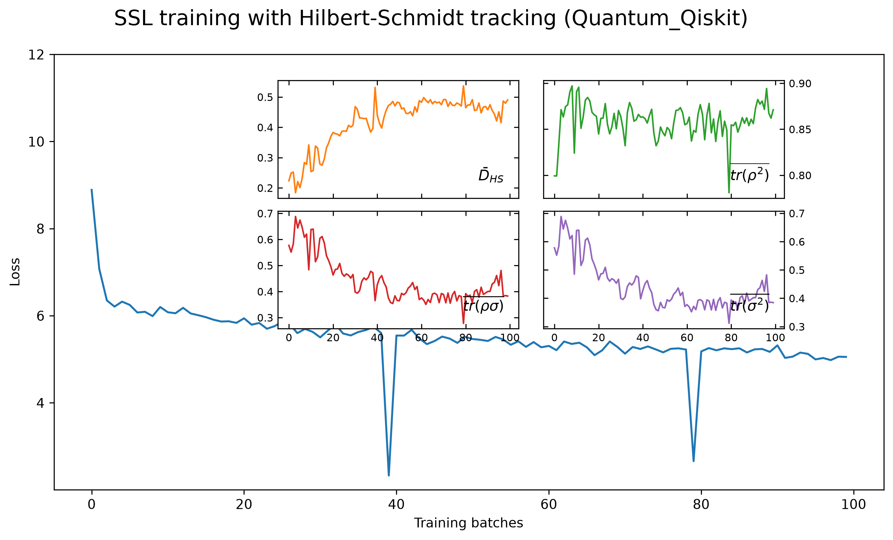
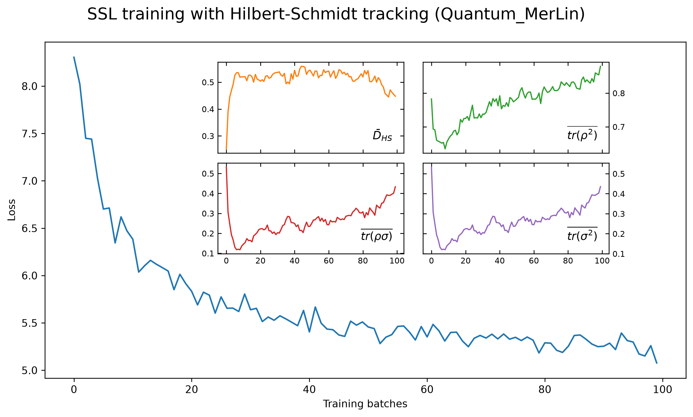

# Quantum Self-Supervised Learning (qSSL)

Reproduction of: “Quantum Self-Supervised Learning” (Jaderberg et al.), arXiv:2103.14653 — https://arxiv.org/abs/2103.14653

In this folder, you will find an implementation and evaluation of the core ideas from the paper. It supports three representation networks under the same SSL pipeline: a photonic (MerLin/Perceval) model, a gate-model (Qiskit) model, and a classical MLP baseline.

— Default backend in this repo: MerLin (photonic).

## What is reproduced
- Dataset and task: CIFAR-10, restricted to the first k labels (e.g., k=5).
- Training: Self-supervised pretraining with InfoNCE on two augmented views (SimCLR-style), followed by linear evaluation with a frozen encoder.
- Models (representation network):
  - MerLin photonic circuit (Perceval + Merlin quantum layer)
  - Qiskit parameterized circuit (via `qSSL/qnn`)
  - Classical MLP baseline
- Metrics: SSL losses over epochs and linear-probing accuracy curves; checkpoints and run metadata saved per experiment.

## Results reproduced

Pretrained models in `./results` give the following results:

| Number of epochs | Number of classes (CIFAR10) | Qiskit based | Classical SSL | Quantum SSL (`no_bunching=False`) | Quantum SSL (`no_bunching=True`) |
|------------------|-----------------------------|--------------|---------------|----------------------------------|---------------------------------|
| 2                | 5                           | 48.37 <br> ✅ OK <br> #32 <br> x0.08/x0.008 | 48.08 <br> 🚫 <br> #144 <br> x1/x1 | 8 modes: **49.22** <br> #184 <br> x0.97/x0.95 <br><br> 10 modes: 47.28 <br> #320 <br> x0.89/x0.88 <br><br> 12 modes: 46.46 <br> #488 <br> x0.83/x0.65 | 8 modes: 45.58 <br> #184 <br> x0.97/x0.97 <br><br> 10 modes: 45.58 <br> #320 <br> x0.97/x0.93 <br><br> 12 modes: 45.76 <br> #488 <br> x0.94/x0.82 |
| 5                | 5                           | 47.88  | 49.04 | 8 modes: 49.9 <br><br> 10 modes: **51.12** <br><br> 12 modes: 50.64 | 8 modes: 49.3 <br><br> 10 modes: 48.86 <br><br> 12 modes: **51.74** |

Legend:
- #number of parameters
- x ... speed-up (relative to classical baseline)

Overall, we reproduced the results highlighted in the paper and we have a photonic implementantion of it, using MerLin, that is faster and more accurate (but has more trainable parameters).

## Project structure
- `lib/runner.py` — runtime entry point consumed by the repo-level runner
- `lib/` — core library modules used by scripts
  - `data_utils.py` — datasets, transforms (SSL and linear eval)
  - `model.py` — backbone, representation networks (MerLin/Qiskit/Classical), projection head
  - `training_utils.py` — InfoNCE, training loops, metrics and results I/O
  - `defaults.py` — helper to expose `configs/defaults.json` to notebooks/tests
- `configs/` — default configs + CLI schema consumed by the shared runner
  - `defaults.json`, `cli.json`
- Other
  - `utils/linear_probing.py` — evaluate frozen features with a linear head. Pretrained models live under `outdir/`
  - `requirements.txt` — Python dependencies
  - `utils/`, `tests/` — placeholders following the template

## Install
```bash
python -m venv ssl-venv
source ssl-venv/bin/activate
pip install -r requirements.txt
```

## Quick start
Run with the default MerLin settings from the repository root:
```bash
python implementation.py --paper qSSL --config qSSL/configs/defaults.json
```
- Or from inside the project directory:
```bash
cd qSSL
python ../implementation.py --paper qSSL --config configs/defaults.json
```
- CLI overrides (mix and match as needed):
```bash
# MerLin (photonic)
python implementation.py --paper qSSL --merlin --classes 5 --modes 10 --epochs 2 --batch_size 256 --ckpt-step 1

# Qiskit (gate-model)
python implementation.py --paper qSSL --qiskit --classes 5 --epochs 2 --batch_size 256 --ckpt-step 1

# Classical baseline
python implementation.py --paper qSSL --classical --classes 5 --epochs 2 --batch_size 256 --ckpt-step 1
```
Need to see every toggle first? Run `python implementation.py --paper qSSL --help` for the auto-generated CLI, including dataset paths, backend switches, and visualization flags.

Data root: CIFAR10 downloads under `<DATA_DIR>/qSSL` (default `DATA_DIR` env or `<repo>/data`). Override the base root with `--datadir` if needed; the paper subfolder is added automatically.

## Configuration (JSON)
See `configs/defaults.json` (overrides are described in `cli.json`). Key fields:
- `dataset`: `root`, `classes`, `batch_size`
- `model`: `backend` (`merlin` | `qiskit` | `classical`), `width`, `loss_dim`, `batch_norm`, `temperature`
- Qiskit-specific: `layers`, `encoding`, `q_ansatz`, `q_sweeps`, `activation`, `shots`, `q_backend`
- MerLin-specific: `modes`, `no_bunching`
- `training`: `epochs`, `ckpt_step`, `le_epochs`

You can combine `--config` with CLI overrides. The runner resolves the final configuration and saves it to the results directory (`args.json`).

## Qiskit Hilbert-Schmidt results

The Qiskit Hilbert-Schmidt experiment reproduces the same results as Fig. 4
in the original paper: the SSL loss decreases during training while the mean
Hilbert-Schmidt distance between positive and negative states increases.



### Regenerate the Hilbert-Schmidt plot from saved JSON

When a run already contains `hilbert_schmidt_metrics.json`, the figure can be
regenerated without retraining the model. The JSON stores the loss and all four
Hilbert-Schmidt quantities for every tracked batch. From the repository root,
run:

```bash
python papers/qSSL/utils/plot_hilbert_schmidt.py \
  --metrics papers/qSSL/outdir/run_20260819-004212/hilbert_schmidt_metrics.json \
  --output papers/qSSL/outdir/run_20260819-004212/hilbert_schmidt_tracking.png \
  --backend qiskit
```

Use `--backend merlin` for a MerLin metrics file. The `--output` path may point
to any PNG location; using the run directory replaces that run's existing
figure. The plotting utility is `utils/plot_hilbert_schmidt.py`, and it uses
the same layout as the training-generated figure.

## MerLin Hilbert-Schmidt experiment

The MerLin experiment extends SSL training with the Hilbert-Schmidt analysis
shown below. It is the photonic counterpart of the paper's state-space
analysis: MerLin exposes photon-count probabilities, rather than complex
amplitudes, so this implementation uses a probability-space surrogate.



For a batch of size `B`, the two augmented views are kept in the order
`[view_1[0:B], view_2[0:B]]`. Each MerLin output is a normalized probability
vector `p`. The implementation treats `p` as the diagonal of a density matrix,
then computes the following vectors for each positive pair `i`:

```text
rho_i   = (p_i_view1 + p_i_view2) / 2
sigma_i = (sum of all batch probability vectors - p_i_view1 - p_i_view2) / (2B - 2)
```

Because these density matrices are diagonal, their Hilbert-Schmidt quantities
reduce to dot products:

```text
tr(rho_i^2), tr(sigma_i^2), tr(rho_i sigma_i),
D_HS(rho_i, sigma_i) = ||rho_i - sigma_i||_2^2
```

The reported values are averages over the batch. This is an exact
Hilbert-Schmidt distance for the diagonal density-matrix representation, but
it does not include optical phases or coherences that would be present in a
full complex state-vector calculation.

Run the ready-made MerLin experiment from the repository root:

```bash
python implementation.py --paper qSSL --config qSSL/configs/merlin_dhs.json
```

The config uses two CIFAR-10 classes, 10 photonic modes, three SSL epochs, and
tracks the metrics every batch. Override the data location or sampling
frequency when needed:

```bash
python implementation.py --paper qSSL \
  --config qSSL/configs/merlin_dhs.json \
  --datadir /path/to/data --dhs-freq 10
```

The run directory contains `hilbert_schmidt_metrics.json` with the per-batch
metrics and `hilbert_schmidt_tracking.png` with the generated plot, alongside
the normal qSSL checkpoints and training summaries. The calculation is
implemented by `compute_batch_probability_hilbert_schmidt_metrics` in
`lib/training_utils.py` and is enabled by `model.save_dhs: true` in
`configs/merlin_dhs.json`.

## Pretrained checkpoints
- Reference weights are hosted on Hugging Face under `Quandela/ReproducedPapersQML/qSSL`. Each run directory mirrors the layout produced locally (checkpoints plus `args.json`).
- `qSSL/utils/linear_probing.py` defaults to the MerLin checkpoint at `merlin/20250827_181840/model-cl-5-epoch-5.pth`. When `--pretrained` is a repo-relative path (or a full HF URL) the script automatically downloads the `.pth` file and matching `args.json`.
- Use `--hf-repo`, `--hf-prefix`, and `--hf-revision` if you need to point to another Hugging Face namespace or branch (defaults are set to `Quandela/ReproducedPapersQML/qSSL`).
- Example:  
  ```bash
  python qSSL/utils/linear_probing.py \
    --pretrained merlin/20250827_181840/model-cl-5-epoch-5.pth \
    --hf-repo Quandela/ReproducedPapersQML --hf-prefix qSSL --hf-revision main
  ```

## Training pipeline (pedagogical overview)


1) SSL pretraining
- Input: for each image, generate two strong augmentations (query/key) using `TwoCropsTransform`.
- Backbone: ResNet18 (final FC replaced by Identity).
- Compression: Linear layer to `width` (quantum-friendly size).
- Representation network (choose one): MerLin, Qiskit, or Classical MLP.
- Projection head: MLP to `loss_dim` with BN + ReLU.
- Loss: InfoNCE (temperature τ) on the two views.

2) Linear evaluation
- Freeze backbone + compression + representation.
- Train a linear classifier on top using lightly augmented train data and minimal val transforms.
- Report accuracy curves and final/best validation accuracy.


## Models explained

- MerLin (default)
  - Photonic circuit built with Perceval: two trainable interferometers around a phase-encoding layer.
  - Features are Sigmoid-normalized and scaled by 1/π to map into phase parameters.
  - Parameters: `modes` (number of photonic modes), `no_bunching` (photon statistics), `width` (input feature size to the circuit), plus trainable circuit phases.

- Qiskit (gate-model)
  - Representation network `QNet` with `n_qubits = width`.
  - Configurable `encoding`, `q_ansatz`, `layers`, `q_sweeps`, `activation`, `shots`, and `q_backend` (e.g., `qasm_simulator`).

- Classical baseline
  - Simple MLP with `args.layers` repetitions of Linear(width, width) + LeakyReLU.

## Outputs and checkpoints
Each invocation writes to `<outdir>/run_YYYYMMDD-HHMMSS/` (default base `outdir/` inside `qSSL/`):
- `config_snapshot.json` — final config after merging defaults, CLI, and extra overrides
- `args.json` — lightweight namespace serialized for backward-compatible tools (e.g., `utils/linear_probing.py`)
- `run.log` — streaming logs from the shared runtime
- `training_metrics.json` — SSL and linear-eval losses/accuracies over epochs
- `experiment_summary.json` — consolidated summary with final and best val accuracy
- `model-cl-<classes>-epoch-<n>.pth` — checkpoints saved every `ckpt_step` epochs

## Linear probing only
Evaluate pretrained encoders with a frozen representation and train a linear head:
```bash
# Default run (downloads the reference Hugging Face checkpoint)
python qSSL/utils/linear_probing.py

# Evaluate all checkpoints from a local run directory
python qSSL/utils/linear_probing.py --pretrained ./outdir/run_<timestamp>/

# Evaluate a specific local checkpoint file
python qSSL/utils/linear_probing.py --pretrained ./outdir/run_<timestamp>/model-cl-5-epoch-5.pth

# Evaluate any other Hugging Face checkpoint via repo-relative path
python qSSL/utils/linear_probing.py --pretrained merlin/<run_id>/model-cl-5-epoch-5.pth
```

## Acknowledgments
- Original paper: Quantum Self-Supervised Learning — https://arxiv.org/abs/2103.14653
- Portions of the Qiskit pipeline and general approach are inspired by the original authors’ resources where relevant.

## Troubleshooting
- For Qiskit, ensure `qiskit-aer` is installed and the selected backend (e.g., `qasm_simulator`) is available.

## Tests:
Tests are in the ./tests folder and contain tests to validate one forward pass in the classical, MerLin and Qiskit models as well as a test on the InfoNCE loss. Once the environment is installed, you can run them
```
python3 -m pytest tests/
```
