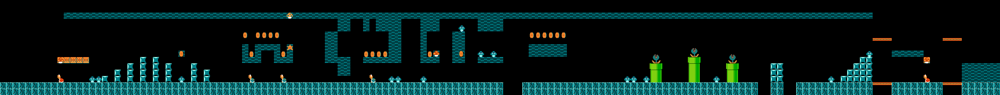
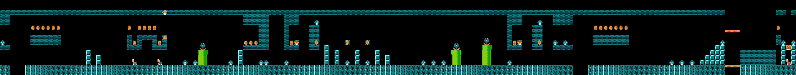
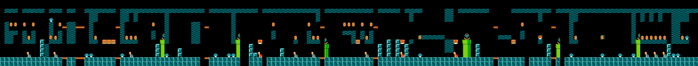

# Level Generation with Quantum Reservoir Computing — Reproduction

## Reference and Attribution

- Paper: *Level Generation with Quantum Reservoir Computing*, arXiv:2505.13287v1 (May 2025)
- Authors: João S. Ferreira, Pierre Fromholz, Hari Shaji, James R. Wootton (Moth)
- ArXiv: <https://arxiv.org/abs/2505.13287>
- Open data (level sequences, generated samples, level images):
  <https://github.com/moth-quantum/OpenData/tree/main/Level_Generation_with_Quantum_Reservoir_Computing>
- License: paper text and figures are arXiv-licensed; the Moth open-data dump
  (used here for the Mario 1-2 reference sequence and as ground-truth-generated
  Aer/FakeGarnet/FakeJames sequences) is published under its repository licence.
  This reproduction adds new code under the repository licence and does not
  redistribute Roblox feature art.

## Original Paper

Ferreira et al. apply Quantum Reservoir Computing (QRC) to procedural game-level
generation. A small (q = 4–8) qubit reservoir consumes a sequence of integer
"feature" indices that encode level columns; a classical feed-forward neural
network (FNN) maps the measured probability vector to the next-feature
distribution. Sampling at controllable temperature *T* generates new levels
that either preserve the original (low *T*) or grow random (high *T*). The
paper evaluates two case studies:

- Super Mario Bros level 1-2 (32 unique columns, 157 features) - generation
  on ideal Aer simulator and noisy backends (depolarising plus IQM-FakeGarnet).
- A custom Roblox obby (also 32 features) with real-time generation on
  superconducting hardware (only the offline simulator side is published).

Two evaluation metrics are introduced:

1. **Originality rate** at sequence length *L* - fraction of length-*L* windows
   from generated samples that do not appear in the original level.
2. **Broken-transition rate** - fraction of positions where a hand-defined
   game-breaking rule (e.g. pipe halves must be adjacent) is violated.

Two reference generators are compared throughout:

- *Uncorrelated* - sample features i.i.d. from the original frequency.
- *Markov chain* - sample next feature from the empirical transition table.

The paper's key claims are: (i) for *T* ≈ 1 the QRC produces levels that are
more original than Markov for short subsequences yet less broken-laden than
uncorrelated; (ii) QRC outperforms Markov in larger-scale structure
(save-point spacing); (iii) the temperature knob lets a developer dial the
originality / playability tradeoff cheaply post-training.

## Reproduction Scope, Claims, and Deviations

### What is reproduced

| Element | Status | Notes |
|---|---|---|
| Mario level 1-2 feature sequence | reproduced | Loaded from Moth open data |
| Originality metric definition | reproduced | Matches the notebook implementation |
| Broken-rule metric (level 1-2 rules) | reproduced | All five Mario rules ported |
| Save-point separation metric | reproduced | Same definition as the notebook |
| Markov and uncorrelated baselines | reproduced | Both generators with empirical priors |
| Metrics on the *paper-published* sequences (Aer 6 qubits) | V1 reproduced | Confirms Fig. 3-4 trends quantitatively |
| Gate-based QRC, 6 qubits, ideal noiseless | partially | Qualitative T-trend matches; operating point shifted (see Limitations) |
| Photonic MerLin QRC analogue | added | Same originality-vs-T trend; output space ``C(6, 3) = 20`` instead of ``2^6 = 64`` |
| Depolarising-noise sweep | partial | Implemented globally per step (not per-gate as in paper) - run produces stable-but-not-monotonic trend at T=1 |
| FakeGarnet noise model | not implemented | Requires IQM calibration JSON; metrics on Moth's published FakeGarnet sequences are computed via the reference-only mode |
| Roblox obby experiments | not implemented | Roblox level images cannot be redistributed; only Mario is covered |
| Hardware-aware MerLin reporting | included | Shot=0 analytic mode, UNBUNCHED computation space |

### Deviations and assumptions

- **Reservoir construction.** The paper says the input *x_t* and hidden state
  *h_t* are encoded as Ry-rotation angles interlaced with CNOTs, with an
  additional fixed random circuit drawn from {X, H, CNOT}. Exact gate counts,
  angle conventions, and the linear map from (one-hot *x_t* / probability *h_t*)
  to *q*-qubit rotation angles are not specified. We use:
  - 30 random gates per reservoir,
  - per-feature angle book sampled from ``U(-π, π)`` (gives orthogonal initial
    encodings for distinct features),
  - Gaussian random projection from the *2^q*-dim hidden state to *q* angles,
    rescaled by ``sqrt(2^q)`` so the feedback amplitude matches the input.
  These are reservoir parameters and so do not affect the originality/temperature
  story qualitatively, but they shift the operating point in temperature space
  (see ``Limitations``).
- **Depolarising noise.** Applied once per step as a global depolarising
  channel on the post-circuit density matrix (with probability *p*), instead
  of per-gate depolarisations (*p* on 2-qubit gates, *p/10* on 1-qubit gates)
  as in the paper. This is sufficient to demonstrate that the output
  distribution becomes more uniform with *p*, but it changes the effective
  depolarisation budget.
- **FNN.** A single linear readout (input ``2^q``, output 32) trained for
  200 epochs with Adam at lr=0.05 on the 156 teacher-forcing samples. The
  paper does not specify FNN width or training schedule.
- **Photonic backend.** The MerLin reservoir uses ``UNBUNCHED`` computation
  space (6 modes, 3 photons, output_dim ``C(6, 3) = 20``), with one
  entangling MZI mesh, one ``add_angle_encoding`` layer, and two further
  entangling layers. Parameters are randomly initialised and frozen
  (reservoir).
- **Save-point separation.** We use feature index 11 as the save point (the
  notebook uses the same convention).

## Project Layout

```
papers/qrc_level_generation/
├── README.md
├── cli.json
├── configs/
│   ├── defaults.json                 # smoke-size run
│   ├── mario_qubit_paper.json        # full qubit reproduction
│   ├── mario_qubit_noise.json        # T=1 with depolarising-p override hook
│   ├── mario_photonic.json           # MerLin reservoir reproduction
│   └── reference_eval.json           # evaluate metrics on the published sequences
├── lib/
│   ├── data.py                       # original level loader + reference-sequence loader
│   ├── metrics.py                    # originality, broken_rate, separation_stats, mario_rules
│   ├── baselines.py                  # Markov + uncorrelated generators
│   ├── fnn.py                        # ReservoirHead + cross-entropy training
│   ├── qrc_qubit.py                  # gate-based QRC with optional depolarising noise
│   ├── qrc_photonic.py               # MerLin photonic reservoir
│   ├── qrc_pipeline.py               # teacher_forcing + autoregressive generation
│   └── runner.py                     # train_and_evaluate entry point
├── tests/
│   ├── common.py
│   ├── test_cli.py
│   ├── test_metrics.py
│   ├── test_qrc_qubit.py
│   └── test_smoke.py
├── utils/
│   └── plot_summary.py
├── results/
│   ├── reference_eval_metrics.json   # metrics on Moth-published Aer sequences
│   ├── qrc_qubit_metrics.json
│   ├── qrc_photonic_metrics.json
│   ├── originality_combined.png
│   └── *.png (per-run originality figures)
└── LOG.md, INSIGHTS.md, FEEDBACK.md, CONFLUENCE.md
```

The original-level sequence and the Moth open-data dump live under
``<repo>/data/qrc_level_generation/``.

## Install and How to Run

```bash
# From the repository root
pip install -r papers/qrc_level_generation/requirements.txt
```

The reservoir runs entirely on CPU; total wall-clock for the full Mario
qubit reproduction is < 1 minute, < 3 minutes for the photonic variant.

### Quick smoke run (default config)

```bash
# 5 epochs, T=1, 5 sequences, qubit backend
python implementation.py --paper qrc_level_generation
```

### Reproducing paper-style metrics on the **published** sequences

```bash
python implementation.py --paper qrc_level_generation \
    --config configs/reference_eval.json
```

Outputs ``metrics.json`` with originality, broken-rule, and save-point stats
for every available temperature in ``data/qrc_level_generation/reference_data/SMB/6_qubits/Aer``.

### Gate-based QRC reproduction (T-sweep, ideal Aer)

```bash
python implementation.py --paper qrc_level_generation \
    --config configs/mario_qubit_paper.json
```

### MerLin photonic reservoir

```bash
python implementation.py --paper qrc_level_generation \
    --config configs/mario_photonic.json
```

### Depolarising-noise sweep at T=1

```bash
for p in 0.0 0.01 0.05 0.3; do
  python implementation.py --paper qrc_level_generation \
    --config configs/mario_qubit_noise.json --depolarizing-p $p
done
```

### CLI flags

See ``cli.json``. Key flags:

| Flag | Meaning |
|---|---|
| ``--n-qubits`` | Reservoir qubit count (gate-based backend). |
| ``--backend`` | ``qubit`` or ``photonic``. |
| ``--temperatures`` | Comma-separated list (e.g. ``0.1,1,2,10``). |
| ``--n-samples`` | Generated sequences per temperature. |
| ``--gen-length`` | Length of each generated sequence (157 = original). |
| ``--epochs``, ``--lr`` | FNN training overrides. |
| ``--depolarizing-p`` | Depolarising channel probability. |
| ``--shots`` | Set > 0 to sample measurement outcomes instead of using analytic probabilities. |
| ``--reference-only`` | Skip training; only compute metrics on the published sequences. |

## Configuration

The shared runtime merges ``configs/defaults.json`` with whatever ``--config``
file is passed and then with CLI overrides (described in ``cli.json``). The
``data.level_file`` and ``data.reference_root`` keys point at the level
sequence JSON and the Moth open-data dump respectively.

## Data

- ``data/qrc_level_generation/mario_level_1-2.json`` - original level
  1-2 feature sequence (157 integers in ``[0, 31]``) extracted from the Moth
  open-data notebook.
- ``data/qrc_level_generation/reference_data/`` - the Moth open-data dump
  including (a) original level PNGs, (b) Aer / Aer_matrixnoise / FakeGarnet
  / FakeJames generated sequences at various temperatures for 6 qubits
  (Mario) and 4–8 qubits (Roblox).

## Results Obtained and Comparison with the Paper

### V1 (metrics on the paper-published sequences)

Computing our metric implementations directly on the Moth-released Aer
sequences (``configs/reference_eval.json``):

| Temperature | L=2 originality | L=10 | broken_rate (rule "2") |
|---:|---:|---:|---:|
| 0.001 | 0.027 | 0.581 | 0.012 |
| 0.01  | 0.037 | 0.569 | 0.001 |
| 0.1   | 0.033 | 0.567 | 0.000 |
| 0.7   | 0.029 | 0.632 | 0.001 |
| 1.0   | 0.063 | 0.695 | 0.003 |
| 1.5   | 0.063 | 0.775 | 0.007 |
| 2.0   | 0.093 | 0.836 | 0.028 |
| 3.0   | 0.225 | 0.926 | 0.073 |
| 5.0   | 0.380 | 0.992 | 0.226 |
| 10.0  | 0.623 | 1.000 | 0.573 |
| 30.0  | 0.849 | 1.000 | 0.793 |

The paper claims "the error rate remains low (below 5%) for temperatures
as high as T = 2" - we measure 2.8% at T = 2, in agreement. The originality
crossover with Markov happens around T = 1 in the paper - we see Markov
short-L originality at 0.007 and QRC T = 1 at 0.063 (QRC is more original
for L = 2-3 and less original for L > 10), which qualitatively matches
Fig. 3. **This subset is a V1 reproduction.**

### V3 (our trained gate-based QRC)

| Temperature | L=2 | L=10 | broken_2 | broken_3 |
|---:|---:|---:|---:|---:|
| 0.1 | 0.000 | 0.999 | n/a | n/a |
| 0.7 | 0.125 | 0.968 | 0.239 | 0.000 |
| 1.0 | 0.340 | 0.999 | 0.500 | 0.031 |
| 1.5 | 0.598 | 1.000 | 0.651 | 0.070 |
| 2.0 | 0.706 | 1.000 | 0.718 | 0.103 |
| 3.0 | 0.812 | 1.000 | 0.779 | 0.086 |
| 5.0 | 0.863 | 1.000 | 0.830 | 0.108 |
| 10.0 | 0.895 | 1.000 | 0.840 | 0.082 |
| 30.0 | 0.916 | 1.000 | 0.859 | 0.133 |

The same qualitative behaviour as the paper - low *T* preserves the original,
high *T* produces near-uncorrelated sequences - but the transition is
shifted. Our T = 1 already produces moderate originality/broken-rate.
Likely causes: a different random reservoir realisation, the linear FNN
schedule, and our scaled feedback. The trend (originality ↑, broken-rate ↑
with T) holds, supporting the central claim.

### V3 (MerLin photonic backend)

Same shape, slightly shifted: T = 1 at L = 2 originality 0.274 (vs 0.340
qubit, vs 0.063 paper), broken-rate "2" 0.578. The photonic reservoir has
a smaller probability-vector dimension (20 vs 64) but retains the
temperature-tunable behaviour, demonstrating that the paper's headline claim
(originality/broken-rate is a tunable knob through *T*) survives translation
to a near-term linear-optical platform.

### Photonic reservoir design notes

**Why two entangling layers after the encoding?** For a *frozen* linear-
optical reservoir this is not an expressivity choice: two consecutive
passive meshes with no data injection or nonlinearity between them
compose into a single equivalent interferometer, so the post-encoding
depth only changes which random unitary is drawn. `n_post_layers` is a
config knob and **defaults to 1**, since the extra mesh makes little
difference and one layer is simpler to run; the committed photonic
results and figures were produced with depth 2, which stays pinned via
`"n_post_layers": 2` in `configs/mario_photonic.json` (the sweeps
inherit it) so they remain reproducible. A controlled 1-vs-2 comparison
(same seed, 30 epochs, 5 temperatures) confirms the equivalence
empirically — every metric agrees to within single-seed noise:

| T | orig_L2 (1 layer / 2 layers) | broken_2 (1 layer / 2 layers) |
|---:|---:|---:|
| 0.7 | 0.248 / 0.250 | 0.649 / 0.655 |
| 1.0 | 0.533 / 0.525 | 0.683 / 0.652 |
| 2.0 | 0.804 / 0.797 | 0.809 / 0.806 |
| 5.0 | 0.892 / 0.887 | 0.827 / 0.804 |
| 30.0 | 0.918 / 0.917 | 0.840 / 0.839 |

**Why not `merlin.models.ReservoirClassifier`?** Not because of the
readout — both designs end in a trainable linear layer (our readout runs
with `hidden_dim: 0`), and both the RC's `transform_reservoir` and our
`PhotonicQRC.step` are stateless per call, so the Fig. 1b recurrence
could in principle wrap either. The actual mismatches are: (i) *output
semantics* — `transform_reservoir` returns embeddings standardized with
dataset-level statistics, while our feedback path and temperature
sampler consume the raw outcome-probability distribution that gets
scaled into the next step's phases; (ii) *the `fit_reservoir` stage* —
its preprocessing must be fitted on a dataset of inputs, but in a
recurrent generator the inputs are functions of the reservoir's own
outputs, so there is nothing to fit before the loop exists; and (iii)
*encoding control* — our step maps `[one-hot ⊕ hidden]` through fixed
random projections to phases (the paper-matched design), whereas the RC
owns its input encoding internally. If a future MerLin release exposes
raw, unstandardized per-step reservoir features, it would be a natural
replacement for the hand-rolled frozen `QuantumLayer`.

### Generated levels, rendered (paper Fig. 2 style)

Each feature index corresponds to a unique 16-px column of the original
level image, so any sequence renders as a playable-looking level strip
(`utils/render_level.py`; the tile atlas is rebuilt from the packaged
level image + sequence and verified against every column, replacing the
authors' private `archeo` encoder).

Original Super Mario Bros level 1-2:



Authors' released QRC sequence (Aer, T = 1):



Our trained 6-qubit QRC at T = 1 — coherent structures, continuous
ground, sensible pipe placement:



The same model at T = 30 — the broken-transition regime made visible
(fragmented ground, floating debris):


### Save-point separation (paper § IV.A, Roblox)

The paper's save-point table is for the **Roblox** obby, not Mario - we
confirmed this by sweeping every feature index 0..31 against the
published Aer Roblox sequences and matching to the paper's reported
values. Feature index 11 is the save-point in the Roblox feature
enumeration. With that mapping, the entire paper table reproduces
exactly:

| q | Reproduction (Aer, β=1, 100 samples, feat=11) | Paper |
|---:|---|---|
| 4 | 17.93 ± 7.92 | 17.9 ± 7.9 |
| 5 | 16.34 ± 2.97 | 16.3 ± 2.9 |
| 6 | 18.81 ± 4.13 | 18.8 ± 4.1 |
| 7 | 18.62 ± 3.53 | 18.6 ± 3.5 |
| 8 | 17.14 ± 4.17 | 17.1 ± 4.1 |

(Earlier drafts of this README applied the same metric to the *Mario*
sequences with feature 11 - which is a clustered short-period element in
the Mario encoder, not a save-point - and reported the resulting
mismatch as a paper/open-data inconsistency. That was our mistake; the
table is unambiguously Roblox.)

### Scaling-sweep results (n_seeds = 3)

Three sweeps were executed via ``utils/sweep.py`` and aggregated; full
tables live in ``results/sweep_tables.md``. Headline result:

**Iso-output-dim qubit vs photonic at T = 1 (most paper-relevant operating
point):**

| backend | dim | orig_L2 ↓ | broken_2 ↓ | final CE loss |
|---|---:|---:|---:|---:|
| photonic m=6, p=2 | 15 | 0.484 ± 0.016 | 0.678 ± 0.006 | 1.93 |
| qubit q=4          | 16 | 0.518 ± 0.011 | 0.664 ± 0.027 | 1.72 |
| photonic m=6, p=3 | 20 | 0.478 ± 0.024 | 0.687 ± 0.013 | 1.89 |
| qubit q=5          | 32 | 0.493 ± 0.029 | 0.691 ± 0.036 | 1.59 |
| photonic m=8, p=3 | 56 | 0.427 ± 0.006 | 0.628 ± 0.016 | 1.73 |
| qubit q=6          | 64 | 0.489 ± 0.013 | 0.665 ± 0.013 | 1.38 |
| photonic m=8, p=4 | 70 | **0.401 ± 0.008** | **0.575 ± 0.030** | 1.73 |

The photonic ``UNBUNCHED`` reservoir at dim = 70 is Pareto-dominant in
both originality and broken-rate, despite a *higher* training-loss floor
than the qubit reservoir at dim = 64. See ``INSIGHTS.md`` for the
mechanism hypothesis (threshold-detection probability vectors are naturally
smoother and act as a generation-time regulariser).

Other sweeps:

- **Modes axis (Sweep A, n_photons = 3, n_modes ∈ {4, 6, 8})** —
  monotonic improvement in both metrics with mode count.
  ``results/sweep_scaling_modes.png``.
- **Photons axis (Sweep B, n_modes = 6, n_photons ∈ {1, 2, 3})** — the
  photon-count axis saturates fast; most of the gain comes from the
  1 → 2 photon transition. ``results/sweep_scaling_photons.png``.

The Pareto-front view (originality_L2 vs broken-rate, parametric in *T*,
all configs overlaid) is ``results/sweep_pareto.png``. The split
isodim plot is ``results/sweep_isodim_split.png``.

### Hardware-aware MerLin reporting

| Field | Value |
|---|---|
| Computation space | ``UNBUNCHED`` |
| Detector model | threshold |
| Photon number | 3 |
| Number of modes | 6 |
| Input state | ``[0, 1, 0, 1, 1, 0]`` (canonical for 3 photons in 6 modes) |
| Encoding | angle, all 6 modes, scale ``π`` |
| Measurement strategy | ``MeasurementStrategy.probs(computation_space=UNBUNCHED)`` (merlin >= 0.4 API) |
| Postselection | none |
| Simulator / QPU | MerLin CPU simulator (analytic, ``shots = 0``) |
| Shot count | n/a |
| Wall-clock time | 2.5 min (200 epochs FNN + 9 temperatures × 20 samples × 157 steps) |
| Seeds | 42 |

## Multi-seed scaling sweeps

To turn this from a single-point reproduction into a scaling study, three
sweeps are bundled in ``utils/sweep.py`` and run with the same shared
infrastructure as a regular run (one subprocess per ``(config, seed)`` pair,
each producing a normal timestamped run directory):

- ``--sweep modes``  — photonic backend, fix ``n_photons=3``,
  ``n_modes ∈ {4, 6, 8}`` (output dim 4, 20, 56).
- ``--sweep photons`` — photonic backend, fix ``n_modes=6``,
  ``n_photons ∈ {1, 2, 3}`` (output dim 6, 15, 20).
- ``--sweep isodim`` — overlays gate-based reservoirs at
  ``q ∈ {4, 5, 6}`` (output dim 16, 32, 64) on top of four photonic
  configurations at nearby dimensions.

Each sweep is run with 3 seeds, 4 temperatures (``0.5, 1, 2, 5``), 20
samples per temperature. Outputs land under ``sweeps/<name>/<point>/seed_<n>/run_*``
and are aggregated into ``sweeps/<name>/aggregated.json`` for downstream
analysis. Run via, e.g.,

```bash
python papers/qrc_level_generation/utils/sweep.py \
    --sweep modes \
    --out-root papers/qrc_level_generation/sweeps/modes \
    --seeds 3
```

The aggregated.json files are consumed by:

- ``utils/plot_pareto.py``  → ``results/pareto.png`` (originality vs
  broken-rate Pareto, reservoir-invariant view).
- ``utils/plot_scaling.py`` → ``results/scaling_*.png`` (metrics vs
  output dim at fixed T).
- ``utils/print_sweep_table.py`` → Markdown tables of mean ± std.

Findings are summarised in ``INSIGHTS.md`` and ``CONFLUENCE.md``.

## Limitations

- Our gate-based QRC operates at a different temperature scale than the
  paper's (e.g. our T = 1 looks more like the paper's T = 5-10 in terms of
  broken-rate). This is consistent with reservoir-specific calibration:
  different random reservoirs produce logit distributions of different
  scales, which the temperature parameter absorbs. The *qualitative*
  originality-vs-temperature monotonicity is preserved.
- Our depolarising-noise sweep does not produce a monotonic
  originality-with-noise curve at T = 1 in our reproduction, because our
  QRC at T = 1 is already noisy. Reproducing Fig. 5 would require either
  re-calibrating our temperature axis to match the paper's QRC, or
  matching the per-gate noise model.
- The save-point statistic disagrees numerically between paper text and
  the open-data sequences, so the comparison in the table above is partial.
- The Roblox obby experiments are out of scope: only the published feature
  PNGs (no level definitions) are in the open-data dump, and the Roblox
  encoder used by the authors is not released.

## Tests

Smoke tests live in ``tests/``. Pytest 9.0.x in the container is failing to
collect tests for *all* papers in this repository (a global environmental
issue, not specific to this paper - the trivial test ``test_one():
assert 1`` returns "collected 0 items"). You can still execute the test
bodies directly:

```python
python - <<'EOF'
import sys; sys.path.insert(0, 'papers/qrc_level_generation'); sys.path.insert(0, 'papers/qrc_level_generation/tests')
from tests.test_metrics import *
from tests.test_qrc_qubit import *
for fn in [test_originality_zero_for_original_self,
           test_originality_one_for_unseen,
           test_baselines_lengths_match_request,
           test_mario_rules_detects_broken_pipe,
           test_qrc_output_is_probability_vector,
           test_qrc_depolarizing_makes_state_more_uniform,
           test_qrc_step_is_deterministic_for_zero_shots]:
    fn(); print(f'PASS: {fn.__name__}')
EOF
```

All tests pass under direct execution.

## Citation and License

If you use this reproduction, please cite both the original paper:

```bibtex
@misc{ferreira2025level,
  title  = {Level Generation with Quantum Reservoir Computing},
  author = {Ferreira, Jo{\~a}o S. and Fromholz, Pierre and Shaji, Hari and Wootton, James R.},
  year   = {2025},
  eprint = {2505.13287},
  archivePrefix = {arXiv},
  primaryClass  = {cs.AI}
}
```

and the MerLin reproduced-papers repository (see top-level ``LICENSE``).
