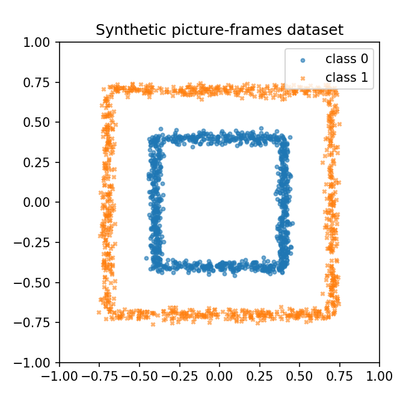
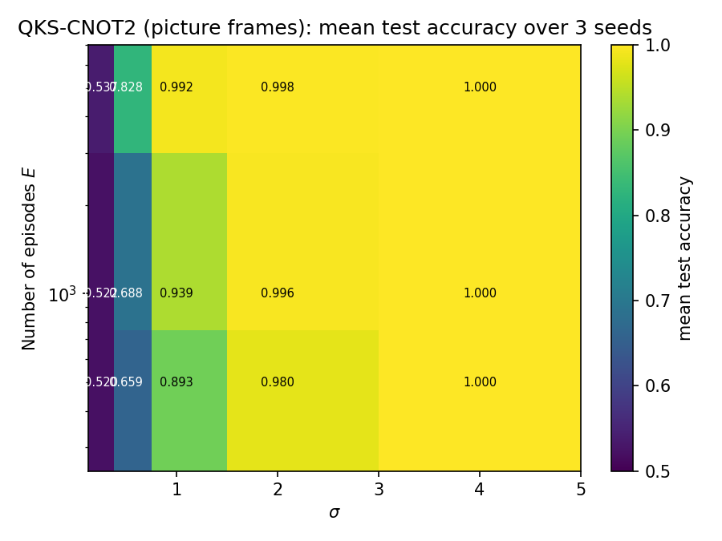
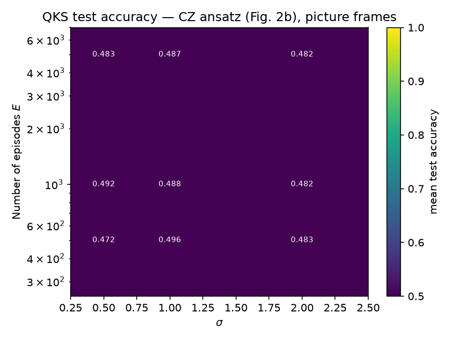
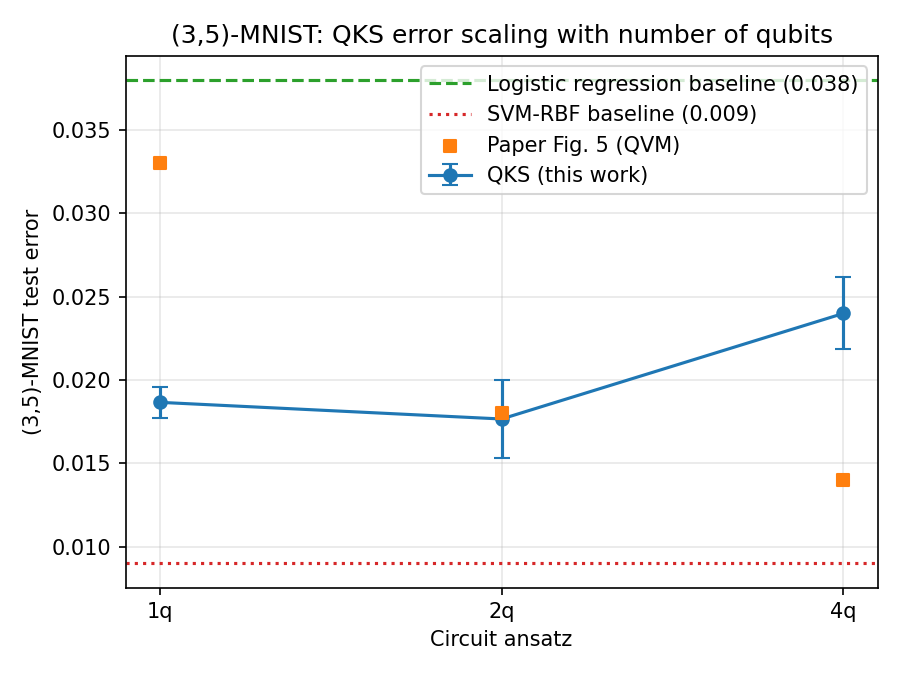

# Quantum Kitchen Sinks — Reproduction

## Reference and Attribution

- Paper: **Quantum Kitchen Sinks: An algorithm for machine learning on near-term quantum computers**
- Authors: C. M. Wilson, J. S. Otterbach, N. Tezak, R. S. Smith, A. M. Polloreno, P. J. Karalekas, S. Heidel, M. S. Alam, G. E. Crooks, M. P. da Silva
- Affiliation: Rigetti Computing (et al.)
- arXiv: [1806.08321v2](https://arxiv.org/abs/1806.08321) (2018; v2 Nov 2019)
- Original repository: not located.  The algorithm is fully specified in the
  main text and the Quil snippets in the appendix.

## Original Paper

The paper introduces **Quantum Kitchen Sinks (QKS)**: an *open-loop* hybrid
QML algorithm in which the quantum processor is used as a random non-linear
feature extractor instead of being trained variationally.  For each "episode"
``e``, the input vector ``u`` is mapped to ``q`` gate angles by a fresh random
linear encoding ``θ_e = Ω_e u + β_e`` (entries of Ω drawn from ``N(0, σ²)``,
biases of β from ``U(0, 2π)``).  A fixed-depth circuit ansatz (RX rotations
followed by a CNOT or CZ network) is executed and **a single bitstring is
sampled** from the output.  Stacking these bitstrings over ``E`` independent
episodes yields a ``(E·q)``-dimensional feature vector that is fed to a
*linear* classifier — by the **Linear Baseline (LB) Rule** the only quantum
non-linearity comes from the circuit itself.

The paper demonstrates:

- **Picture frames** (synthetic 2-D classification, Fig. 3): logistic
  regression alone gets ≈ 50% accuracy; QKS with a 2-qubit CNOT ansatz
  achieves > 99.9% test accuracy at the optimal ``σ ≈ 1``.
- **(3,5)-MNIST subset** (Fig. 5, *simulated on the Rigetti QVM*): logistic
  regression baseline 4.1% error; QKS reduces this to **1.4%**.  Fig. 5 plots,
  per qubit count, "the minimum error rate ... after optimizing the
  hyperparameters σ and E"; the paper states "the maximum number of episodes
  used was 20,000".  1.4% is the best point of that curve.
- **Rigetti QPU results** (*noisy hardware*, full-sized MNIST images), reported
  separately from Fig. 5: "for a one qubit circuit with σ=0.05 and E=10,000, we
  find an error rate of 3.3%" and "the two qubit CNOT circuit ... with σ=0.05
  and E=8,900 ... an error rate of 3.7%".

## Related reproductions in this repository

[`papers/fock_state_expressivity/q_random_kitchen_sinks/`](../fock_state_expressivity/q_random_kitchen_sinks/)
reproduces **Algorithm 3 ("Quantum-enhanced random kitchen sinks") of Gan et
al. 2022** ([arXiv:2107.05224](https://arxiv.org/abs/2107.05224)).  That work
takes the QKS idea and pushes it into a Fock-state photonic regime on the
moons dataset.  Our reproduction here covers the *original* Wilson et al.
2019 gate-model formulation and adds an independent photonic adaptation on
picture frames and (3,5)-MNIST.  The two reproductions are complementary.

## Reproduction Scope (including Updates and Deviations)

This reproduction implements the QKS algorithm in **NumPy** (a small custom
batched statevector simulator for the gate-model circuits, since the paper's
circuits are tiny and fixed-depth) and adds a **photonic MerLin** adaptation
on top of the open-loop QKS recipe, evaluated on both the synthetic
picture-frames dataset and the (3,5)-MNIST subset.

What is reproduced:

- The 1, 2, and 4-qubit ansätze from Fig. 2 (a, b) and Fig. 6 of the appendix.
- The picture-frames synthetic dataset (Fig. 3), with σ and E sweeps over 3 seeds.
- The (3,5)-MNIST subset (Fig. 5), with 1q / 2q / 4q QKS over 3 seeds.
- Fair classical baselines: logistic regression (paper's LB-rule reference)
  and SVM-RBF (paper's non-linear reference).
- A **photonic MerLin adaptation** of the QKS recipe, run on **both**
  picture-frames and (3,5)-MNIST.

Deviations and notes:

- **Simulator.** We use a small batched-NumPy statevector simulator rather
  than the Rigetti QVM.  Single-shot sampling exactly matches the paper.
- **Dataset sizes.** The picture-frames dataset is regenerated from the paper
  description.  For (3,5)-MNIST we use a 4 000-train / 1 000-test subset to
  keep CPU wall-clock manageable.
- **QPU results.** Not reproduced.  No Rigetti QPU access.

## Project Layout

```text
papers/quantum_kitchen_sinks/
|-- README.md, INSIGHTS.md
|-- cli.json, requirements.txt, notebook.ipynb
|-- configs/                       # 22 experiment configs (incl. baselines and sweeps)
|-- lib/
|   |-- data.py, encoding.py, circuits.py, qks_model.py
|   |-- photonic_qks.py            # MerLin photonic adaptation
|   |-- classifiers.py, runner.py
|-- tests/                         # 15 unit, kernel and smoke tests
|-- utils/                         # 3 plotting scripts
|-- outdir/                        # timestamped run artifacts (git-ignored)
`-- results/                       # curated figures
```

## Install and How to Run

```bash
pip install -r papers/quantum_kitchen_sinks/requirements.txt
```

From the repo root:

```bash
python implementation.py --paper quantum_kitchen_sinks --config configs/<name>.json
```

Smoke run (≤ 1 minute on CPU):

```bash
python implementation.py --paper quantum_kitchen_sinks \
    --config configs/picture_frames_cnot2.json \
    --n-train 200 --n-test 50
```

Photonic MerLin QKS on picture frames (≈ 3 minutes total, 3 seeds):

```bash
python implementation.py --paper quantum_kitchen_sinks \
    --config configs/picture_frames_merlin.json
```

Photonic MerLin QKS on (3,5)-MNIST (≈ 15 minutes per seed):

```bash
python implementation.py --paper quantum_kitchen_sinks \
    --config configs/mnist35_merlin.json
```

## Configuration

The CLI is described by ``cli.json``.  Key knobs (see ``cli.json`` for full
schema):

| Flag | Default | Meaning |
|------|---------|---------|
| ``--circuit`` | ``cnot2`` | One of ``cnot1``, ``cnot2``, ``cz2``, ``cnot4``, ``cnot8`` |
| ``--n-qubits`` | 2 | Number of qubits ``q`` |
| ``--encoding`` | ``split`` | ``split`` (``q = p``, one input dim per gate parameter) or ``tile`` (``q`` contiguous tiles, fan-in ``r = p/q``).  ``tile`` is what the paper uses for MNIST; note that σ must be rescaled with ``r`` — see `INSIGHTS.md` |
| ``--n-episodes`` | 100 | ``E``: number of independent random circuits |
| ``--sigma`` | 1.0 | Std-dev of the encoding distribution ``N(0, σ²)`` |
| ``--shots-per-episode`` | 1 | Single-shot per episode matches the paper |
| ``--n-layers`` | 1 | Stacked encoding layers (1 in the main text) |
| ``--dataset-name`` | ``picture_frames`` | ``picture_frames`` or ``mnist35`` |
| ``--classifier-kind`` | ``logistic_regression`` | ``logistic_regression``, ``svm_rbf``, ``svm_linear`` |
| ``--backend`` | ``gate`` | ``gate`` (NumPy simulator) or ``photonic_merlin`` |

## Data

- **Picture frames** — generated synthetically.  Two square frames at
  ``inner_radius = 0.4`` and ``outer_radius = 0.7`` with light Gaussian noise.
  We use the paper's split verbatim: "the training set contained M=1600
  two-dimensional points, 800 for each class ... tested using a different set
  of 400 points".  Note that 400 test points quantise the error rate at 0.25%,
  so the paper's "< 0.1%" headline is at or below the resolution of a single
  test set; our best runs make 0 errors on 400 points × 3 seeds.
- **(3,5)-MNIST** — downloaded via torchvision into
  ``data/quantum_kitchen_sinks/MNIST_raw_cache/``.  We use a 4 000-train /
  1 000-test subset (the paper uses the full (3,5) subset).



## Results Obtained and Comparison with the Paper

All numbers below are mean ± std over 3 seeds where noted.

### Picture frames (Fig. 3)

| Method | Paper value | Reproduced value | Seeds | Label |
|--------|------------:|-----------------:|------:|-------|
| LR baseline (no QKS) | ≈ 50% | 49.25% | 3 | paper-accurate |
| QKS-CNOT2 (best σ, E) | > 99.9% | **100.0 ± 0.0%** (σ=4, E=500) | 3 | paper-accurate |
| QKS-CNOT2 (σ=1, E=5000) | > 99.9% | 99.17 ± 0.12% | 3 | **deviation** — at the paper's own σ ≈ 1 we do not reach > 99.9% |
| QKS-CZ2 (σ × E sweep) | ≈ 50% ("no discrimination") | **48.51 ± 2.26%** (pooled, 27 runs); best cell 49.58 ± 1.94% | 3 | paper-accurate |
| **Photonic MerLin QKS (σ=3, E=2000, 4 modes, 2 photons)** | n/a | **99.67 ± 0.47%** | 3 | paper-accurate (photonic adaptation) |

σ × E sweeps for the two gate-model ansätze (test accuracy, mean over 3 seeds):

| CNOT ansatz (Fig. 2a) | CZ ansatz (Fig. 2b) |
|---|---|
|  |  |

The CZ ansatz of Fig. 2(b) is chance-level at every point of the sweep, as the
paper reports.  The mechanism is worth stating because it is easy to get wrong:
Fig. 2(b) applies the CZ **before** the data-dependent rotations, to ``|++>``.
``CZ|++>`` is maximally entangled, so each qubit's reduced state is maximally
mixed and the following ``RX(θ_i)`` cannot reintroduce any dependence on the
input — every feature bit is a fair coin.  Note that train accuracy still
reaches ~99% (5000 random features, 1600 training points), so only the *test*
number reveals it.  See `INSIGHTS.md`.

### (3,5)-MNIST — gate-model, simulated (Fig. 5)

Test errors (1 − test accuracy).  Fig. 5 reports only the *minimum* error per
qubit count after a joint (σ, E) optimisation with E up to 20 000, so the paper
column below carries the single value the text states — the best point of the
curve, 1.4% — rather than a per-row value we cannot read off the figure.  Our
runs use a fixed E = 5000 and a hand-picked σ, i.e. a smaller budget and no
per-point optimisation.

| Method | Paper (QVM) | Reproduced | Seeds | Label |
|--------|------------:|-----------:|------:|-------|
| LR baseline | 4.1% | **3.80%** | 1 | paper-accurate |
| SVM-RBF (reference) | not stated | 0.90% | 1 | our own non-linear reference |
| QKS-1q (σ=0.05, E=5000) | — | **1.87 ± 0.09%** | 3 | reduced budget |
| QKS-2q (σ=0.10, E=5000) | — | **1.77 ± 0.24%** | 3 | reduced budget |
| QKS-4q (σ=0.10, E=5000) | — | 2.40 ± 0.21% | 3 | reduced budget |
| **best over qubit counts** | **1.4%** (E ≤ 20 000, σ and E optimised) | **1.77 ± 0.24%** (2q) | 3 | reduced budget |

Unlike the paper we do not see a monotone improvement with qubit count: 4q is
worse than 2q at a fixed E = 5000.  The tile fan-in ``r = p/q`` shrinks as ``q``
grows, so σ and E should be re-optimised per qubit count (see `INSIGHTS.md`);
we did not run that sweep.



### (3,5)-MNIST — Rigetti QPU (not reproduced)

These are **noisy-hardware** numbers on full-sized MNIST images.  They are not
comparable with the simulated results above and we make no claim against them;
they are listed so the two sets are not confused.

| Circuit | Paper (QPU hardware) | Reproduced |
|---------|---------------------:|------------|
| 1 qubit, σ=0.05, E=10 000 | 3.3% | not reproduced (no QPU access) |
| 2-qubit CNOT, σ=0.05, E=8 900 | 3.7% | not reproduced (no QPU access) |

### (3,5)-MNIST — Photonic MerLin QKS (new)

Test errors (1 − test accuracy):

| Variant | Setting | Test error (mean ± std, 3 seeds) |
|---------|---------|---------------------------------:|
| Photonic QKS, ``m=4 / k=2 / E=2000`` | UNBUNCHED, tile encoding, σ=0.05 | 7.80 ± 0.08% |
| Photonic QKS, ``m=6 / k=3 / E=10000`` | DUAL_RAIL, tile encoding, σ=0.05 | 3.83 ± 0.50% |
| **Photonic QKS, ``m=6 / k=3 / E=10000``** | **DUAL_RAIL, tile encoding, σ=0.07** | **3.60 ± 0.42%** |
| Photonic QKS, ``m=8 / k=4 / E=5000`` | DUAL_RAIL, tile encoding, σ=0.05 | 5.43 ± 0.45% |
| Photonic QKS, ``m=8 / k=4 / E=5000`` | DUAL_RAIL, tile encoding, σ=0.07 | 5.40 ± 0.22% |
| LR baseline (raw pixels, for reference) | n/a | 3.80% |
| Gate-model QKS-1q, ``E=5000`` | tile encoding, σ=0.05 | 1.87 ± 0.09% |

The small photonic setting (`m=4, k=2`) remains clearly below the gate-model
QKS and above the LR baseline. In the enlarged settings, constraining the
photonic model to the logical ``DUAL_RAIL`` subspace helps substantially, and
the ``m=6, k=3`` geometry benefits strongly from more episodes and a slightly
larger sigma. Our best photonic MNIST result is now **3.60 ± 0.42%** with
``m=6, k=3, E=10000, σ=0.07`` in ``DUAL_RAIL``, which is effectively on par
with the LR baseline and much closer to the gate-based regime than the compact
UNBUNCHED setting.

### Hardware-aware reporting (MerLin photonic adaptation)

| Field | Picture frames value | Best MNIST photonic value |
|-------|----------------------|---------------------------|
| Computation space | UNBUNCHED | DUAL_RAIL |
| Detector model | threshold | threshold |
| Photon number | 2 | 3 |
| Number of modes | 4 | 6 |
| Input state | ``[1, 1, 0, 0]`` | ``[1, 0, 1, 0, 1, 0]`` |
| Encoding | linear angle, modes 0–1, scale = 1.0 | linear angle (tile), modes 0/2/4, scale = 1.0 |
| Measurement strategy | ``MeasurementStrategy.probs(computation_space=UNBUNCHED)`` + single-shot sampling | ``MeasurementStrategy.probs(computation_space=DUAL_RAIL)`` + single-shot sampling |
| Postselection | none | none |
| Simulator | MerLin CPU simulator (analytic) | same |
| Shot count | 1 / episode | 1 / episode |
| Seeds | [42, 43, 44] | [42, 43, 44] |

## Fair Baselines

The paper requires that the *only* non-linearity comes from the quantum
circuit (LB rule).  Our fair classical baseline is therefore plain
``LogisticRegression`` on the raw inputs.  We also report an unfair (non-linear)
SVM-RBF baseline of our own as an upper reference; the paper does not quote an
SVM-RBF number, so this row has no paper counterpart.

## MerLin Photonic Extension

`lib/photonic_qks.py` implements per-episode `ml.QuantumLayer`s with frozen
entangling-mesh phases, data driving an `add_angle_encoding`, and single-shot
sampling.  The photonic adaptation reproduces the central QKS claim on
picture frames. On (3,5)-MNIST, the original UNBUNCHED setting remains weak,
but enlarged DUAL_RAIL runs close much of the gap: the best current photonic
result is ``m=6, k=3, E=10000, σ=0.07`` with **3.60 ± 0.42%** test error.

## Limitations

- No QPU experiments. Entirely simulated.
- (3,5)-MNIST uses a 4 000-train / 1 000-test subset.
- Photonic adaptation on MNIST still trails the best gate-model QKS result,
  but DUAL_RAIL plus larger ``n_modes``/``n_photons`` closes much of the gap.
- As with classical Random Kitchen Sinks, the benefit is not universal: it
  likely depends strongly on the dataset and on how well the chosen feature map
  matches the underlying structure.

## Tests

```bash
cd papers/quantum_kitchen_sinks && pytest -q
```

Beyond the usual smoke and CLI tests, `tests/test_kernel.py` checks the
gate-model simulator against the *closed-form implicit kernel* the paper
derives, which is a sharper check than any accuracy number:

- Fig. 2(a): the measured kernel must equal
  ``1/2 + (1/8)e^{-σ²‖u⁽¹⁾-v⁽¹⁾‖²/2} + (1/16)e^{-σ²‖u-v‖²/2}``
  at several ``(u, v, σ)`` points.
- Fig. 2(b): the measured kernel must equal the constant ``1/2``, and every
  single-qubit marginal must be exactly ``1/2`` — this is what pins the CZ
  gate order, since ``RX`` before a diagonal entangler would leave the
  Z-basis marginals untouched and quietly turn the ansatz into two
  independent one-qubit circuits.

## Citation and License

```
@article{wilson2019qks,
  title   = {Quantum Kitchen Sinks: An algorithm for machine learning on near-term quantum computers},
  author  = {Wilson, C. M. and Otterbach, J. S. and Tezak, N. and Smith, R. S. and Polloreno, A. M. and Karalekas, P. J. and Heidel, S. and Alam, M. S. and Crooks, G. E. and da Silva, M. P.},
  journal = {arXiv:1806.08321},
  year    = {2019}
}
```

This reproduction is released under the same license as the rest of the
repository (MIT, see the repository-root ``LICENSE``).
