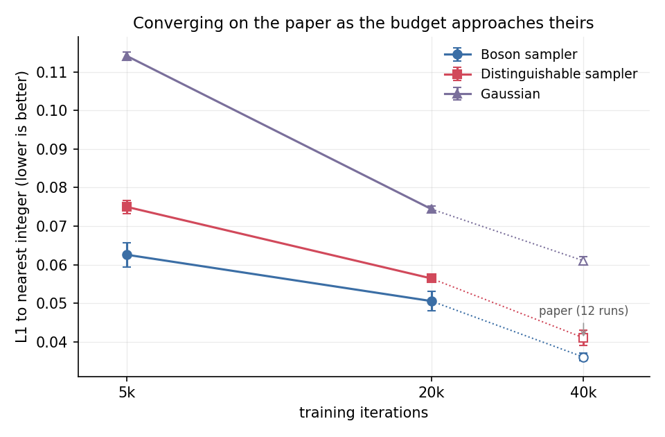
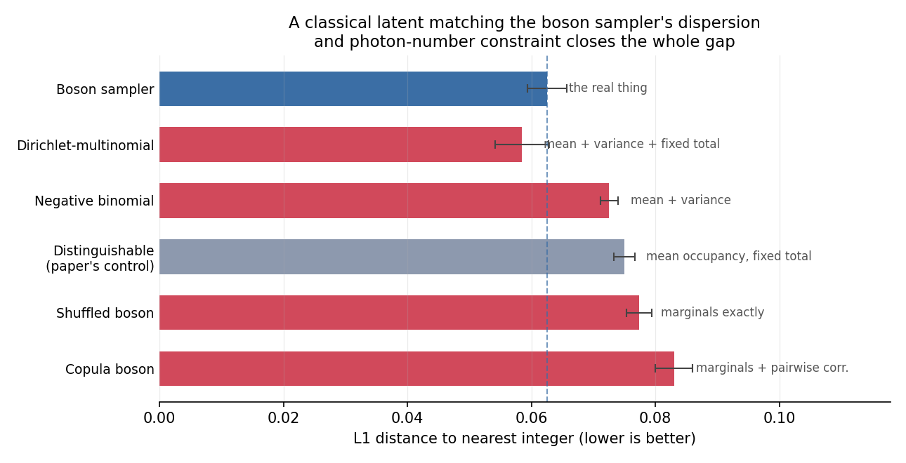
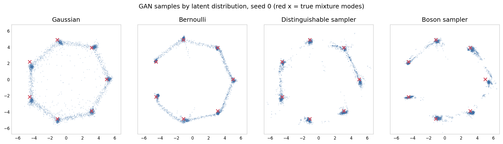

# Quantum Latent Distributions in Deep Generative Models - Reproduction

## Reference and Attribution

- **Paper**: *Quantum latent distributions in deep generative models* (arXiv preprint, 2025)
- **Authors**: Omar Bacarreza, Thorin Farnsworth, Alexander Makarovskiy, Hugo Wallner, Tessa Hicks, Santiago Sempere-Llagostera, John Price, Robert J. A. Francis-Jones, William R. Clements
- **arXiv / DOI**: [arXiv:2508.19857](https://arxiv.org/abs/2508.19857) - [10.48550/arXiv.2508.19857](https://doi.org/10.48550/arXiv.2508.19857)
- **Original repository**: the paper contains **no code or data availability statement** and links no repository of its own. An official release nonetheless exists and is **not cited in the paper**: [orcacomputing/quantum-latent-distributions](https://github.com/orcacomputing/quantum-latent-distributions) (Apache-2.0), which covers the Figure 1 / 2D-mixture experiment only — "Code for the remaining results in the paper will be uploaded soon". Where the paper is silent on a hyperparameter and that release states one, we follow the release and say so. The QM9 branch follows the MolGAN baseline the paper cites, [kfzyqin/Implementation-MolGAN-PyTorch](https://github.com/kfzyqin/Implementation-MolGAN-PyTorch); QM9 metrics come from [MorganCThomas/MolScore](https://github.com/MorganCThomas/MolScore).
- **Authors' affiliation**: all nine authors are at ORCA Computing; the PT-2 was hosted at the UK National Quantum Computing Centre. The paper is accepted at ICML 2026.
- **Attribution**: this folder is an independent reimplementation from the paper text. All quoted sentences are marked as quotations and attributed to their appendix. Code here is released under the repository licence; please cite the original paper (BibTeX at the bottom) for the science.

## Original Paper

In a GAN the generator is a **deterministic** map `g` applied to a latent sample `z ~ P_z`. The latent is therefore the only place randomness enters the model, which means its complexity bounds the complexity of everything the generator can produce. Essentially everyone uses `P_z = N(0, I)`.

The paper asks what happens when `P_z` is instead a distribution that no classical computer can sample efficiently, and answers in two halves.

**Theory.** Theorem 1: *"We consider a neural network g in G such that its inverse g^-1 exists, is efficiently classically implementable and is also Lipschitz continuous. Let P_z be in Q. Then the pushforward distribution P_g(z) is not in C."* Here `C` is the class of distributions approximately samplable classically in `Poly(n, 1/eps)` time, and `Q` the class samplable that way by a quantum computer but not classically. Boson sampling supplies a `P_z` in `Q`.

**Experiment.** GANs are trained with four latent distributions - a boson sampler, the same interferometer run with *distinguishable* photons, uniform Bernoulli bit strings, and the usual Gaussian - on a 2D mixture of Gaussians (Fig. 2), on synthetic discrete datasets (Table I), and on QM9 molecular generation (Table II), using both simulated and real photonic processors (an ORCA PT-2: 16 photons in 32 channels, delay lines in the `1-1` configuration, half a million samples in 40 minutes). Diffusion (DDGAN on CIFAR-10) and flow matching (on "moons") are shown to be *compatible* with quantum latents, with no advantage claimed.

The paper's own summary of the empirical picture: benefits *"remain dataset and model dependent"*, and *"Further work would be required to identify models and datasets on which a quantum distribution can provide a benefit."*

What makes this an unusually good fit for MerLin is that the quantum device is **not a trainable layer**. The photonic circuit is fixed and random, no gradient ever crosses the quantum boundary, and the entire quantum cost is a one-off bank of samples drawn before training starts.

## Reproduction Scope (including Updates and Deviations)

### Reproduced

| Study | `--experiment` | Paper reference | Status |
| --- | --- | --- | --- |
| Boson sampler vs MerLin's exact simulation | `sampler_validation` | infrastructure check | ✅ run here |
| Blobs on a circle | `mixture_of_gaussians` | Fig. 1, Fig. 2 / Appendix C | ✅ run here, 5 seeds |
| Synthetic discrete datasets | `synthetic_datasets` | Table I / Appendix D | ✅ run here, 3 seeds x 2 budgets |
| Classical-challenger study | `synthetic_datasets` | **not in the paper** | ✅ run here, 4 challengers x 3 seeds |
| QM9 molecular generation | `qm9` | Table II / Appendix E | ⚠️ implemented and import-tested, **not run** |
| Diffusion / flow matching | - | Appendix F, G | ❌ not attempted |

The four latent distributions, all implemented as `merlin.LatentDistribution` subclasses in `lib/latents.py`:

| Latent | Definition | Classically samplable? |
| --- | --- | --- |
| `boson` | indistinguishable photons in a random interferometer | no (conjectured) |
| `distinguishable` | **the same circuit**, photons made distinguishable | yes, linear time |
| `bernoulli` | uniform bit strings on `{0,1}^L` | yes |
| `gaussian` | `N(0, I)` | yes |

`distinguishable` is the control that carries the argument, and it is weaker than the paper presents it as. It matches the boson sampler's **mean occupancy** per mode - we measure a maximum difference of 0.0012 over 800k samples - while the joint distributions differ by a total variation distance of 0.266. It does **not** match the single-mode *marginals*: at the Table I size of 16 modes and 8 photons, boson sampling bunches (Fano factor 1.28, super-Poissonian) while distinguishable photons anti-bunch (0.89, sub-Poissonian). The gap between the two is therefore *not* attributable to multi-photon interference alone - see [Is the distinguishable-photon control strong enough?](#is-the-distinguishable-photon-control-strong-enough-a-classical-latent-closes-the-gap) below.

### Updates and deviations

**Hyperparameters follow the paper wherever it states them.** The paper is uneven about this, so the provenance of every setting is recorded here.

| Setting | Mixture (App. C) | Synthetic (App. D) | QM9 (App. E) |
| --- | --- | --- | --- |
| Networks | 2x256, LeakyReLU *(paper)* | 2x512, ReLU *(paper)* | 64/176/288/400/512, LeakyReLU *(paper)* |
| Optimizer | Adam, betas (0.0, 0.9) *(released code)* | **RMSProp** *(paper)* | Adam *(paper)* |
| Learning rate | 5e-4 *(released code)* | 5e-4 *(paper)* | 1e-4 *(paper)* |
| Batch size | 32 *(released code)* | 500 *(paper)* | 256 *(paper)* |
| Iterations | 5000 *(paper)* | 40 000 *(paper)* | 20 000 *(paper)* |
| Critic ratio | 5:1 *(released code)* | 5:1 *(paper)* | not stated; we use 5:1 |
| Gradient penalty | 10 *(released code)* | not stated; we use 10 | not stated; we use 10 |
| Latent re-injection | no | no | **yes** *(paper)* |
| Weight init | Xavier uniform, zero bias *(released code)* | same | same |
| Output activation | none *(released code)* | none | MolGAN default |

Remaining deviations, all deliberate:

- **Reduced budget on CPU.** `configs/synthetic_datasets.json` is the paper-accurate config (40k iterations, batch 500, 12 repeats) and costs about 2.8 h per (latent, seed) on one core — 134 h for the full table. `configs/synthetic_datasets_fast.json` keeps the optimizer, activation and architecture and cuts the iteration count; the numbers below say which was used.
- **QM9 repeats.** `configs/qm9.json` sets 5 repeats against the paper's 20, purely for cost.
- **The mixture dataset is not described in the paper at all** — component count, positions and width are absent from the text. We take them from the authors' released `SevenGaussians`: **7** blobs on a radius-5 circle with polar noise (`r ~ N(5, 0.2)`, `theta ~ N(theta_k, 0.05)`). Note this is *not* isotropic noise, which makes the blobs slightly banana-shaped and matters for any "does it interpolate between modes" metric.
- **Loop architecture.** The paper says the mixture latents come from a 3-loop "1-3-9" system, which is what we implement; the authors' released demo instead uses a *single*-loop time-bin sampler. We follow the paper.
- **Centring.** Appendix C says *"all distributions were centered to have a mean value of 0"*, which we read as the empirical mean; the released demo instead subtracts the constant 0.5. QM9 preprocessing is described nowhere, even though photon counts are unbounded non-negative integers.
- **Objective attribution.** WGAN-GP is stated only for the mixture; Appendix D gives RMSProp with a 5:1 critic ratio but never says whether the penalty or weight clipping is used, and no clipping value appears. We use WGAN-GP throughout and flag the ambiguity.
- **Loop unitaries** are modelled as the equivalent mode-mixing matrix — a cascade of programmable couplings between bins `i` and `i + d` — rather than simulated in the time domain with an explicit delay component.
- **Simulated boson sampling is ideal**, matching the paper: no loss, no detector model, no partial distinguishability. Imperfections enter only through the hardware path.
- **Hardware post-selection.** The paper populates *all* input time bins and discards shots with fewer than `n_photons` detections: *"we populated all 32 input time bins and discarded all results in which fewer than 16 photons were measured."* `lib/hardware.py` follows that recipe by default (`post_select=True`); pass `post_select=False` to keep lossy shots instead.

## Install and How to Run

```bash
cd papers/quantum_latent_distributions
python -m venv .venv && source .venv/bin/activate
pip install -r requirements.txt
```

The QM9 study additionally needs the optional extras commented at the bottom of `requirements.txt` (`rdkit`, `fcd-torch`, `torch-geometric`) and a GPU.

### Quick smoke run (about 30 seconds)

```bash
python ../../implementation.py --config configs/smoke.json
# or from the repository root
python implementation.py --paper quantum_latent_distributions --config configs/smoke.json
```

### Full paper reproductions

```bash
# Infrastructure check: sampler vs MerLin's exact simulation (about 2 minutes)
python ../../implementation.py --config configs/sampler_validation.json

# Paper Fig. 2 - 2D mixture of Gaussians, 5 seeds (about 70 minutes on one CPU core)
python ../../implementation.py --config configs/mixture_of_gaussians.json

# Paper Table I - synthetic discrete datasets, Appendix D settings in full
# (40k iterations at batch 500: about 2.8 h per latent per seed on one core)
python ../../implementation.py --config configs/synthetic_datasets.json

# Same optimizer, reduced budget - what the numbers in this README use
python ../../implementation.py --config configs/synthetic_datasets_fast.json --repeats 3
python ../../implementation.py --config configs/synthetic_datasets_fast.json --repeats 3 --iterations 20000

# Classical challengers to the paper's distinguishable-photon control (not in the paper)
python ../../implementation.py --config configs/classical_challengers.json

# Paper Table II - QM9; needs a GPU and the optional extras
python ../../implementation.py --config configs/qm9.json --latents boson
```

Aggregate and plot afterwards:

```bash
python utils/summarize.py outdir/run_YYYYMMDD-HHMMSS [more run dirs...]
python utils/plot_mixture.py outdir/run_YYYYMMDD-HHMMSS --seed 0
python utils/plot_budget_sweep.py results/budget_sweep
```

### Running the latents on real hardware

Because every latent is routed through a pre-drawn bank, switching to a QPU changes nothing downstream:

```bash
export QUANDELA_TOKEN=...
python ../../implementation.py --config configs/synthetic_datasets.json \
    --latent-source hardware --platform qpu:belenos --latent-dim 32 --architecture 1-1
```

`1-1` is the ORCA PT-2 delay-line configuration used for the paper's hardware runs. Lossy shots are **kept**, not post-selected: loss is part of the distribution the generator actually sees, and discarding it biases the latent.

## Configuration

`cli.json` is the authoritative CLI schema; `--config`, `--outdir`, `--seed`, `--dtype`, `--device` and `--log-level` come from the shared runtime. The flags that matter most here:

| Flag | Config path | Meaning |
| --- | --- | --- |
| `--experiment` | `experiment` | `sampler_validation`, `mixture_of_gaussians`, `synthetic_datasets`, `qm9` |
| `--latents` | `latent.kinds` | comma-separated subset of `gaussian,bernoulli,distinguishable,boson` |
| `--latent-dim` / `--photons` | `latent.dim`, `latent.n_photons` | optical modes and photon number (default: half filling, as in the paper) |
| `--architecture` | `latent.architecture` | `haar`, `1-1`, or `1-3-9` |
| `--normalize` | `latent.normalize` | `center` (paper), `standardize`, or `none` |
| `--bank-size` | `latent.bank_size` | latent samples drawn before training |
| `--latent-source` / `--platform` | `latent.source`, `latent.hardware.platform` | simulation or Quandela Cloud QPU |
| `--targets` | `dataset.targets` | `quantum`, `bernoulli`, or both |
| `--repeats` | `evaluation.repeats` | repeat `k` uses `seed + k` for the circuit draw and for training |
| `--torch-threads` | `torch_threads` | cap intra-op threads when running several studies side by side |

## Data

No datasets are downloaded for the mixture, synthetic or validation studies: targets are generated from the photonic simulator and from numpy. The QM9 study downloads through `torch_geometric` into the shared root, `data/quantum_latent_distributions/qm9`.

## Results Obtained and Comparison with the Paper

Raw runs land in `outdir/run_YYYYMMDD-HHMMSS/` (`metrics.json`, `summary.json`, `run.log`, `config_snapshot.json`); the curated artifacts quoted below are committed under `results/`.

### Infrastructure: is the sampler right? (yes)

`configs/sampler_validation.json`, 3 photons in 6 modes, 56 Fock states:

| Samples | TVD to MerLin's exact distribution |
| --- | --- |
| 12 500 | 0.0233 |
| 50 000 | 0.0138 |
| 200 000 | 0.0054 |
| 800 000 | 0.0024 |

(`results/sampler_validation.json`, `--seed 7`.)

The distance halves with each 4x increase in sample count - exactly the `1/sqrt(N)` behaviour of an unbiased sampler. The distinguishable control has a maximum **mean-occupancy** difference of **0.0012** from the boson sampler and a joint-distribution TVD of **0.266**. Note that this is a first-moment match only: the marginals themselves differ. In this small 6-mode / 3-photon system the Fano factors are **0.90 vs 0.67** — the fixed photon total holds both below 1, but the boson sampler still bunches by a factor of 1.4 relative to its control. At the Table I size of 16 modes and 8 photons the same ratio puts them either side of 1 (**1.28 vs 0.89**), which is what the challenger study below turns on. 51% of shots in this system are bunched, which is the mass that `ComputationSpace.UNBUNCHED` would silently discard.

### Paper Table I - synthetic discrete datasets: **reproduces**

L1 distance between generated coordinates and their nearest integers; lower is better.

**Boson sampler versus its distinguishable control** — the comparison the paper's whole argument rests on — paired by seed, at the Appendix D optimizer/activation/batch size and two iteration budgets (`configs/synthetic_datasets_fast.json`, 3 seeds, `results/budget_sweep/`):

| Iterations | Boson sampler | Dist. sampler | Paired gap | t | Seeds favouring boson |
| --- | --- | --- | --- | --- | --- |
| 5 000 | 0.0626 ± 0.0032 | 0.0750 ± 0.0017 | +0.0124 ± 0.0045 | 2.79 | 3/3 |
| 20 000 | 0.0505 ± 0.0025 | 0.0564 ± 0.0004 | +0.0059 ± 0.0029 | 2.06 | 3/3 |
| 40 000 *(paper, 12 runs)* | 0.036 ± 0.001 | 0.041 ± 0.002 | +0.005 | 2.24 | — |



Both the level and the gap converge monotonically on the paper's reported values as the budget approaches theirs. At 20 000 iterations — half the paper's — our gap (+0.0059) is already statistically indistinguishable from theirs (+0.005), with every seed pointing the same way and a t-statistic comparable to what they obtain from 12 runs.

The gap **narrows** with training, from +0.0124 at 5k to +0.0059 at 20k. That is consistent with what the authors report for the mixture dataset in Appendix C: with 10 000 steps instead of 5 000, *"the latent distribution with distinguishable photons was often able to close the gap with the indistinguishable photons."* The quantum advantage on this task is largest when the model is capacity- or budget-limited, and erodes as the generator gets good enough to exploit a classical latent equally well. Anyone extending this work should report the training budget alongside the gap.

> **Correction, and a lesson about under-specified papers.** An earlier pass of this reproduction ran Adam at 2e-4 with batch 128, LeakyReLU and QM9-style latent re-injection, because Appendix D's hyperparameters had not been read carefully. Under those settings the same comparison gave a paired gap of only +0.0026 ± 0.0037 (t = 0.69, 4 of 7 seeds favouring boson), and this README previously reported "right sign, not resolved" and speculated that ~33 seeds would be needed. That was wrong. Switching to the paper's stated optimizer moved the paired effect size from d = 0.40 to d = 1.61 — from roughly 50 seeds needed for 80% power down to about 4. The effect was never seed-limited; the wrong optimizer was masking it. Appendix D is worth quoting in full for anyone else reproducing this: *"The training is done using batches of 500 samples over 40k iterations"*, *"We use a RMSProp optimizer with a learning rate of 5 x 10^-4"*, *"Both models use a ReLU activation function in all their hidden layers."*

**All four latents**, at the earlier non-paper optimizer (4 000 iterations, Adam 2e-4, batch 128). Retained because it still shows the two structural claims, and because it is the only run here that covers the Bernoulli target:

| Latent | Quantum dataset (paper) | Quantum dataset (here) | Bernoulli dataset (paper) | Bernoulli dataset (here) |
| --- | --- | --- | --- | --- |
| Gaussian | 0.061 ± 0.001 | 0.140 ± 0.001 | **0.012 ± 0.002** | 0.107 ± 0.002 |
| Bernoulli | 0.065 ± 0.001 | 0.131 ± 0.002 | 0.020 ± 0.013 | 0.058 ± 0.005 |
| Dist. sampler | 0.041 ± 0.002 | 0.095 ± 0.002 | 0.017 ± 0.002 | **0.054 ± 0.001** |
| Boson sampler | **0.036 ± 0.001** | **0.093 ± 0.004** | 0.015 ± 0.002 | 0.076 ± 0.004 |

Both photonic latents beat both classical ones on the quantum dataset by a wide margin, and on the **factorisable** Bernoulli target the boson sampler's advantage disappears — it drops from first to third. That dataset-dependence is the paper's own headline caveat (*"benefits remain dataset and model dependent"*) and it reproduces. **# TODO**: re-run the full four-latent, two-target table at the Appendix D optimizer to replace this one.

### Is the distinguishable-photon control strong enough? **A classical latent closes the gap**

*This study is not in the paper.*

The paper's argument leans on one control: distinguishable photons in the same interferometer, which is meant to isolate multi-photon interference as the resource. Checking that control empirically shows it is weaker than it looks — it matches only the **first moment** of each mode:

| statistic (16 modes, 8 photons, 300k samples) | boson sampler | distinguishable |
| --- | --- | --- |
| mean occupancy, max difference | \<0.004 | — |
| mean per-mode variance | 0.644 | 0.444 |
| Fano factor (variance / mean) | **1.28** (super-Poissonian) | **0.89** (sub-Poissonian) |
| P(3 photons in one mode) | 0.018 | 0.005 |

Boson sampling bunches; the multinomial statistics of distinguishable photons anti-bunch. So the two latents differ in their **marginals** as well as in their correlations, and the reported gap is *not* attributable to interference alone. An earlier version of this README repeated the paper's framing of "identical marginals"; that was wrong, and it matters.

To find out what is actually doing the work, we ran four classical challengers against the same target at the same settings, ordered by how much of the boson distribution each one reproduces:

| Latent | What it matches | L1 | Paired gap vs boson | t |
| --- | --- | --- | --- | --- |
| Boson sampler | — | 0.0626 ± 0.0032 | — | — |
| **Dirichlet-multinomial** | mean + dispersion + fixed total | **0.0585 ± 0.0043** | **-0.0041 ± 0.0041** | **-1.00** |
| Negative binomial | mean + dispersion | 0.0726 ± 0.0014 | +0.0100 | 2.73 |
| Distinguishable *(paper's control)* | mean + fixed total | 0.0750 ± 0.0017 | +0.0124 | 2.79 |
| Shuffled boson | every marginal exactly | 0.0774 ± 0.0021 | +0.0148 | 2.83 |
| Copula boson | marginals + pairwise correlations | 0.0830 ± 0.0030 | +0.0205 | 6.63 |



Read the table from the bottom up:

- **Shuffled boson** is the boson bank with each column independently permuted. Every single-mode marginal is preserved *exactly* — bunching tail included — and every correlation destroyed. It does **not** recover the advantage. So over-dispersed marginals alone are not the mechanism.
- **Copula boson** adds the rank-correlation matrix back. It is the *worst* latent tested, suggesting an imposed Gaussian dependence structure actively mis-specifies the joint distribution.
- Both of those break something the real distribution has: boson sampling shots always contain exactly `n_photons` photons, so the coordinates live on a simplex. Shuffling and copula resampling destroy that constraint, which confounds the comparison.
- **Dirichlet-multinomial** removes the confound. Draw `p ~ Dirichlet(alpha * q)` per sample, where `q` is the mean occupancy vector, then `multinomial(n_photons, p)`; `alpha` is bisected once to match the boson Fano factor. Total exactly `n_photons`, over-dispersion matched, and no quantum structure of any kind. **It matches the boson sampler** — paired gap -0.0041 ± 0.0041, t = -1.00, and it wins on 2 of 3 seeds — while the paper's own control loses at t = 2.79.

**What this implies.** On this benchmark, the boson sampler's advantage over the paper's control is fully accounted for by two properties that are classically reproducible in two lines of numpy: support on the fixed-photon simplex, and super-Poissonian per-mode statistics. The Dirichlet-multinomial needs only a mean occupancy vector and one scalar — low-order marginals of the boson distribution, which are the parts that are *not* hard to compute classically. Nothing here requires a permanent, an interferometer, or multi-photon interference.

**What this does not imply.** Theorem 1 is untouched: it concerns the classical hardness of the pushforward distribution, not GAN sample quality, and a Dirichlet-multinomial latent is in `C` so its pushforward stays in `C`. The paper's *theoretical* claim survives intact; it is the empirical "quantum interference is a useful resource" reading of Table I that this challenges. Nor does it transfer automatically — this is 3 seeds at 5000 iterations on one dataset, and the QM9 result may have a different mechanism.

There is also a design point no latent can fix: the synthetic "quantum dataset" **is itself boson sampling output**. A boson-sampler latent shares its distributional family with the target, which is close to circular. That is consistent with what happens elsewhere in the paper's own results — on the factorisable Bernoulli target the boson advantage disappears entirely (it drops from first to third in our runs), and Appendix H reports that a modest hyperparameter change erases the QM9 effect. The Dirichlet-multinomial result gives a concrete mechanism for that pattern: what transfers is not "quantumness" but *distributional shape matched to the target*.

**Reproduce it:**

```bash
python ../../implementation.py --config configs/classical_challengers.json
python utils/plot_challengers.py results/classical_challengers
```

### Paper Fig. 1 / Fig. 2 - blobs on a circle: **the qualitative claim reproduces, the ranking does not**

Fraction of generated points lying outside every blob's 3-sigma neighbourhood ("interpolation rate"), 5 seeds, paper/released-code settings:

| Latent | Interpolation rate (lower better) | Modes covered (of 7) | MMD to data |
| --- | --- | --- | --- |
| Gaussian | 0.383 ± 0.007 | 7.0 ± 0.0 | 0.026 ± 0.001 |
| Bernoulli | 0.123 ± 0.029 | 7.0 ± 0.0 | **0.011 ± 0.001** |
| Dist. sampler | **0.118 ± 0.019** | 7.0 ± 0.0 | 0.015 ± 0.002 |
| Boson sampler | 0.159 ± 0.011 | 7.0 ± 0.0 | 0.015 ± 0.001 |



Left to right the panel is the progression the paper's Fig. 2 caption describes, "from the commonly used Gaussian distribution (left) to a quantum distribution (boson sampler, right)". The Gaussian model fills a continuous ring between the blobs; the others leave the gaps mostly empty. That is the paper's headline observation — *"The main failure mode is a tendency to interpolate between different modes"* — and it reproduces unambiguously: the Gaussian latent interpolates 3x more than any other, on every one of the 5 seeds, with an error bar of 0.007.

What does **not** reproduce is the second half of the claim, *"the model with the quantum latent distribution is least affected"*. The boson sampler (0.159 ± 0.011) is beaten by both its own distinguishable control (0.118 ± 0.019) and the Bernoulli baseline (0.123 ± 0.029). Every latent covers all 7 modes on all 5 seeds. So at these settings the useful distinction is Gaussian versus everything else, not classical versus quantum.

The paper offers a partial explanation of its own, in Appendix C: with 10 000 steps instead of 5 000, *"the latent distribution with distinguishable photons was often able to close the gap with the indistinguishable photons"*, while *"further training did not improve results with Gaussian and Bernoulli latent distributions."* The quantum-versus-distinguishable ordering on this dataset is therefore budget-dependent by the authors' own account, and 5 000 steps is where they chose to report it.

> **Correction.** An earlier pass of this reproduction reported this experiment as wildly unstable, with the boson latent collapsing on 3 of 5 seeds. That was an artifact of the wrong dataset and hyperparameters (8 blobs at radius 2, isotropic noise, batch 256, Adam at 2e-4). With the authors' actual dataset and optimizer settings there is **no collapse at all**: every latent covers every mode on every seed, and the largest error bar across all four latents is 0.029.

### Paper Table II - QM9: not run

`lib/molgan.py` implements the paper's modified MolGAN generator (5 hidden layers of 64/176/288/400/512, LeakyReLU, affine latent re-injection at every layer), a relational-GCN critic, Gumbel-softmax graph decoding, and the FCD / valid-and-unique / novel metrics. Forward and backward passes are verified. The full protocol is 4 latents x 3 latent sizes x 20 seeds at 20 000 iterations, roughly 2 hours per GAN on an A100, which is out of reach for the CPU environment this reproduction ran in. **# TODO**: run `configs/qm9.json` on a GPU and fill in the comparison against the paper's size-16 row (boson 1.160 ± 0.06 FCD / 2522 ± 65 valid-and-unique / 1331 ± 37 novel, against Gaussian 1.529 ± 0.08 / 1814 ± 115 / 1017 ± 64).

## Related Reproductions in This Repository

Three existing reproductions bear directly on this one, and the first shares its central control.

- **[`photonic_quantum_enhanced_kernels`](../photonic_quantum_enhanced_kernels/)** — Yin et al.,
  *Experimental quantum-enhanced kernel-based machine learning on a photonic processor*
  (Nature Photonics, 2025; [arXiv:2407.20364](https://arxiv.org/abs/2407.20364)). **The closest
  relative.** It separates an *indistinguishable*-photon kernel from a *distinguishable*-photon
  kernel — the same control Bacarreza et al. rely on — and its README records the same structural
  concern that appears here as the "quantum dataset is itself boson-sampling output" issue: *"the
  dataset is ad-hoc such that the indistinguishable kernel outperforms the kernel with
  distinguishable photons"*. It also reproduces an accuracy-versus-**geometric-difference** figure,
  which is Huang et al.'s formal criterion for when a quantum kernel can beat *any* classical one.
  That criterion is the principled version of the challenger study above, and this paper has no
  equivalent.

- **[`QORC`](../QORC/)** — Sakurai, Hayashi, Munro & Nemoto, *Quantum optical reservoir computing
  powered by boson sampling* (Optica Quantum, 2025;
  [10.1364/OPTICAQ.541432](https://doi.org/10.1364/OPTICAQ.541432)). **The same engineering
  pattern**: a fixed, untrained Haar-random photonic circuit supplying high-dimensional features,
  with only a classical linear layer trained, so no gradient crosses the quantum boundary. It
  exposes a bunching switch (`--b-no-bunching`) that is the same knob as the `ComputationSpace`
  note below, and its classical baseline is Random Fourier Features — a cheap classical
  *random-feature* construction set against a random *quantum* one, structurally the same move as
  the Dirichlet-multinomial challenger here.

- **[`LatentQGAN`](../LatentQGAN/)** ([arXiv:2409.14622](https://arxiv.org/abs/2409.14622)) and
  **[`photonic_QGAN`](../photonic_QGAN/)** ([arXiv:2405.06023](https://arxiv.org/abs/2405.06023))
  — **the same application with the opposite design.** Both place a quantum circuit inside a GAN
  (LatentQGAN in the latent space of a convolutional autoencoder, photonic_QGAN as a Fock-encoded
  generator trained end-to-end on a QPU), but in both the circuit is **trainable** — LatentQGAN
  uses 140 quantum parameters. Bacarreza et al.'s contribution is precisely to drop that: the
  circuit here is never trained, which is what removes the barren-plateau and
  differentiable-simulator costs. Having both in one repository makes the trainable-versus-untrained
  comparison available on common ground.

Worth flagging as a cross-paper question: the distinguishable-photon control appears in this paper
and in `photonic_quantum_enhanced_kernels`, and there is now evidence in both places that it
under-controls. Whether it survives as a quantum/classical separator is a question no single paper
reproduction can answer.

## Limitations

- The four-latent table above still uses the earlier non-paper optimizer; only the boson-vs-distinguishable comparison has been re-run at Appendix D settings. Nothing here has been run at the paper's full 40 000 iterations with 12 repeats (134 h of CPU).
- The quantum advantage on the synthetic dataset shrinks with training budget, so a reproduction that trains longer than the paper may find no effect at all. This is a property of the result, not a flaw in the measurement.
- On the mixture dataset the paper's *ranking* claim does not reproduce: the boson sampler is beaten by its own distinguishable control and by Bernoulli, though the Gaussian latent is clearly and stably the worst.
- The classical-challenger result rests on 3 seeds at 5000 iterations on one dataset. It should be repeated at the paper's full 40 000 iterations and on QM9 before being treated as general. The Dirichlet-multinomial's dispersion is fitted to the boson Fano factor, which we estimate from boson samples; doing it without any quantum data means scanning `alpha`, which we did not test.
- Theorem 1's hypotheses are not verified for the networks actually trained. The non-decreasing-width constraint makes invertibility *possible*, not certain, and the Lipschitz constant of `g^-1` is never measured — here or in the paper.
- The synthetic "quantum dataset" target is itself boson sampling output, so a boson-sampler latent shares its distributional family with the target. That flatters the quantum latent and no choice of control can undo it; only a different target can.
- QM9 and the diffusion / flow-matching studies are not run, so the paper's strongest quantitative claim is untested here. Note the authors' own Appendix H reports that at a higher learning rate and shorter schedule *"There is no statistically significant difference between the latent distributions"* on QM9 — the QM9 result is itself hyperparameter-fragile.
- No QPU access was available; `lib/hardware.py` is written against Perceval's `RemoteProcessor` and exercised only through the simulation path.
- Several settings are taken from the authors' released code rather than the paper, and that release covers only the mixture experiment. Where the release and the paper disagree (single-loop versus "1-3-9" latents; subtracting 0.5 versus the empirical mean) we follow the paper and say so above.

## Tests

```bash
cd papers/quantum_latent_distributions
PYTHONPATH=. pytest -q     # 23 tests, about 35 seconds
```

Coverage: CLI schema and config validity, unitarity of both circuit families, shape and photon-number conservation for every latent, the marginals-match-but-joints-differ property of the distinguishable control, sampler convergence against MerLin's exact Fock-space distribution, and two end-to-end runs through the shared runtime.

## A MerLin note worth recording

`QuantumLayer` defaults to `ComputationSpace.UNBUNCHED`, which keeps only collision-free outcomes **and renormalises them to sum to 1**. For 3 photons in 6 modes that returns a distribution over 20 of the 56 Fock states while silently discarding 51% of the events - and it still looks like a perfectly valid distribution. Boson sampling lives on bunching, so `ComputationSpace.FOCK` is mandatory here. This is the single easiest way to get this reproduction wrong.

## Citation and License

```bibtex
@article{bacarreza2025quantumlatent,
  title   = {Quantum latent distributions in deep generative models},
  author  = {Bacarreza, Omar and Farnsworth, Thorin and Makarovskiy, Alexander
             and Wallner, Hugo and Hicks, Tessa and Sempere-Llagostera, Santiago
             and Price, John and Francis-Jones, Robert J. A. and Clements, William R.},
  journal = {arXiv preprint arXiv:2508.19857},
  year    = {2025},
  doi     = {10.48550/arXiv.2508.19857}
}
```

Code in this folder follows the repository licence. The original paper remains the property of its authors; please cite it rather than this reproduction for the scientific claims.
