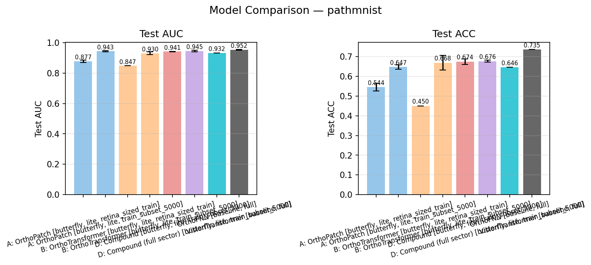

# Quantum Vision Transformers: Comprehensive Reproduction and Extension Report

This report consolidates the current state of the `quantum_vision_transformers` repo after the engineering fixes, figure regeneration, RetinaMNIST reproduction work, and MedMNIST extension runs.

It summarizes:
- what was changed in the codebase
- what the final experimental picture looks like
- where we match the paper
- where we deviate
- which extensions appear worth pursuing

This report is the top-level summary. More focused companion reports remain in:
- [Retina Butterfly Full vs Paper](./retina_cpu/retina_butterfly_full_vs_paper.md)
- [Retina Lite Analysis](./retina_cpu/retina_lite_analysis.md)

## Executive Summary

The repo is now in good shape as a research and reproduction codebase. The main paper benchmark family is implemented, the MerLin dependency is vendored and editable, training is resumable, deterministic enough for comparison work, and figure/report generation is materially better than at the start.

Scientifically, the current evidence supports a qualified reproduction of the paper:
- we reproduce the main qualitative claim that structured quantum models are competitive with the classical baseline
- `A` and `D` are the strongest paper-core quantum models in our runs
- the parameter-efficiency story is supported
- exact numerical agreement with the paper is mixed, especially for `B` and `OrthoFNN`

The lite models are not just smoke tests anymore. On RetinaMNIST, butterfly-lite preserves most of the useful behavior of the full models and in some cases slightly improves on them. On larger MedMNIST datasets, the bigger issue turned out not to be lite vs full but the training-data ceiling: moving from Retina-sized train subsets to 5k-example capped subsets changed the results materially.

For the MedMNIST subset study, the current best general pattern is:
- `D` or `D_full` usually gives the best AUC
- `A` stays surprisingly competitive and remains the strongest efficiency candidate
- `B` is sometimes strong but less consistently dominant

At report time, the MedMNIST `subset5000` sweep is complete for all `A`, `B`, and `D_full` runs. The only remaining progress-only directories are three `D` runs:
- `D_octmnist_butterfly_lite_subset5000_s7`
- `D_tissuemnist_butterfly_lite_subset5000_s7`
- `D_tissuemnist_butterfly_lite_subset5000_s123`

## 1. Code and Infrastructure Changes

The repo changed substantially during this work. The main engineering changes were:

- Fixed the structured butterfly circuit construction so it respects Perceval's consecutive-port requirements while preserving the logical butterfly pairing schedule.
- Added real checkpointing and resume support:
  - `last.pt`
  - `best.pt`
  - `progress.json`
  - `results.json`
  - `--resume auto|never|must`
- Made resume more robust:
  - structurally incompatible checkpoints now fall back to a fresh run under `--resume auto`
  - `--resume must` still fails strictly
- Added deterministic data loading:
  - seeded loaders
  - worker seeding
  - reproducible subset selection
- Added real `pytest` coverage for:
  - config validation
  - butterfly construction
  - checkpoint resume
  - figure grouping
  - deterministic loader behavior
  - wrapper-level model coverage
- Added paper benchmark configs and runner scripts for:
  - `VisionTransformer`
  - `OrthoFNN`
  - `A`
  - `B`
  - `D`
- Fixed the `OrthoFNN` implementation so it no longer runs through the transformer residual/MLP wrapper.
- Improved figure generation:
  - family/profile separation
  - baseline handling
  - top-level `figures/` output instead of writing back into `outdir/`
  - PNG export in addition to PDF
  - data-regime-aware variant keys
  - better deduplication of stale runs
- Added convenience suite scripts for easier benchmarking.
- Vendored `third_party/merlinquantum` and switched the active environment to use that editable checkout.

### MerLin performance work

The MerLin path was also optimized materially:

- preserved sparse superposition inputs longer
- removed unnecessary dense superposition staging
- chunked TorchScript layer execution
- rerouted `StateVector` inputs to the batched EBS path rather than the older incremental path
- added `gpu_friendly` precision mode so the repo can run `float32/complex64` cleanly

The most important result from that work was not theoretical. It was directly measured:

- `StateVector -> QuantumLayer` microbenchmark:
  - before reroute: about `25.52s`, peak RSS about `1.19 GB`
  - after reroute: about `0.010s`, peak RSS about `0.66 GB`
- real QVT training step, `Model D`, CPU:
  - before reroute: about `15.45s`, peak RSS about `2.05 GB`
  - after reroute: about `0.612s`, peak RSS about `0.81 GB`

These changes were intended to preserve semantics. The numerical behavior remained close, but exact bitwise identity is not expected because accumulation order changed in several places.

## 2. Experimental Regimes

The repo now contains four distinct kinds of experimental regime:

| Regime | Purpose | Main status |
|---|---|---|
| `standard` full | Paper-style or extension benchmark at the original operating point | Used for RetinaMNIST reproduction |
| `standard` lite | Smaller one-block operating point | Used for scaling and data-efficiency analysis |
| `retina_sized_train` | Train larger MedMNIST datasets on `1080` examples, keep full val/test | Useful as a low-data stress test |
| `train_subset_5000` | Train larger MedMNIST datasets on up to `5000` examples, keep full val/test | Most informative MedMNIST extension regime so far |

Important detail:
- `breastmnist` and `pneumoniamnist` do not actually reach 5k train examples
- so the `subset5000` regime uses the full train split on those datasets

## 3. RetinaMNIST Reproduction

### 3.1 Paper-facing butterfly/full results

The most relevant comparison to the paper is the paper family under the butterfly/full path:
- `VisionTransformer`
- `OrthoFNN`
- `A`
- `B`
- `D`

Current means from the regenerated Retina figures:

| Model | Paper AUC | Ours AUC | Paper ACC | Ours ACC | Comment |
|---|---:|---:|---:|---:|---|
| VisionTransformer | `0.736` | `0.7417 +- 0.0030` | `0.548` | `0.5450 +- 0.0174` | Very close |
| OrthoFNN | `0.731` | `0.6720 +- 0.0068` | `0.548` | `0.4908 +- 0.0059` | Still substantially worse even after the paper-faithful rerun |
| A | `0.739` | `0.7479 +- 0.0071` | `0.560` | `0.5325 +- 0.0122` | AUC slightly better, ACC lower |
| B | `0.745` | `0.7369 +- 0.0053` | `0.542` | `0.5108 +- 0.0066` | Weaker than paper |
| D | `0.740` | `0.7409 +- 0.0087` | `0.565` | `0.5283 +- 0.0077` | AUC matches, ACC lower |

Interpretation:
- `VisionTransformer`, `A`, and `D` are reasonably close to the paper in AUC
- `B` underperforms relative to the paper
- `OrthoFNN` remains the clearest mismatch
- ACC is systematically lower than the paper even where AUC is close

This supports a qualitative reproduction, not a strict numerical one.

### 3.2 RetinaMNIST comparison figures

Full butterfly comparison:

This is the most relevant figure for the paper-style comparison. The main takeaways are:
- `A` is the strongest quantum model on AUC in the butterfly/full setting
- `D` is competitive and lands close to the paper AUC
- `VisionTransformer` remains a strong baseline
- `OrthoFNN` is clearly weaker than expected from the paper

Training curves:

These curves support the same interpretation:
- the quantum models are not failing to train
- the issue is not catastrophic instability
- the main discrepancy is final generalization level, especially for `B` and `OrthoFNN`

## 4. Lite vs Full on RetinaMNIST

The lite operating point changes:
- `n_layers = 1`
- smaller feature width
- smaller batch size
- same training duration

It does not mean "one interferometer stage." It means one outer model block rather than a stack of several blocks.

### 4.1 Butterfly lite vs butterfly full

For the overlapping butterfly models:

| Model | Full AUC | Lite AUC | Full ACC | Lite ACC | Interpretation |
|---|---:|---:|---:|---:|---|
| A | `0.7479` | `0.7386` | `0.5325` | `0.5342` | Lite is close |
| B | `0.7369` | `0.7392` | `0.5108` | `0.5250` | Lite is slightly better |
| D | `0.7409` | `0.7381` | `0.5283` | `0.5250` | Essentially tied |
| D_full | `0.7313` (`n=1`) | `0.7408` | `0.5225` (`n=1`) | `0.5392` | Lite looks better, but full evidence is weak |

Butterfly-lite comparison:

The scientific reading is:
- lite is not merely a cheap proxy
- for RetinaMNIST, a single smaller block often preserves most of the useful signal
- some of the full models may simply be over-capacity for this dataset

This does not make the paper wrong. It suggests the paper's chosen operating point may not be the most data-efficient one for RetinaMNIST.

## 5. MedMNIST Capped-data Study

### 5.1 Why this study was added

The original MedMNIST full-dataset sweep was too expensive on CPU for practical iteration. The repo was extended with capped-data training regimes so we could ask a more focused question:

"Given a manageable training budget, which butterfly-lite models generalize best across MedMNIST tasks?"

Two capped regimes were used:
- `retina_sized_train` (`1080` examples)
- `train_subset_5000` (up to `5000` examples)

### 5.2 Completion state

At report time, the `subset5000` butterfly-lite sweep is complete for all `A`, `B`, and `D_full` runs. Still missing final `results.json`:
- `D_octmnist_butterfly_lite_subset5000_s7`
- `D_tissuemnist_butterfly_lite_subset5000_s7`
- `D_tissuemnist_butterfly_lite_subset5000_s123`

So the study is fully interpretable for `A`, `B`, and `D_full`, while the `octmnist D` and `tissuemnist D` rows remain one seed short.

### 5.3 Low-data PathMNIST lesson

The `retina_sized_train` regime was most useful for showing that `1080` training examples were too restrictive for larger datasets.

For `PathMNIST`:

| Model | `retina_sized_train` AUC / ACC | `subset5000` AUC / ACC | Delta |
|---|---|---|---|
| A | `0.8768 / 0.5445` | `0.9434 / 0.6468` | `+0.0665 AUC`, `+0.1023 ACC` |
| B | `0.8473 / 0.4499` (`n=1`) | `0.9300 / 0.6681` | very large improvement |

This is the clearest cross-dataset finding in the MedMNIST work: the training-data ceiling matters more than the fine distinction between lite and full on large datasets.

### 5.4 `subset5000` results by dataset

Best current models on the 5k-capped study:

| Dataset | Best AUC | Best ACC | Comment |
|---|---|---|---|
| bloodmnist | `D` (`0.9754`) | `D` (`0.8351`) | `D` clearly best |
| breastmnist | `B` (`0.8341`) | `D` (`0.8013`) | split result |
| dermamnist | `D` (`0.8927`) | `D` (`0.7272`) | `D` clearly best |
| octmnist | `D` (`0.8177`, `n=2`) | `D_full` (`0.5070`) | hard dataset, one `D` seed still missing |
| pathmnist | `D_full` (`0.9452`) | `D_full` (`0.6762`) | strongest `D_full` case |
| pneumoniamnist | `D` (`0.9507`) | `B` (`0.8691`) | split result |
| retinamnist | `D_full` (`0.7408`) | `D_full` (`0.5392`) | agrees with Retina lite story |
| tissuemnist | `D_full` (`0.8209`) | `D_full` (`0.5145`) | `D_full` is best among completed models; `D` is still one seed short |

Representative comparison figure from the all-results bundle:

Main MedMNIST findings:
- the `D` family is strongest overall
- `D` or `D_full` wins most datasets on AUC
- `A` remains highly competitive for a much simpler model
- `B` is occasionally strong but not consistently dominant
- `OCTMNIST` remains the least stable dataset in this capped-data regime
- `TissueMNIST` is now interpretable and favors `D_full`, though the plain `D` row is still missing one seed

On the seven fully interpretable datasets above, the best-AUC count is:
- `D`: 4 datasets
- `D_full`: 2 datasets
- `B`: 1 dataset

This is the strongest current reason to keep `D` and `D_full` central in future work.

## 6. What We Learned About the Extensions

### `D_full`

`D_full` is worth keeping.

Current evidence:
- stronger than `D` on `PathMNIST`
- strongest Retina-lite result among the butterfly-lite variants
- usually close to `D` even when not clearly better

`D_full` appears to be the most worthwhile extension beyond the exact paper family.

### `E`

`E` remains low priority.

Current evidence is weak:
- full generic Retina result is poor
- lite generic Retina result is much better, but still only exploratory
- conceptually it is more incremental than `F`

`E` is not clearly bad, but it is not the best place to spend compute right now.

### `F`

`F` is scientifically interesting but not yet validated strongly enough.

Why it still matters:
- it is a genuine extension to three photons
- it tests a more ambitious hierarchical encoding idea

Why it should stay secondary:
- the current evidence is mostly Retina generic-lite
- full generic Retina was poor
- we do not yet have a broad enough sweep to justify expensive follow-up

If one non-paper extension deserves future attention, `F` is more compelling than `E`, but `D_full` is currently the most empirically supported extension.

## 7. Reproduction Assessment

The cleanest scientific statement is:

> We reproduce the main qualitative conclusions of the paper, while observing quantitative deviations in some models and baselines.

This is justified because:
- the main paper family is implemented and run
- the training setup closely matches the paper
- `A` and `D` are competitive with the classical baseline
- the quantum parameter-efficiency claim is supported

But it is not a strict exact reproduction because:
- `B` is weaker than in the paper
- `OrthoFNN` still does not match the paper even after the paper-faithful rerun
- ACC is systematically lower than the paper in several cases
- there is still some ambiguity around exact architectural parity for butterfly `D` and CLS-token usage

So the correct phrasing is:
- strong qualitative reproduction
- mixed quantitative agreement
- credible reproduction overall, but not a perfect numerical match

## 8. Recommendations

### Worth finishing

Worth finishing if you want the MedMNIST subset study fully clean:
- `D_octmnist_butterfly_lite_subset5000_s7`
- `D_tissuemnist_butterfly_lite_subset5000_s7`
- `D_tissuemnist_butterfly_lite_subset5000_s123`

These are the only remaining runs with clear scientific value.

### Probably not worth prioritizing

- completing the old `retina_sized_train` `PathMNIST B` sweep
- broad full generic sweeps for `E` and `F`

The return on CPU time is low compared with the current evidence.

### Best current research directions

If the goal is to push the project forward rather than only reproduce the paper:

1. Keep `A`, `D`, and `D_full` central.
2. Use butterfly-lite and capped-data MedMNIST studies as the default practical regime.
3. Treat `F` as the main long-term architectural extension if higher-photon work is revisited.
4. Deprioritize `E` unless a strong new reason appears.
5. If GPU work resumes, focus on `gpu_friendly` precision mode and throughput tuning rather than expanding the model family further.

## Final Bottom Line

The repo is now a solid research reproduction codebase.

The paper has been reproduced well enough to support its main qualitative claims, but not so exactly that we should present the result as a perfect one-to-one replication.

The strongest scientific outcomes from the work are:
- `A` and `D` do carry the paper's central story
- `D_full` is the most convincing extension
- lite models are more meaningful than expected
- on larger MedMNIST datasets, the training-data ceiling matters much more than we initially assumed

That is enough to treat the current repo as both:
- a credible reproduction of the original paper
- and a useful platform for follow-on research
