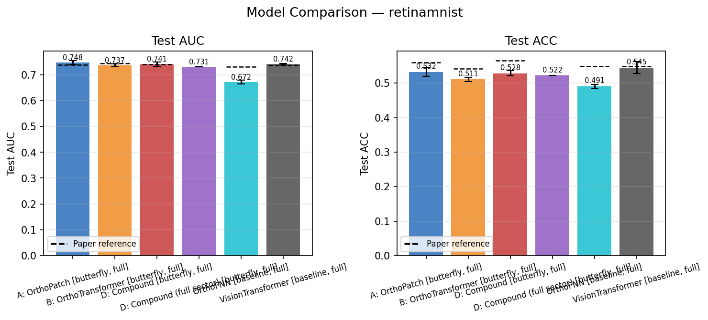
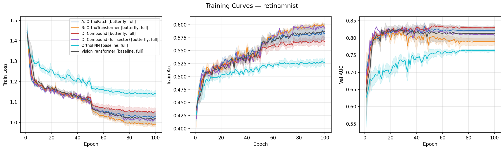
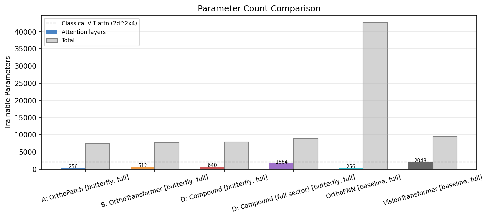
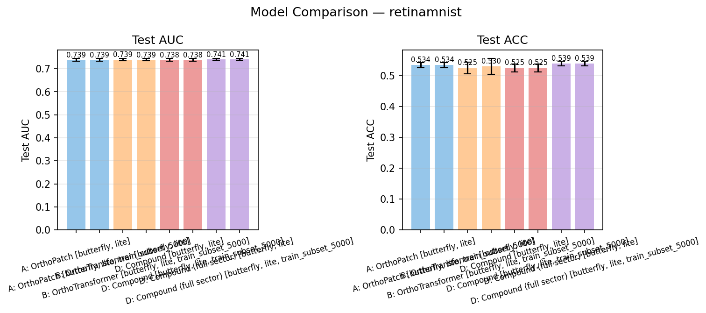
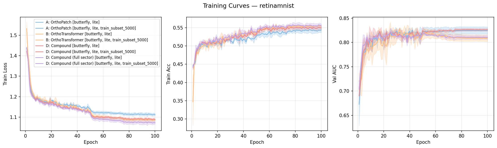
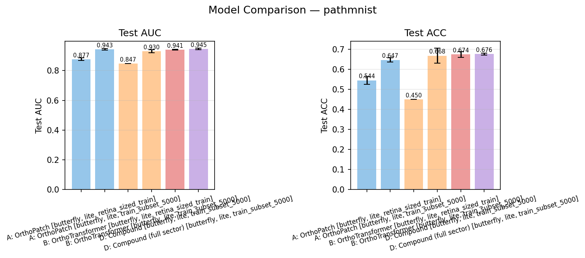
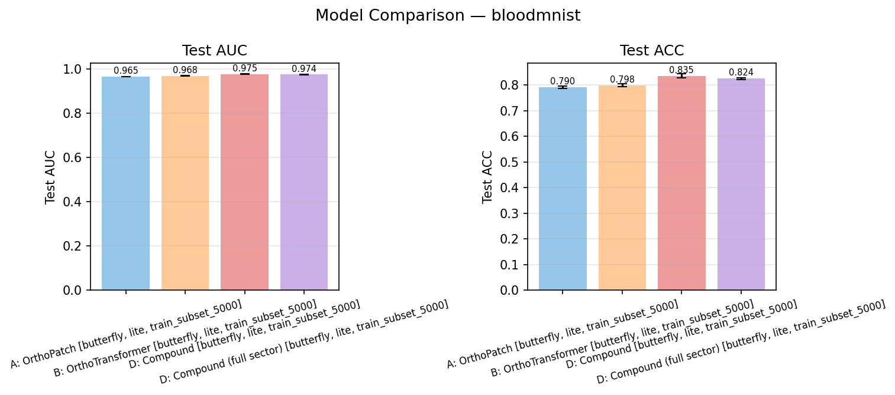
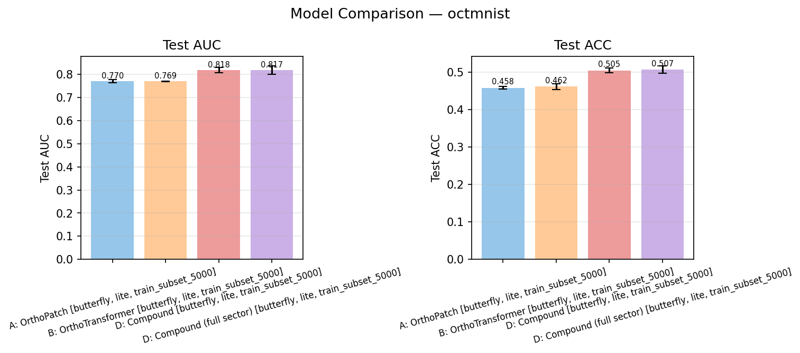

# Quantum Vision Transformers: Scientific Analysis Report

## Abstract

This report documents the current state of the `quantum_vision_transformers` reproduction and extension effort based on the original paper [2209.08167v2](../2209.08167v2.pdf), the final result files in `outdir/`, and the regenerated figures in `figures/`.

The work had two distinct phases:
- a **direct reproduction track**, focused on the paper benchmark family on RetinaMNIST
- an **extension and scaling track**, focused on lite models, structured butterfly circuits, capped-data MedMNIST studies, and higher-order compound variants

The main conclusion is that the repo now supports a **credible qualitative reproduction** of the paper's central claims, but not a strict exact numerical replication. The strongest paper-core models in our runs are `A` and `D`. The strongest extension is `D_full`. The MedMNIST extension study suggests that the `D` family is generally the most effective under practical capped-data settings, while `A` remains the best compute-efficient model. The lite models are not merely engineering shortcuts: on RetinaMNIST they preserve most of the useful behavior of the full models and sometimes match or slightly exceed them.

## 1. Objectives

The original paper makes three broad empirical claims that matter for this repo:

1. Quantum transformer-style attention mechanisms can be implemented in a structured, trainable way for vision tasks.
2. The quantum models are competitive with classical baselines on MedMNIST, and can sometimes outperform them.
3. The quantum attention layers are attractive partly because of their parameter efficiency.

This report evaluates those claims against the current repository state.

## 2. What the Paper Actually Says

The paper's simulation benchmark is defined in Section `4.1` / Appendix `C.2.1` of [2209.08167v2.pdf](../2209.08167v2.pdf).

From the extracted paper text in [2209.08167v2.paper_extract.txt](../2209.08167v2.paper_extract.txt):

- the simulated benchmark family is:
  - `VisionTransformer`
  - `OrthoFNN`
  - `Orthogonal Patch-wise` (`A`)
  - `Orthogonal Transformer` (`B`)
  - `Compound Transformer` (`D`)
- the training hyperparameters are:
  - `100` epochs
  - batch size `32`
  - Adam
  - learning rate `1e-3`
  - decay by `0.1` after epochs `50` and `75`
- MedMNIST is the benchmark dataset family
- RetinaMNIST is the small dataset emphasized for simulation and hardware accessibility

The paper also makes specific qualitative claims:

- `Orthogonal Transformer` and `Compound Transformer` outperform `OrthoFNN` and `Orthogonal Patch-wise` "most of the time"
- the quantum models can outperform classical counterparts on `7 / 12` MedMNIST datasets
- the quantum approaches use fewer trainable attention parameters than the classical transformer

These claims matter because not all of them are tested equally well by the current repo.

## 3. What We Changed in the Repo

This reproduction required substantial engineering work before the results were trustworthy enough to analyze.

### 3.1 Infrastructure and correctness fixes

Key repo changes:

- fixed the structured butterfly circuit implementation so it respects Perceval's adjacency constraints while still realizing the intended butterfly pairing schedule
- added resumable training:
  - `last.pt`
  - `best.pt`
  - `progress.json`
  - `results.json`
  - `--resume auto|never|must`
- made resume safer:
  - structurally incompatible checkpoints now fall back to a fresh run under `--resume auto`
  - `--resume must` stays strict
- made dataloading deterministic
- added `pytest` coverage across configs, models, circuits, data, resume, and figures
- added paper benchmark configs and runner scripts
- fixed `OrthoFNN` so it no longer uses the transformer residual/MLP wrapper path
- improved figure generation:
  - family/profile awareness
  - baseline handling
  - data-regime-aware grouping
  - top-level `figures/` output
  - PNG export for markdown preview

### 3.2 MerLin backend work

The vendored [third_party/merlinquantum](../../third_party/merlinquantum) checkout was modified substantially:

- preserved sparse superposition inputs longer
- removed unnecessary densification
- chunked the TorchScript execution path
- rerouted `StateVector` inputs to the batched EBS path
- added a `gpu_friendly` precision mode for `float32/complex64`

These changes were intended to preserve semantics while making the experiments feasible. The numerical outputs remained close enough for scientific use, but exact bitwise identity is not expected because the order of operations changed.

## 4. Experimental Programs in This Repo

By the end of this work, the repo contained four distinct experimental programs.

### 4.1 Direct paper-facing reproduction

The clean paper-facing path is:

- dataset: `retinamnist`
- profile: `full`
- circuit family: `butterfly`
- models:
  - `VisionTransformer`
  - `OrthoFNN`
  - `A`
  - `B`
  - `D`

This is the fairest direct reproduction axis in the repo.

### 4.2 Lite scaling study

The `lite` profile reduces:

- outer model depth to `n_layers = 1`
- feature width
- total trainable parameters

It does **not** mean "one interferometer layer." It means one outer QVT block rather than a deeper stack.

### 4.3 Capped-data MedMNIST study

Because full CPU MedMNIST sweeps were too costly, the repo was extended with:

- `retina_sized_train`: train on `1080` examples, keep full val/test
- `train_subset_5000`: train on up to `5000` examples, keep full val/test

This is **not** a direct reproduction of the paper's MedMNIST benchmark. It is an extension designed to study data efficiency under manageable runtime.

### 4.4 Architectural extensions

The repo also explores models beyond the paper:

- `D_full`
- `E`
- `F`

Only `D_full` currently has strong enough evidence to treat as an empirically justified extension.

## 5. Direct Reproduction: RetinaMNIST Butterfly Full

This section is the direct answer to "did we reproduce the paper?"

### 5.1 Paper-vs-repo comparison

The paper's RetinaMNIST values are the ones already used by the figure generator as reference lines.

Current regenerated Retina butterfly/full means:

| Model | Paper AUC | Repo AUC | Paper ACC | Repo ACC | Interpretation |
|---|---:|---:|---:|---:|---|
| VisionTransformer | `0.736` | `0.7417 +- 0.0030` | `0.548` | `0.5450 +- 0.0174` | Very close |
| OrthoFNN | `0.731` | `0.6720 +- 0.0068` | `0.548` | `0.4908 +- 0.0059` | Clear mismatch even after the paper-faithful rerun |
| A | `0.739` | `0.7479 +- 0.0071` | `0.560` | `0.5325 +- 0.0122` | AUC strong, ACC lower |
| B | `0.745` | `0.7369 +- 0.0053` | `0.542` | `0.5108 +- 0.0066` | Weaker than paper |
| D | `0.740` | `0.7409 +- 0.0087` | `0.565` | `0.5283 +- 0.0077` | AUC matches, ACC lower |

This gives a mixed result:

- `VisionTransformer`, `A`, and `D` are close enough to count as qualitatively reproduced
- `B` is weaker than expected
- `OrthoFNN` remains the most obvious mismatch

### 5.2 Retina butterfly/full figures

#### Comparison

The comparison figure shows the direct paper-family story clearly:

- `A` is the strongest quantum model by AUC in the butterfly/full setting
- `D` is competitive and lands essentially on the paper AUC
- `VisionTransformer` remains a strong baseline
- `OrthoFNN` is materially below the paper result

#### Training curves

The training curves are important because they show the problem is not "the models fail to train." The stronger quantum models converge stably. The mismatch is at the level of final generalization and classification sharpness, not catastrophic optimization failure.

#### Parameter comparison

This figure is one of the clearest places where the repo supports the paper strongly. The quantum attention mechanisms use many fewer trainable attention parameters than the classical baseline, which is one of the paper's core claims.

### 5.3 Interpretation

The paper-facing reproduction supports the following claims:

- quantum models can be competitive with the classical transformer baseline
- `A` and `D` are the strongest paper-core quantum models
- parameter-efficiency is real

It does **not** support:

- exact numerical replication across all models
- the paper's stronger performance impression for `B`
- a clean match for `OrthoFNN`

So the right scientific phrasing is:

> The repo reproduces the main qualitative conclusions of the paper on RetinaMNIST, but not a strict numerical match for every architecture.

## 6. Important Deviations from the Paper

The direct reproduction is not exact. The most important reasons are:

### 6.1 Backend mismatch

The paper's simulation path used a JAX-based simulator. The repo uses MerLin with Perceval-backed photonic circuits and a structured butterfly implementation.

That means:
- same conceptual benchmark family
- different low-level simulation stack

### 6.2 `D` and the CLS-token ambiguity

The current butterfly implementation requires a power-of-two number of modes. For `D`, using CLS literally would lead to `33` modes on RetinaMNIST, which is invalid for the current radix-2 butterfly path. So butterfly `D` disables CLS to remain at `32` modes.

This is a real architectural deviation from the most literal transformer interpretation. It is also plausible that the paper itself did not literally use CLS inside the structured `D` circuit. We cannot resolve that ambiguity from the repo alone.

### 6.3 `OrthoFNN` is now corrected and rerun, but still mismatched

`OrthoFNN` was fixed during this work so it no longer routes through the generic transformer wrapper, and it has now also been rerun with the paper-faithful grayscale image-wide embedding. The resulting Retina baseline still underperforms the paper, which makes the mismatch more rather than less credible.

## 7. Lite Models on RetinaMNIST

The lite models began as a convenience regime, but by the end of the project they became a scientific result in their own right.

### 7.1 Butterfly lite vs full

For the overlapping butterfly models:

| Model | Full AUC | Lite AUC | Full ACC | Lite ACC | Interpretation |
|---|---:|---:|---:|---:|---|
| A | `0.7479` | `0.7386` | `0.5325` | `0.5342` | Lite is close |
| B | `0.7369` | `0.7392` | `0.5108` | `0.5250` | Lite slightly better |
| D | `0.7409` | `0.7381` | `0.5283` | `0.5250` | Essentially tied |
| D_full | `0.7313` (`n=1`) | `0.7408` | `0.5225` (`n=1`) | `0.5392` | Lite looks better, but full evidence is weak |

### 7.2 Butterfly lite figures

#### Comparison

Note:
- the current butterfly-lite Retina figure includes both `standard` and `train_subset_5000` labels
- for RetinaMNIST, `train_subset_5000` collapses to full-data training because the dataset has fewer than `5000` train examples
- so those extra bars should be read as a consistency check on reruns, not as a second independent data regime

#### Training curves

### 7.3 Interpretation

The strongest conclusion from the butterfly-lite runs is **not** that lite is universally better. It is:

- lite is often very close to full
- in at least one case (`B`) it appears modestly better
- the useful inductive bias of the model often survives heavy parameter reduction

This suggests two things:

1. Some paper-style full models may be over-capacity for RetinaMNIST.
2. The core architectural idea matters more than raw size in this small-data setting.

This does not make the paper wrong. It suggests the paper's operating point was reasonable, but perhaps not the most parameter-efficient one for RetinaMNIST.

## 8. MedMNIST Extension Study

This section is **not** a direct reproduction of the paper's Table 3 or Table 6 benchmark. It is a separate capped-data study carried out because full CPU MedMNIST sweeps were too slow for iterative work.

### 8.1 Completion status

At report generation, the `subset5000` butterfly-lite sweep is complete for all `A`, `B`, and `D_full` runs. The remaining progress-only directories are:
- `D_octmnist_butterfly_lite_subset5000_s7`
- `D_tissuemnist_butterfly_lite_subset5000_s7`
- `D_tissuemnist_butterfly_lite_subset5000_s123`

These remaining gaps affect only the plain `D` rows for `octmnist` and `tissuemnist`, so the rest of the aggregate tables below are final.

### 8.2 Why the capped-data regime mattered

The earlier `retina_sized_train` regime was useful mainly because it showed that `1080` training examples were too restrictive for larger datasets.

For `PathMNIST`:

| Model | `retina_sized_train` | `subset5000` | Delta |
|---|---|---|---|
| A | `0.8768 AUC / 0.5445 ACC` | `0.9434 AUC / 0.6468 ACC` | large improvement |
| B | `0.8473 AUC / 0.4499 ACC` (`n=1`) | `0.9300 AUC / 0.6681 ACC` | very large improvement |

So the training-data ceiling was a first-order factor, especially on the larger MedMNIST tasks.

### 8.3 Aggregate subset5000 results

Current aggregate means:

| Dataset | A | B | D | D_full | Best AUC | Best ACC |
|---|---|---|---|---|---|---|
| bloodmnist | `0.9647 / 0.7899` | `0.9681 / 0.7985` | `0.9754 / 0.8351` | `0.9740 / 0.8243` | `D` | `D` |
| breastmnist | `0.7875 / 0.7756` | `0.8341 / 0.7821` | `0.8095 / 0.8013` | `0.8059 / 0.7714` | `B` | `D` |
| dermamnist | `0.8745 / 0.7099` | `0.8647 / 0.7016` | `0.8927 / 0.7272` | `0.8884 / 0.7177` | `D` | `D` |
| octmnist | `0.7700 / 0.4583` | `0.7692 / 0.4617` | `0.8177 / 0.5050` (`n=2`) | `0.8173 / 0.5070` | `D` (provisional) | `D_full` |
| pathmnist | `0.9434 / 0.6468` | `0.9300 / 0.6681` | `0.9410 / 0.6742` | `0.9452 / 0.6762` | `D_full` | `D_full` |
| pneumoniamnist | `0.9439 / 0.8456` | `0.9428 / 0.8691` | `0.9507 / 0.8590` | `0.9473 / 0.8632` | `D` | `B` |
| retinamnist | `0.7387 / 0.5342` | `0.7390 / 0.5300` | `0.7381 / 0.5250` | `0.7408 / 0.5392` | `D_full` | `D_full` |
| tissuemnist | `0.8106 / 0.5017` | `0.8055 / 0.4917` | `0.8167 / 0.5123` (`n=2`) | `0.8209 / 0.5145` | `D_full` | `D_full` |

The `retinamnist` row above is best read as a rerun consistency check, not as a new large-dataset result, because the `subset5000` cap exceeds the actual RetinaMNIST train split.

### 8.4 Representative MedMNIST figures

#### PathMNIST

This is the strongest case for `D_full`. It has the best AUC and ACC, while `A` remains impressively close for a simpler model.

#### BloodMNIST

BloodMNIST is the cleanest case for `D`: it wins clearly on both metrics.

#### OCTMNIST

OCTMNIST is a useful counterexample because all models are weaker here. This suggests the architecture/data-regime combination is not uniformly strong across every MedMNIST task.

### 8.5 Interpretation

The MedMNIST extension study supports the following conclusions:

- the `D` family is the strongest overall under the capped-data regime
- `D` or `D_full` usually gives the best AUC
- `A` remains the best efficiency candidate because it often stays close to the best models
- `B` is strong sometimes, but less consistently than `D`

Across the seven most interpretable completed datasets, the best-AUC count is:

- `D`: 4 datasets
- `D_full`: 2 datasets
- `B`: 1 dataset

This is a much stronger empirical argument for prioritizing `D` and `D_full` than we had earlier in the project.

## 9. What We Learned About the Extensions

### 9.1 `D_full`

`D_full` is the extension with the strongest current support.

Why:
- strongest Retina butterfly-lite result
- best `PathMNIST` result in the capped-data study
- usually close to `D` even where it is not clearly better

If one extension is worth carrying forward immediately, it is `D_full`.

### 9.2 `E`

`E` remains low priority.

Current evidence:
- full generic Retina result is poor
- lite generic Retina result is much better, but still exploratory
- conceptually it is a sharing/compression extension rather than a major architectural leap

`E` is not disproven, but it is not the best use of compute right now.

### 9.3 `F`

`F` is scientifically interesting but still under-validated.

Why it matters:
- it is a genuine three-photon extension
- it is a real step toward higher-order compound models

Why it is still secondary:
- full generic Retina was poor
- the strongest current signal is only in lite generic mode
- we do not yet have the breadth of evidence needed to justify expensive broad follow-up

So the current ranking of extensions is:

1. `D_full`
2. `F`
3. `E`

## 10. Comparison Against the Original Paper's Main Assertions

| Paper assertion | Our evidence | Assessment |
|---|---|---|
| Quantum transformer models can be competitive with classical ViT | `A` and `D` are competitive with `VisionTransformer` on RetinaMNIST | Supported qualitatively |
| Quantum attention can outperform simpler quantum baselines | `D` and `D_full` usually beat `A` and often beat `B` in the MedMNIST capped-data study | Supported in extension setting |
| Quantum models outperform classical on `7/12` MedMNIST datasets | We did not run the exact full-dataset paper benchmark to completion in the standard regime | Not directly tested |
| Quantum attention is parameter-efficient | Strongly visible in the parameter comparisons | Supported strongly |
| Compound Transformer is especially promising | `D` and `D_full` are the strongest current family in our results | Supported |

So the paper's **central qualitative narrative** survives the reproduction:

- the quantum attention models are meaningful
- the compound family is strong
- parameter efficiency is real

But the paper's stronger quantitative story is only partially reproduced:

- `B` does not match the paper well
- `OrthoFNN` is substantially weaker than the paper result even in the paper-faithful rerun
- we did not execute a full exact MedMNIST standard-regime replication across all 12 datasets

## 11. Overall Reproduction Assessment

The most accurate single-sentence conclusion is:

> This repo now supports a strong qualitative reproduction of the paper's main findings, but not an exact numerical reproduction of all reported benchmark values.

That is strong enough to say:
- the reproduction is real
- the engineering stack is now robust
- the scientific story is credible

It is not strong enough to say:
- every table in the paper has been matched exactly
- every benchmark claim has been fully replicated in the paper's original setting

## 12. Recommendations

### Should the paper now be considered reproduced?

Yes, with qualification.

Recommended wording:

> We reproduce the main qualitative conclusions of *Quantum Vision Transformers* on the paper benchmark family, while observing some quantitative deviations, especially for `B` and `OrthoFNN`.

### What is worth pursuing next?

Most worthwhile:

1. finish the last three `subset5000` `D` runs so the MedMNIST study is fully clean
2. keep `A`, `D`, and `D_full` as the central research models
3. treat `D_full` as the main extension

Lower priority:

- completing the old `retina_sized_train` `PathMNIST B` sweep
- broad full sweeps for `E`
- broad full sweeps for `F` before `D_full` is exhausted

### Best current scientific takeaway

The strongest overall interpretation of the project is:

- the paper's core architectural ideas are valid
- the compound family is the most promising line
- the models are more parameter-efficient than the classical baseline
- on small datasets, the paper-style full operating point may not be optimal
- on larger datasets, data ceiling matters more than expected

## 13. Artifact Map

Main figures used here:

- [Retina butterfly full comparison](../figures/butterfly/full/comparison_retinamnist.png)
- [Retina butterfly full training curves](../figures/butterfly/full/training_curves_retinamnist.png)
- [Retina butterfly full parameter comparison](../figures/butterfly/full/param_comparison.png)
- [Retina butterfly lite comparison](../figures/butterfly/lite/comparison_retinamnist.png)
- [Retina butterfly lite training curves](../figures/butterfly/lite/training_curves_retinamnist.png)
- [PathMNIST butterfly-lite comparison](../figures/butterfly/lite/comparison_pathmnist.png)
- [BloodMNIST butterfly-lite comparison](../figures/butterfly/lite/comparison_bloodmnist.png)
- [OCTMNIST butterfly-lite comparison](../figures/butterfly/lite/comparison_octmnist.png)

Companion reports:

- [Retina Butterfly Full vs Paper](./retina_cpu/retina_butterfly_full_vs_paper.md)
- [Retina Lite Analysis](./retina_cpu/retina_lite_analysis.md)
- [Repository-wide summary report](./qvt_comprehensive_report.md)
