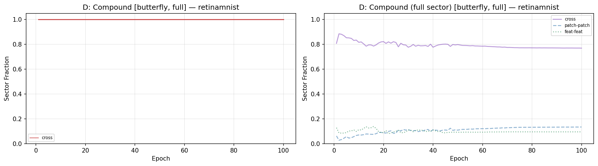
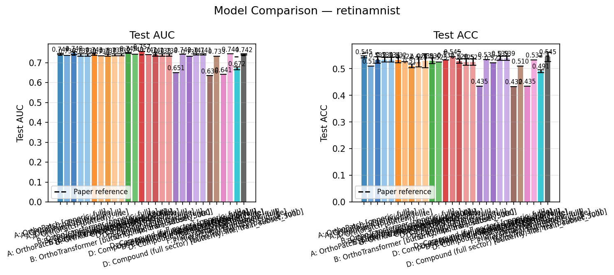

# RetinaMNIST Butterfly Full Reproduction Report

## Scope

This report compares the current RetinaMNIST `butterfly/full` results in this repo against the paper-style Retina reference values already used by the figure generator, and audits the relevant architecture and training hyperparameters.

Compared runs:
- `VisionTransformer`
- `OrthoFNN`
- `A`
- `B`
- `D`

Extension noted separately:
- `D_full`

Current result source:
- `figures/butterfly/full/summary.csv`

Paper reference source used for comparison:
- `scripts/analysis/generate_figures.py` (`PAPER_RESULTS["retinamnist"]`)

These reference values are the same ones used to draw the paper-reference lines in the repo's comparison plots.

## Executive summary

- This report reflects the corrected `OrthoFNN` rerun with the paper-faithful grayscale image-wide embedding and supersedes the earlier pre-fix comparison.
- The `butterfly/full` reproduction is reasonably close to the paper in AUC for `VisionTransformer`, `A`, `B`, and `D`.
- Accuracy is systematically lower than the paper references for almost every quantum model, even when AUC is close or slightly better.
- The largest baseline mismatch is `OrthoFNN`, not `VisionTransformer`.
- The previously identified `OrthoFNN` routing bug has now been fixed and rerun. The corrected baseline is still substantially below the paper, which means the remaining mismatch is not explained by that wrapper bug alone.
- `D` is also not an exact architectural match to the paper benchmark path because the repo disables the CLS token for butterfly `D` to satisfy the power-of-two mode constraint.

## Result comparison

ACC is shown as a fraction in `[0, 1]`.

| Model | Paper AUC | Repo mean AUC +- std | Repo best AUC | Delta mean AUC | Paper ACC | Repo mean ACC +- std | Repo best ACC | Delta mean ACC |
|---|---:|---:|---:|---:|---:|---:|---:|---:|
| VisionTransformer | 0.7360 | 0.7417 +- 0.0030 | 0.7444 | +0.0057 | 0.5480 | 0.5450 +- 0.0174 | 0.5650 | -0.0030 |
| OrthoFNN | 0.7310 | 0.6720 +- 0.0068 | 0.6776 | -0.0590 | 0.5480 | 0.4908 +- 0.0059 | 0.4950 | -0.0572 |
| A | 0.7390 | 0.7479 +- 0.0071 | 0.7578 | +0.0089 | 0.5600 | 0.5325 +- 0.0122 | 0.5475 | -0.0275 |
| B | 0.7450 | 0.7369 +- 0.0053 | 0.7426 | -0.0081 | 0.5420 | 0.5108 +- 0.0066 | 0.5200 | -0.0312 |
| D | 0.7400 | 0.7409 +- 0.0087 | 0.7517 | +0.0009 | 0.5650 | 0.5283 +- 0.0077 | 0.5350 | -0.0367 |

Single-seed extension:

| Model | Repo AUC | Repo ACC | Note |
|---|---:|---:|---|
| D_full | 0.7313 | 0.5225 | Repo extension, not a paper benchmark model |

## What matched the paper setup well

The following are high-confidence matches between the intended paper-style setup and the current repo configuration:

- Image preprocessing uses `28 x 28` inputs split into `16` patches of size `7 x 7`.
- Patch embeddings use `d = 16`.
- The paper benchmark configs use `4` layers.
- The quantum paper configs use `circuit_family = "butterfly"`.
- The `OrthoFNN` config uses a single global image embedding and disables positional embedding and CLS token, matching the intended "no attention" baseline shape.
- The training loop is explicitly coded as the paper setup:
  - Adam
  - `lr = 1e-3`
  - decay by `0.1` at epochs `50` and `75`
  - `100` epochs
  - batch size `32`

Repo evidence:
- `lib/training.py`
- `configs/paper/model_vision_transformer_retina.json`
- `configs/paper/model_orthofnn_retina.json`
- `configs/paper/model_a_retina.json`
- `configs/paper/model_b_retina.json`
- `configs/paper/model_d_retina.json`

## Important deviations and likely causes

### 1. The earlier `OrthoFNN` implementation mismatches are fixed, but the baseline still misses the paper

This was previously the strongest concrete deviation found in the code. It has now been corrected and the Retina paper seeds were rerun.

What changed:
- `model_type="OrthoFNN"` now uses the intended dedicated baseline path rather than the generic transformer residual/MLP wrapper
- the paper-faithful grayscale image-wide embedding is now used, giving the intended `784 x 16` first layer and `12901` total parameters
- the corrected results are the ones shown in the table above

Why this matters:
- it removes the strongest earlier implementation objections to the `OrthoFNN` comparison
- the corrected `OrthoFNN` baseline is still substantially below the paper reference
- therefore the remaining gap is no longer well explained by the wrapper path or by the earlier RGB image-wide embedding mismatch

What this implies:
- the `OrthoFNN` mismatch is now a genuine reproduction discrepancy
- likely causes are now things like implementation-stack differences, optimizer sensitivity, or paper-side baseline details not fully captured by the public description

Confidence:
- High

### 2. Butterfly `D` disables the CLS token

The paper benchmark architecture is described as transformer-like and includes a class embedding in the classical vision transformer description. In this repo, butterfly `D` uses:
- `use_cls_token = false`

This is done to satisfy the butterfly power-of-two mode constraint:
- `total_modes = total_seq + embed_dim`
- with `16` patches and `d = 16`, keeping CLS would make `33` modes instead of `32`

Why this matters:
- it changes the sequence structure seen by `D`
- it is a real architectural deviation from the most literal transformer-style interpretation of the paper setup
- it can plausibly hurt ACC more than AUC because classification head behavior is especially sensitive to readout structure

Confidence:
- High for the deviation
- Medium for its quantitative effect

### 3. `A` also disables the CLS token

Current paper config:
- `configs/paper/model_a_retina.json` sets `use_cls_token = false`

This is smaller than the `D` issue because `A` has no attention anyway, but it is still a benchmark-path difference relative to a fully uniform transformer wrapper.

Confidence:
- High for the config difference
- Medium for its effect size

### 4. The simulation backend differs from the paper's implementation stack

The repo now uses:
- MerLin
- Perceval-backed photonic circuits
- exact / structured linear-optical simulation with the repo's butterfly circuit implementation

The paper's published Retina hardware table distinguishes:
- classical JAX-equivalent evaluation
- IBM simulator
- IBM hardware

So even if the high-level architecture matches, the execution stack is not identical.

Why this matters:
- numerical behavior can differ
- the exact gate compilation path differs
- this can especially affect baselines and compound models

Confidence:
- High

### 5. The paper reports single reference values, while the repo reports seed distributions

Our figure and summary pipeline reports:
- mean +- std over seeds

The paper tables expose:
- single values

This is not a bug, but it affects how "match" should be interpreted. For that reason the comparison table above includes both:
- repo mean +- std
- repo best-of-seed

Confidence:
- High

## Interpreting the current mismatch pattern

### VisionTransformer

This baseline is actually close to the paper:
- AUC is slightly higher than the paper reference
- mean ACC is only slightly lower

So the classical baseline issue is not primarily `VisionTransformer`.

### OrthoFNN

With the corrected rerun, this is the least faithful baseline at present:
- lower AUC than the paper by `0.0590`
- lower ACC than the paper by `0.0572`
- and no longer attributable to the earlier wrapper bug or the earlier image-wide embedding mismatch

So `OrthoFNN` should now be treated as a real residual mismatch between this repo and the paper, not as an unresolved implementation error inside the current codebase.

### A

`A` reproduces the paper quite well in AUC:
- mean AUC is slightly above the reference
- best-seed AUC is clearly above the reference

But ACC is lower by about `2.75` percentage points.

Interpretation:
- feature transformation quality looks competitive
- final class decision quality is weaker than in the paper setup

### B

`B` is a moderate miss:
- AUC is below the paper reference
- ACC is also below the paper reference

Interpretation:
- this is the weakest of the main paper reproduction models in the current butterfly/full runs
- unlike `A` and `D`, it does not recover the paper AUC

### D

`D` is close in AUC but not in ACC:
- mean AUC essentially matches the paper
- best-seed AUC exceeds it
- ACC remains well below the paper

This pattern is consistent with:
- semantically reasonable ranking behavior
- but a materially different output/readout behavior

The CLS-token removal is the first thing to suspect here.

## Why AUC can look good while ACC stays low

This pattern appears repeatedly in the current butterfly/full runs.

Likely interpretation:
- the models rank the correct classes reasonably well
- but the final argmax decisions are less sharp or less well calibrated than in the paper setup

That is why:
- `A` and `D` can have paper-level or better AUC
- while still missing the paper ACC by several percentage points

So for this reproduction, the gap is less "the model learned nothing" and more "the final decision path is not matching the original setup cleanly enough."

## Recommended next actions

1. Treat `OrthoFNN` as corrected but still unmatched.
If tighter paper agreement is needed, investigate baseline-detail differences rather than assuming a remaining obvious code bug.

2. Revisit butterfly `D` with respect to the CLS token.
If exact architecture fidelity matters more than keeping the strict `(n + d)` power-of-two layout, this needs a design decision rather than being silently accepted as "the paper model."

3. If further paper-facing reruns are done, regenerate:
- `figures/butterfly/full/*`
- `reports/retina_cpu/*`

4. Keep reporting both:
- mean +- std over seeds
- best-of-seed

This makes the comparison to the paper's single reported values much cleaner.

## Bottom line

The current Retina butterfly/full reproduction is already fairly credible for:
- `VisionTransformer`
- `A`
- `D`

It is noticeably weaker for:
- `B`
- `OrthoFNN`

The main architecture-level compromise still visible in the code is the no-CLS butterfly `D` path. The main remaining benchmark mismatch is now `OrthoFNN`, but that mismatch persists even after the routing fix and rerun. So the next paper-facing work is no longer "fix the obvious OrthoFNN bug"; it is understanding why the corrected baseline still falls short of the paper.

## Scientific interpretation relative to the paper

### Main empirical assertions of the paper

At a high level, the paper makes four relevant claims for this RetinaMNIST benchmark family:

1. The proposed quantum vision transformer variants are competitive with strong classical baselines, including a classical vision transformer.
2. Different quantum attention constructions (`A`, `B`, `D`) can all work, but they do not behave identically.
3. The quantum models use substantially fewer trainable attention parameters than a classical vision transformer.
4. The compound / structured quantum attention mechanism is interesting not only empirically, but also theoretically and for hardware-oriented implementation.

Only the first three claims are meaningfully testable from the current Retina simulation results in this repo. The fourth is broader and includes asymptotic and hardware considerations that this reproduction does not settle by itself.

### What we can say scientifically from the current results

#### 1. "Quantum models are competitive with classical baselines"

This is **partially supported** by the current Retina butterfly/full results.

Evidence:
- `A` is competitive with `VisionTransformer` in AUC and slightly exceeds the paper reference AUC.
- `D` is essentially tied with the paper reference AUC and close to `VisionTransformer` in AUC.
- `B` is somewhat weaker than both its paper reference and the stronger reproduced models.
- `OrthoFNN` is weaker than `VisionTransformer` in the current reproduction.

So the strongest supported statement is:
- some quantum models are competitive with the classical baseline on RetinaMNIST

The weaker statement:
- all reproduced quantum models consistently beat the classical baseline

is **not supported** by the current results.

#### 2. "The quantum models are not all equivalent"

This is **supported**.

The current runs show a clear ordering:
- `A` and `D` are the strongest paper-style butterfly quantum models in this repo
- `B` is weaker than `A` and not clearly better than the classical baseline
- `OrthoFNN` is the weakest among the main multi-seed reproduced baselines

So even without perfect paper matching, the qualitative conclusion that the proposed quantum constructions behave differently is clearly reproduced.

#### 3. "Quantum attention can be parameter-efficient"

This is **supported very strongly**.

Even with the current reproduction mismatches, the parameter-count conclusion is clear:
- the quantum attention layers have far fewer trainable attention parameters than the classical ViT baseline
- this remains true in the current repo and is visible in `param_comparison.pdf`

So the paper's qualitative claim about parameter efficiency is consistent with the reproduction.

#### 4. "Compound attention is theoretically / hardware attractive"

This is **not directly tested** by the current Retina CPU reproduction.

The current repo can say:
- `D` is competitive in AUC on RetinaMNIST
- `D` uses a photonic-native compound mechanism with relatively few attention parameters

But the current reproduction does **not** by itself establish:
- asymptotic speedup
- real hardware superiority
- or a faithful reproduction of the paper's hardware experiments

So that part of the paper should be treated as background motivation, not as something verified by the current report.

### Do we match the paper's qualitative story?

Broadly: **yes, but imperfectly**.

What matches:
- quantum models can be competitive with the classical ViT baseline
- `A` and `D` look like the strongest reproduced butterfly quantum models
- parameter-efficiency claims remain true

What does not match cleanly:
- `B` is not reproducing as strongly as the paper suggests
- `OrthoFNN` is underperforming even after the implementation fix and rerun
- ACC is consistently lower than the paper even when AUC is close

So the current reproduction supports the **direction** of the paper's conclusions better than it supports every **numerical claim**.

### Most defensible conclusions right now

From the current reproduction, the scientifically careful conclusions are:

- The repo reproduces the qualitative finding that quantum structured models can be competitive with a classical RetinaMNIST vision transformer.
- The strongest evidence in this reproduction is for `A` and `D`, not for `B`.
- The parameter-efficiency story survives reproduction.
- Exact benchmark-level agreement with the paper is not yet achieved, especially for `OrthoFNN` and ACC.
- Therefore the present evidence is best described as a **partial but credible reproduction**, not a strict numerical match.

## Key figures and how to read them

The main generated Retina figures that support this report are:

- [Butterfly full comparison PDF](../../figures/butterfly/full/comparison_retinamnist.pdf)
- [Butterfly full training curves PDF](../../figures/butterfly/full/training_curves_retinamnist.pdf)
- [Butterfly full parameter comparison PDF](../../figures/butterfly/full/param_comparison.pdf)
- [Butterfly full sector-mass PDF](../../figures/butterfly/full/sector_mass_retinamnist.pdf)
- [All-model comparison PDF](../../figures/all/all/comparison_retinamnist.pdf)

### 1. Butterfly full comparison

Link:
- [comparison_retinamnist.pdf](../../figures/butterfly/full/comparison_retinamnist.pdf)

What it shows:
- test AUC and test ACC for the paper-style butterfly/full Retina bundle
- includes the two baselines:
  - `VisionTransformer`
  - `OrthoFNN`
- includes the reproduced butterfly models:
  - `A`
  - `B`
  - `D`
  - `D_full`

How to interpret it:
- this is the clearest single plot for the question "do the butterfly quantum models look competitive with the baselines?"
- it visually supports the claim that `A` and `D` are competitive in AUC
- it also makes the persistent ACC gap visible, especially for `B` and `D`

Why it matters for the report:
- it directly supports the statement that the reproduction is qualitatively credible but not a clean numerical match

### 2. Butterfly full training curves

Link:
- [training_curves_retinamnist.pdf](../../figures/butterfly/full/training_curves_retinamnist.pdf)

What it shows:
- mean train loss
- mean train accuracy
- mean validation AUC
- all as a function of epoch, aggregated over seeds where available

How to interpret it:
- use this plot to distinguish optimization issues from final-metric issues
- if a model trains smoothly but ends with weaker test ACC, that suggests the gap is not simply "the model failed to optimize"
- this is especially relevant for `A` and `D`, where AUC remains competitive even though final ACC is below the paper

Why it matters for the report:
- it supports the interpretation that several models are learning sensible ranking structure, even when final hard classification performance is weaker than the paper

### 3. Parameter comparison

Link:
- [param_comparison.pdf](../../figures/butterfly/full/param_comparison.pdf)

What it shows:
- attention-parameter counts versus total trainable parameters
- alongside the classical ViT reference line

How to interpret it:
- this figure is the cleanest evidence for the paper's parameter-efficiency claim
- it shows that the quantum attention models remain far smaller in attention-parameter count than the classical transformer baseline

Why it matters for the report:
- even where exact benchmark metrics are imperfectly matched, this figure strongly supports the paper's qualitative claim that the quantum constructions are parameter-efficient

### 4. Sector-mass plot

Link:
- [sector_mass_retinamnist.pdf](../../figures/butterfly/full/sector_mass_retinamnist.pdf)

What it shows:
- probability mass in physically meaningful output sectors across training
- mainly relevant for compound / multi-sector models

How to interpret it:
- this is more of a mechanistic diagnostic than a headline benchmark plot
- it helps explain where the model is placing amplitude or probability mass during learning
- for `D` and `D_full`, it provides evidence that the learned circuit is actually using the intended photonic sector structure rather than behaving like an arbitrary black box

Why it matters for the report:
- it supports the claim that these models are not merely "small neural nets with funny names"; they are using the intended sector-based photonic structure

### 5. All-model comparison

Link:
- [comparison_retinamnist.pdf](../../figures/all/all/comparison_retinamnist.pdf)

What it shows:
- all currently available Retina variants together:
  - baselines
  - generic full
  - generic lite
  - butterfly full
  - butterfly lite

How to interpret it:
- this figure is not the cleanest paper-reproduction figure, but it is useful for contextualizing the reproduced paper models against the repo extensions
- it shows that the paper-style butterfly/full path is only one slice of the broader experimental space in this repo

Why it matters for the report:
- it helps separate "paper reproduction quality" from "repo exploration quality"
- this is important because some stronger or weaker results in the repo come from extensions, not the original benchmark family
