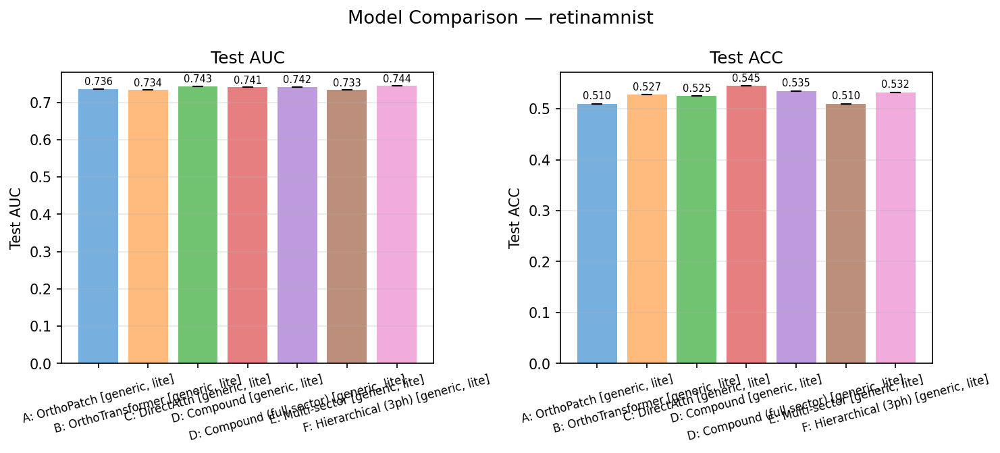
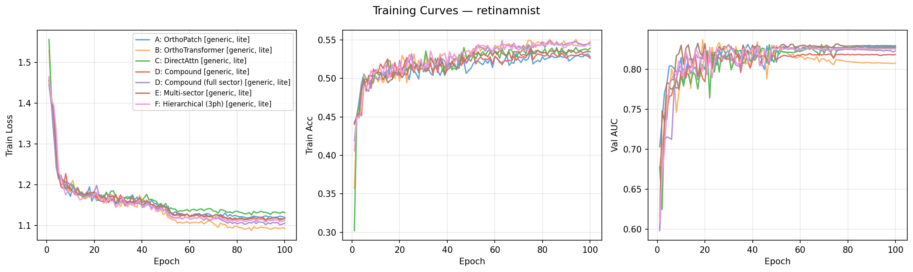

# RetinaMNIST Lite Models Analysis

## Scope

This report summarizes what can and cannot be concluded from the current RetinaMNIST `lite` runs in this repo.

Lite variants are repo-side approximations intended for:
- faster turnaround
- smoke testing
- architecture triage
- rough parameter/performance tradeoff checks

They are **not** exact paper-reproduction configurations.

Current lite result sources:
- `figures/generic/lite/summary.csv`
- `figures/butterfly/lite/summary.csv`

## Are the lite models valid?

Yes, but only for a narrower purpose.

Scientifically, the lite configs are valid as:
- reduced-capacity ablations
- engineering proxies for "which ideas still work when the model is made much smaller?"
- quick checks of whether a model family is promising enough to justify full training

They are **not** valid as:
- direct evidence of paper reproduction quality
- a substitute for the paper benchmark family
- a robust ranking of models for publication-level claims

The reasons are straightforward:
- lite configs reduce model capacity substantially
- generic lite runs still mostly use only one seed in the current repo
- butterfly lite on RetinaMNIST now has a stronger three-seed comparison
- several lite variants also alter the parameter budget and circuit size enough that they are no longer "same model, just faster"

So the right framing is:
- valid for internal comparison and engineering decisions
- not valid for strict reproduction claims

## What changes in lite mode

In practice, lite mode shrinks the models substantially:
- fewer attention parameters
- fewer total trainable parameters
- much shorter wall-clock time

Representative examples from the current Retina results:

| Variant | Full attention params | Lite attention params | Full total params | Lite total params |
|---|---:|---:|---:|---:|
| A generic | 960 | 56 | 8213 | 1725 |
| A butterfly | 256 | 24 | 7509 | 1693 |
| B generic | 1920 | 112 | 9205 | 1797 |
| B butterfly | 512 | 48 | 7797 | 1733 |
| D generic | 4224 | 552 | 11509 | 2221 |
| D butterfly | 640 | 160 | 7893 | 4005 |

So "lite" is a real model simplification, not just a shorter training schedule.

## Exploratory full-vs-lite comparison

The table below compares the overlapping Retina variants between full and lite runs.

Important caveat:
- full values are often multi-seed means
- generic lite values are mostly single-seed
- butterfly lite on RetinaMNIST now has a three-seed comparison and is stronger evidence than the generic lite table

So this table is useful for trend analysis, not for strict statistical claims.

| Variant | Full AUC | Lite AUC | Delta AUC | Full ACC | Lite ACC | Delta ACC | Full params | Lite params | Param ratio | Full time (min) | Lite time (min) | Speedup |
|---|---:|---:|---:|---:|---:|---:|---:|---:|---:|---:|---:|---:|
| A generic | 0.7435 | 0.7364 | -0.0071 | 0.5450 | 0.5100 | -0.0350 | 8213 | 1725 | 0.210 | 35.4 | 2.7 | 13.3x |
| A butterfly | 0.7479 | 0.7422 | -0.0056 | 0.5325 | 0.5250 | -0.0075 | 7509 | 1693 | 0.225 | 98.9 | 2.2 | 44.3x |
| B generic | 0.7425 | 0.7338 | -0.0087 | 0.5325 | 0.5275 | -0.0050 | 9205 | 1797 | 0.195 | 73.6 | 4.3 | 17.3x |
| B butterfly | 0.7369 | 0.7455 | +0.0086 | 0.5108 | 0.5500 | +0.0392 | 7797 | 1733 | 0.222 | 8.2 | 4.8 | 1.7x |
| C generic | 0.7489 | 0.7433 | -0.0056 | 0.5300 | 0.5250 | -0.0050 | 9205 | 1797 | 0.195 | 73.9 | 4.7 | 15.8x |
| D generic | 0.7566 | 0.7411 | -0.0155 | 0.5325 | 0.5450 | +0.0125 | 11509 | 2221 | 0.193 | 209.4 | 193.8 | 1.1x |
| D butterfly | 0.7409 | 0.7417 | +0.0009 | 0.5283 | 0.5150 | -0.0133 | 7893 | 4005 | 0.507 | 11.8 | 8.8 | 1.3x |
| D_full generic | 0.6506 | 0.7419 | +0.0913 | 0.4350 | 0.5350 | +0.1000 | 12533 | 2285 | 0.182 | 0.8 | 16.3 | 0.0x |
| D_full butterfly | 0.7313 | 0.7443 | +0.0130 | 0.5225 | 0.5450 | +0.0225 | 8917 | 4261 | 0.478 | 12.8 | 11.2 | 1.1x |
| E generic | 0.6356 | 0.7329 | +0.0973 | 0.4325 | 0.5100 | +0.0775 | 11509 | 2221 | 0.193 | 1.4 | 32.2 | 0.0x |
| F generic | 0.6414 | 0.7442 | +0.1028 | 0.4350 | 0.5325 | +0.0975 | 9461 | 1909 | 0.202 | 0.4 | 8.0 | 0.1x |

How to read this table:
- `A`, `B`, `C`, and butterfly `D` degrade only modestly in AUC under lite scaling
- some lite variants even look better than the current full results, but those cases are not strong evidence because the full result is only single-seed or otherwise noisy
- the parameter reductions are large, often to about `20%` to `22%` of the full model size
- the runtime reductions are real, but they are not always proportional to parameter reduction because some models are dominated by simulation overhead rather than raw parameter count

The most trustworthy takeaway from this table is:
- for several families, lite preserves much of the predictive behavior while dramatically shrinking parameter count

The least trustworthy takeaway is:
- any claim that a lite variant is "better" than its full counterpart when the full counterpart only has one run or noisy timing

## Retina butterfly lite vs full: stronger evidence

The butterfly Retina results are now more informative than the generic lite runs, because the lite side has been rerun over three seeds.

That means the butterfly comparison below is the strongest current evidence in the repo for what lite scaling really does to the paper-relevant quantum family.

| Variant | Full AUC (mean+-std) | Lite AUC (mean+-std) | Delta AUC | Full ACC (mean+-std) | Lite ACC (mean+-std) | Delta ACC | Full params | Lite params | Param ratio |
|---|---:|---:|---:|---:|---:|---:|---:|---:|---:|
| A butterfly | 0.7479 +- 0.0071 | 0.7386 +- 0.0055 | -0.0093 | 0.5325 +- 0.0122 | 0.5342 +- 0.0082 | +0.0017 | 7509 | 1693 | 0.225 |
| B butterfly | 0.7369 +- 0.0053 | 0.7392 +- 0.0051 | +0.0023 | 0.5108 +- 0.0066 | 0.5250 +- 0.0187 | +0.0142 | 7797 | 1733 | 0.222 |
| D butterfly | 0.7409 +- 0.0087 | 0.7381 +- 0.0061 | -0.0028 | 0.5283 +- 0.0077 | 0.5250 +- 0.0124 | -0.0033 | 7893 | 4005 | 0.507 |
| D_full butterfly | 0.7313 +- 0.0000 | 0.7408 +- 0.0031 | +0.0095 | 0.5225 +- 0.0000 | 0.5392 +- 0.0082 | +0.0167 | 8917 | 4261 | 0.478 |

What this stronger comparison says:
- `A` lite is worse than full on AUC, but by less than `0.01`, while using about `22.5%` of the parameters
- `D` lite is essentially tied with full within a narrow margin
- `B` lite is now modestly better than full even after moving from one seed to three seeds
- `D_full` lite also looks better, but that claim is weaker because the full side still only has one run

The key scientific shift is this:
- the earlier single-seed impression was "lite may often be better"
- the stronger butterfly evidence refines that to "lite is often very close, and sometimes better"

That is a much more defensible claim.

## Key figures

### Generic lite comparison

PDF:
- [generic lite comparison](../../figures/generic/lite/comparison_retinamnist.pdf)

What this figure says:
- among the generic lite runs, `F`, `C`, `D_full`, and `D` are all clustered in a narrow AUC band around `0.741` to `0.744`
- `A` and `B` are somewhat lower
- all conclusions here are single-seed conclusions

### Butterfly lite comparison

PDF:
- [butterfly lite comparison](../../figures/butterfly/lite/comparison_retinamnist.pdf)

What this figure says:
- over three seeds, all four butterfly lite models remain tightly grouped
- `B` and `D_full` have the strongest mean AUCs
- the spread across seeds is moderate rather than catastrophic, which makes the butterfly lite conclusions much more credible than before

### Generic lite training curves

PDF:
- [generic lite training curves](../../figures/generic/lite/training_curves_retinamnist.pdf)

What this figure says:
- the lite models are still trainable in a meaningful sense
- they are not collapsing immediately into noise
- several lite runs show smooth improvement in validation AUC despite the reduced parameter budget

### Butterfly lite training curves

PDF:
- [butterfly lite training curves](../../figures/butterfly/lite/training_curves_retinamnist.pdf)

What this figure says:
- the butterfly lite models remain optimization-stable
- the structured butterfly constraint does not make the lite models obviously unusable

## Current lite results

### Generic lite

| Model | Test AUC | Test ACC | Best val AUC |
|---|---:|---:|---:|
| A | 0.7364 | 0.5100 | 0.8311 |
| B | 0.7338 | 0.5275 | 0.8371 |
| C | 0.7433 | 0.5250 | 0.8308 |
| D | 0.7411 | 0.5450 | 0.8199 |
| D_full | 0.7419 | 0.5350 | 0.8304 |
| E | 0.7329 | 0.5100 | 0.8325 |
| F | 0.7442 | 0.5325 | 0.8296 |

### Butterfly lite

| Model | Test AUC (mean+-std) | Test ACC (mean+-std) | Best val AUC (best seed) |
|---|---:|---:|---:|
| A | 0.7386 +- 0.0055 | 0.5342 +- 0.0082 | 0.8397 |
| B | 0.7392 +- 0.0051 | 0.5250 +- 0.0187 | 0.8415 |
| D | 0.7381 +- 0.0061 | 0.5250 +- 0.0124 | 0.8377 |
| D_full | 0.7408 +- 0.0031 | 0.5392 +- 0.0082 | 0.8318 |

## What can we say from these lite results?

### 1. The lite models are not meaningless

This is the most important positive conclusion.

Even after substantial simplification:
- the models still train
- their AUCs remain in a credible range
- and the architecture families remain distinguishable

So lite mode is a useful development and triage tool.

### 2. Some model families degrade surprisingly little under lite scaling

This is also supported.

Examples:
- `A butterfly`: full mean AUC `0.7479`, lite mean AUC `0.7386`
- `B butterfly`: full mean AUC `0.7369`, lite mean AUC `0.7392`
- `D butterfly`: full mean AUC `0.7409`, lite mean AUC `0.7381`
- `C generic`: full mean AUC `0.7489`, lite single-seed AUC `0.7433`

These are not apples-to-apples statistical matches, but they do suggest that some model families preserve most of their usefulness even after heavy parameter reduction.

### 3. Lite mode is good for deciding which full runs are worth paying for

This is probably the best use of these results.

The lite runs suggest:
- `A`, `C`, `D`, and `D_full` are worth taking seriously
- butterfly `B` is promising enough to keep
- the extensions `E` and `F` are viable enough to justify fuller investigation when resources allow

In other words, lite mode can help decide where to spend CPU/GPU time.

## If lite appears better than full, what could that mean?

This is an important question, because some current Retina results do show lite matching or exceeding the corresponding full run.

The scientifically careful answer is: this does **not** immediately mean the lite architecture is intrinsically superior. But it does suggest a few plausible things about the models and the experimental setting.

### 1. Some full models may be over-capacity for RetinaMNIST

RetinaMNIST is a relatively small benchmark. If a lite model performs as well as, or better than, the full version, one reasonable inference is:
- the full model may have more capacity than this dataset really needs
- the extra parameters may not be buying useful generalization

In that interpretation, the paper's qualitative story can still hold, but the best practical operating point on this dataset may be smaller than the paper-style configuration.

### 2. The smaller models may simply be easier to optimize

A second plausible interpretation is optimization rather than generalization:
- fewer parameters
- smaller interferometers
- fewer trainable degrees of freedom

can make training more stable and reduce the chance of landing in a weak solution.

If that is the explanation, then a lite win is not evidence that the underlying full architecture idea is wrong. It is evidence that, under the current optimizer, schedule, and dataset size, the smaller version is easier to train well.

### 3. Some architecture families may have a better parameter-efficiency regime than the paper emphasizes

If the lite models remain strong, that supports a broader scientific claim:
- these structured quantum-inspired models may derive a large fraction of their useful behavior from architecture and inductive bias, not just raw parameter count

That is especially relevant for this repo, because one of the attractive claims around these models is parameter efficiency. Strong lite results are therefore not just "good news for speed"; they may indicate that the architecture family is genuinely effective in a lower-capacity regime.

### 4. Some apparent lite wins may actually reflect weakness or noise in the current full runs

This is the most important caution.

A lite result being better than full can also mean:
- the corresponding full run only has one seed
- the full result is noisy
- the full extension model is not yet tuned well
- the timing/history for that full variant comes from an older or less clean run

So the strongest lite-vs-full claims should only be made for model families where the full side is already reasonably stable and multi-seed.

### 5. This does not, by itself, contradict the paper

Even if lite is better in the current repo, that does **not** automatically mean the paper is wrong.

What it could mean instead is:
- the paper's chosen benchmark configuration was not the only good operating point
- on RetinaMNIST specifically, a smaller version may generalize as well or better
- the paper focused on one regime, while this repo is revealing another

So the right interpretation is not "lite disproves full." The better interpretation is:
- the paper-style models are one reference point
- the lite results suggest the same architecture families may have a more efficient sweet spot than the original benchmark explored

### Most defensible inference

The current butterfly multi-seed evidence suggests a slightly narrower version of that claim:

- lite does not broadly dominate full
- but it often remains very close to full despite a major parameter reduction
- and in at least some cases, such as butterfly `B`, it may genuinely be the better operating point

If similar patterns continue to hold after more reruns, the strongest scientific inference would be:

- on RetinaMNIST, several of these model families are likely over-parameterized in their paper-style form
- a substantial part of their useful predictive behavior survives aggressive downsizing
- therefore parameter-efficient variants deserve to be treated as a real research direction, not just as engineering shortcuts

That would be a meaningful result in its own right.

## What we should *not* conclude from the lite results

### 1. We should not rank lite models as if they were publication-level benchmarks

Why not:
- generic lite is still mostly single-seed
- butterfly lite on RetinaMNIST is now stronger, but not every lite family has the same level of evidence
- no confidence intervals beyond a single trajectory
- reduced architecture/capacity means the results are not directly comparable to the full paper claims

So statements like:
- "`B` is definitively better than `A` in butterfly mode"

would be too strong from the current lite evidence alone.

### 2. We should not compare lite directly to the paper table

Lite is not a paper config.

So even if a lite result happens to land near a paper AUC, that does **not** mean the paper has been reproduced in lite mode.

### 3. We should not over-interpret runtime numbers yet

The lite runs are much faster, but some of the repo timing history contains older runs and environment noise.
So the main value of lite timing is relative engineering guidance, not polished benchmarking.

## Most defensible scientific interpretation

The scientifically careful summary is:

- Lite models are valid as reduced-capacity ablations and development proxies.
- They provide meaningful evidence about which architecture families remain strong under aggressive simplification.
- They are useful for model selection and compute allocation.
- They are not valid substitutes for full multi-seed paper-style reproduction.

## Practical recommendation

Use lite results for:
- smoke testing
- architecture triage
- GPU tuning
- deciding which expensive full runs to prioritize

Do not use lite results for:
- paper reproduction claims
- final benchmark tables
- strong ranking claims across closely matched models without rerunning full multi-seed experiments

## Bottom line

Yes, we can say something from the lite versions:
- they are useful
- they are informative
- and they are valid as engineering/scaling ablations

But the correct interpretation is:
- **valid for internal scientific triage**
- **not valid as a direct reproduction benchmark**
